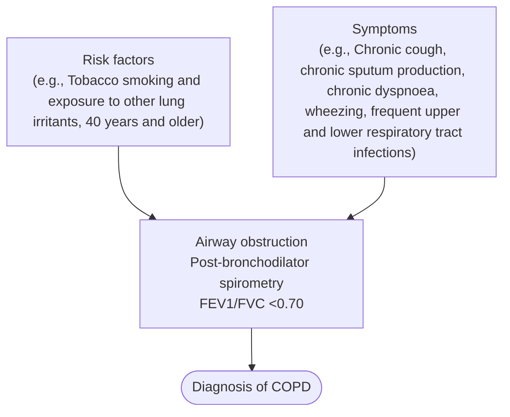
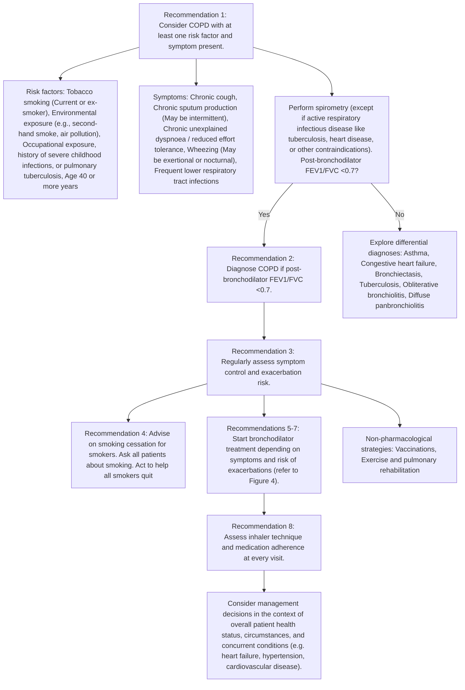

<!-- cpg_id: Chronic obstructive pulmonary disease diagnosis and management (Dec 2024) | phase4 deterministic | spine: Overview, Establishing a diagnosis of COPD, Initial and ongoing COPD assessment, Management of stable COPD, References -->
<!-- meta | source: ACE CLINICAL GUIDANCE | published: First Published: 25 September 2018; Last Updated: 6 December 2024 | url: www.ace-hta.gov.sg | title: Chronic obstructive pulmonary disease. Diagnosis and management -->


## Overview

```yaml
cpg_id: Chronic obstructive pulmonary disease diagnosis and management (Dec 2024)
chunk_id: Chronic obstructive pulmonary disease diagnosis and management (Dec 2024).overview.prose.01
chunk_type: prose
section_id: overview
parent_rec: null
title: "Definitions and scope of application"
source_pages: [1]
strength: null
tables_referenced: []
figures_referenced: []
url_links: []
cross_refs: []
review_flags:
  - contains_conditional_language
```

First Published: 25 September 2018

Last Updated: 6 December 2024

Chronic
obstructive
pulmonary
disease

Illustration of a stylized, segmented biological structure with a star-shaped element inside, set against a red background (no text or symbols)

### Objective

To encourage best practice for the diagnosis and management of stable COPD

### Scope

Diagnostic approach for COPD, pharmacological and non-pharmacological management options for patients with stable COPD, with a focus on inhalers

### Target audience

This clinical guidance is relevant to all healthcare professionals caring for patients with COPD, especially those providing primary or generalist care

### Background

COPD is a heterogeneous lung condition characterised by chronic respiratory symptoms due to abnormalities of the airways or alveoli that cause persistent, often progressive, airflow obstruction.   Globally, in 2019, COPD is the third most common cause of death and an increasingly important contributor to morbidity due to an ageing population, urbanisation, and persistence of risk factors.   In Singapore, COPD is estimated to be the tenth highest cause of death and seventeenth highest cause of disability-adjusted life years.   Locally, COPD contributes to chronic respiratory disease-related hospitalisations and emergency department visits, and was estimated to have an annual societal cost of SGD3,304 per capita in 2022.   COPD exacerbations account for the greatest proportion of the total COPD burden on the healthcare system.

Although COPD is not fully reversible, once diagnosed it can be effectively managed in primary care. Primary care plays an important role in detecting new cases in the community to generate early intervention opportunities, including counselling to quit smoking, and initiating pharmacotherapy to reduce symptoms and future risk of exacerbations.   Research and treatment options for COPD continue to evolve, therefore up-to-date guidance on accurate diagnosis and optimal management can support clinical improvements in COPD care, including better quality of life for patients.

Adjusted from 2009 to 2022 $SGD using the Singapore healthcare consumer price index.

### Statement of Intent

This ACE Clinical Guidance (ACG) provides concise, evidence-based recommendations and serves as a common starting point nationally for clinical decision-making. It is underpinned by a wide array of considerations contextualised to Singapore, based on best available evidence at the time of development. The ACG is not exhaustive of the subject matter and does not replace clinical judgement. The recommendations in the ACG are not mandatory, and the responsibility for making decisions appropriate to the circumstances of the individual patient remains at all times with the healthcare professional.

---


## Establishing a diagnosis of COPD

```yaml
cpg_id: Chronic obstructive pulmonary disease diagnosis and management (Dec 2024)
chunk_id: Chronic obstructive pulmonary disease diagnosis and management (Dec 2024).establishing_a_diagnosis_of_copd.recommendation.01
chunk_type: recommendation
section_id: establishing_a_diagnosis_of_copd
parent_rec: null
title: "Recommendation 1"
source_pages: [2]
strength: strong
tables_referenced: []
figures_referenced:
  - Figure 1. Overview of diagnosis and management of COPD
url_links: []
cross_refs: []
review_flags:
  - contains_conditional_language
```

**Recommendation 1**

Suspect COPD in any patient with at least one relevant symptom and risk factor.

A thorough history-taking is important for establishing COPD diagnosis and should include:

- Past medical history (for example, early life events, respiratory disease, respiratory infections in childhood, history of exacerbations or previous hospitalisations for respiratory disorder), and existing comorbidities;

- Family history of COPD or other chronic respiratory disease; and

- COPD risk factors and symptoms (see Figure 1).

The index of suspicion for COPD should be raised when the patient presents with chronic unexplained dyspnoea or reduced effort tolerance that tends to worsen over time, chronic cough with or without sputum production, or inspiratory/expiratory wheezing. Symptoms may vary from day-to-day and can be under-reported by patients, who often attribute them to ageing, smoker's cough, or other disorders.

COPD risk factors include tobacco smoking, environmental or occupational sources of lung irritants, history of severe childhood infections, pulmonary tuberculosis, abnormal lung development, and age 40 or more years. Rare risk factors of COPD include genetic components, such as alpha-1 antitrypsin deficiency. In the absence of risk factors, COPD is unlikely. However, exercise clinical judgement in light of individual patient circumstances, and consider spirometry testing if suspicion of COPD remains high after exploring differential diagnoses (see section "Differential diagnoses of COPD" on page 4).

Figure 1 provides an overview of the diagnosis and management of COPD, including COPD symptoms and risk factors commonly available from history-taking.

---

```yaml
cpg_id: Chronic obstructive pulmonary disease diagnosis and management (Dec 2024)
chunk_id: Chronic obstructive pulmonary disease diagnosis and management (Dec 2024).establishing_a_diagnosis_of_copd.recommendation.02
chunk_type: recommendation
section_id: establishing_a_diagnosis_of_copd
parent_rec: null
title: "Recommendation 2"
source_pages: [2, 4]
strength: strong
tables_referenced:
  - Table 1. Features favouring COPD or asthma
figures_referenced:
  - Figure 2. Components of COPD diagnosis
url_links:
  - https://go.gov.sg/suppl-guide-copd-interpreting-spirometry-pdf
  - https://go.gov.sg/suppl-guide-copd-open-access-spirometry-pdf
  - https://www.ace-hta.gov.sg/docs/default-source/acgs/patient-education-aid--spirometry-test-for-lung-conditions.pdf?sfvrsn=58c51413_1
  - https://go.gov.sg/acg-asthma-optimising-long-term-management-with-inhaled-corticosteroid
cross_refs: []
review_flags:
  - contains_conditional_language
```

**Recommendation 2**

Diagnose COPD in patients with relevant symptoms and risk factors who have airflow obstruction detected via spirometry (post-bronchodilator FEV  /FVC <0.7).

There are three key factors required for COPD diagnosis (see Figure 2):

- COPD risk factor(s);

- COPD symptom(s); and

- Concordant spirometry findings.

Ensuring that all three components are met prior to diagnosis increases the ability to differentiate COPD from other similar respiratory conditions, including asthma.

Once COPD is suspected based on the presence of relevant risk factors and symptoms, spirometry is required for diagnosis for all patients, except for those with active respiratory infectious disease like tuberculosis, heart disease, or other contraindications to the test.   COPD is characterised by persistent, and often progressive airflow limitation, which is defined as spirometry value of   . Post-bronchodilator    in patients with pertinent risk factors and symptoms confirms COPD.   Spirometry findings are to be interpreted in the overall context of patient presentation, including symptoms and risk factors. For example, the fixed    cut-off alone might result in overdiagnosis of COPD in the elderly. Refer to the supplementary guide on “Interpreting spirometry reports” for examples that elucidate the importance of assessing a history of symptoms and risk factors.

### Practice point on spirometry

- While peak flow meters may help to identify patients who potentially have COPD, spirometry is required to confirm a diagnosis.

- Spirometry may be performed at pulmonary function laboratories or in clinics using HSA-approved portable office spirometers using the same post-bronchodilator testing criteria.

- If an HSA-approved portable office spirometer is used, ensure it can calculate the post-bronchodilator FEV1/FVC. In conducting the spirometry test ensure to use the appropriate procedures and refer to the product guide for more information.

- For more information on interpreting spirometry reports, scan or click the QR code for more information.

- If spirometry is not available onsite, consider referring the patient to an open-access spirometry laboratory in Singapore (scan or click the QR code for more information).

- Clinicians can use the patient education aid on “Spirometry for lung conditions” to encourage patients to undergo the test (scan or click the QR code for more information)

- https://go.gov.sg/suppl-guide-copd-interpreting-spirometry-pdf

- https://go.gov.sg/suppl-guide-copd-open-access-spirometry-pdf

- https://www.ace-hta.gov.sg/docs/default-source/acgs/patient-education-aid--spirometry-test-for-lung-conditions.pdf?sfvrsn=58c51413_1

### Differential diagnoses of COPD

Due to similarities in symptoms, these differential diagnoses should be considered when assessing a patient presenting with symptoms and risk factors suggestive of COPD.

- Asthma

- Congestive heart failure

- Bronchiectasis

- Tuberculosis

- Obliterative bronchiolitis

- Diffuse panbronchiolitis

Further investigations such as chest X-ray forms part of the initial assessment of a patient presenting with respiratory symptoms suggestive of COPD, for assessing comorbidities, or excluding alternative diagnoses.

### COPD and asthma

The clinical presentations of COPD and asthma can be similar, and differentiating between the two conditions is necessary to provide the appropriate treatment. COPD treatment is centred on using inhaled bronchodilators (beta  -agonists and antimuscarinics), and inhaled corticosteroids play a targeted role.   In contrast, controller therapy in asthma is anchored on inhaled corticosteroids.

In most cases, a detailed history of symptoms and risk factors, and objective spirometry test results can separate COPD from asthma (see Table 1). Knowing if a patient has more asthma or COPD features increases diagnostic accuracy.

In some cases, it may be challenging to distinguish between COPD and asthma. Some patients may have features of both asthma and COPD which is characterised by persistent airflow limitation with clinical features that are consistent with both conditions.

If a concurrent diagnosis of asthma is suspected, the pharmacotherapy options should follow asthma guidelines.   If the distinction between COPD and asthma is unclear, consider a trial of asthma treatment first. For information on asthma assessment and management scan or click the QR code to see the ACG “Asthma – optimising long-term management with inhaled corticosteroid”.

- https://go.gov.sg/acg-asthma-optimising-long-term-management-with-inhaled-corticosteroid

---

```yaml
cpg_id: Chronic obstructive pulmonary disease diagnosis and management (Dec 2024)
chunk_id: Chronic obstructive pulmonary disease diagnosis and management (Dec 2024).establishing_a_diagnosis_of_copd.figure.01
chunk_type: figure
section_id: establishing_a_diagnosis_of_copd
parent_rec: Chronic obstructive pulmonary disease diagnosis and management (Dec 2024).establishing_a_diagnosis_of_copd.recommendation.02
title: "Figure 2. Components of COPD diagnosis"
source_pages: [2]
strength: null
reconstructed_from: mermaid
image_dir: grouped_p2_fig_01.jpg
url_links: []
cross_refs: []
review_flags: []
```

**Figure 2. Components of COPD diagnosis**



> *Footnote: FEV  /FVC, Ratio between the forced expiratory volume in one second (FEV and forced vital capacity (FVC)*

---

```yaml
cpg_id: Chronic obstructive pulmonary disease diagnosis and management (Dec 2024)
chunk_id: Chronic obstructive pulmonary disease diagnosis and management (Dec 2024).establishing_a_diagnosis_of_copd.figure.02
chunk_type: figure
section_id: establishing_a_diagnosis_of_copd
parent_rec: Chronic obstructive pulmonary disease diagnosis and management (Dec 2024).establishing_a_diagnosis_of_copd.recommendation.02
title: "Figure 1. Overview of diagnosis and management of COPD"
source_pages: [3]
strength: null
reconstructed_from: mermaid
image_dir: grouped_p3_fig_01.jpg
url_links: []
cross_refs: []
review_flags: []
```

**Figure 1. Overview of diagnosis and management of COPD**



> *Footnote: FEV  /FVC, Ratio between the forced expiratory volume in one second (FEV and forced vital capacity (FVC)*

---

```yaml
cpg_id: Chronic obstructive pulmonary disease diagnosis and management (Dec 2024)
chunk_id: Chronic obstructive pulmonary disease diagnosis and management (Dec 2024).establishing_a_diagnosis_of_copd.table.01
chunk_type: table
section_id: establishing_a_diagnosis_of_copd
parent_rec: Chronic obstructive pulmonary disease diagnosis and management (Dec 2024).establishing_a_diagnosis_of_copd.recommendation.02
title: "Table 1. Features favouring COPD or asthma"
source_pages: [5]
strength: null
image_dir: 8dbce0ca3ec65f5c63e7024f32a2d39f6bc99053a076432ae6468c5c71255c87.jpg
url_links: []
cross_refs: []
review_flags: []
```

**Table 1. Features favouring COPD or asthma**

<table><tr><td>Feature</td><td>More likely to be COPD</td><td>More likely to be asthma</td></tr><tr><td>Age of onset</td><td>40 or more years of age</td><td>Less than 40 years, but can manifest at any age</td></tr><tr><td>Pattern of respiratory symptoms</td><td>Symptoms persist despite treatmentDays with stable and unstable symptoms but consistent daily symptoms and exertional dyspnoeaChronic cough or sputum may precede onset of dyspnoea, unrelated to triggers</td><td>Symptoms may vary over minutes, hours, or daysSymptoms worsen at night or early morningSymptoms often triggered by exercise, temperature change, dust, or allergen exposure</td></tr><tr><td>History, family history, or risk factors</td><td>Previously diagnosed with COPD, chronic bronchitis, or emphysema by a doctorExposure to risk factors such as tobacco smoke or history of severe childhood infections or pulmonary tuberculosis</td><td>Previously diagnosed with asthma by a doctorHistory of other allergic conditions (for example, allergic rhinitis, eczema, allergic conjunctivitis, or childhood wheeze)Family history of asthma and other allergic conditions (for example, allergic rhinitis or eczema)</td></tr><tr><td>Time course</td><td>Symptoms slowly worsening over time (progressive course over years)Rapid-acting bronchodilator treatment provides only transient relief</td><td>Symptoms do not worsen progressively; they vary seasonally, or from year to yearMay improve spontaneously or have an immediate response to bronchodilator or to inhaled corticosteroids over weeks</td></tr><tr><td>Lung function</td><td>Abnormal</td><td>Record of variable airflow limitation (spirometry, peak flow)Persistent expiratory airflow limitation may be present</td></tr><tr><td>Lung function between symptoms</td><td>Record of post-bronchodilator <eq>FEV_1/FVC &lt;0.70</eq>Persistent expiratory airflow limitation</td><td>Often normal</td></tr><tr><td>Chest X-ray</td><td>Hyperinflated lung fields (in some patients) [this finding is not required for diagnosis of COPD]</td><td>Normal</td></tr></table>

> *Footnote: FEV  /FVC, Ratio between the forced expiratory volume in one second (FEV and forced vital capacity (FVC)*

---


## Initial and ongoing COPD assessment

```yaml
cpg_id: Chronic obstructive pulmonary disease diagnosis and management (Dec 2024)
chunk_id: Chronic obstructive pulmonary disease diagnosis and management (Dec 2024).initial_and_ongoing_copd_assessment.recommendation.03
chunk_type: recommendation
section_id: initial_and_ongoing_copd_assessment
parent_rec: null
title: "Recommendation 3"
source_pages: [6]
strength: strong
tables_referenced: []
figures_referenced:
  - Figure 4. Individualised maintenance pharmacotherapy options for patients with COPD
url_links: []
cross_refs: []
review_flags:
  - contains_conditional_language
```

**Recommendation 3**

Regularly assess symptoms and exacerbation risk for all patients with COPD.

Regular assessment for patients with COPD  includes evaluating their current symptoms by checking:

- Frequency and intensity of symptoms;

- Use of reliever medications; and

- Impact on activities of daily living.

Symptoms assessment should be conducted at least yearly, and more frequently for patients who are more symptomatic, have more frequent exacerbations, or have recent escalation in treatment. Questionnaires are available to guide COPD symptoms assessment. For example, the COPD Assessment Test (CAT)  is a validated 8-item questionnaire that was developed (translated and validated for use in many languages) to assess the health status in patients with COPD. The Modified British Medical Research Council (mMRC) dyspnoea scale,  although simple to use, was developed to measure breathlessness, which may not account for the other symptoms of COPD.

In addition to symptoms, the history of exacerbations due to COPD informs the patient's risk of future exacerbations. Patients with COPD are at increased risk of future exacerbations if they had:

- Two or more exacerbations requiring antibiotics or steroids in the previous year; or

- One leading to hospitalisation in the previous year.

### Acute exacerbation of COPD

A COPD exacerbation is defined as an event characterised by dyspnoea and/or cough and sputum that worsens in <14 days which may be accompanied by tachypnoea and/or tachycardia and is often associated with increased local and systemic inflammation caused by infection, pollution, or other insults to the airways.   Differential diagnoses that may present similarly should be excluded, such as pneumonia, congestive heart failure, or pulmonary embolism.

Treatment of COPD acute exacerbations should be initiated with short-acting inhaled beta  -agonists with or without antimuscarinics. Consider additional therapy with systemic corticosteroids or antibiotics where indicated.

Patients who should be considered for treatment in the tertiary setting include those with severe signs and symptoms, unstable vitals (for example, respiratory rate  >= 24 breaths/minute, heart rate  >= 95 beats/minute, resting oxygen saturation <92% on room air and/or change >3% [when known]), serious comorbidities, or those who fail to respond to initial treatment.

After the episode, check blood eosinophils levels to guide the adjustment of maintenance therapy as necessary (see Figure 4). Additionally, provide patients with an exacerbation action plan, or discuss and agree changes to the existing one.

---


## Management of stable COPD

```yaml
cpg_id: Chronic obstructive pulmonary disease diagnosis and management (Dec 2024)
chunk_id: Chronic obstructive pulmonary disease diagnosis and management (Dec 2024).management_of_stable_copd.prose.01
chunk_type: prose
section_id: management_of_stable_copd
parent_rec: null
title: "Management of stable COPD overview"
source_pages: [7]
strength: null
tables_referenced: []
figures_referenced: []
url_links: []
cross_refs: []
review_flags:
  - contains_conditional_language
```

The main goals in managing stable COPD are reducing symptoms and risk of future exacerbations.   Both pharmacological and non-pharmacological measures are important to achieve COPD management goals, and reduce associated morbidity and mortality.

Choice of COPD long-term treatment is based on individualised symptom and exacerbation risk assessment. A stepwise approach to add or change inhaler medication classes is recommended for patients with persistent symptoms or further exacerbations.

Patients with COPD often coexist with other comorbidities such as cardiovascular diseases, heart failure, and hypertension.   Although the presence of comorbidities generally does not alter COPD treatment, clinicians should consider management decisions in the context of overall patient health status, circumstances, and concurrent conditions.

---

```yaml
cpg_id: Chronic obstructive pulmonary disease diagnosis and management (Dec 2024)
chunk_id: Chronic obstructive pulmonary disease diagnosis and management (Dec 2024).management_of_stable_copd.recommendation.04
chunk_type: recommendation
section_id: management_of_stable_copd
parent_rec: null
title: "Recommendation 4"
source_pages: [7]
strength: strong
tables_referenced: []
figures_referenced:
  - Figure 3. Smoking and decline of lung function
url_links: []
cross_refs: []
review_flags:
  - contains_conditional_language
```

**Recommendation 4:** Explain the benefits of smoking cessation on COPD progression and strongly encourage those who smoke to quit.

Smoking is the commonest risk factor for COPD and smoking cessation is the single most effective intervention for managing the disease. Stopping smoking reduces decline in lung function (see Figure 3)  and mortality. Check smoking status in every patient with COPD and encourage those who smoke to quit smoking. Studies have shown that even brief clinician advice—less than three minutes—produces long-term smoking abstinence rates of 13.4%.

### Smoking cessation – the 2As

Routinely use the 2As approach as a brief opportunistic first-line intervention during consultations.

Ask all patients about smoking

Act to help all smokers quit

Consider a more comprehensive approach to smoking cessation if time permits, or refer for smoking cessation services. Scan or click the QR code for the HealthierSG care protocol on smoking cessation.

GOgovsg

---

```yaml
cpg_id: Chronic obstructive pulmonary disease diagnosis and management (Dec 2024)
chunk_id: Chronic obstructive pulmonary disease diagnosis and management (Dec 2024).management_of_stable_copd.figure.01
chunk_type: figure
section_id: management_of_stable_copd
parent_rec: Chronic obstructive pulmonary disease diagnosis and management (Dec 2024).management_of_stable_copd.recommendation.04
title: "Figure 3. Smoking and decline of lung function"
source_pages: [7]
strength: null
reconstructed_from: table
image_dir: grouped_p7_fig_01.jpg
url_links: []
cross_refs: []
review_flags: []
```

**Figure 3. Smoking and decline of lung function**

| Trajectory / Status | Visual Representation | Description of FEV1 Decline |
| :--- | :--- | :--- |
| **Never smoked or not susceptible to smoke** | Blue solid line (top) | Slow, gradual decline in lung function over time. |
| **Smoked regularly and susceptible to its effect** | Red solid line | Steep, accelerated decline in lung function starting early. |
| **Stopped at 45** | Green dotted line | Rate of decline slows after age 45; FEV1 remains lower than never-smokers but better than continuing smokers. |
| **Stopped at 65** | Orange dashed line | Rate of decline slows after age 65; significant cumulative loss of FEV1 compared to those who quit earlier. |
| **Disability** | Grey shaded region | Threshold for disability (approx. 25–50% FEV1). |
| **Death** | Black shaded region | Threshold for death (0% FEV1). |

**Additional Information:**
*   **FEV1:** Forced expiratory volume in one second.
*   **Patient Resources:** Information on smoking cessation and the "I Quit Programme" is available via the provided QR code.
*   **Source:** Adapted from Fletcher C & Peto R, 1977;1:1645-48, with permission from BMJ Publishing Group Ltd.

> *Footnote: FEV1, Forced expiratory volume in one second*

> *Footnote: Source: Adapted from Fletcher C & Peto R, 1977;1:1645-48, with permission from BMJ Publishing Group Ltd*

---

```yaml
cpg_id: Chronic obstructive pulmonary disease diagnosis and management (Dec 2024)
chunk_id: Chronic obstructive pulmonary disease diagnosis and management (Dec 2024).management_of_stable_copd.figure.02
chunk_type: figure
section_id: management_of_stable_copd
parent_rec: Chronic obstructive pulmonary disease diagnosis and management (Dec 2024).management_of_stable_copd.recommendation.04
title: "Figure 4. Individualised maintenance pharmacotherapy options for patients with COPD"
source_pages: [8]
strength: null
reconstructed_from: mermaid
image_dir: grouped_p8_fig_01.jpg
url_links: []
cross_refs: []
review_flags: []
```

**Figure 4. Individualised maintenance pharmacotherapy options for patients with COPD**

```mermaid
graph TD
    Start{"Number of Exacerbations (last 12 months)"}
    
    Start -->|0–1 exacerbations treated as outpatient + COPD symptoms| LowExacGroup
    Start -->|≥2 exacerbations treated as outpatient OR ≥1 leading to hospitalisations| HighExacGroup

    LowExacGroup -->|Infrequent or less intense symptoms (for example, CAT <10)| InfrequentSymptoms["Infrequent or less intense symptoms (for example, CAT <10)"]
    InfrequentSymptoms --> LAMA[LAMA]
    
    LowExacGroup -->|Frequent / intense symptoms (for example, CAT ≥10)| FrequentSymptoms["Frequent / intense symptoms (for example, CAT ≥10)"]
    FrequentSymptoms --> LAMA_LABA_G["LAMA + LABA"]
    
    HighExacGroup --> LAMA_LABA_P["LAMA + LABA"]
    HighExacGroup -->|If blood eosinophils ≥300 cells/µL| ConsiderICS_Triple["Consider LAMA + LABA + ICS*"]

    LAMA_LABA_G --> EscalationCheck{"Continues to have exacerbations & blood eosinophils ≥100 cells/µL"}
    LAMA_LABA_P --> EscalationCheck

    EscalationCheck -->|Yes| ConsiderICS_Triple

    LAMA --> Rec5["See Recommendation 5"]
    LAMA_LABA_G --> Rec5
    LAMA_LABA_P --> Rec67["See Recommendation 6 and 7"]
    ConsiderICS_Triple --> Rec67
```

---

```yaml
cpg_id: Chronic obstructive pulmonary disease diagnosis and management (Dec 2024)
chunk_id: Chronic obstructive pulmonary disease diagnosis and management (Dec 2024).management_of_stable_copd.recommendation.06
chunk_type: recommendation
section_id: management_of_stable_copd
parent_rec: null
title: "Recommendation 6"
source_pages: [9]
strength: strong
tables_referenced: []
figures_referenced: []
url_links: []
cross_refs: []
review_flags: []
```

**Recommendation 6:** Start dual bronchodilator therapy with LAMA + LABA for patients with frequent or intense COPD symptoms, or a higher risk of exacerbations.

For patients with frequent or intense COPD symptoms (for example, CAT ≥10) or at a higher risk of future exacerbations (for example, have had at least two COPD exacerbations or one COPD exacerbation requiring hospitalisation in the past year), LAMA + LABA combination has a greater ability to reduce COPD exacerbations compared to monotherapy with a long-acting bronchodilator.

---

```yaml
cpg_id: Chronic obstructive pulmonary disease diagnosis and management (Dec 2024)
chunk_id: Chronic obstructive pulmonary disease diagnosis and management (Dec 2024).management_of_stable_copd.recommendation.07
chunk_type: recommendation
section_id: management_of_stable_copd
parent_rec: null
title: "Recommendation 7"
source_pages: [9]
strength: conditional
tables_referenced: []
figures_referenced:
  - Figure 4. Individualised maintenance pharmacotherapy options for patients with COPD
  - Figure 5
url_links: []
cross_refs: []
review_flags:
  - contains_conditional_language
  - contains_dosing_information
```

**Recommendation 7:** Consider triple therapy with LAMA + LABA + ICS for patients with frequent COPD exacerbations and eosinophilia.

### Initial treatment with triple therapy (LAMA + LABA + ICS)

Initiating treatment with triple therapy (LAMA + LABA + inhaled corticosteroid [ICS]) could be considered if the patient is assessed to be at a higher risk for exacerbations (for example, two or more exacerbations of COPD requiring antibiotics or steroids per year or history of hospitalisation(s) for COPD) and have blood eosinophils  >= 300 cells/  L. Although there is limited evidence for initiating treatment with triple therapy, this is a practical recommendation based on inferences from randomised controlled trials which have shown that increased eosinophil counts were associated with increased COPD exacerbation rates in patients already on treatment.

Other factors which would favour the use of ICS include the history of asthma. ICS therapy plays a role for patients with features of both asthma and COPD.   Consider specialist referral for this group of patients.

### Escalation to triple therapy (LAMA + LABA + ICS)

For patients who continue to have frequent exacerbations on LAMA + LABA therapy and have elevated blood eosinophil levels (blood eosinophils  >= 100 cells/  L), addition of inhaled corticosteroid (ICS) to LAMA + LABA therapy should be considered.   It has been shown to improve lung function, patient reported outcomes, and reduce exacerbations when compared to dual long-acting bronchodilator therapy.

Side effects and complications associated with the use of ICS include oral thrush, hoarse voice, skin bruising, and pneumonia. Regular use of ICS increases the risk of pneumonia,  especially when using high dose/high-potency ICS, or in certain subgroups of patients with COPD, such as patients with severe disease, smokers, aged 55 or more years, BMI <25 kg/m , and a previous history of exacerbation or pneumonia. As such, ICS is not recommended for patients with recurrent pneumonia events, blood eosinophils <100 cells/  L, or history of mycobacterial infections.

Blood eosinophil levels have been found to have reasonable repeatability during stable disease (at least 14 days after an exacerbation).   Clinicians are reminded to do a full blood count to check blood eosinophil levels before starting ICS in COPD patients – this can be done after an episode of exacerbation (see Figure 4).

### Alternatives to Single-Inhaler Triple Therapy (SITT)

If combination treatment involving LAMA + LABA + ICS is required for the patient, prescribing single-inhaler triple therapy (SITT), which combines all three drugs into a single inhaler, will simplify the dosing regimen for patients, and avoid confusion in using different types of inhaler devices.

Prescribing more than one device or inhaler to achieve the desired triple therapy effect is an alternative option. Clinicians should engage in a tailored discussion with the patient about their management goals to determine the most appropriate treatment for them – including patient affordability factors.

Inhaled bronchodilators and ICS registered in Singapore for the management of COPD are listed in Figure 5.

### Other medications for management of COPD

Methylxanthines such as theophylline, mucolytics, and macrolides are not within the scope of this clinical guidance. Overall, they should be reserved as adjuncts to inhaled therapy.

---

```yaml
cpg_id: Chronic obstructive pulmonary disease diagnosis and management (Dec 2024)
chunk_id: Chronic obstructive pulmonary disease diagnosis and management (Dec 2024).management_of_stable_copd.recommendation.08
chunk_type: recommendation
section_id: management_of_stable_copd
parent_rec: null
title: "Recommendation 8"
source_pages: [10, 11, 12]
strength: strong
tables_referenced: []
figures_referenced:
  - Figure 5
url_links:
  - https://go.gov.sg/acecues-inhaler-videos-copdacg
cross_refs: []
review_flags:
  - contains_dosing_information
  - contains_conditional_language
```

**Recommendation 8:** Assess inhaler technique and medication adherence at every visit and provide support to ensure optimal benefits from medications.

Incorrect inhaler technique is common. Before stepping up therapy, assess whether patients are adhering to their recommended treatment and using their inhalers correctly. Provide patients with sufficient information and demonstration on correct inhaler use for optimal benefits. Scan or click the QR code for more related information (for example, inhaler technique videos).

- https://go.gov.sg/acecues-inhaler-videos-copdacg

Figure 5. Inhalers for COPD registered in Singapore

<table><tr><td colspan="3">Relievers – short-acting bronchodilators</td></tr><tr><td>SABA</td><td>SAMA</td><td>SAMA + SABA</td></tr><tr><td>Salbutamol(Salbuair MDI*, Azmasol MDI*, Ventolin Evohaler MDI, Buventol Easyhaler DPI*) </td><td>Ipratropium(Iprovent MDI*) </td><td>Ipratropium + fenoterol(Berodual N MDI) </td></tr></table>

### Check if your patient is doubling up on inhalers

Do not double up on inhalers from the same class of drugs.

For example, if a patient is already on one LAMA such as umeclidinium, do not prescribe another, such as glycopyrronium or tiotropium.

Do not double up on inhalers containing a muscarinic antagonist (SAMA, LAMA, or LAMA + LABA).

This includes a SAMA with LAMA, because of potential antimuscarinic or anticholinergic side effects such as dry mouth and urinary retention.

Do not double up on inhalers containing a LABA (LAMA + LABA, LABA + ICS).

Common side effects include tremors, palpitations, and headaches.

List of inhalers currently registered and available for COPD management in Singapore. Active ingredients in bold denote availability on government subsidy list. Please refer to product inserts for detailed information on the inhalers.

- Generics.

ICS (beclomethasone, budesonide, fluticasone) should only be used in combination with LAMA+LABA.

^ Not all strengths available are registered for COPD.

Symbicort Turbuhaler: only 9/320 mcg and 4.5/160 mcg

Symbicort Rapihaler: only the 2.25/80 mcg and 4.5/160 mcg

Seretide Accuhaler: only 50/500 mcg

Salflumix Easyhaler: only 50/500 mcg

Relvar Ellipta: only 25/100 mcg

Trelegy Ellipta: only 100/62.5/25 mcg

DPI, dry powder inhaler; ICS, inhaled corticosteroid; LABA, long-acting beta  -agonist; LAMA long-acting muscarinic antagonist; mcg, microgram; MDI, metered dose inhaler; SABA, short-acting beta  -agonist; SAMA, short-acting muscarinic antagonist; SMI, soft mist inhaler

### Vaccinations that lower risk of respiratory tract infections

Both influenza and pneumococcal vaccinations decrease lower respiratory tract infections.   Offer patients with COPD both these vaccinations in alignment with the National Adult Immunisation Schedule.   Patients who have not received vaccination against Pertussis should also receive the Tdap vaccine.

### Exercise and pulmonary rehabilitation

Reduced physical activity is common in patients with COPD and results in poorer outcomes. Encourage patients to exercise regularly. Simple aerobic exercises such as walking three to four times a week for 20 to 30 minutes is beneficial. Coupling this with strengthening exercises such as repeated movements with weights has additional benefits.

Pulmonary rehabilitation programmes are available in hospitals. They improve symptoms, quality of life, and exercise tolerance. A key component of pulmonary rehabilitation programmes is structured exercise training, recommended twice a week for six to eight weeks. Education and self-management strategies are also incorporated to target behavioural change, with the aim of improving patient well-being and long-term adherence to health-enhancing behaviours.

### Long-Term Oxygen Therapy (LTOT)

COPD patients managed in the primary care setting may be on LTOT. It is indicated when  :

- on room air when stable (confirmed twice over a three-week period); or

- on room air with evidence of right heart failure or erythrocytosis.

If prescribed, LTOT should achieve   , and clinicians should review their patient's condition and    at room air every 60 to 90 days to adjust the oxygen therapy accordingly.

### Nutritional Support

In patients with COPD, weight loss and malnutrition develop as the disease progresses and indicates a poor prognosis. Malnutrition in COPD is associated with impaired lung function, poor exercise tolerance, worsened quality of life, increased hospitalisations and mortality.   As such, nutritional repletion (including protein supplementation) plays an important role for such patients, and should be coupled with optimisation of lung function, regular exercise, and oxygenation if needed.

### Specialist referral

Indications for referring to a specialist include diagnostic uncertainty (such as patients with features of both asthma and COPD), unusual symptoms (such as haemoptysis), severe COPD, onset of cor pulmonale, bullous lung disease, COPD <40 years of age, and frequent chest infections.

### Palliative and supportive care

Palliative care aims to optimise quality of life at all stages of disease by achieving symptom control and maximising function. In the context of palliative or supportive care for patients with COPD, treatment options to reduce dyspnoea include opioids,   pulmonary rehabilitation,   patient self-management education for breathing techniques,   neuromuscular electrical stimulation,   chest wall vibration,   and blowing air onto the face – in addition to treatment with inhalers.   Referral to palliative care services can aid in managing refractory dyspnoea.

As COPD is a progressive disease with difficult prognostication, advanced care planning should be performed early without waiting for life expectancy to be considered limited in the short term. Recent hospitalisation may be an opportunity to initiate such discussions.

This ACG has been adapted with permission from the Global Initiative for Chronic Obstructive Lung Disease (GOLD), Global Strategy for the Diagnosis, Management, and Prevention of COPD (2024).

---

```yaml
cpg_id: Chronic obstructive pulmonary disease diagnosis and management (Dec 2024)
chunk_id: Chronic obstructive pulmonary disease diagnosis and management (Dec 2024).management_of_stable_copd.table.01
chunk_type: table
section_id: management_of_stable_copd
parent_rec: Chronic obstructive pulmonary disease diagnosis and management (Dec 2024).management_of_stable_copd.recommendation.08
title: "Maintenance – long-acting bronchodilators"
source_pages: [10]
strength: null
image_dir: 4be51e8164f1db062cc5f14292438cae2c404e2b0bbc925f1cfade83f1182d61.jpg
url_links: []
cross_refs: []
review_flags:
  - contains_dosing_information
```

**Maintenance – long-acting bronchodilators**

<table><tr><td colspan="5">LAMA</td></tr><tr><td colspan="2">Umeclidinium (Incruse Ellipta DPI) </td><td colspan="2">Glycopyrronium (Seebri Breezhaler DPI) </td><td>Tiotropium (Spiriva Respimat SMI) travel</td></tr><tr><td colspan="5">LAMA + LABA</td></tr><tr><td>Umeclidinium + vilanterol (Anoro Ellipta DPI)</td><td>[100ml]</td><td>Glycopyrronium + indacaterol (Ultibro Breezhaler DPI)</td><td>[100ml]</td><td>Tiotropium + olodaterol (Spiolto Respimat SMI)</td></tr></table>

---

```yaml
cpg_id: Chronic obstructive pulmonary disease diagnosis and management (Dec 2024)
chunk_id: Chronic obstructive pulmonary disease diagnosis and management (Dec 2024).management_of_stable_copd.table.02
chunk_type: table
section_id: management_of_stable_copd
parent_rec: Chronic obstructive pulmonary disease diagnosis and management (Dec 2024).management_of_stable_copd.recommendation.08
title: "Maintenance – ICS  combinations"
source_pages: [10]
strength: null
image_dir: 50b150bb7cbf7653ed12194598bd6189a9e3ec3bb0f505c605df9469ea112bb0.jpg
url_links: []
cross_refs: []
review_flags: []
```

**Maintenance – ICS  combinations**

<table><tr><td colspan="4">LABA + ICS</td></tr><tr><td>Formoterol + budesonide(Symbicort Turbuhaler DPI<eq>^{^}</eq>,Symbicort Rapihaler MDI<eq>^{^}</eq>,DuoResp Spiromax DPI*)</td><td>Salmeterol +fluticasone propionate(Seretide Accuhaler DPI<eq>^{^}</eq>,Salflumix Easyhaler DPI<eq>^{^*}</eq>)</td><td>Vilanterol +fluticasone furoate(Relvar Ellipta DPI<eq>^{^}</eq>)</td><td>Formoterol +beclomethasonedipropionate (Foster MDI,Foster NEXThaler DPI)</td></tr><tr><td></td><td></td><td></td><td></td></tr><tr><td colspan="4">LAMA + LABA + ICS</td></tr><tr><td>Umeclidinium + vilanterol+ fluticasone furoate(Trelegy Ellipta DPI<eq>^{^}</eq>)</td><td></td><td>Glycopyrronium + formoterol +beclomethasone dipropionate(Trimbow MDI)</td><td>Glycopyrronium +formoterol + budesonide(Breztri Aerosphere MDI)</td></tr></table>

---


## References

```yaml
cpg_id: Chronic obstructive pulmonary disease diagnosis and management (Dec 2024)
chunk_id: Chronic obstructive pulmonary disease diagnosis and management (Dec 2024).references.reference.01
chunk_type: reference
section_id: references
parent_rec: null
title: "References"
source_pages: [12]
strength: null
tables_referenced: []
figures_referenced: []
url_links: []
cross_refs: []
review_flags: []
```

Click or scan the QR code for the reference list to this clinical guidance

GO gov.sg

### Expert group

#### Chairpersons

Prof Lim Tow Keang, Respiratory (NUH)

Dr Valerie Teo Hui Ying, Primary Care (NHGP)

#### Members

A/Prof John Abisheganaden, Respiratory (TTSH)

A/Prof Gerald Chua, Respiratory (NTFGH)

Dr Eng Soo Kiang, Primary Care (CCK – 24 Hour Family Clinic)

Ms Goh Chee Yen, Nurse Clinician (TTSH)

Mr Lee Tingfeng, Pharmacy (TTSH)

A/Prof Loo Chian Min, Respiratory (SGH)

Adj A/Prof Tan Hsien Yung David, Primary Care (NUP)

Adj Assoc Prof Tan Tze Lee, Primary Care (The Edinburgh Clinic)

Adj A/Prof Augustine Tee, Respiratory (CGH)

### About the Agency

The Agency for Care Effectiveness (ACE) was established by the Ministry of Health (Singapore) to drive better decision-making in healthcare by conducting health technology assessments (HTA), publishing healthcare guidance and providing education. ACE develops ACE Clinical Guidances (ACGs) to inform specific areas of clinical practice. ACGs are usually reviewed around five years after publication, or earlier, if new evidence emerges that requires substantive changes to the recommendations. To access this ACG online, along with other ACGs published to date, please visit www.ace-hta.gov.sg/acg

Find out more about ACE at www.ace-hta.gov.sg/about-us

### © Agency for Care Effectiveness, Ministry of Health, Republic of Singapore

All rights reserved. Reproduction of this publication in whole or in part in any material form is prohibited without the prior written permission of the copyright holder. Application to reproduce any part of this publication should be addressed to: ACE_HTA@moh.gov.sg

#### Suggested citation:

Agency for Care Effectiveness (ACE) Chronic obstructive pulmonary disease – Diagnosis and management. ACE Clinical Guidance (ACG), Ministry of Health, Singapore. 2024. Available from: go.gov.sg/acg-copd

The Ministry of Health, Singapore disclaims any and all liability to any party for any direct, indirect, implied, punitive or other consequential damages arising directly or indirectly from any use of this ACG, which is provided as is, without warranties.

---
