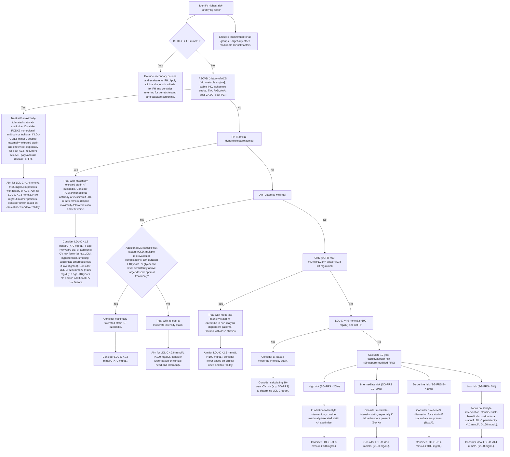
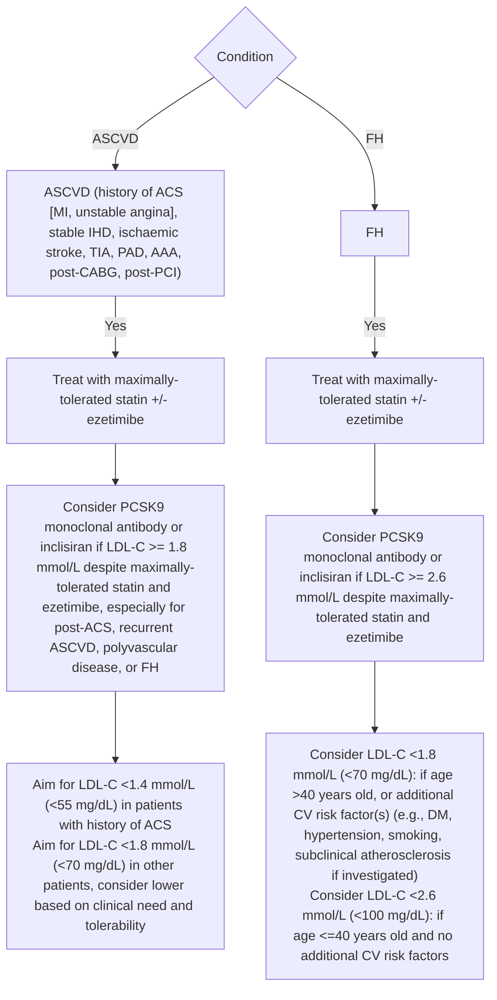
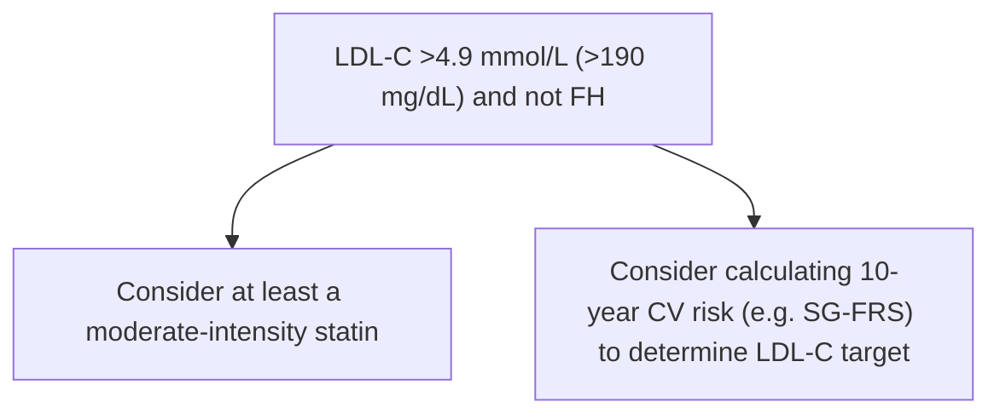
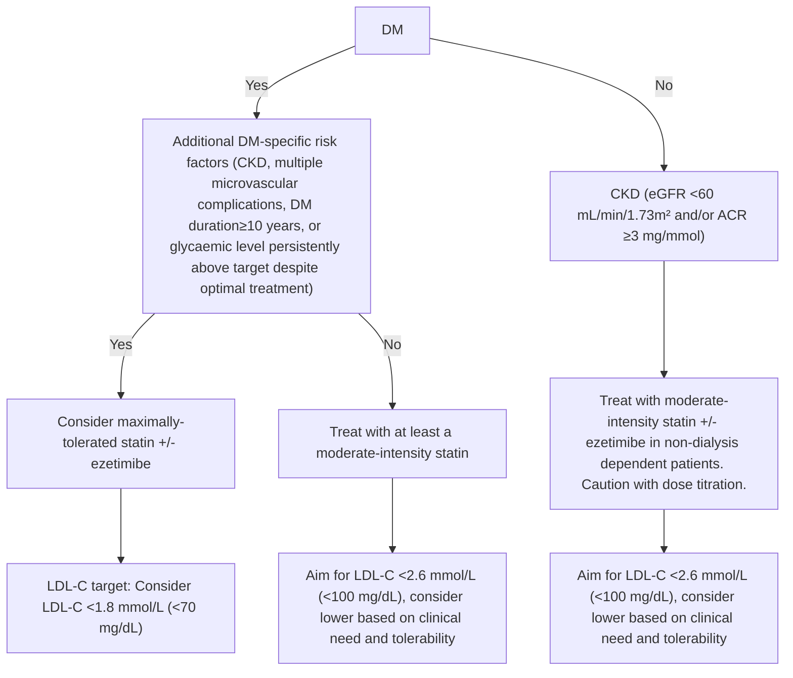
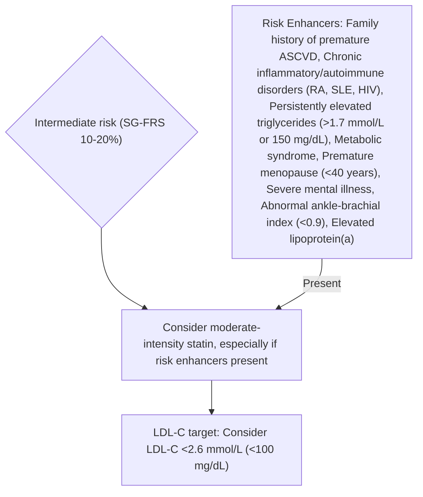
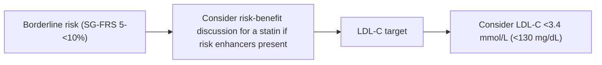
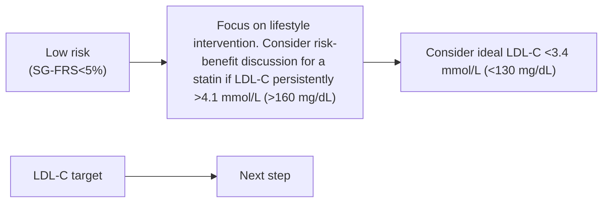
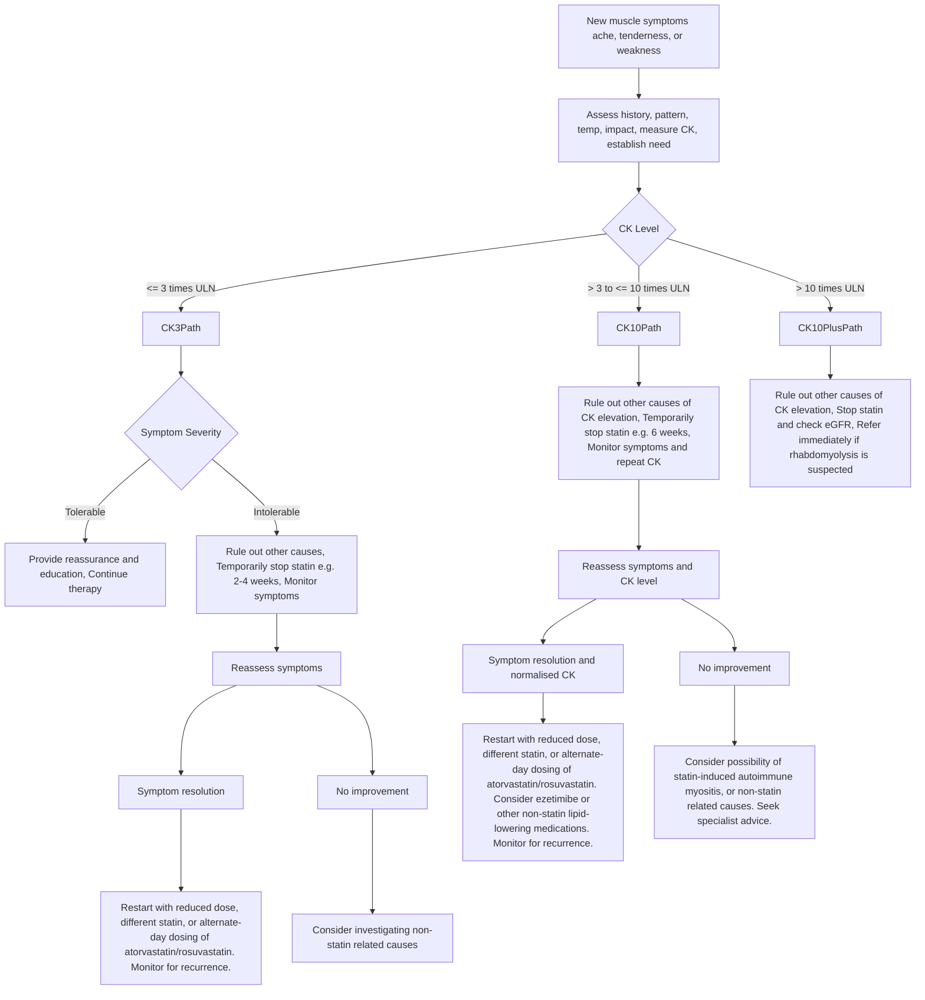

<!-- cpg_id: Lipid management- focus on cardiovascular risk ACG (Dec 2023) v1.1 | phase4 deterministic | spine: Overview, Assessment, Selection of management options, Support and review, References -->
<!-- meta | source: ACE CLINICAL GUIDANCE | published: Published: 15 December 2023 | url: www.ace-hta.gov.sg | title: Lipid management. Focus on cardiovascular risk -->


## Overview

```yaml
cpg_id: Lipid management- focus on cardiovascular risk ACG (Dec 2023) v1.1
chunk_id: Lipid management- focus on cardiovascular risk ACG (Dec 2023) v1.1.overview.prose.01
chunk_type: prose
section_id: overview
parent_rec: null
title: "Definitions and scope of application"
source_pages: [1, 2]
strength: null
tables_referenced: []
figures_referenced: []
url_links: []
cross_refs: []
review_flags:
  - contains_conditional_language
```

Version 1.1 (amended in June 2025)

Lipid
management

Illustration of blood vessels with red blood vessels inside a circular frame (no text or symbols)

Human body silhouette with internal organs and a brain diagram overlay (no text or symbols)

### Objective

To optimise management of hyperlipidaemia and reduce overall cardiovascular risk

### Scope

Management of hyperlipidaemia with lipid-lowering medications and lifestyle intervention

### Target audience

This clinical guidance is relevant to all healthcare professionals, especially those providing primary or generalist care

### Background

Hyperlipidaemia is characterised by elevated lipid levels in the blood. Among Singaporean adults, hyperlipidaemia is a leading risk factor for atherosclerotic cardiovascular diseases (ASCVDs) such as myocardial infarction  and ischaemic stroke.  The goal of lipid management is to reduce the incidence or recurrence of ASCVD, especially coronary artery disease, through minimising accumulated exposure to low-density lipoprotein (LDL) cholesterol.

Individuals who may benefit from lipid-lowering pharmacotherapy can be identified through cardiovascular (CV) risk assessment. In addition to lifestyle intervention, statins are the main class of medications used to reduce lipid levels and ASCVD risk. Non-statin lipid-lowering medications are additional options for patients who require intensive lipid lowering or are unable to tolerate statins. This guidance provides evidence-based recommendations to optimise management of hyperlipidaemia by assessing overall CV risk and the clinical need for lipid-lowering medications, especially for healthcare professionals working in primary care settings.

### Statement of Intent

This ACE Clinical Guidance (ACG) provides concise, evidence-based recommendations and serves as a common starting point nationally for clinical decision-making. It is underpinned by a wide array of considerations contextualised to Singapore, based on best available evidence at the time of development. The ACG is not exhaustive of the subject matter and does not replace clinical judgement. The recommendations in the ACG are not mandatory, and the responsibility for making decisions appropriate to the circumstances of the individual patient remains at all times with the healthcare professional.

College of Public Health & Occupational Physicians

### Approach to lipid management – at a glance

Lipid management is a component of preventive care that aims to reduce the risk of atherosclerotic CV events, such as myocardial infarction and ischaemic stroke.

---


## Assessment

```yaml
cpg_id: Lipid management- focus on cardiovascular risk ACG (Dec 2023) v1.1
chunk_id: Lipid management- focus on cardiovascular risk ACG (Dec 2023) v1.1.assessment.prose.01
chunk_type: prose
section_id: assessment
parent_rec: null
title: "Assessment overview"
source_pages: [2]
strength: null
tables_referenced: []
figures_referenced:
  - Figure 1. A practical guide to risk stratification for lipid management in key patient groups
url_links: []
cross_refs: []
review_flags: []
```

▶ Cardiovascular (CV) risk and lipid profile are key factors in deciding on management options.

▶ Figure 1 provides a practical flow chart for assessing and stratifying CV risk based on:

Medical conditions that confer very high to high risk, or

Estimated 10-year CV risk score for people who have one or more risk factors but are otherwise healthy

Recommendation 1 | Pages 2–3

---

```yaml
cpg_id: Lipid management- focus on cardiovascular risk ACG (Dec 2023) v1.1
chunk_id: Lipid management- focus on cardiovascular risk ACG (Dec 2023) v1.1.assessment.recommendation.01
chunk_type: recommendation
section_id: assessment
parent_rec: null
title: "Recommendation 1"
source_pages: [2]
strength: strong
tables_referenced: []
figures_referenced:
  - Figure 1. A practical guide to risk stratification for lipid management in key patient groups
url_links: []
cross_refs: []
review_flags: []
```

**Recommendation 1**

### Assess overall CV risk to inform initial and ongoing management of hyperlipidaemia

CV risk provides the starting point for clinical judgment and shared decision-making to manage hyperlipidaemia, since the benefit from lipid lowering is proportionate to the baseline cardiovascular risk. Specifically, CV risk assessment informs:

1. The need for statin initiation

2. The intensity of pharmacotherapy, including use of non-statin lipid-lowering medications

For the purpose of lipid management, assess for the presence of medical conditions that confer risk, and other CV risk factors. In the absence of established conditions that confer a very high to high level of risk, calculate 10-year risk score  (see Figure 1 for risk stratification).

Identify the presence of medical condition(s) that confers very high to high risk

If none present

Calculate 10-year risk score for the general population who are otherwise healthy and asymptomatic

### Very high to high risk

See Figure 1 for risk stratification and further details on management

a. While risk calculators account for major risk factors, they are not exhaustive. For example, risk enhancers are not usually part of risk calculators. Taking into account risk enhancers can help to better assess the patient's CV risk profile when there is uncertainty on starting a statin at the intermediate to borderline risk level.

---


## Selection of management options

```yaml
cpg_id: Lipid management- focus on cardiovascular risk ACG (Dec 2023) v1.1
chunk_id: Lipid management- focus on cardiovascular risk ACG (Dec 2023) v1.1.selection_of_management_options.prose.01
chunk_type: prose
section_id: selection_of_management_options
parent_rec: null
title: "Selection of management options overview"
source_pages: [2]
strength: null
tables_referenced: []
figures_referenced: []
url_links: []
cross_refs: []
review_flags:
  - contains_conditional_language
```

The goal of lifestyle intervention and statin therapy if indicated is to lower CV risk through reducing low-density lipoprotein cholesterol (LDL-C) – alongside modification of other risk factors.

Beyond statins, some patients may have clinical need for additional pharmacotherapy such as ezetimibe and PCSK9 inhibitors

Recommendation 2: factors for consideration

Page 4

Recommendation 3: lifestyle intervention

Page 5

Recommendations 4-7: clinical approach by key patient groups

Pages 6–11

▶ Elevated triglycerides are mainly addressed through lifestyle intervention and reversal of secondary causes. Use of fibrates may be considered to reduce the risk of acute pancreatitis.

Recommendation 8

Page 12

---

```yaml
cpg_id: Lipid management- focus on cardiovascular risk ACG (Dec 2023) v1.1
chunk_id: Lipid management- focus on cardiovascular risk ACG (Dec 2023) v1.1.selection_of_management_options.figure.01
chunk_type: figure
section_id: selection_of_management_options
parent_rec: null
title: "Figure 1. A practical guide to risk stratification for lipid management in key patient groups"
source_pages: [3]
strength: null
reconstructed_from: mermaid
image_dir: grouped_p3_fig_01.jpg
url_links: []
cross_refs: []
review_flags: []
```

**Figure 1. A practical guide to risk stratification for lipid management in key patient groups**



---

```yaml
cpg_id: Lipid management- focus on cardiovascular risk ACG (Dec 2023) v1.1
chunk_id: Lipid management- focus on cardiovascular risk ACG (Dec 2023) v1.1.selection_of_management_options.recommendation.02
chunk_type: recommendation
section_id: selection_of_management_options
parent_rec: null
title: "Recommendation 2"
source_pages: [4]
strength: strong
tables_referenced: []
figures_referenced: []
url_links: []
cross_refs: []
review_flags:
  - contains_conditional_language
  - contains_dosing_information
```

**Recommendation 2**

### Individualise management goals, including use of LDL-C targets, in the context of patient-specific risk factors

Reduction of CV risk requires multiple management strategies, as lipid management alone reduces but does not eliminate risk (residual risk can remain in patients who have achieved lipid control).

Management should be tailored to individual goals and characteristics, including comorbidities. For example, lipid management for a patient with both ASCVD and diabetes would be tailored to the risk conferred by ASCVD (CV risk is assigned according to the highest category fulfilled), while attending to other factors such as glycaemic control.

Lipid management options should include the following considerations:

- Overall CV risk: absolute benefits from lowering LDL-C are greater as risk increases.

- Lifestyle factors: a trial of lifestyle intervention (to address diet, physical activity, smoking) can be offered as primary prevention for those who are not at high risk of CV events. For those who are at higher risk, lifestyle intervention should be emphasised in parallel with pharmacological treatment.

- Patient preferences and values

Putting the patient at the centre of management allows for shared decision-making, which is essential to achieve agreed goals and encourage adherence to medication and medical advice.

▶ Lifestyle interventions should be tailored based on readiness to change and individual context (such as occupation and social support).

- Age, functional status, and life expectancy:

In patients with poor functional status or short life expectancy, pill burden and the relative importance of other management goals can influence the choice of management options (e.g., the need to start pharmacotherapy).

▶ While older age (>75 years) is not a contraindication for statin use, factors to be considered include potential benefits, risk of side effects (noting that renal or hepatic impairment and potential for drug interactions may be more likely), patient preference, and functional status.

### Use of lipid-lowering therapy in pregnancy

In pregnant women, choice of lipid-lowering therapy is limited by potential safety concerns, and balance of benefits and risks should be individualised. Generally, statins should be avoided in most pregnant patients.

### LDL-C remains an established marker for lipid management

Setting management goals in the form of absolute LDL-C targets may be useful in monitoring progress, and guides clinicians on management when pre-treatment LDL-C is not available. However, there are evidence limitations to the treat-to-target strategy, as this approach is indirectly derived from clinical trials and observational studies. To help contextualise use of LDL-C targets:

- Select appropriate intensity of pharmacotherapy, as a sufficient reduction in LDL-C is necessary to reduce CV events.

- Consider individual circumstances in which LDL-C target attainment is outweighed by other clinical priorities or is of uncertain benefit due to factors such as precautions with statin use, frailty, or polypharmacy.

- If a patient cannot attain their LDL-C target, check for barriers such as poor adherence, adverse effects, misperceptions about statins, or issues with medication administration before increasing statin dose or adding another medication class.

- Individuals vary in their response to lipid-lowering therapy; if pre-treatment LDL-C is available, percent reduction from baseline can be monitored alongside absolute LDL-C targets.

---

```yaml
cpg_id: Lipid management- focus on cardiovascular risk ACG (Dec 2023) v1.1
chunk_id: Lipid management- focus on cardiovascular risk ACG (Dec 2023) v1.1.selection_of_management_options.recommendation.03
chunk_type: recommendation
section_id: selection_of_management_options
parent_rec: null
title: "Recommendation 3"
source_pages: [5, 6, 7]
strength: strong
tables_referenced:
  - Table 1. Statin intensity by ACC/AHA system of classification
figures_referenced:
  - Figure 1. A practical guide to risk stratification for lipid management in key patient groups
url_links: []
cross_refs: []
review_flags:
  - contains_conditional_language
  - contains_dosing_information
```

**Recommendation 3**

### Encourage and support healthy diet, physical activity, weight management, or smoking cessation, tailored to the patient's circumstances

Lifestyle intervention, as a component of both primary and secondary prevention, should be tailored according to the individual's context, overall CV risk, and lipid profile. In addition to addressing cardiometabolic risk factors, patients may value benefits to quality of life and daily functioning. Among patients with clinical need for significant reduction in LDL-C, lifestyle intervention is complementary to pharmacotherapy.

Supporting behavioural change via engaging patients in their lifestyle intervention plan can optimise chances of sustained changes. Simple counselling frameworks may be applied to assess lifestyle factors and support patients, such as the 5A's – ask, advise, assess, assist and arrange. Follow-up and support may be provided over several visits, including by allied-health professionals.

For individuals who have undertaken a trial of lifestyle intervention, 10-year CV risk can be reassessed after 3–6 months, alongside the lipid profile, to determine effectiveness.

### LDL-C lowering pharmacotherapy

This subsection discusses lipid-lowering pharmacotherapy options for patients with various degrees of CV risk (patient groups are aligned with those in the Figure 1 flow chart).

### Statins

In addition to lifestyle intervention, statins are the mainstay of pharmacological lipid management, lowering the risk of major CV events by 20–25% per 1 mmol/L (40 mg/dL) reduction in LDL-C.   With the same relative risk reduction, absolute benefits are greater as risk increases. Apart from LDL-C lowering effect, statins modestly reduce triglyceride levels, lower inflammatory markers like C-reactive protein, and have plaque-stabilising effects.

Statins range from low- to high-intensity, leading to different degrees of LDL-C reduction (Table 1).

Where “maximally-tolerated statin” is recommended, note that:

Most patients in this category benefit from intensive lipid lowering, that is at least 50% reduction or to reach lower LDL-C targets, due to their high to very high level of CV risk.

Some patients may not tolerate a high-intensity statin dose. For these patients, a maximally-tolerated statin may be of lower dose or a less potent statin instead. The addition of a non-statin medication such as ezetimibe may be helpful in such patients.

Before starting a statin, check for:

- Pregnancy, preconception planning, or breastfeeding (if applicable)

- Hepatic impairment, as use is contraindicated in decompensated cirrhosis and acute liver failure

- Renal function to inform dose adjustment

- Predisposition to adverse effects

- Concurrent treatment that may interact with statins

See Recommendation 9 for more details.

### Non-statin lipid-lowering medications

Use of a non-statin lipid-lowering medication may be indicated, if a patient is on maximally-tolerated statin and has not reached their management goal (despite good adherence) or is unable to tolerate statins. Factors for consideration include CV risk profile, potential adverse effects, affordability, and patient preference.

- Ezetimibe is an oral, cholesterol absorption inhibitor that lowers LDL-C by 15–20%,  with associated CV risk reduction when combined with statin therapy.

- Proprotein convertase subtilisin/kexin type-9 (PCSK9) inhibitors include monoclonal antibodies (evolocumab, alirocumab) and inclisiran. This class of medication reduce LDL-C by an additional 45–60% when added to statin therapy and may be considered for select patients with ASCVD or FH who require more intensive lipid lowering.   In monotherapy trials with statin-intolerant patients, mean LDL-C reduction ranged from 45 to 52%.

- Bile acid sequestrants (BAS) lower LDL-C by an additional 10–20%,  but lack proven cardiovascular benefit and thus are less preferred as add-on medication. BAS require multiple doses daily and are prone to drug-drug interactions.

### General principles of lipid-lowering pharmacotherapy for CV risk reduction

1. A statin is recommended for patients at high to very high risk as the benefit significantly outweighs potential harms; some patients may require intensive lipid lowering (see below). For patients at intermediate risk or below, a statin can be offered depending on balance of benefits and harms, including presence of risk enhancers.

2. Intensive lipid lowering (with maximally-tolerated statin and ezetimibe) is recommended for patients with ASCVD or FH. Depending on clinical need and LDL-C level, some can also be considered for the addition of a PCSK9 monoclonal antibody (alirocumab or evolocumab) or inclisiran.

3. Intensive lipid lowering can be considered for some patients without ASCVD or FH, such as those with high 10-year risk score (above 20%), or diabetes with complications and/or long duration of disease.

Other factors for consideration are outlined in Recommendation 2.

Further details are provided in subsequent recommendations (Recommendations 4-7).

---

```yaml
cpg_id: Lipid management- focus on cardiovascular risk ACG (Dec 2023) v1.1
chunk_id: Lipid management- focus on cardiovascular risk ACG (Dec 2023) v1.1.selection_of_management_options.figure.02
chunk_type: figure
section_id: selection_of_management_options
parent_rec: Lipid management- focus on cardiovascular risk ACG (Dec 2023) v1.1.selection_of_management_options.recommendation.03
title: "Figure 2. Key components of lifestyle intervention to support lipid management"
source_pages: [5]
strength: null
reconstructed_from: table
image_dir: grouped_p5_fig_01.jpg
url_links: []
cross_refs: []
review_flags: []
```

**Figure 2. Key components of lifestyle intervention to support lipid management**

| Component | Key Recommendations & Details |
| :--- | :--- |
| **Cardioprotective diet** | - Use "My Healthy Plate" guide.<br>- Emphasize: Wholegrains, Fruits and vegetables, Healthy protein (fish, lean meat, tofu, bean products, nuts).<br>- **To lower Triglycerides:** Address excessive calories (incl. alcohol), refined sugar, saturated fat.<br>- **To lower LDL cholesterol:** Increase soluble fibre, avoid trans fat, replace saturated fat with polyunsaturated fats. Avoid ketogenic diets (increase LDL-C). |
| **Physical activity** | - Include movement during occupational/daily activities.<br>- Encourage any duration/intensity for sedentary people.<br>- Aim for **150–300 minutes/week** of moderate-intensity activity (gradual increase).<br>- Supervised exercise/professional advice may be needed (e.g., cardiac rehab) or if resting BP > 160/90 mmHg. |
| **Smoking cessation** | - Support via "I Quit" programme and pharmacotherapy. |
| **Healthy weight** | - **Overweight/obese:** Weight reduction of **5–10%** beneficial for lipid profile (esp. lowering TG) and CV risk factors. |
| **Limited alcohol intake** | - **Elevated TG + excessive intake:** Limit to ≤2 drinks/day (men), ≤1 drink/day (women).<br>- **TG > 4.5 mmol/L (400 mg/dL) OR history of acute pancreatitis:** Abstain from alcohol. |

---

```yaml
cpg_id: Lipid management- focus on cardiovascular risk ACG (Dec 2023) v1.1
chunk_id: Lipid management- focus on cardiovascular risk ACG (Dec 2023) v1.1.selection_of_management_options.table.01
chunk_type: table
section_id: selection_of_management_options
parent_rec: Lipid management- focus on cardiovascular risk ACG (Dec 2023) v1.1.selection_of_management_options.recommendation.03
title: "Table 1. Statin intensity by ACC/AHA system of classification"
source_pages: [6]
strength: null
image_dir: 3ecbecfcce2caf41abd598dad944ed2a4feb0e056d94dd60b28c25278ab6b899.jpg
url_links: []
cross_refs: []
review_flags:
  - contains_dosing_information
```

**Table 1. Statin intensity by ACC/AHA system of classification**

<table><tr><td rowspan="2">Statin</td><td>Low-intensity dose</td><td>Moderate-intensity dose</td><td>High-intensity dose</td></tr><tr><td>(LDL-C reduction &lt;30%)</td><td>(LDL-C reduction 30–49%)</td><td>(LDL-C reduction ≥50%)</td></tr><tr><td>Atorvastatin</td><td>-</td><td>10–20 mg</td><td>40–80mg</td></tr><tr><td>Lovastatin</td><td>20 mg</td><td>40–80 mg</td><td>-</td></tr><tr><td>Pitavastatin</td><td>-</td><td>1–4 mg</td><td>-</td></tr><tr><td>Pravastatin</td><td>10–20 mg</td><td>40–80 mg</td><td>-</td></tr><tr><td>Rosuvastatin</td><td>-</td><td>5–10 mg</td><td>20–40 mg</td></tr><tr><td>Simvastatin</td><td>10 mg</td><td>20–40 mg</td><td>*</td></tr></table>

> *Footnote: ACC, American College of Cardiology; AHA, American Heart Association*

> *Footnote: *Simvastatin 80 mg is not recommended due to high risk of myopathy; use should be restricted to those who have been taking 80 mg long-term without evidence of myopathy.*

---

```yaml
cpg_id: Lipid management- focus on cardiovascular risk ACG (Dec 2023) v1.1
chunk_id: Lipid management- focus on cardiovascular risk ACG (Dec 2023) v1.1.selection_of_management_options.recommendation.04
chunk_type: recommendation
section_id: selection_of_management_options
parent_rec: null
title: "Recommendation 4"
source_pages: [7, 8]
strength: strong
tables_referenced: []
figures_referenced:
  - Figure 3. Additional considerations when prescribing ezetimibe
url_links: []
cross_refs: []
review_flags:
  - contains_conditional_language
  - contains_dosing_information
```

**Recommendation 4**

Select intensive lipid-lowering therapy, using maximally-tolerated statin and adding ezetimibe as needed, for patients with:

- Atherosclerotic cardiovascular disease (ASCVD)

- Familial hypercholesterolaemia (FH).

### ASCVD

(history of ACS [MI, unstable angina], stable IHD  , ischaemic stroke, TIA, PAD, AAA, post-CABG, post-PCI)

▶ Treat with maximally-tolerated statin +/- ezetimibe

Consider PCSK9 monoclonal antibody or inclisiran if LDL-C ≥ 1.8 mmol/L despite maximally-tolerated statin and ezetimibe, especially for post-ACS, recurrent ASCVD, polyvascular disease, or FH.

### LDL-C target

- Aim for LDL-C <1.4 mmol/L (<55 mg/dL) in patients with history of ACS

- Aim for LDL-C <1.8 mmol/L (<70 mg/dL) in other patients, consider lower based on clinical need and tolerability

### Clinical approach for ASCVD and/or FH

If not currently on lipid-lowering therapy, high-intensity statin or maximally-tolerated statin is recommended to achieve a substantial reduction in LDL-C. Monitor and titrate statin therapy towards the patient's LDL-C target.

For individuals already on a statin, titrate to a high-intensity statin or maximally-tolerated statin, and add ezetimibe for an additional 15–20% reduction if LDL-C target cannot be achieved (see Figure 3 below for additional considerations).

---

```yaml
cpg_id: Lipid management- focus on cardiovascular risk ACG (Dec 2023) v1.1
chunk_id: Lipid management- focus on cardiovascular risk ACG (Dec 2023) v1.1.selection_of_management_options.figure.03
chunk_type: figure
section_id: selection_of_management_options
parent_rec: Lipid management- focus on cardiovascular risk ACG (Dec 2023) v1.1.selection_of_management_options.recommendation.04
title: "Figure 1 extract"
source_pages: [7]
strength: null
reconstructed_from: mermaid
image_dir: grouped_p7_fig_01.jpg
url_links: []
cross_refs: []
review_flags: []
```

**Figure 1 extract**



---

```yaml
cpg_id: Lipid management- focus on cardiovascular risk ACG (Dec 2023) v1.1
chunk_id: Lipid management- focus on cardiovascular risk ACG (Dec 2023) v1.1.selection_of_management_options.figure.04
chunk_type: figure
section_id: selection_of_management_options
parent_rec: Lipid management- focus on cardiovascular risk ACG (Dec 2023) v1.1.selection_of_management_options.recommendation.04
title: "Figure 3. Additional considerations when prescribing ezetimibe"
source_pages: [8]
strength: null
reconstructed_from: mermaid
image_dir: grouped_p8_fig_01.jpg
url_links: []
cross_refs: []
review_flags: []
```

**Figure 3. Additional considerations when prescribing ezetimibe**

```mermaid
graph TD
    Start{Patient on maximally-tolerated statin + ezetimibe}
    Start -->|ASCVD| ASCVD_Cond{"LDL-C >= 1.8 mmol/L (70 mg/dL)?"}
    ASCVD_Cond -->|Yes| ASCVD_Action["Consider PCSK9 mAb (alirocumab/evolocumab) or inclisiran"]
    ASCVD_Action -->|Especially for| High_Risk[ACS, recurrent ASCVD, FH, or polyvascular disease]
    Start -->|FH (without ASCVD)| FH_Cond{"LDL-C >= 2.6 mmol/L (100 mg/dL)?"}
    FH_Cond -->|Yes| FH_Action[Consider PCSK9 mAb]
    FH_Action -->|Note| Evolocumab_Reg[Only evolocumab registered for heterozygous and homozygous FH]
    FH_Action -->|If unable to achieve reduction| Specialist_Ref[Shared care or specialist management at lipid clinics]
```

---

```yaml
cpg_id: Lipid management- focus on cardiovascular risk ACG (Dec 2023) v1.1
chunk_id: Lipid management- focus on cardiovascular risk ACG (Dec 2023) v1.1.selection_of_management_options.figure.05
chunk_type: figure
section_id: selection_of_management_options
parent_rec: Lipid management- focus on cardiovascular risk ACG (Dec 2023) v1.1.selection_of_management_options.recommendation.04
title: "Figure 4. Additional considerations when prescribing PCSK9 monoclonal antibodies or inclisiran"
source_pages: [8]
strength: null
reconstructed_from: mermaid
image_dir: grouped_p8_fig_02.jpg
url_links: []
cross_refs: []
review_flags: []
```

**Figure 4. Additional considerations when prescribing PCSK9 monoclonal antibodies or inclisiran**



---

```yaml
cpg_id: Lipid management- focus on cardiovascular risk ACG (Dec 2023) v1.1
chunk_id: Lipid management- focus on cardiovascular risk ACG (Dec 2023) v1.1.selection_of_management_options.recommendation.05
chunk_type: recommendation
section_id: selection_of_management_options
parent_rec: null
title: "Recommendation 5"
source_pages: [9]
strength: strong
tables_referenced: []
figures_referenced:
  - Figure 1. A practical guide to risk stratification for lipid management in key patient groups
url_links: []
cross_refs: []
review_flags:
  - contains_conditional_language
  - contains_dosing_information
```

**Recommendation 5**

### Select a statin for patients with diabetes mellitus (DM), chronic kidney disease (CKD), or high 10-year CV risk (>20%). Consider adding ezetimibe for further risk reduction if needed.



Most people with DM or non-dialysis-dependent CKD (without prior ASCVD or FH) have an elevated risk of CV complications over their lifetime. Also, the lipid profile in patients with DM or CKD often consists of mixed dyslipidaemia, where both TG and LDL-C are elevated.

### Clinical approach for DM and/or CKD

As part of a multifactorial CV risk reduction strategy, use at least a moderate-intensity statin for patients with DM. Due to significant residual risk, consider increasing statin dose or adding ezetimibe as needed if DM-specific risk factors are present (CKD, multiple microvascular complications, long disease duration, or persistently above-target glycaemic levels).

- For advanced CKD, caution with dose titration of statin is advised to minimise the risk of myopathy, especially when eGFR <30 mL/min/1.73m² (see Supplement 1 for dose adjustments and contraindications).

There is uncertainty of the benefit of high-intensity statins for patients with non-dialysis dependent CKD in primary prevention or treating intensively to target. A moderate-intensity statin, with or without ezetimibe, is recommended for this group. Benefits of initiating statins have not been demonstrated in dialysis-dependent patients.

Address modifiable risk factors, including glycaemic control and BP control:

For guidance on management of T2DM, refer to Type 2 diabetes mellitus – personalising management with non-insulin medications and Initiating basal insulin in type 2 diabetes mellitus

For guidance on management of CKD, refer to Chronic kidney disease – delaying progression and reducing cardiovascular complications

In the absence of high-risk medical conditions such as DM or CKD, overall cardiovascular risk should be assessed and stratified according to 10-year risk score to inform decision-making on statin initiation and intensity of lipid lowering.

High risk (SG-FRS >20%)

Consider maximally-tolerated statin +/- ezetimibe

LDL-C target

Consider LDL-C <1.8 mmol/L (<70 mg/dL)

Figure 1 extract

### Clinical approach for high 10-year risk (>20%)

The benefit of pharmacotherapy in reducing CV risk outweighs potential adverse effects for patients with a 10-year risk above 20%. It is therefore reasonable to offer a statin (high-intensity or maximally-tolerated dose), regardless of baseline LDL-C, and add ezetimibe as needed to reach management goals. In addition to statin-based therapy, address modifiable factors that contribute to the 10-year CV risk such as hypertension and smoking.

Factors such as patient preferences and values, life expectancy, frailty, and polypharmacy apply when deciding on starting a statin and selecting a target. While older age alone may confer significant CV risk, direct evidence of intensive lipid lowering is currently lacking for patients older than 75 years without ASCVD.

It should be noted that the SG-FRS predicts the endpoint myocardial infarction and coronary death, and does not include ischaemic stroke as an outcome. Thus, established risk factors for stroke  — namely hypertension, atrial fibrillation, physical inactivity, diet, smoking, and abdominal obesity — should be addressed, in view of their contribution to the overall CV risk.

---

```yaml
cpg_id: Lipid management- focus on cardiovascular risk ACG (Dec 2023) v1.1
chunk_id: Lipid management- focus on cardiovascular risk ACG (Dec 2023) v1.1.selection_of_management_options.recommendation.06
chunk_type: recommendation
section_id: selection_of_management_options
parent_rec: null
title: "Recommendation 6"
source_pages: [10, 11]
strength: strong
tables_referenced: []
figures_referenced: []
url_links: []
cross_refs: []
review_flags:
  - contains_conditional_language
  - contains_dosing_information
```

**Recommendation 6**

### Consider prescribing a statin for patients with 10-year CV risk between 10–20%, especially in the presence of risk enhancers.

Intermediate risk (SG-FRS 10–20%)

Consider moderate-intensity statin, especially if risk enhancers present

LDL-C target

Consider LDL-C <2.6 mmol/L (<100 mg/dL)

### Selective use of coronary artery calcium (CAC) scoring

If uncertainty on the benefit-harm balance of statin initiation remains after both 10-year CV risk score and risk enhancers have been considered, some guidelines suggest potential use of CAC scoring to reclassify risk for decision-making. Risk scores are available which integrate the calcium score to recalculate 10-year risk (e.g., Multi-Ethnic Study of Atherosclerosis Risk [MESA] calculator).

In many patients at intermediate risk, CAC scoring is not needed as the decision to start statin is clear. It is not intended for de-risking patients with known risk, such as those with smoking history.

---

```yaml
cpg_id: Lipid management- focus on cardiovascular risk ACG (Dec 2023) v1.1
chunk_id: Lipid management- focus on cardiovascular risk ACG (Dec 2023) v1.1.selection_of_management_options.figure.06
chunk_type: figure
section_id: selection_of_management_options
parent_rec: Lipid management- focus on cardiovascular risk ACG (Dec 2023) v1.1.selection_of_management_options.recommendation.06
title: "Figure 1 extract"
source_pages: [10]
strength: null
reconstructed_from: mermaid
image_dir: grouped_p10_fig_01.jpg
url_links: []
cross_refs: []
review_flags: []
```

**Figure 1 extract**



---

```yaml
cpg_id: Lipid management- focus on cardiovascular risk ACG (Dec 2023) v1.1
chunk_id: Lipid management- focus on cardiovascular risk ACG (Dec 2023) v1.1.selection_of_management_options.recommendation.07
chunk_type: recommendation
section_id: selection_of_management_options
parent_rec: null
title: "Recommendation 7"
source_pages: [11]
strength: strong
tables_referenced: []
figures_referenced:
  - Figure 5
url_links: []
cross_refs: []
review_flags:
  - contains_conditional_language
  - contains_dosing_information
```

**Recommendation 7**

### Provide education and a lifestyle management plan for patients with 10-year CV risk below 10%; consider assessing risk enhancers for patients with borderline risk to discuss the clinical need for a statin.

Addressing modifiable risk factors and optimising lifestyle are the main management options for individuals with a 10-year CV risk below 10%, as the balance of CV benefits and adverse effects for a statin are less certain. If the patient has severe hypercholesterolaemia (LDL-C >4.9 mmol/L or 190 mg/dL, not FH), consider at least a moderate-intensity statin on account of the elevated risk factor alone.



### Clinical approach for borderline risk (5–<10%)

The borderline risk group is a new category that recognises the potential benefit of providing earlier clinical attention to patients who will accumulate risk over a longer time period, if lifestyle and risk factor modification are not started.

Among patients in the borderline CV risk group, the benefit-risk balance of taking a statin is less certain.   Hence, risk enhancers may be helpful to decide which patients are closer to intermediate risk and may benefit from early discussion on clinical need for a statin or closer monitoring (see Figure 5 above).



### Clinical approach for low risk (<5%)

In general, statin therapy is not needed if 10-year CV risk is low (<5%). If LDL-C level is persistently high (above 4.1 mmol/L [160 mg/dL]) despite intensive lifestyle changes, consider a risk-benefit discussion for pharmacotherapy.

Optimal lipid control early and over time is associated with a lower risk of CVD or mortality in later life.   Thus, clinicians may wish to offer an ideal LDL-C level of <3.4 mmol/L (<130 mg/dL) as part of shared decision-making with the patient. Many low-risk patients with LDL-C between 3.4–4.1 mmol/L can still benefit from lifestyle intervention. Younger age groups especially have a longer time trajectory to be exposed to LDL-C and other risk factors, the burden of which is not reflected in their low 10-year risk scores.

While all patients should be reassessed and provided tailored advice on optimising lifestyle, some patients may benefit from a personalised lifestyle management plan that specifies the quantity, timing, and type of action to drive behavioural change (see Recommendation 3).

f. For example, at a 10-year CV risk score of 5–9%, about 1-3 out of 100 people will avoid a major CV event over ten years by taking a moderate-intensity statin. In comparison, 1 out of 100 people may experience myalgia or new-onset diabetes over five years (slightly increased for those with risk factors for diabetes).

---

```yaml
cpg_id: Lipid management- focus on cardiovascular risk ACG (Dec 2023) v1.1
chunk_id: Lipid management- focus on cardiovascular risk ACG (Dec 2023) v1.1.selection_of_management_options.recommendation.08
chunk_type: recommendation
section_id: selection_of_management_options
parent_rec: null
title: "Recommendation 8"
source_pages: [12]
strength: strong
tables_referenced: []
figures_referenced:
  - Figure 1. A practical guide to risk stratification for lipid management in key patient groups
url_links: []
cross_refs: []
review_flags:
  - contains_conditional_language
  - contains_dosing_information
```

**Recommendation 8**

For patients with elevated triglycerides (TG):

a. Assess and manage lifestyle-related and secondary causes;  
b. At higher levels exceeding 4.5 mmol/L (400 mg/dL), consider fibrates to lower the risk of pancreatitis.

Elevated triglyceride level (TG >1.7 mmol/L or 150 mg/dL) contribute to overall cardiovascular risk, while even higher levels lead to accumulation of large chylomicrons that may trigger pancreatitis.   Correcting underlying causes and lifestyle factors is the cornerstone of management. Reversible secondary causes including the following should be identified and managed:

- Diet high in saturated fat, simple sugars, and caloric intake

- Obesity or overweight

- Poorly controlled diabetes

- Alcohol intake

- Medications that raise TG (e.g. thiazide diuretics, beta-blockers), some of which may be replaced with lipid-neutral alternatives

- Hypothyroidism

### Managing cardiovascular risk

Many patients with hypertriglyceridaemia also have concurrent CV risk factors that can be optimised. If not yet assessed or not already on a statin, they should be risk-stratified according to Figure 1.

Lifestyle intervention, and pharmacotherapy if indicated, are the cornerstone of managing CV risk in patients with elevated TG where secondary causes have been ruled out or addressed. Statins reduce TG levels by 10–20%,  with higher reduction if baseline TG is higher.

Fibrates in
statin-treated patients

Lowering TG through fibrates has not demonstrated significant additive benefits for CV risk reduction among patients optimised on statins.

### Managing pancreatitis risk

The risk of acute pancreatitis increases progressively with triglyceride level. In a cohort study, individuals with TG between 4.5–10 mmol/L have on average double the risk compared to those at 1.7 mmol/L or below.   Previous history of acute pancreatitis is a strong risk factor for recurrence, even when TG is modestly elevated.

Internationally, differences exist in the recommended threshold of TG level for treatment to reduce pancreatitis risk.   Most commonly, TG level either exceeding 4.5 mmol/L (400 mg/dL) or 5.6 mmol/L (500 mg/dL) is used to guide clinical attention to the need for more intensive dietary management, alcohol abstinence, and triglyceride-lowering pharmacotherapy. After excluding or addressing secondary causes, fibrates may be considered when significant TG lowering, up to 30–70%,   is desired.

When the patient is on a statin, fenofibrate is preferred over gemfibrozil, as it has a lower risk of drug-drug interaction resulting in severe myopathy. Concomitant fibrate and statin therapy require liver function monitoring due to risk of hepatotoxicity. Multiple formulations of fenofibrate exist; refer to product-specific prescribing information for dosing.

Severe elevation of TG at 10 mmol/L (885 mg/dL) and above generally warrant specialist assessment and management.

---


## Support and review

```yaml
cpg_id: Lipid management- focus on cardiovascular risk ACG (Dec 2023) v1.1
chunk_id: Lipid management- focus on cardiovascular risk ACG (Dec 2023) v1.1.support_and_review.prose.01
chunk_type: prose
section_id: support_and_review
parent_rec: null
title: "Support and review overview"
source_pages: [2, 12]
strength: null
tables_referenced: []
figures_referenced: []
url_links: []
cross_refs: []
review_flags:
  - contains_conditional_language
```

▶ Clinicians play a role in providing patient education, managing adverse effects, and adjusting or switching statins when warranted.

▶ Alternative lipid-lowering therapies may be considered to reach management goal if statins are not tolerated.

Recommendation 9 | Pages 13–14

Follow-up and review of patients with hyperlipidaemia include:

√ Lipid control (LDL-C, TG)

√ Lifestyle changes and maintenance

√ Medication tolerability or adverse effects

√ Treatment adherence

√ Management of modifiable risk factors (e.g. blood pressure, glycaemic level, etc.)

√ Changes in CV risk factors or clinical comorbidities

---

```yaml
cpg_id: Lipid management- focus on cardiovascular risk ACG (Dec 2023) v1.1
chunk_id: Lipid management- focus on cardiovascular risk ACG (Dec 2023) v1.1.support_and_review.recommendation.09
chunk_type: recommendation
section_id: support_and_review
parent_rec: null
title: "Recommendation 9"
source_pages: [13, 14, 17]
strength: strong
tables_referenced:
  - Table 3. Selected interactions with commonly used medications that may increase the risk of statin side effects
figures_referenced:
  - Figure 6. General overview of management of muscle symptoms
url_links: []
cross_refs: []
review_flags:
  - contains_conditional_language
  - contains_dosing_information
```

**Recommendation 9**

### Encourage statin adherence by providing patient education, managing adverse effects, and optimising treatment to improve tolerability as needed

The benefits of statins accrue over the long term, with a relative risk reduction of 16% in major coronary events during the first year that increases to above 20% in each subsequent year.   However, poor adherence and premature discontinuation due to adverse effects are common, contributing to poorer CV outcomes.   Clinicians play an important role in the structured assessment and management of adverse effects, as well as ongoing patient education, to achieve desired health outcomes.

### Before starting a statin

- Proactively identify risk factors that may predispose patients to myopathy (e.g. older age, thyroid disorders, excessive alcohol consumption, family history of myopathy to statins, renal or hepatic impairment). While severe myopathy or rhabdomyolysis is rare, carefully monitor individuals with multiple risk factors.

- Check that patients do not have muscle-related issues or unexplained elevated liver transaminases at baseline that need to be investigated.

- Review other medications: ensure dose adjustment according to manufacturer's advice to avoid drug-drug interactions or choose statins that are less susceptible to interactions.

Refer to Supplement 1, Table 3 for guidance on clinically significant interactions.

### Patient education

Patients may have negative beliefs about statins, which contribute to reluctance in initiating or continuing statin therapy.   It is therefore important to correct the understanding about benefits and risks of statin therapy, where applicable. For example:

- Frame information on adverse effects in the context of greater CV benefits

- Inform that adverse effects are infrequently caused by the statin itself and that if a new symptom arises, it can be managed

- Address individual concerns raised by the patient; unproven adverse effects purportedly linked to statin use by the mass media include cognitive impairment or dementia, eye cataracts, renal impairment, and cancers

### Muscle symptoms

Muscle aches or weakness are commonly reported by patients taking statins. However these symptoms are infrequently related to the statin and can arise through negative expectations of treatment; when compared with placebo, less than 10% of reported events are attributed to statin therapy itself.   Recent small-scale studies among patients previously labelled as unable to tolerate statins due to muscle symptoms show that half to two-thirds are able to restart treatment, after observing similar symptoms between placebo and active treatment periods.

Since statin intolerance is uncommon, clinicians play an important role to assess symptoms systematically and prevent unnecessary discontinuation, in discussion with the patient and after providing education. The degree of creatinine kinase (CK) elevation and symptom intensity informs whether the statin should be continued

or stopped temporarily, and whether restarting with a lower dose or different statin can be considered (Figure 6).   Adopt a patient-centered approach throughout and maintain rapport to meet the clinical need for CV risk reduction.

Rhabdomyolysis is rare and a more serious concern. Discontinue the statin if serious adverse effects are suspected and consider referral to hospital for management.

### Typical statin-associated muscle symptoms

- Symmetric in distribution

- Located in large muscle groups

- Short in time to onset after starting therapy (within 4–12 weeks)

- Resolve when statin is stopped, and recur when it is restarted.

### Liver transaminase elevations

Transient transaminase elevations occur in 1–3% of patients on statin therapy, but rarely rise to above 3 times upper limit of normal (ULN).   If transaminases are elevated to above 3 times ULN without symptoms, reduce statin dose temporarily or withhold until levels normalise. Other causes of elevation should be considered. Restart statin with a reduced dose, different statin intensity, or use non-daily dosing of atorvastatin or rosuvastatin.

Clinical liver injury is rare and idiosyncratic. If there is concomitant increase in bilirubin (suggestive of cholestatic liver abnormality) or clinical symptoms of hepatotoxicity, stop statin and evaluate underlying causes.

### New-onset diabetes

The risk of new-onset diabetes from statin use is generally higher for patients with predisposing risk factors, in whom management should include intensive lifestyle intervention.   High-intensity statins are associated with slightly greater risk of new-onset diabetes compared to moderate-intensity doses, however in terms of absolute risk, this is outweighed by the benefit of averted major CV events.   It is not recommended to withdraw statins in patients with new-onset DM as CV benefits outweigh the risk in most people.

### Definition of statin intolerance

Based on consensus definitions, statin intolerance is a clinical syndrome that involves significant symptoms or abnormal elevation of laboratory markers in response to at least two different statins, which resolve when statin is stopped and recur when restarted.   Such symptoms or abnormal elevation of laboratory markers are not attributed to drug-drug interactions or secondary causes, and lead to treatment goals not being met or act as a barrier to adherence. Complete statin intolerance is uncommon.

There may be a need to use alternative non-statin lipid-lowering medications after systematic assessment and trials of statin. In a minority of individuals unable to tolerate the lowest dose of statins, including non-daily dosing of atorvastatin or rosuvastatin, consider the alternative use of ezetimibe as monotherapy.

Message to healthcare professionals

With our nation's move to Healthier SG, the optimal management of hyperlipidaemia has assumed critical importance. Numerous clinical trials have continued to examine the value of more intensive treatments and newer medications across a range of settings and add to the wealth of medical evidence supporting the role of effective lipid management in reducing cardiovascular risk. For the busy clinician, staying current with this latest evidence can be challenging, especially as international guidelines are not uniform in their recommendations. Hence it is timely that local guidelines on lipid management be updated.

While all guidelines recommend using risk stratification for global ten-year cardiovascular risk to guide lipid management, there is a need to tailor these risk scores to our local population. Notably, guidelines should support, not negate, flexibility for healthcare professionals to customise treatment according to each patient's unique needs and profile.

We are grateful to Saw Swee Hock School of Public Health, National University of Singapore, and Ministry of Health Singapore, for the recalibration of the SG-FRS-2023 risk score. We are very grateful for the efforts of all who have contributed to crafting this guideline.

Clin Prof Terrance Chua Siang Jin | Dr Ian Phoon Kwong Yun

ACG Expert Group co-chairpersons

---

```yaml
cpg_id: Lipid management- focus on cardiovascular risk ACG (Dec 2023) v1.1
chunk_id: Lipid management- focus on cardiovascular risk ACG (Dec 2023) v1.1.support_and_review.figure.01
chunk_type: figure
section_id: support_and_review
parent_rec: Lipid management- focus on cardiovascular risk ACG (Dec 2023) v1.1.support_and_review.recommendation.09
title: "Figure 6. General overview of management of muscle symptoms"
source_pages: [14]
strength: null
reconstructed_from: mermaid
image_dir: grouped_p14_fig_01.jpg
url_links: []
cross_refs: []
review_flags: []
```

**Figure 6. General overview of management of muscle symptoms**



> *Footnote: g. Creatine kinase (CK) cut-offs vary across international consensus-based guidelines, ranging from 3 to 5 times upper limit of normal (ULN). 3 times ULN was chosen as the most conservative estimate in this guidance. Where available, use age- and sex-specific laboratory reference ranges to determine if CK is significantly elevated in an individual patient.*

---

```yaml
cpg_id: Lipid management- focus on cardiovascular risk ACG (Dec 2023) v1.1
chunk_id: Lipid management- focus on cardiovascular risk ACG (Dec 2023) v1.1.support_and_review.table.01
chunk_type: table
section_id: support_and_review
parent_rec: Lipid management- focus on cardiovascular risk ACG (Dec 2023) v1.1.support_and_review.recommendation.09
title: "Supplement 1. Lipid-lowering medications in Singapore"
source_pages: [15]
strength: null
url_links: []
cross_refs: []
review_flags: []
```

**Supplement 1. Lipid-lowering medications in Singapore**

---

```yaml
cpg_id: Lipid management- focus on cardiovascular risk ACG (Dec 2023) v1.1
chunk_id: Lipid management- focus on cardiovascular risk ACG (Dec 2023) v1.1.support_and_review.table.02
chunk_type: table
section_id: support_and_review
parent_rec: Lipid management- focus on cardiovascular risk ACG (Dec 2023) v1.1.support_and_review.recommendation.09
title: "Table 2. Overview of lipid-lowering medications registered in Singapore"
source_pages: [15, 16]
strength: null
image_dir: 16826b457243e928bd9e1b56deece82ab9c7cb38614b0f26a9b33ddfb49f54b4.jpg
url_links: []
cross_refs: []
review_flags:
  - contains_dosing_information
```

**Table 2. Overview of lipid-lowering medications registered in Singapore**

<table><tr><td>Medication*</td><td>Dosing recommendations</td><td>Dose adjustment in renal impairment^</td><td>Common side effects</td><td>Additional considerations (contraindications, precautions, monitoring)</td></tr><tr><td colspan="5">Statin: inhibits the HMG-CoA reductase enzyme, increasing the uptake of cholesterol and inhibiting hepatic synthesis</td></tr><tr><td>Atorvastatin</td><td>10–80 mg daily</td><td>Not required</td><td rowspan="6">Headache, myalgia, fatigue, constipation, dizziness, nausea, abdominal pain, hyperglycaemia</td><td rowspan="6">Usual dose range applies in patients with mild hepatic impairment (Child-Pugh score class A)Elevated CK at baseline &gt;5x ULN: investigate cause before considering statin initiationRosuvastatin:Regular monitoring of renal function and specialist supervision is recommended if treated with 40 mg dose.Contraindication: Decompensated cirrhosis or acute liver failure. The manufacturer advises against use of statin in active liver disease or unexplained persistent transaminase elevations.</td></tr><tr><td>Lovastatin</td><td>20–80 mg daily, with evening meal</td><td>CrCl &lt;30: caution with &gt;20 mg daily</td></tr><tr><td>Pitavastatin</td><td>1–4 mg daily</td><td>CrCl 15–60: initial 1 mg daily, up to 2 mg daily</td></tr><tr><td>Pravastatin</td><td>10–40 mg daily</td><td>Moderate to severe renal impairment: initial dose 10 mg daily</td></tr><tr><td>Rosuvastatin</td><td>Initial: 5 mg daily for Asian patientsMaintenance: up to 20 mg dailyHigher doses than 20 mg should be prescribed with caution in Asian patients</td><td>Not required for mild renal impairmentCrCl &lt;60: doses above 20 mg should not be usedCrCl &lt;30: contraindicated</td></tr><tr><td>Simvastatin</td><td>5–40 mg daily80 mg: use should be limited to patients who have been taking 80mg long-term without myopathy.</td><td>Not required</td></tr><tr><td colspan="5">Cholesterol absorption inhibitor: inhibits the absorption of cholesterol, leading to reduced hepatic stores and increasing clearance of cholesterol</td></tr><tr><td>Ezetimibe</td><td>10 mg daily</td><td>Not requiredIf eGFR &lt;60 mL/min/1.73 m2and used with simvastatin: Caution with simvastatin doses &gt;20 mg daily</td><td>Arthralgia, dizziness, upper respiratory tract infection, diarrhoea, GGT increased(With statin) AST or ALT increased, myalgia, fatigue, headache</td><td>Hepatic impairment: No dosage adjustment is necessary for patients with mild impairment. Not recommended in moderate or severe (Child-Pugh class B and C) hepatic impairmentCo-administration with other lipid-lowering medications:Statins: Liver function test should be performed if added on to a statin.Fibrates: Fenofibrate is the only fibrate that has been co-administered with ezetimibeContraindication: Active liver disease or unexplained persistent transaminase elevations</td></tr><tr><td colspan="5">Fibrate: activation of peroxisome proliferator activated receptor type alpha (PPARα) and increases the lipolysis of triglyceride-rich particles</td></tr><tr><td>Fenofibrate</td><td>Multiple formulations exist - refer to institutional formulary when using information below.Fenofibrate 145 mg tablet (nanoparticles): 1 tab dailyFenofibrate (micronised) 160 mg tablet: 1 tab daily with foodFenofibrate capsule (100 mg, 160 mg, 200 mg, 300 mg): refer to product-specific prescribing information as dosing varies</td><td>CrCl 30–59: if available, start with 100 mg standard capsule.CrCl &lt;30: contraindicated</td><td>Abdominal pain, nausea, vomiting, diarrhoea, flatulence, transaminases increased</td><td>Monitor the risk of myopathy if used with a statin and consult product information for dosing advice. Review the indication and consider reducing or stopping fenofibrate if appropriate.Contraindication: Not recommended for patients with hepatic impairmentMonitoring: Transaminases should be monitored periodically. Renal monitoring should be considered for patients at risk of renal impairment.</td></tr></table>

<table><tr><td>Medication*</td><td>Dosing recommendations</td><td>Dose adjustment in renal impairment^</td><td>Common side effects</td><td>Additional considerations (contraindications, precautions, monitoring)</td></tr><tr><td>Choline fenofibrate</td><td>MR capsules: 135mg daily for mixed hyperlipidaemia; 45–135 mg daily for severe hypertriglyceridaemia</td><td>CrCl 30–80: initial 45 mg dailyCrCl &lt;30: contraindicated</td><td>Abdominal pain, nausea, vomiting, diarrhea, flatulence, transaminases increased</td><td>Hepatic impairment: Not studied in patients with hepatic impairment</td></tr><tr><td>Bezafibrate</td><td>200 mg TDS</td><td>CrCl &lt;15: avoid</td><td>Decreased appetite, GI disorder</td><td>Monitoring: liver function and creatine kinase when used in conjunction with statin</td></tr><tr><td>Pemafibrate</td><td>0.1–0.2 mg BD</td><td>eGFR &lt;30: Use a low starting dose; max 0.2 mg daily</td><td>Cholelithiasis</td><td>Contraindication: Child-Pugh grade B or C, biliary obstruction, cholelithiasisMonitoring: liver function</td></tr><tr><td>Gemfibrozil</td><td>1200 mg daily in 2 divided doses, 30 min before morning and evening meal</td><td>eGFR 30–80: initial 900 mg dailyeGFR &lt;30: contraindicated</td><td>Constipation, diarrhoea, fatigue, flatulence, GI discomfort, headache, nausea, skin reactions, vertigo, vomiting</td><td>Contraindication: gallbladder or biliary tract disease, use with simvastatinMonitoring: blood count for first year of use; liver function; creatine kinase when used in conjunction with statin</td></tr><tr><td colspan="5">PCSK9 inhibitorMonoclonal antibody: inhibits the binding of PCSK9 to LDL-C receptors, increasing LDL-C receptors and enhancing clearance of cholesterol from the blood.</td></tr><tr><td>Evolocumab(only 140 mg/mL injection registered in Singapore at present)</td><td>SC 140 mg once every 2 weeks or 420 mg once monthly</td><td>Not requiredeGFR &lt;30: Limited experience and data; use with caution</td><td rowspan="2">Injection site reactions, upper respiratory tract signs and symptoms, pruritus, arthralgia, back pain</td><td rowspan="2">Hepatic impairment: Limited experience in severe hepatic impairment (Child-Pugh class C). No dose adjustment is needed for patients with mild or moderate hepatic impairment.Patient or caregiver should be counselled on subcutaneous injection technique and how to handle missed doses.</td></tr><tr><td>Alirocumab(only 75 mg/mL and 150 mg/mL injections registered in Singapore at present)</td><td>SC 75 mg once every 2 weeks or 300 mg once monthlySC 150 mg once every 2 weeks may be considered for those requiring &gt;60% LDL-C reduction</td><td>No dose adjustment is needed for patients with mild or moderate renal impairmenteGFR &lt;30: Limited experience and data; use with caution</td></tr><tr><td colspan="5">PCSK9 inhibitorDouble-stranded small interfering ribonucleic acid (SiRNA): directs breakdown of mRNA for PCSK9, increasing LDL-C receptors and enhancing clearance of cholesterol from the blood.</td></tr><tr><td>Inclisiran</td><td>SC 284 mg initially, again at 3 months, then every 6 months</td><td>Not requiredeGFR &lt;30: Limited experience</td><td>Injection site reactions (pain, rash, erythema)</td><td>Hepatic impairment: Limited experience in severe hepatic impairment (Child-Pugh class C). No dose adjustment is needed for patients with mild or moderate hepatic impairment.Inclisiran is to be administered by a healthcare professional.</td></tr><tr><td colspan="5">Bile acid sequestrants: bind bile acids and promote hepatic conversion of cholesterol into bile acids, increasing LDL-C receptors and clearing LDL-C from the blood</td></tr><tr><td>Cholestyramine</td><td>Initially 4 g daily, increase to 12–16 g in 1 to 4 divided doses before meals. Max dose may vary depending on product – refer to leaflet.</td><td>Not required</td><td>Constipation, GI discomfort, headache, nausea, vomiting</td><td>Contraindication: Complete biliary obstructionHyperchloraemic acidosis have been reported.</td></tr></table>

> *Footnote: * Includes medications with single active ingredient registered in Singapore. For fixed-dose combination products, refer to information on individual components. Information is referenced from local product inserts or consolidated product monographs; refer to product inserts for full details before prescribing. Information from other references (e.g. international guidelines) may differ. Clinical judgement should be exercised at all times when making decisions for an individual patient.

^ Renal dose adjustment in dialysis is excluded from this table.*

> *Footnote: Abbreviations - ALT, alanine aminotransferase; AST, aspartate aminotransferase; CrCl, creatinine clearance (in mL/min); eGFR, estimated glomerular filtration rate (in mL/min/1.73m²); GGT, gamma-glutamyl transferase; ULN, upper limit of norma*

---

```yaml
cpg_id: Lipid management- focus on cardiovascular risk ACG (Dec 2023) v1.1
chunk_id: Lipid management- focus on cardiovascular risk ACG (Dec 2023) v1.1.support_and_review.table.03
chunk_type: table
section_id: support_and_review
parent_rec: Lipid management- focus on cardiovascular risk ACG (Dec 2023) v1.1.support_and_review.recommendation.09
title: "Table 3. Selected interactions with commonly used medications that may increase "
source_pages: [17]
strength: null
image_dir: 37204648635d03ba55864b0de348db39ce0b816fd07e2f334583e92cd281e15f.jpg
url_links: []
cross_refs: []
review_flags:
  - contains_dosing_information
```

**Table 3. Selected interactions with commonly used medications that may increase the risk of statin side effects**

<table><tr><td>Statin</td><td>Medication</td><td>Recommendation**</td></tr><tr><td rowspan="3">All statins</td><td>Colchicine</td><td>Monitor signs and symptoms of myopathy</td></tr><tr><td>Gemfibrozil</td><td>Avoid; if gemfibrozil must be used, rosuvastatin 10mg daily may be considered</td></tr><tr><td>Fenofibrate</td><td>Monitor signs and symptoms of myopathyMax dose of rosuvastatin: 10 mg daily</td></tr><tr><td rowspan="6">Atorvastatin</td><td>Clarithromycin (oral)</td><td>Max dose of atorvastatin 20 mg daily</td></tr><tr><td>Erythromycin (oral)</td><td>Monitor signs and symptoms of myopathy</td></tr><tr><td>Fluconazole (oral)</td><td>Monitor signs and symptoms of myopathy</td></tr><tr><td>Itraconazole (oral)</td><td>Max dose of atorvastatin 20 mg daily</td></tr><tr><td>Sacubitril and valsartan combination</td><td>Consider lower doses and monitor signs and symptoms of myopathy, or use other statins</td></tr><tr><td>Verapamil</td><td>Consider lower doses of atorvastatin and monitor signs and symptoms of myopathy</td></tr><tr><td rowspan="9">Lovastatin</td><td>Amlodipine</td><td>Monitor signs and symptoms of myopathy; consider limiting lovastatin dose to 20 mg daily</td></tr><tr><td>Amiodarone</td><td>Max dose of lovastatin 40 mg daily</td></tr><tr><td>Clarithromycin (oral)</td><td>Avoid; stop statin temporarily to complete course of treatment if clarithromycin is needed</td></tr><tr><td>Diltiazem</td><td>Max dose of lovastatin 20 mg daily</td></tr><tr><td>Erythromycin (oral)</td><td>Avoid</td></tr><tr><td>Fluconazole (oral)</td><td>Monitor signs and symptoms of myopathy</td></tr><tr><td>Itraconazole (oral)</td><td>Avoid; lovastatin is contraindicated during and for 2 weeks after treatment with itraconazole</td></tr><tr><td>Ticagrelor</td><td>Max dose of lovastatin 40 mg daily</td></tr><tr><td>Verapamil</td><td>Max dose of lovastatin 20 mg daily</td></tr><tr><td>Pitavastatin</td><td>Erythromycin (oral)</td><td>Max dose of pitavastatin 1 mg daily</td></tr><tr><td>Pravastatin</td><td>Clarithromycin (oral)</td><td>Max dose of pravastatin 40 mg daily</td></tr><tr><td>Rosuvastatin</td><td>Clopidogrel</td><td>Max dose of rosuvastatin 20 mg daily</td></tr><tr><td rowspan="10">Simvastatin</td><td>Amlodipine</td><td>Max dose of simvastatin 20 mg daily</td></tr><tr><td>Amiodarone</td><td>Max dose of simvastatin 20 mg daily</td></tr><tr><td>Clarithromycin (oral)</td><td>Avoid; stop statin temporarily to complete course of treatment if clarithromycin is needed</td></tr><tr><td>Diltiazem</td><td>Avoid using simvastatin doses greater than 10 mg/day and diltiazem doses greater than 240 mg/day</td></tr><tr><td>Erythromycin (oral)</td><td>Avoid</td></tr><tr><td>Fluconazole (oral)</td><td>Monitor signs and symptoms of myopathy</td></tr><tr><td>Itraconazole (oral)</td><td>Avoid; simvastatin is contraindicated during and for 2 weeks after treatment with itraconazole</td></tr><tr><td>Nirmatrelvir and ritonavir combination (Paxlovid)</td><td>Stop statin temporarily to complete course of treatment</td></tr><tr><td>Ticagrelor</td><td>Max dose of simvastatin 40 mg daily</td></tr><tr><td>Verapamil</td><td>Max dose of simvastatin 10 mg daily</td></tr></table>

> *Footnote: ** Refer to drug interactions checker for full details on management and other medications.*

---


## References

```yaml
cpg_id: Lipid management- focus on cardiovascular risk ACG (Dec 2023) v1.1
chunk_id: Lipid management- focus on cardiovascular risk ACG (Dec 2023) v1.1.references.reference.01
chunk_type: reference
section_id: references
parent_rec: null
title: "References"
source_pages: [18]
strength: null
tables_referenced: []
figures_referenced: []
url_links:
  - https://go.gov.sg/acg-lipid-references
cross_refs: []
review_flags: []
```

Scan or click on the QR code for the reference list to this clinical guidance

- https://go.gov.sg/acg-lipid-references

### Expert group

#### Chairpersons

Clin Prof Chua Siang Jin Terrance, Cardiology (NHCS)

Dr Ian Phoon Kwong Yun, Primary Care (SHP)

#### Members

Dr Beh Chun Yen, Primary Care (NUP)

Ms Jen Pei-Hsuan, Pharmacy (NHGP Pharmacy)

Dr Khoo Yin Hao Eric, Endocrinology (Diabetes and Endocrine Clinic Pte Ltd, Gleneagles)

Dr Ian Koh Jan Ming, Primary Care (NHGP)

Dr Suraj Kumar, Primary Care (Drs Bain & Partners)

Dr Leong Choon Kit, Primary Care (Mission Medical Clinic)

Dr Lee Sze Haur, Neurology (NNI @ TTSH Campus)

Dr Lim Chun Leng Michael, Cardiology (Royal Healthcare)

Adj Prof Poh Kian Keong, Cardiology (NUHCS)

Dr Sim Kok Ping, Primary Care (Frontier Healthcare)

Adj Assoc Prof Ashish Anil Sule, Internal Medicine (TTSH)

A/Prof Sum Chee Fang, Endocrinology (KTPH)

A/P Doreen Tan Su-Yin, Pharmacy (NUS)

Dr Justin Tang I-Shing, Cardiology (KTPH)

Assoc Prof Wong Kok Seng, Internal Medicine and Renal Medicine (SGH)

### About the Agency

The Agency for Care Effectiveness (ACE) was established by the Ministry of Health (Singapore) to drive better decision-making in healthcare by conducting health technology assessments (HTA), publishing healthcare guidance and providing education. ACE develops ACE Clinical Guidances (ACGs) to inform specific areas of clinical practice. ACGs are usually reviewed around five years after publication, or earlier, if new evidence emerges that requires substantive changes to the recommendations. To access this ACG online, along with other ACGs published to date, please visit www.ace-hta.gov.sg/acg

Find out more about ACE at www.ace-hta.gov.sg/about-us

© Agency for Care Effectiveness, Ministry of Health, Republic of Singapore

All rights reserved. Reproduction of this publication in whole or in part in any material form is prohibited without the prior written permission of the copyright holder. Application to reproduce any part of this publication should be addressed to: ACE_HTA@moh.gov.sg

Suggested citation:

Agency for Care Effectiveness (ACE). Lipid management: focus on cardiovascular risk. ACE Clinical Guidance (ACG), Ministry of Health, Singapore. 2023. Available from: go.gov.sg/acg-lipid-management

The Ministry of Health, Singapore disclaims any and all liability to any party for any direct, indirect, implied, punitive or other consequential damages arising directly or indirectly from any use of this ACG, which is provided as is, without warranties.

Agency for Care Effectiveness (ACE)

College of Medicine Building

16 College Road Singapore 169854

---
