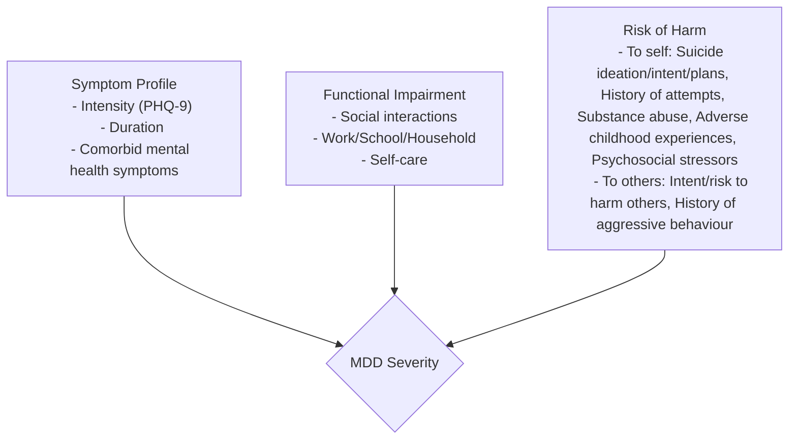
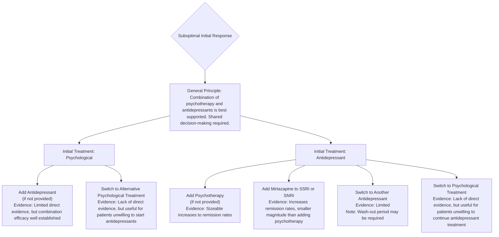
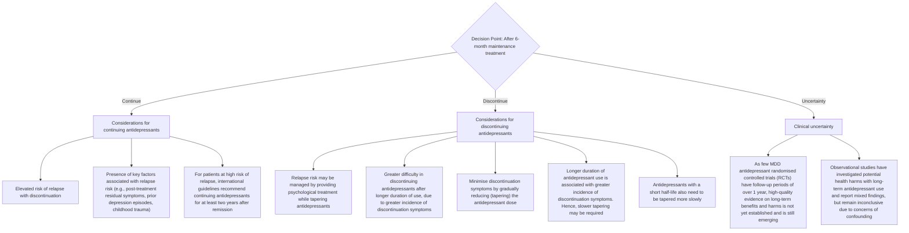

<!-- cpg_id: Major depressive disorder achieving and sustaining remission (Mar 2025) | phase4 deterministic | spine: Overview, Assessment to guide management, Treatment of an MDD episode, Management of suboptimal response to initial treatment, Management to reduce risk of relapse, Supplement 1: MDD management considerations for perinatal populations, Supplement 2: MDD management considerations for children and adolescents, References -->
<!-- meta | source: ACE CLINICAL GUIDANCE | published: First Published: 26 March 2025 | url: www.ace-hta.gov.sg | title: Major depressive disorder. Achieving and sustaining remission -->


## Overview

```yaml
cpg_id: Major depressive disorder achieving and sustaining remission (Mar 2025)
chunk_id: Major depressive disorder achieving and sustaining remission (Mar 2025).overview.prose.01
chunk_type: prose
section_id: overview
parent_rec: null
title: "Definitions and scope of application"
source_pages: [1]
tables_referenced: []
figures_referenced:
  - Figure 1. Overview of MDD management
url_links: []
cross_refs: []
review_flags:
  - contains_conditional_language
```

Major
depressive
disorder

### Objective

To enhance long-term management of major depressive disorder (MDD), for achieving remission and reducing relapse

### Scope

Non-pharmacological and pharmacological management of MDD in adults, during the acute and maintenance phases of treatment

### Target audience

This clinical guidance is relevant to all healthcare professionals caring for patients with diagnosed MDD, especially those in primary or generalist care

### Background

Major depressive disorder (MDD) is highly debilitating. Patients experience a reduction in quality of life  and ability to function,  impacting interpersonal relationships, education, and employment.  This may result in an overall substantial economic impact (due to demands on healthcare utilisation and reduced productivity).  The numerous detrimental effects of this mental health condition, including the increased likelihood of suicidal behaviour,  underscore the need for effective treatments.

The 2023 National Mental Health and Well-being Strategy aims to enhance primary care capacity and capability for managing mental health conditions, which will facilitate anchoring care in community settings under a tiered care model.   In support of the National Strategy, this ACE Clinical Guidance (ACG) aims to inform clinical management of MDD in primary and generalist care, among patients with a diagnosis of MDD. See Figure 1 for an overview of MDD management. Adults (patients 18 years old and above) are the focus of this ACG, though brief guidance on other populations is also included. Depression and anxiety are commonly comorbid   – management of generalised anxiety disorder (GAD) is covered in another ACG.

### Statement of Intent

This ACE Clinical Guidance (ACG) provides concise, evidence-based recommendations and serves as a common starting point nationally for clinical decision-making. It is underpinned by a wide array of considerations contextualised to Singapore, based on best available evidence at the time of development. The ACG is not exhaustive of the subject matter and does not replace clinical judgement. The recommendations in the ACG are not mandatory, and the responsibility for making decisions appropriate to the circumstances of the individual patient remains at all times with the healthcare professional.

---

```yaml
cpg_id: Major depressive disorder achieving and sustaining remission (Mar 2025)
chunk_id: Major depressive disorder achieving and sustaining remission (Mar 2025).overview.figure.01
chunk_type: figure
section_id: overview
parent_rec: null
title: "Figure 1. Overview of MDD management"
source_pages: [2]
reconstructed_from: mermaid
image_dir: grouped_p2_fig_01.jpg
url_links: []
cross_refs: []
review_flags: []
```

**Figure 1. Overview of MDD management**

```mermaid
graph TD
    MDDDef["An MDD episode is characterised by a period of at least two weeks in which a depressed mood and/or diminished interest or pleasure in activities are experienced nearly every day, alongside other symptoms (changes in weight or appetite, disruption to normal sleep patterns, psychomotor agitation or retardation, loss of energy, reduced ability to think or concentrate, feelings of worthlessness or excessive guilt, and recurrent thoughts of death or suicide). Patient's quality of life and functioning are significantly impacted. The management goal for MDD is to achieve and sustain remission, which includes relief from symptoms and restoration of functioning. Treatment for patients with diagnosed MDD entails both an acute phase (to treat the presenting episode) and a maintenance phase (to prevent relapse)."] --> AimAcute["Aim: To restore function and resolve symptoms"]
    AimAcute --> AssessSev["Evaluate MDD severity based on symptom profile, functional impairment, and risk of harm"]
    AssessSev --> Personalize["Personalise the treatment approach based on MDD severity and other patient factors"]
    Personalize --> SevBranch{Severity}
    SevBranch -->|Mild to moderate MDD| MildMod["Offer psychological treatment over antidepressants where feasible and acceptable"]
    SevBranch -->|Moderately severe or severe MDD| ModSevere["Offer a combination of a second-generation antidepressant with psychotherapy, or psychotherapy alone. When psychotherapy is not feasible or acceptable, consider a second-generation antidepressant. When initiating antidepressant therapy, start at a low dose."]
    MildMod --> AssessResp["Assess treatment response after an adequate treatment trial (about 4 to 12 weeks of antidepressant at appropriate therapeutic dose and/or about 8 to 9 sessions of psychotherapy)"]
    ModSevere --> AssessResp
    AssessResp --> RespBranch{Response}
    RespBranch -->|Suboptimal| Suboptimal["Treatment response is suboptimal (for example, <50% reduction in depression symptom scores)"]
    RespBranch -->|Elicited| Elicited["Treatment response elicited"]
    Suboptimal --> AssessReasons["Assess possible reasons for suboptimal treatment response. Where possible, address reasons for treatment ineffectiveness."]
    AssessReasons --> ChangeStrat["A change in management strategy may be required. See Figure 4 for recommended strategies."]
    ChangeStrat --> Referral["Patient may benefit from referral to specialist services."]
    Elicited --> ContTillRem["Continue treatment till remission is reached"]
    ContTillRem --> Monit["Monitoring for remission of symptoms may be operationalised using threshold scores on depression symptom scales, such as a score of less than five on the nine-item Patient Health Questionnaire (PHQ-9). Full remission of symptoms may not always be viable for all patients, for example those with persistent depression or with limited life expectancy. In such cases, treatment may focus on reducing depression symptoms or increasing quality of life as much as possible."]
    Monit --> AimMaint["Aim: Sustain remission and reduce risk of relapse"]
    AimMaint --> ContTreat["Continue treatment after remission to reduce relapse risk; if antidepressants are prescribed, continue at optimal dose for at least 6 months after remission"]
    ContTreat --> RelapsePrevent["Effective treatments for reducing relapse risk: Continuation of antidepressant treatment, Provision of psychological treatment (effective even with tapering of antidepressants), Combination of psychological treatment and antidepressants"]
    RelapsePrevent --> Dec6Mo["Initiate a conversation with the patient for shared decision-making regarding further continuation of antidepressants. See Figure 5 for key factors to consider when deciding to continue or discontinue antidepressants after 6-month maintenance treatment."]
    Dec6Mo --> ContAnt["Continue antidepressant treatment."]
    Dec6Mo --> DiscAnt["Discontinue antidepressant treatment. Minimise discontinuation symptoms by gradually reducing (tapering) the antidepressant dose."]
    ContAnt --> MonReass["Monitor and reassess patient as needed."]
    DiscAnt --> MonReass
    MonReass --> NotePop["Note: This ACG focuses on adults (patients 18 years old and above), with brief guidance on other populations included: Perinatal populations - Supplement 1, Children and adolescents - Supplement 2, Other special populations - page 11"]
```



---


## Assessment to guide management

```yaml
cpg_id: Major depressive disorder achieving and sustaining remission (Mar 2025)
chunk_id: Major depressive disorder achieving and sustaining remission (Mar 2025).assessment_to_guide_management.recommendation.01
chunk_type: recommendation
section_id: assessment_to_guide_management
parent_rec: null
title: "Recommendation 1"
source_pages: [3]
tables_referenced: []
figures_referenced: []
url_links: []
cross_refs: []
review_flags: []
```

**Recommendation 1**

### Evaluate MDD severity based on

- Symptom profile,

- Functional impairment, and

- Risk of harm (to self or others).

For patients who have been diagnosed with MDD, the first step is to determine the severity to inform management.

---

```yaml
cpg_id: Major depressive disorder achieving and sustaining remission (Mar 2025)
chunk_id: Major depressive disorder achieving and sustaining remission (Mar 2025).assessment_to_guide_management.figure.01
chunk_type: figure
section_id: assessment_to_guide_management
parent_rec: Major depressive disorder achieving and sustaining remission (Mar 2025).assessment_to_guide_management.recommendation.01
title: "Figure 2. Components of MDD severity"
source_pages: [3]
reconstructed_from: table
image_dir: grouped_p3_fig_01.jpg
url_links: []
cross_refs: []
review_flags: []
```

**Figure 2. Components of MDD severity**

| Patient factors | Impact on treatment approach |
|---|---|
| Patient preference | Patients may prefer either pharmacological or non-pharmacological treatment. Factor this in when selecting treatment, via shared decision-making. |
| Physical illnesses and concurrent medication | Pharmacotherapy choice and dosing is influenced by patient's comorbidities and current medication regime. For example, lower antidepressant doses may be required for patients with renal or hepatic impairment. When selecting an antidepressant, consider potential drug interactions with concurrent medications which may increase the side effect burden. Refer to package inserts or drug information references for further details. |
| Social and environmental factors | Sources of stressors can be targeted as a complement to clinical treatment. For example, referral can be made to community resources or social services for patients experiencing domestic unrest or financial pressure. |
| History of past episodes and treatment | Treatments that worked previously can be restarted. |

---

```yaml
cpg_id: Major depressive disorder achieving and sustaining remission (Mar 2025)
chunk_id: Major depressive disorder achieving and sustaining remission (Mar 2025).assessment_to_guide_management.figure.02
chunk_type: figure
section_id: assessment_to_guide_management
parent_rec: Major depressive disorder achieving and sustaining remission (Mar 2025).assessment_to_guide_management.recommendation.01
title: "Figure 3a. Evaluation of MDD severity (to inform management) is based on symptom profile, functional impairment, and risk of harm (to self or others)"
source_pages: [4]
reconstructed_from: mermaid
image_dir: grouped_p4_fig_01.jpg
url_links: []
cross_refs: []
review_flags: []
```

**Figure 3a. Evaluation of MDD severity (to inform management) is based on symptom profile, functional impairment, and risk of harm (to self or others)**



---

```yaml
cpg_id: Major depressive disorder achieving and sustaining remission (Mar 2025)
chunk_id: Major depressive disorder achieving and sustaining remission (Mar 2025).assessment_to_guide_management.figure.03
chunk_type: figure
section_id: assessment_to_guide_management
parent_rec: Major depressive disorder achieving and sustaining remission (Mar 2025).assessment_to_guide_management.recommendation.01
title: "Figure 3b. Clinical vignettes illustrating holistic assessment of MDD severity (based on symptom profile, functional impairment, and risk of harm)"
source_pages: [5]
reconstructed_from: table
image_dir: grouped_p5_fig_01.jpg
url_links: []
cross_refs: []
review_flags: []
```

**Figure 3b. Clinical vignettes illustrating holistic assessment of MDD severity (based on symptom profile, functional impairment, and risk of harm)**

| Assessment Domain | Patient 1 | Patient 2 |
| :--- | :--- | :--- |
| **Demographics/Context** | 32-year-old working mother; considerable stress caring for two young children; strong supportive network from family and friends. | 55-year-old man living alone in a small high-rise flat; currently not working; brought to clinic by daughter (visits occasionally); on treatment for diabetes mellitus and hypertension. |
| **PHQ-9 Score** | 14 (moderate MDD) | 12 (moderate MDD) |
| **Symptom Profile** | Loss of pleasure in typically-enjoyed activities and other depression symptoms. | Depressed mood and other depression symptoms. |
| **Duration of Symptoms** | 3 weeks | 4 months |
| **Other Mental Health Conditions** | No features of other mental health conditions. | No features of other mental health conditions. |
| **Functional Impairment** | Goes to work most days but finds it difficult to focus; maintains most social engagements. | Has not left the house for 2 months and stopped meeting his friends; frequently spends the whole day on the couch, skipping meals and not showering. |
| **Risk of Harm** | No suicide ideation; no intent to harm. | Sometimes wishes he was dead and has history of suicide planning, but currently no active suicidal intent; no intent to harm. |
| **Final Severity Assessment** | Managed as **moderate MDD**. | Managed as **moderately severe MDD** despite moderate PHQ-9 score, in view of long duration of untreated symptoms, marked functional impairment and risk of self-harm. |

---


## Treatment of an MDD episode

```yaml
cpg_id: Major depressive disorder achieving and sustaining remission (Mar 2025)
chunk_id: Major depressive disorder achieving and sustaining remission (Mar 2025).treatment_of_an_mdd_episode.prose.01
chunk_type: prose
section_id: treatment_of_an_mdd_episode
parent_rec: null
title: "Evidence of efficacy and benefit-risk profile of treatments"
source_pages: [6]
tables_referenced: []
figures_referenced: []
url_links: []
cross_refs: []
review_flags:
  - contains_conditional_language
```

The mainstay treatment options for MDD in primary care are antidepressants, psychological treatment (supportive counselling or psychotherapy),  and a combination of both. Network meta-analyses of randomised controlled trials (RCTs) have found that combining antidepressants with psychotherapy results in increased response  and remission  rates for depression, compared to antidepressants or psychotherapy alone. Overall, a combined treatment approach is most effective for patients with MDD, although the evidence base is more established for moderately severe and severe depression than for mild to moderate depression.

Illustration of a medicine bottle, a balance scale, and two people in discussion (no text or symbols)

While antidepressants and psychotherapy are equally efficacious, the benefit-risk balance is more favourable for psychotherapy due to risk of adverse effects with antidepressants.

Increased efficacy
when antidepressants and psychotherapy are
combined.

Antidepressant treatment and psychotherapy are equally effective in achieving remission.   There is emerging evidence that psychotherapy may be more effective in the long term, although further research is required.   Given that antidepressants and psychotherapy are equally efficacious, and considering the risk of adverse effects with antidepressant use,   the overall benefit-risk balance is more favourable for psychotherapy.

---

```yaml
cpg_id: Major depressive disorder achieving and sustaining remission (Mar 2025)
chunk_id: Major depressive disorder achieving and sustaining remission (Mar 2025).treatment_of_an_mdd_episode.recommendation.03
chunk_type: recommendation
section_id: treatment_of_an_mdd_episode
parent_rec: null
title: "Recommendation 3"
source_pages: [6, 7]
tables_referenced: []
figures_referenced: []
url_links: []
cross_refs: []
review_flags:
  - contains_conditional_language
```

**Recommendation 3:** For patients with mild to moderate MDD, offer psychological treatment over antidepressants where feasible and acceptable.

### Preferred treatment of mild to moderate MDD

Psychological treatments (supportive counselling or psychotherapy) are preferred over antidepressants for mild to moderate MDD. Supportive counselling has proven to reduce depression symptoms, although it may be less efficacious than psychotherapy.

In circumstances where these are not acceptable to the patient or not feasible, antidepressants may be required. For example:

- The healthcare professional assesses a need for, or the patient prefers, initiating treatment sooner (than waiting time allows)

- The healthcare professional assesses that some symptomatic improvement is required before the patient can adequately engage in psychological treatment

- The patient is unwilling to engage in psychological treatment

- The patient is unable to attend or commit to regular therapy sessions

- The patient is unable to participate in or understand tasks for therapy sessions (for example, due to cognitive impairment)

As MDD severity is dynamic, antidepressants can be started pre-emptively to supplement psychological treatment if clinical assessment indicates that the patient's symptoms may worsen soon.

If referring to another healthcare professional for counselling or psychotherapy, provide information on MDD severity and other patient factors evaluated (Recommendations 1 and 2). Selection and delivery of an evidence-based psychotherapy is tailored to the patient's therapeutic needs and preferences (see notepad Selecting and delivering psychotherapy for MDD on the next page for more information on evidence-based psychotherapies and delivery formats).

### Choice of psychotherapy

Various psychotherapies have proven efficacy in RCTs, with no significant differences between them. These include:

- Behavioural activation therapy

- Cognitive behavioural therapy

- Interpersonal therapy

- Problem-solving therapy

- Psychodynamic therapy

- Schema therapy

- Third-wave therapies (for example, mindfulness-based cognitive therapy, acceptance and commitment therapy, and positive psychotherapy)

### Delivery formats

Various formats of administering psychotherapy have been found to be equally efficacious, including:

- Individual therapy

- Group therapy

- Telephone-delivered therapy

- Guided internet-delivered therapy

Guided internet-delivered therapy is an emerging treatment format for MDD: psychotherapy materials are provided for the patient to work through, with guidance from a trained professional.   Current evidence indicates that this treatment format is effective for treating depression, although treatment dropout may be higher compared to the other delivery formats. Unguided internet-delivered therapy has not proven efficacious for treatment of depression.

---

```yaml
cpg_id: Major depressive disorder achieving and sustaining remission (Mar 2025)
chunk_id: Major depressive disorder achieving and sustaining remission (Mar 2025).treatment_of_an_mdd_episode.recommendation.04
chunk_type: recommendation
section_id: treatment_of_an_mdd_episode
parent_rec: null
title: "Recommendation 4"
source_pages: [7, 8, 11]
tables_referenced:
  - Table 1. Key considerations for selecting a second-generation antidepressant in MDD. Antidepressants listed are locally-registered for MDD treatment. Information sourced from international literature  and local drug information resources  (including package inserts). The information in this table is not exhaustive of the subject matter. Refer to package inserts and drug information resources for further details — including contraindications, drug interactions, and medication doses.
figures_referenced: []
url_links: []
cross_refs: []
review_flags:
  - contains_conditional_language
  - contains_dosing_information
```

**Recommendation 4:** For patients with moderately severe or severe MDD:

a) Offer a combination of a second-generation antidepressant with psychotherapy, or psychotherapy alone.

b) Consider a second-generation antidepressant when psychotherapy is not feasible or acceptable.

### Preferred treatment of moderately severe and severe MDD

Combining a second-generation antidepressant with psychotherapy, or psychotherapy alone, are preferred for treating moderately severe and severe MDD, given greater efficacy and more favourable benefit-risk balance respectively (Recommendation 4a). Nonetheless, similar to mild to moderate MDD, some patients may be unwilling or unable to engage in psychotherapy. In these cases, treatment with a second-generation antidepressant on its own is an accepted alternative (Recommendation 4b). Co-management or referral to a specialist may be required, especially for severe MDD, depending on the healthcare professional's experience.

### First and second-generation antidepressants

First-generation antidepressants refer to tricyclic antidepressants (TCAs) and monoamine oxidase inhibitors (MAOIs), while second-generation antidepressants include selective serotonin reuptake inhibitors (SSRIs), serotonin–norepinephrine reuptake inhibitors (SNRIs), and other newer agents.

Second-generation antidepressants are recommended as the first-line antidepressants for treatment of MDD.   First-generation antidepressants are not preferred for routine use   due to their low therapeutic index (i.e. small margin between effective and toxic doses), which results in a greater likelihood of toxicity;   and, potentially serious adverse events (for example, seizures, arrhythmias, and coma).   Nonetheless, first-generation antidepressants could be reserved as an option on a case-by-case basis for selected patients with recurrent MDD who had previously responded to, and safely tolerated, them.

### Prescribing antidepressants for MDD

Refer to Table 1 for key considerations to guide selection of an antidepressant for MDD treatment. Table 1 provides a list of all locally-registered second-generation antidepressants with proven efficacy over placebo in achieving remission, with some variation in efficacy and tolerability (though these differences are mostly statistically insignificant).   Antidepressants are associated with different adverse effects, contraindications, drug interactions, and costs, which reinforces the importance of shared decision-making with the patient when selecting pharmacotherapy.

Routine use of pharmacogenomic tests to select the choice and dose of antidepressants for newly-diagnosed patients with MDD is not currently recommended due to the inconsistent and low-certainty evidence, biased by lack of blinding.

When initiating antidepressant therapy, start at a low dose to reduce the risk of adverse effects and facilitate adherence.   During the initial months of treatment and dose changes, monitor patients closely for emergent suicidal thoughts and behaviour, especially those under 25 years of age or with pre-existing suicide risk.   Advise patients to seek medical attention immediately if symptoms emerge.

Among patients with depression, observational data suggests that the risk of suicidal behaviour and self-harm may be highest during the initial one to three months after starting an antidepressant and one month after stopping an antidepressant.   Closer monitoring during these periods is therefore warranted.

### Patient communication points at new onset of MDD

Discussion regarding MDD and its treatment includes the following key points:

- Symptoms and biopsychosocial causes of MDD.

- Goal of treatment: to achieve and sustain remission, which includes relief of symptoms and restoration of functioning.

- Available non-pharmacological and pharmacological treatments, and potential adverse effects.

- Pharmacological treatment course:

- While some improvement in symptoms may occur as early as 2 weeks of starting antidepressant treatment, the full benefit is typically observed between 4 to 12 weeks.

- MDD management extends beyond the acute episode and includes maintenance treatment after remission, to reduce the risk of relapse.

- The importance of treatment adherence: Emphasise that if the patient decides to discontinue antidepressant treatment, these medications should not be abruptly stopped but rather tapered off gradually. This is to minimise the development of discontinuation symptoms.

- Importance of returning to clinic if experiencing worsening symptoms, suicidal thoughts, abnormally elevated or irritable mood, or intolerable side effects of treatment.

- Available online resources (MindSG, Mindline), helplines to call, as well as support schemes and services.

### Older adults (65 years old and above)

Psychotherapy remains an effective treatment of depression for older adults.   The efficacy of antidepressants among this population is less established,   especially SSRIs.   Therefore, where acceptable to the patient (i.e. receptive and able to engage in therapy) and feasible, psychotherapy is preferred for older patients with MDD. If prescribing an antidepressant, lower doses and more gradual titration may be required due to physiological changes that accompany advancing age. Note that antidepressants (especially SSRIs and SNRIs) have been associated with hyponatraemia, although such events are overall not very common.   Consider also the potential for drug-drug interactions, as elderly patients may already be prescribed other medications for comorbid conditions.

### Patients with comorbid dementia

The magnitude of depression symptom reduction with psychotherapy may be small for patients with dementia,  although other non-pharmacological interventions have been found to reduce depression symptoms among this population.  Efficacy of antidepressants for treating depression in this cohort is not established.

### Patients with comorbid anxiety symptoms

Comorbidity with anxiety symptoms is associated with reduced likelihood of remission in MDD,  and thus represents a higher severity of illness. More extensive interventions may therefore be warranted (for example, combination of an antidepressant with psychotherapy).

Evidence of antidepressant anxiolytic effects in MDD is limited but indicate that antidepressants (including SSRIs,   SNRIs,   bupropion,   and vortioxetine reduce anxiety symptoms in MDD. No significant differences between agents have been reported.   Overall, the presence of comorbid anxiety symptoms does not influence selection of antidepressant for MDD.   However, if patients are diagnosed with generalised anxiety disorder (GAD), note that SSRIs or SNRIs are preferred: please refer to the GAD ACG for further details.

### Patients with neurodevelopmental disorders (for example, intellectual disability, autism spectrum disorder, or attention-deficit/ hyperactivity disorder)

Patients with neurodevelopmental disorders may have atypical presentation of depression. Involve specialist care in assessment and treatment planning, as needed. Interventions should be adapted to the person's needs (for example, developmental level and communication skills).

### Patient communication points on other treatments for MDD

In addition to antidepressants and psychological treatment, various other treatments exist for MDD:

### Exercise

Encourage exercise as a complement to pharmacotherapy or psychological treatment for all patients with MDD, as even simple activities like walking and jogging have been found to reduce depression symptoms.

### St John's Wort

Evidence suggests St. John's Wort reduces depression symptoms. However, different extract preparations were employed in RCTs, limiting recommendations for St John's Wort in international guidelines. Caution patients that St. John's Wort may interact adversely with other medications, and emphasise that it should not be taken alongside antidepressants due to the risk of serotonin syndrome.

### Acupuncture

While recent systematic reviews have found a positive effect of acupuncture on depression symptoms, the quality of the underlying evidence remains insufficient (for example, due to risk of bias concerns in RCTs).   For patients interested in receiving acupuncture for treating MDD, advise them not to discontinue mainstay treatment (antidepressant and/or psychological treatment).

### Social prescribing of community-based programmes

Emerging evidence suggests that community interventions such as music therapy, art therapy, exercise programmes, and community gardening may help reduce depression symptoms. However, more research is needed to better understand their effectiveness.   For patients interested in joining community-based programmes, advise that they may be used as a complement to mainstay treatment (antidepressant and/or psychological treatment).

---

```yaml
cpg_id: Major depressive disorder achieving and sustaining remission (Mar 2025)
chunk_id: Major depressive disorder achieving and sustaining remission (Mar 2025).treatment_of_an_mdd_episode.table.01
chunk_type: table
section_id: treatment_of_an_mdd_episode
parent_rec: Major depressive disorder achieving and sustaining remission (Mar 2025).treatment_of_an_mdd_episode.recommendation.04
title: "Table 1. Key considerations for selecting a second-generation antidepressant in "
source_pages: [9]
image_dir: 82758c75a3d30a83f6380647ea4724b313adc378756b8bf4240f3d6e6050e737.jpg
url_links: []
cross_refs: []
review_flags:
  - contains_dosing_information
```

**Table 1. Key considerations for selecting a second-generation antidepressant in MDD. Antidepressants listed are locally-registered for MDD treatment. Information sourced from international literature  and local drug information resources  (including package inserts). The information in this table is not exhaustive of the subject matter. Refer to package inserts and drug information resources for further details — including contraindications, drug interactions, and medication doses.**

<table><tr><td>Second-generation antidepressant for treating MDD**</td><td>Other labelled indications<eq>^{††}</eq></td><td colspan="2">Key precautions<eq>^{‡‡}</eq></td><td>Additional considerations+ Advantageous● May be advantageous or disadvantageous,■ Disadvantageousdepending on context of individual patient</td></tr><tr><td colspan="5">Selective serotonin reuptake inhibitor</td></tr><tr><td>Escitalopram</td><td>GAD, OCD, panic disorder</td><td rowspan="4">Risk of bleeding abnormalities with SSRIs; bleeding tendency may be increased if concurrently used with anticoagulants, or medications that affect platelet function (e.g. NSAIDs and aspirin).</td><td>Dose-dependent QTc prolongation (higher risk than other SSRIs).</td><td>+ Lower treatment drop-out due to side effects, compared to other antidepressants● Greater propensity for weight gain compared to other antidepressants</td></tr><tr><td>Fluoxetine</td><td>Bulimia nervosa, OCD, pre-menstrual dysphoric disorder</td><td>Strong inhibitor of CYP2D6.</td><td>+ Lower treatment drop-out due to side effects, compared to other antidepressants+ Suitable for patients with poor medication adherence due to a long half-life+ Lower risk of discontinuation symptoms compared to other antidepressants■ Insomnia very commonly reported■ Greater difficulty in switching to another antidepressant due to long half-life● Activating effect</td></tr><tr><td>Fluvoxamine</td><td>OCD</td><td>Strong inhibitor of CYP1A2, CYP2C19, and CYP3A4.</td><td>● Sedating effect</td></tr><tr><td>Paroxetine</td><td>Pre-menstrual dysphoric disorder, social anxiety disorder</td><td>Strong inhibitor of CYP2D6; contraindicated for concurrent use with CYP2D6 substrates that can prolong QT interval.</td><td>■ Greater propensity for anticholinergic effects compared to other antidepressants■ Higher risk of discontinuation symptoms compared to other antidepressants● Greater propensity for weight gain compared to other antidepressants● Sedating effect</td></tr><tr><td>Sertraline</td><td>OCD, panic disorder, pre-menstrual dysphoric disorder, PTSD, social anxiety disorder</td><td colspan="2">Risk of bleeding abnormalities with SSRIs; bleeding tendency may be increased if concurrently used with anticoagulants, or medications that affect platelet function (e.g. NSAIDs and aspirin).</td><td>+ Dose adjustment not routinely required in renal insufficiency■ Insomnia very commonly reported● Activating effect</td></tr><tr><td colspan="5">Serotonin-norepinephrine reuptake inhibitor</td></tr><tr><td>Desvenlafaxine</td><td>Nil</td><td rowspan="3">Risk of bleeding abnormalities with SNRIs; bleeding tendency may be increased if concurrently used with anticoagulants, or medications that affect platelet function (e.g. NSAIDs and aspirin).</td><td rowspan="2">May cause increased blood pressure (therefore may not be suitable for patients with uncontrolled hypertension).</td><td rowspan="2">■ Insomnia very commonly reported■ Higher risk of discontinuation symptoms compared to other antidepressants</td></tr><tr><td>Venlafaxine</td><td>GAD, panic disorder, social anxiety disorder</td></tr><tr><td>Duloxetine</td><td>Diabetic peripheral neuropathic pain, GAD, pain associated with fibromyalgia</td><td>May cause increased blood pressure and is contraindicated in patients with uncontrolled hypertension.Contraindicated if substantial alcohol use is present, if severe renal impairment (creatinine clearance &lt;30 mL/min) is present, or if liver disease is present.Contraindicated for concurrent use with strong CYP1A2 inhibitors (such as ciprofloxacin and fluvoxamine).</td><td>■ Higher risk of discontinuation symptoms compared to other antidepressants</td></tr></table>

---


## Management of suboptimal response to initial treatment

```yaml
cpg_id: Major depressive disorder achieving and sustaining remission (Mar 2025)
chunk_id: Major depressive disorder achieving and sustaining remission (Mar 2025).management_of_suboptimal_response_to_initial_treatment.recommendation.05
chunk_type: recommendation
section_id: management_of_suboptimal_response_to_initial_treatment
parent_rec: null
title: "Recommendation 5"
source_pages: [12]
tables_referenced: []
figures_referenced:
  - Figure 4. Changes in management strategy when initial response is suboptimal
url_links: []
cross_refs: []
review_flags:
  - contains_conditional_language
  - contains_dosing_information
```

**Recommendation 5:** If response to initial treatment is suboptimal, assess possible reasons before adjusting management strategy.

Some improvement in symptoms may occur as early as 2 weeks after starting antidepressant treatment, although the full benefit is typically observed between 4 to 12 weeks, with adequate dosing.   Periodically monitor treatment progress in terms of symptom reduction (for example, via PHQ-9) and adverse effects of medications. Use this information to guide treatment decisions (for example, if dose or choice of antidepressant needs to be changed), as such measurement-based care enhances treatment adherence and remission rates.   Note that high antidepressant doses may not be required to elicit a treatment response. For example, the balance between SSRIs' efficacy and acceptability tends to be optimal at lower doses (fluoxetine: between 20 mg and 40 mg per day; escitalopram: between 10 mg and 20 mg per day; paroxetine: between 20 mg and 30 mg per day; sertraline: between 50 mg and 100 mg per day;   fluvoxamine: evidence on optimal dose is less established due to greater imprecision, but a recent systematic review suggests that its efficacy may not be increased with doses above 150 mg per day).

Suboptimal response may also be observed with psychological treatment. As evidence suggests that improvement in depression symptoms may be most rapid within the first 8 to 9 sessions of psychotherapy,  a lack of improvement during this period may indicate the therapy is ineffective.

If treatment response remains suboptimal - for example, less than 50% reduction in depression symptom scores - after an adequate treatment trial (about 4 to 12 weeks of antidepressant at appropriate therapeutic dose and/or about 8 to 9 sessions of psychotherapy), assess possible reasons for this.   Reasons may include:

### Ongoing psychosocial stressors and poor coping mechanisms

For example, financial pressure, interpersonal conflicts, or recent diagnosis of a severe medical condition.

### Suboptimal treatment adherence

▶ Routinely check compliance to treatment: patients may independently stop taking medication or reduce the dose in response to adverse effects or if they perceive treatment is ineffective.

### Diagnostic inaccuracy or presence of other mental health conditions

For example, missed diagnosis of bipolar or psychotic depression, addictive disorder, or personality disorder.

▶ Note that the emergence of manic or hypomanic symptoms during antidepressant treatment may indicate the presence of bipolar depression.

### Comorbid conditions that may limit response to treatment or mimic depression symptoms such as fatigue

For example, anaemia, hypothyroidism, poor glycaemic regulation, or antidepressant-induced hyponatraemia.

If response remains suboptimal after assessing, and where possible, addressing reasons for treatment ineffectiveness, a change in management strategy may be required (please refer to Figure 4 for recommended strategies).

### Referral considerations

Specialist involvement may be required for assessing and addressing reasons for initial treatment ineffectiveness (for example, to detect and treat comorbid psychosis).

If the second treatment attempt (Figure 4) still produces suboptimal response, patients may benefit from referral to specialist services.

---

```yaml
cpg_id: Major depressive disorder achieving and sustaining remission (Mar 2025)
chunk_id: Major depressive disorder achieving and sustaining remission (Mar 2025).management_of_suboptimal_response_to_initial_treatment.figure.01
chunk_type: figure
section_id: management_of_suboptimal_response_to_initial_treatment
parent_rec: Major depressive disorder achieving and sustaining remission (Mar 2025).management_of_suboptimal_response_to_initial_treatment.recommendation.05
title: "Figure 4. Changes in management strategy when initial response is suboptimal"
source_pages: [13]
reconstructed_from: mermaid
image_dir: grouped_p13_fig_01.jpg
url_links: []
cross_refs: []
review_flags: []
```

**Figure 4. Changes in management strategy when initial response is suboptimal**



---


## Management to reduce risk of relapse

```yaml
cpg_id: Major depressive disorder achieving and sustaining remission (Mar 2025)
chunk_id: Major depressive disorder achieving and sustaining remission (Mar 2025).management_to_reduce_risk_of_relapse.recommendation.06
chunk_type: recommendation
section_id: management_to_reduce_risk_of_relapse
parent_rec: null
title: "Recommendation 6"
source_pages: [14, 15]
tables_referenced: []
figures_referenced:
  - Figure 5. Key considerations for continuing or discontinuing antidepressants after 6-month maintenance treatment
url_links: []
cross_refs: []
review_flags:
  - contains_conditional_language
  - contains_dosing_information
```

**Recommendation 6:** Continue treatment after remission to reduce relapse risk; if antidepressants are prescribed, continue at optimal dose for at least 6 months after remission.

After remission from the acute MDD episode, patients who receive no treatment are at higher risk of relapse compared to those who do.   Therefore, it is important to provide maintenance treatment post-remission. Current evidence indicates that the following treatments are effective in reducing relapse risk:

- Continuation of antidepressant treatment.

- Provision of psychological treatment (effective even with tapering of antidepressants). Tailor the duration of psychological treatment based on individual patient's needs.

- Combination of psychological treatment and antidepressants.

Continuation of antidepressants for at least 6 months after remission is recommended because relapse occurs most frequently during this time.   Maintain the same dose that achieved remission in the acute phase (optimal dose),   unless there are reasons to adjust it (for example, due to adverse effects).   After 6 months, initiate a conversation with the patient for shared decision-making regarding further continuation of antidepressants. Consider the following key factors (Figure 5) when making a shared decision with the patient.

### Management to reduce risk of relapse overview

If a decision is made to discontinue antidepressant treatment, minimise discontinuation symptoms by gradually reducing (tapering) the antidepressant dose.   Longer duration of antidepressant use is associated with greater incidence of discontinuation symptoms. Hence, slower tapering may be required.   Antidepressants with a short half-life also need to be tapered more slowly.

Among patients with depression, observational data suggests that the risk of suicidal behaviour and self-harm may be highest during the initial one to three months after starting an antidepressant and one month after stopping an antidepressant.   Closer monitoring during these periods is therefore warranted.

### Patient communication points after remission

- Explain the need for maintenance treatment post-remission: to reduce the risk of relapse.

- Discuss the options of continuing or discontinuing antidepressants after 6 months of maintenance treatment (Figure 5).

- Advise patients to monitor for discontinuation symptoms and potential increase in suicidality when antidepressants are discontinued; antidepressant discontinuation symptoms can be summarised using the acronym FINISH:

- Flu-like symptoms (lethargy, fatigue, headache, aches, sweating)

- Insomnia (with vivid dreams or nightmares)

- Nausea (vomiting may occur)

- Imbalance (dizziness, light-headedness)

- Sensory disturbances (“burning” or “tingling” sensations)

- Hyperarousal (anxiety, irritability, agitation, aggression, mania)

- Advise patients to monitor for symptoms of relapse, so that treatment can be provided promptly.

---

```yaml
cpg_id: Major depressive disorder achieving and sustaining remission (Mar 2025)
chunk_id: Major depressive disorder achieving and sustaining remission (Mar 2025).management_to_reduce_risk_of_relapse.figure.01
chunk_type: figure
section_id: management_to_reduce_risk_of_relapse
parent_rec: Major depressive disorder achieving and sustaining remission (Mar 2025).management_to_reduce_risk_of_relapse.recommendation.06
title: "Figure 5. Key considerations for continuing or discontinuing antidepressants after 6-month maintenance treatment"
source_pages: [14]
reconstructed_from: mermaid
image_dir: grouped_p14_fig_01.jpg
url_links: []
cross_refs: []
review_flags: []
```

**Figure 5. Key considerations for continuing or discontinuing antidepressants after 6-month maintenance treatment**



---


## Supplement 1: MDD management considerations for perinatal populations

```yaml
cpg_id: Major depressive disorder achieving and sustaining remission (Mar 2025)
chunk_id: Major depressive disorder achieving and sustaining remission (Mar 2025).supplement_1:_mdd_management_considerations_for_perinatal_populations.prose.01
chunk_type: prose
section_id: supplement_1:_mdd_management_considerations_for_perinatal_populations
parent_rec: null
title: "Supplement 1: MDD management considerations for perinatal populations overview"
source_pages: [16]
tables_referenced: []
figures_referenced: []
url_links: []
cross_refs: []
review_flags:
  - contains_conditional_language
```

This supplement addresses the principles of care for pregnant and postpartum women. As an additional and practical resource for primary and generalist care, the principles presented here are not exhaustive of the subject matter, acknowledging that healthcare professionals in these settings may also refer or co-manage with specialists as required.

---


## Supplement 2: MDD management considerations for children and adolescents

```yaml
cpg_id: Major depressive disorder achieving and sustaining remission (Mar 2025)
chunk_id: Major depressive disorder achieving and sustaining remission (Mar 2025).supplement_2:_mdd_management_considerations_for_children_and_adolescents.prose.01
chunk_type: prose
section_id: supplement_2:_mdd_management_considerations_for_children_and_adolescents
parent_rec: null
title: "Assessment"
source_pages: [16]
tables_referenced: []
figures_referenced: []
url_links: []
cross_refs: []
review_flags:
  - contains_conditional_language
```

- The Edinburgh Postnatal Depression Scale is a tailored assessment tool and may be used to assess depression symptoms in the pregnant or postpartum stage.

- DSM or ICD criteria informs the diagnosis of MDD. Note that sleep, energy levels, and appetite may be disrupted during pregnancy, which may be conflated with MDD symptoms.

- In addition to typical mental state assessments for adults, check for any impairments to mother-child bonding. Other factors that inform management planning include obstetric health, breastfeeding status, experience of pregnancy/parenting (including specific stressors), social or partner support, and caregiving responsibilities. Problems with sleep can be addressed, if present.

- A comprehensive assessment and holistic understanding of the patient's profile is important for case formulation:

- This includes social, family, and educational context; developmental level, communication needs, and any learning disability; comorbidities; changes from the premorbid state in terms of mood and functioning; as well as any mental health problems faced by parents/ caregivers/ other family members.

- Corroborative history-taking, incorporating inputs from parents/ guardians and schools, is especially important for children as they may not be able to adequately express their emotional state or symptoms. Such inputs may also aid in determining if presenting symptoms are due to depression or developmental delays.

- For adolescents, the HEEADSSS framework may be helpful to progressively discuss the patient's psychosocial context and direct management.

- Sufficient time should be allocated for assessments.

- DSM or ICD criteria informs the diagnosis of MDD. Note that depression may present differently in children and adolescents, compared to adults: for example, undue irritability may be observed instead of a sad mood. Separation anxiety may accompany MDD in children.

---

```yaml
cpg_id: Major depressive disorder achieving and sustaining remission (Mar 2025)
chunk_id: Major depressive disorder achieving and sustaining remission (Mar 2025).supplement_2:_mdd_management_considerations_for_children_and_adolescents.prose.02
chunk_type: prose
section_id: supplement_2:_mdd_management_considerations_for_children_and_adolescents
parent_rec: null
title: "Principles of management for patients with a diagnosis of MDD (if managing in primary or generalist care)"
source_pages: [16]
tables_referenced: []
figures_referenced: []
url_links: []
cross_refs: []
review_flags:
  - contains_conditional_language
```

- Overall, psychological treatment is preferred over antidepressants for treating MDD in the perinatal period:

- Patients in these populations tend to prefer non-pharmacological treatment.

° Psychotherapy has proven efficacy for treating perinatal depression, especially cognitive behavioural therapy.   Current evidence indicates that supportive counselling is efficacious in treating postpartum depression.

- For patients at higher severity, optimise decision-making by discussing treatment options, including medications and seeking specialist advice or referral.

- Given that poor mental health is a significant contributor to maternal mortality  and that perinatal depression may also result in adverse health outcomes for the child,  providing antidepressant treatment is preferred over not treating perinatal depression:

Considerations for use of antidepressants in perinatal MDD

- If starting an antidepressant, note that international guidelines recommend SSRIs,  although evidence of efficacy is only established for sertraline in treating postpartum depression.  Most reports have found no adverse effects of sertraline on breastfed infants.

- Whilst not developed specifically for the local population, references such as UKTIS, MotherToBaby, and LactMed may facilitate patient education and discussion.

- Always check if the patient is breastfeeding so that lactational safety of medications can be taken into account.

- Consider specialist input if deciding to initiate an antidepressant.

- Overall, efficacy of psychological treatment is better supported by current evidence compared to antidepressants for children and adolescents. Given also the risk of adverse effects with antidepressants, psychological treatment is preferred as the first treatment option.

- Supportive counselling or psychotherapy are efficacious treatments for children and adolescent depression;  family-based therapy may be useful as an adjunct treatment.

- For adolescents who do not respond to psychological treatment or have more severe symptoms, addition of fluoxetine*** may help reduce depression symptoms and increase functioning.

- While evidence indicates that escitalopram is also efficacious in treating depression in adolescents,  note that this currently constitutes off-label use as local package inserts do not recommend its use in patients under 18 years old.

- Evidence regarding the use of other antidepressants for MDD treatment in adolescents is not yet well established.

- Consider specialist input if deciding to initiate an antidepressant.

- Close monitoring for emergent suicidal thoughts and behaviour, especially during the period of treatment initiation, forms part of ongoing patient assessment.

- Evidence regarding the use of antidepressants for children with MDD is not yet well established.

---

```yaml
cpg_id: Major depressive disorder achieving and sustaining remission (Mar 2025)
chunk_id: Major depressive disorder achieving and sustaining remission (Mar 2025).supplement_2:_mdd_management_considerations_for_children_and_adolescents.prose.03
chunk_type: prose
section_id: supplement_2:_mdd_management_considerations_for_children_and_adolescents
parent_rec: null
title: "Clinical and community resources"
source_pages: [16]
tables_referenced: []
figures_referenced: []
url_links: []
cross_refs: []
review_flags: []
```

Non-pharmacological and pharmacological interventions tailored for the perinatal population are available in tertiary care settings, such as:

- The National University Hospital Women’s Emotional Health Service

- KK Women's and Children's Hospital

- Institute of Mental Health

- School-based counselling services can provide access to multidisciplinary REACH teams. IMH, KKH, and NUH REACH teams provide mental health assessment, holistic case management, and therapy services.

- Youth Integrated Teams in the community offer assessment and non-pharmacological treatment options.

- IMH's CHAT service provides mental health assessments and supportive help for young persons aged 16–30 years old. Youth Community Outreach Teams are also available islandwide for screening and linking up to relevant services.

CHAT, Centre of Excellence for Youth Mental Health; DSM, Diagnostic and Statistical Manual of Mental Disorders; HEEADSSS, Home, Education/Employment, Eating, Activities, Drugs, Sexuality, Suicidal ideation and Safety; IMH, Institute of Mental Health; ICD, International Classification of Diseases; KKH, KK Women's and Children's Hospital; MDD, major depressive disorder; NUH, National University Hospital; REACH, Response, Early intervention and Assessment in Community mental Health

*** Local package inserts do not recommend use of fluoxetine in children (age range not specified).

The US Food and Drug Administration (FDA) has approved escitalopram for treating MDD in patients 12 years old and above.

In addition to the Expert Group, the following child and adolescent psychiatry expert advisers generously contributed their insights and reviewed this supplement: Dr Lim Choon Guan (IMH) | Clin Asst Prof Vicknesan Jeyan Marimuttu (KKH) | Asst Prof Celine Wong (NUH)

---

```yaml
cpg_id: Major depressive disorder achieving and sustaining remission (Mar 2025)
chunk_id: Major depressive disorder achieving and sustaining remission (Mar 2025).supplement_2:_mdd_management_considerations_for_children_and_adolescents.prose.04
chunk_type: prose
section_id: supplement_2:_mdd_management_considerations_for_children_and_adolescents
parent_rec: null
title: "Supplement 2: MDD management considerations for children and adolescents overview"
source_pages: [17]
tables_referenced: []
figures_referenced: []
url_links: []
cross_refs: []
review_flags:
  - contains_conditional_language
```

This supplement addresses the principles of care for children and adolescents. As an additional and practical resource for primary and generalist care, the principles presented here are not exhaustive of the subject matter, acknowledging that healthcare professionals in these settings can consult child and adolescent mental health service providers and may also refer or co-manage with specialists as required.

---


## References

```yaml
cpg_id: Major depressive disorder achieving and sustaining remission (Mar 2025)
chunk_id: Major depressive disorder achieving and sustaining remission (Mar 2025).references.reference.01
chunk_type: reference
section_id: references
parent_rec: null
title: "References"
source_pages: [18]
tables_referenced: []
figures_referenced: []
url_links: []
cross_refs: []
review_flags: []
```

Click or scan the QR code for the reference list to this clinical guidance

GO
gov.sg

### Evidence-to-Recommendation Framework

Click or scan the QR code to view the Evidence-to-Recommendation Framework for the recommendations in this clinical guidance

GO gov.sg

### Expert group

#### Chairpersons

Dr Koot David, Family Medicine (SHP)

Adj Asst Prof Mok Yee Ming, Psychiatry (IMH)

#### Members

Dr Paul Ang Teng Soon, Family Medicine (Zenith Medical Clinic)

Dr Evelyn Boon, Psychology (SGH)

Dr James Cheong, Family Medicine (C3 Family Clinic)

Dr Goh Tze Chien Kelvin, Family Medicine (United PCN Clinical Lead)

Dr Guo Xiaoxuan, Family Medicine (SHP)

Ms Jiang Lina, Nursing (CGH)

Ms Amy Leo Wen Ling, Pharmacy (IMH)

Ms Lin Yijun Carol, Psychology (NHGP)

Mr Jeffrey Loh, Nursing (AH)

Dr Shaikh Abdul Matin Mattar, Internal Medicine (SGH)

Dr Ng Beng Yeong, Psychiatry (Mt Elizabeth Hospital)

Mr Ng Boon Tat, Pharmacy (IMH)

Dr Ng Mae Ling, Family Medicine (NUP)

Dr Winnie Soon, Family Medicine (NHGP)

Dr Wong Mei Yin, Psychology (Singapore Psychological Society)

The Expert Group would like to thank the co-chairs of the generalised anxiety disorder (GAD) ACE Clinical Guidance (ACG), for their inputs and review of this ACG:

Dr Chua Yu Cong Eugene, Family Medicine (NHGP)

Dr Michael Yong Kian Hui, Psychiatry (NUHS)

### About the Agency

The Agency for Care Effectiveness (ACE) was established by the Ministry of Health (Singapore) to drive better decision-making in healthcare by conducting health technology assessments (HTA), publishing healthcare guidance and providing education. ACE develops ACE Clinical Guidances (ACGs) to inform specific areas of clinical practice. ACGs are usually reviewed around five years after publication, or earlier, if new evidence emerges that requires substantive changes to the recommendations. To access this ACG online, along with other ACGs published to date, please visit www.ace-hta.gov.sg/acg

Find out more about ACE at www.ace-hta.gov.sg/about-us

© Agency for Care Effectiveness, Ministry of Health, Republic of Singapore

All rights reserved. Reproduction of this publication in whole or in part in any material form is prohibited without the prior written permission of the copyright holder. Application to reproduce any part of this publication should be addressed to: ACE_HTA@moh.gov.sg

Suggested citation:

Agency for Care Effectiveness (ACE). Major depressive disorder – achieving and sustaining remission. ACE Clinical Guidance (ACG), Ministry of Health, Singapore. 2025. Available from: go.gov.sg/acg-mdd

The Ministry of Health, Singapore disclaims any and all liability to any party for any direct, indirect, implied, punitive or other consequential damages arising directly or indirectly from any use of this ACG, which is provided as is, without warranties.

---
