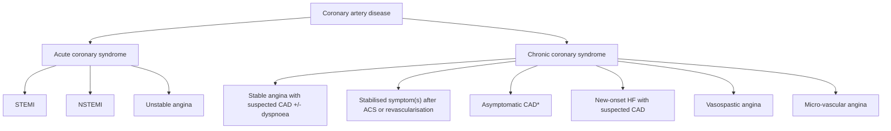

<!-- cpg_id: Management of chronic coronary syndrome (Mar 2025) | phase4 deterministic | spine: Overview, Angina/ischaemia with non-obstructive coronary arteries, Management of comorbid or associated conditions, Assessment of acute exacerbation of chest pain in patients with CCS, Lifestyle, Follow-up and monitoring, References -->
<!-- meta | source: ACE CLINICAL GUIDANCE | published: Published: 26 March 2025 | url: www.ace-hta.gov.sg | title: Management of chronic coronary syndrome -->


## Overview

```yaml
cpg_id: Management of chronic coronary syndrome (Mar 2025)
chunk_id: Management of chronic coronary syndrome (Mar 2025).overview.prose.01
chunk_type: prose
section_id: overview
parent_rec: null
title: "Definitions and scope of application"
source_pages: [1]
tables_referenced: []
figures_referenced:
  - Figure 1. Clinical presentations of chronic coronary syndrome
url_links: []
cross_refs: []
review_flags:
  - contains_conditional_language
```

Management of
chronic coronary
syndrome

Illustration of the human heart with blood vessels and a magnified inset showing blood vessels in the artery (no text or labels)

Close-up of hands holding a small white object, enclosed in a blue shield frame (no text or symbols visible)

Close-up of a person's lower legs and foot wearing a red athletic shoe, captured with a blue shield frame (no text or symbols visible)

Close-up of hands holding a cigarette with a visible flame, enclosed in a blue shield frame (no text or symbols)

Colorful salad bowl with carrots, lettuce, cabbage, tomato, and herbs (no text or symbols)

Chronic coronary syndrome (CCS),  also known as chronic or stable ischaemic heart disease or stable coronary artery disease, refers to clinical presentations that arise due to structural or functional alterations related to chronic diseases of the coronary arteries or microcirculation.  CCS encompasses six different clinical presentations as summarised in Figure 1.

Clinical presentations of CCS covered in this ACG

The primary goals of CCS management are to alleviate symptoms, improve quality of life, and prevent adverse CV events. By doing so, it enhances both the patient's immediate well-being and their long-term CV prognosis. This is achieved through a combination of pharmacological and non-pharmacological treatment, including lifestyle interventions.

This ACG focuses on the management of patients with established diagnosis of CCS due to coronary artery obstruction (i.e. patients with stable angina with suspected CAD with or without dyspnoea, stabilised symptoms after ACS or revascularisation procedure, and asymptomatic CAD detected through screening). Management of patients with new-onset heart failure and patients with vasospastic or microvascular angina is not discussed in this ACG (see ‘Angina/ischaemia with non-obstructive coronary arteries’).

### Objective

To enhance appropriate management of chronic coronary syndrome (CCS)

### Scope

Initiation and review of pharmacological treatment and non-pharmacological management of CCS

### Target audience

This clinical guidance is relevant to all healthcare professionals caring for patients with CCS, especially for those in primary and generalist care

### Background

Ischaemic heart disease (IHD) is the leading cause of death among non-communicable diseases worldwide.   It is one of the leading causes of morbidity and mortality in Singapore,   with 2021 data reporting that it was responsible for approximately one-fifth of all deaths.   The impact of IHD extends beyond the cardiovascular (CV) system, and it is commonly associated with various chronic comorbidities,   including hypertension, dyslipidaemia, diabetes mellitus, and ischaemic stroke.

Chronic coronary syndrome (CCS) is a common form of IHD. While antithrombotic therapy is the cornerstone of CCS management, local primary care physicians highlighted uncertainty regarding its use for patients with CCS, including initiation, optimal dosing, and monitoring parameters. Hence, this ACE Clinical Guidance (ACG) provides evidence-based recommendations for managing CCS, focusing on the initiation and review of antithrombotic therapy in primary care settings. The ACG also covers pharmacological and non-pharmacological interventions used to manage chronic comorbidities associated with CCS, tailored to each patient's individual needs.

### Statement of Intent

This ACE Clinical Guidance (ACG) provides concise, evidence-based recommendations and serves as a common starting point nationally for clinical decision-making. It is underpinned by a wide array of considerations contextualised to Singapore, based on best available evidence at the time of development. The ACG is not exhaustive of the subject matter and does not replace clinical judgement. The recommendations in the ACG are not mandatory, and the responsibility for making decisions appropriate to the circumstances of the individual patient remains at all times with the healthcare professional.

College of Emergency Physicians

---

```yaml
cpg_id: Management of chronic coronary syndrome (Mar 2025)
chunk_id: Management of chronic coronary syndrome (Mar 2025).overview.figure.01
chunk_type: figure
section_id: overview
parent_rec: null
title: "Figure 1. Clinical presentations of chronic coronary syndrome"
source_pages: [2]
reconstructed_from: mermaid
image_dir: grouped_p2_fig_01.jpg
url_links: []
cross_refs: []
review_flags: []
```

**Figure 1. Clinical presentations of chronic coronary syndrome**



> *Footnote: ACS, acute coronary syndrome; CAD, coronary artery disease; HF, heart failure; NSTEMI, non ST-segment elevation myocardial infarction; STEMI, ST-segment elevation myocardial infarction*

> *Footnote: * Patients with abnormal coronary anatomical or function test but no symptoms*

> *Footnote: Clinical presentations of CCS covered in this ACG*

---


## Angina/ischaemia with non-obstructive coronary arteries

```yaml
cpg_id: Management of chronic coronary syndrome (Mar 2025)
chunk_id: Management of chronic coronary syndrome (Mar 2025).angina/ischaemia_with_non_obstructive_coronary_arteries.prose.01
chunk_type: prose
section_id: angina/ischaemia_with_non_obstructive_coronary_arteries
parent_rec: null
title: "Angina/ischaemia with non-obstructive coronary arteries overview"
source_pages: [1, 2]
tables_referenced: []
figures_referenced: []
url_links: []
cross_refs: []
review_flags:
  - contains_conditional_language
  - contains_dosing_information
```

Management of patients with angina with no obstructive coronary artery (ANOCA) (e.g. vasospastic angina) or ischaemia with no obstructive coronary artery (INOCA) (e.g. microvascular angina) differ from management of patients with CCS due to coronary artery obstruction, and are not covered in this ACG. This distinction is due to the varying pathophysiological mechanisms involved. Notably, antiplatelet therapy is not considered a first-line treatment for patients with ANOCA or INOCA; also, choice of anti-anginal therapy may differ based on pathophysiology.

Recommendation 1a

Recommendation 1b

Use long-term low-dose aspirin monotherapy for secondary prevention of cardiovascular events.

Consider long-term clopidogrel monotherapy as an alternative to aspirin.

Oral antiplatelet therapy is the cornerstone of cardiovascular disease (CVD) secondary prevention.

---

```yaml
cpg_id: Management of chronic coronary syndrome (Mar 2025)
chunk_id: Management of chronic coronary syndrome (Mar 2025).angina/ischaemia_with_non_obstructive_coronary_arteries.prose.02
chunk_type: prose
section_id: angina/ischaemia_with_non_obstructive_coronary_arteries
parent_rec: null
title: "Low-dose aspirin"
source_pages: [2]
tables_referenced: []
figures_referenced: []
url_links: []
cross_refs: []
review_flags:
  - contains_conditional_language
  - contains_dosing_information
```

Low-dose aspirin (75–100 mg once daily) is the preferred antiplatelet for patients with CCS, regardless of history of myocardial infarction (MI), due to its efficacy and safety profile.   The effect of low-dose aspirin for secondary prevention is well-established in the literature.   Compared to placebo, aspirin significantly reduces serious vascular events, non-fatal MI, non-fatal stroke, and vascular mortality.   Compared to other antiplatelets (e.g. ticagrelor or dipyridamole), aspirin showed similar or non-inferior effects.

The low dosage is associated with minimal bleeding risk and it is recommended for patients with CCS, including those who have undergone PCI (after a short duration of dual antiplatelet therapy) or coronary artery bypass graft (CABG).   For patients at high risk of gastrointestinal bleeding, gastric protection with proton pump inhibitors may be required.

---

```yaml
cpg_id: Management of chronic coronary syndrome (Mar 2025)
chunk_id: Management of chronic coronary syndrome (Mar 2025).angina/ischaemia_with_non_obstructive_coronary_arteries.prose.03
chunk_type: prose
section_id: angina/ischaemia_with_non_obstructive_coronary_arteries
parent_rec: null
title: "Patient education aids"
source_pages: [3]
tables_referenced: []
figures_referenced: []
url_links: []
cross_refs:
  - ccs-patientaid
  - ccs-patientaid-mythsfacts
review_flags: []
```

Click or scan the QR codes below to access the following patient education aids.

Use the patient education aid ‘Coronary heart disease’ to help patients to better understand their condition. The aid covers general information about coronary heart disease and lifestyle changes patients can adopt to reduce the risk of their condition worsening.

- https://go.gov.sg/ccs-patientaid

Use the patient education aid ‘Myths and facts about antiplatelet medicines for chronic coronary heart disease’ to support treatment adherence by dispelling common misconceptions about antiplatelet therapy.

- https://go.gov.sg/ccs-patientaid-mythsfacts

---

```yaml
cpg_id: Management of chronic coronary syndrome (Mar 2025)
chunk_id: Management of chronic coronary syndrome (Mar 2025).angina/ischaemia_with_non_obstructive_coronary_arteries.prose.04
chunk_type: prose
section_id: angina/ischaemia_with_non_obstructive_coronary_arteries
parent_rec: null
title: "Clopidogrel and other P2Y12 inhibitors"
source_pages: [3]
tables_referenced: []
figures_referenced: []
url_links: []
cross_refs: []
review_flags:
  - contains_conditional_language
```

Compared to aspirin monotherapy, clopidogrel monotherapy has been found to be associated with a reduction in the risk of CV events such as major adverse cardiac and cerebrovascular events, MI, stroke and major bleeding.   However, the overall evidence is assessed to be of low quality for most outcomes. Long-term clopidogrel monotherapy is an alternative to aspirin monotherapy — for example for patients with CCS who are intolerant to aspirin or when an alternative is preferred.

When using clopidogrel, consider that:

- Depending on types of elective or diagnostic procedures, there may be a need to replace clopidogrel with aspirin for a few days (e.g. 5–7 days) beforehand. This is due to the slightly greater inhibition of platelet function with clopidogrel compared to aspirin, potentially conferring a higher risk of peri-operative bleeding. However, it is important to note that temporary cessation of all antiplatelet therapy in CCS, even for a few days, is associated with an increased risk of thrombotic events. As such, many surgeons or endoscopists may recommend switching from clopidogrel monotherapy to aspirin monotherapy for 5–7 days before the surgery or endoscopy, depending on the risk of procedure-related bleeding. The patient is usually switched back to clopidogrel 12–24 hours after the elective procedure if there is no significant bleeding; check with the proceduralist to confirm bleeding status before switching back. For patients with aspirin intolerance or allergy, consider aspirin desensitisation in consultation with a specialist (e.g. an allergist or immunologist) before temporarily switching to aspirin. Alternatively, if the thrombotic risk is low, consider stopping clopidogrel without aspirin cover (in consultation with a cardiologist).

- Premature withdrawal of clopidogrel in patients with recent drug-eluting stent implantation (within past 1–3 months) may be associated with stent thrombosis and potentially fatal consequences;  seek advice from the cardiologist if non-urgent surgery or diagnostic procedure is required for these patients.

The evidence for other P2Y12 (purinergic receptor P2Y, G-protein coupled, 12 protein) inhibitor (i.e. ticagrelor and prasugrel) monotherapy in patients with CCS is limited. The optimal timing and duration of ticagrelor monotherapy remains unclear due to a lack of long-term data. Similarly, there is insufficient evidence regarding the efficacy and safety of prasugrel monotherapy in patients with CCS.

---

```yaml
cpg_id: Management of chronic coronary syndrome (Mar 2025)
chunk_id: Management of chronic coronary syndrome (Mar 2025).angina/ischaemia_with_non_obstructive_coronary_arteries.prose.05
chunk_type: prose
section_id: angina/ischaemia_with_non_obstructive_coronary_arteries
parent_rec: null
title: "Clopidogrel genetic testing"
source_pages: [3]
tables_referenced: []
figures_referenced: []
url_links: []
cross_refs: []
review_flags:
  - contains_conditional_language
```

The use of clopidogrel in East Asian populations, particularly in Chinese patients, may be complicated by the high prevalence of CYP2C19 intermediate metabolisers (IMs) and poor metabolisers (PMs). These genetic variations can lead to poor pharmacodynamic and pharmacokinetic effects,  potentially resulting in suboptimal therapeutic outcomes.

While genetic testing for CYP2C19 variants is supported by evidence for patients with ACS, post-stroke, or transient ischaemic attack, its utility for patients with CCS and post-PCI is less established. This limits the overall value of routine genetic testing for CYP2C19 variants before clopidogrel initiation. The decision to test should be individualised, considering the patient's existing ischaemic and bleeding risk, response to antiplatelet therapy, as well as the cost and availability of the test.

---

```yaml
cpg_id: Management of chronic coronary syndrome (Mar 2025)
chunk_id: Management of chronic coronary syndrome (Mar 2025).angina/ischaemia_with_non_obstructive_coronary_arteries.recommendation.02
chunk_type: recommendation
section_id: angina/ischaemia_with_non_obstructive_coronary_arteries
parent_rec: null
title: "Recommendation 2"
source_pages: [3, 4]
tables_referenced: []
figures_referenced: []
url_links: []
cross_refs: []
review_flags:
  - contains_conditional_language
```

**Recommendation 2:** Review patients following PCI to confirm that there is a specified treatment duration for their dual antiplatelet therapy and check with the referring cardiologist if treatment duration is unclear.

Dual antiplatelet therapy (DAPT), combining aspirin with clopidogrel or ticagrelor, is indicated for patients after PCI due to its superior efficacy in preventing thrombosis compared to aspirin monotherapy, despite an increased bleeding risk.

Besides clinical effectiveness, the optimal duration of DAPT is influenced by factors such as procedure-related considerations and the number of stents or stent sites. Therefore, DAPT duration for patients with CCS following PCI is typically determined by the cardiologist performing the procedure or involved in the patient's care, and communicated to the primary care physician. Overall, recent evidence suggests that in patients after PCI, short-term DAPT (1–3 months) followed by P2Y12 inhibitor monotherapy could significantly reduce major bleeding risk by 40% compared to 12-month DAPT, without increasing the risk of major adverse CV events, MI, or death.

Certain clinical scenarios may require shorter DAPT duration than initially specified, necessitating effective communications for collaborative care between primary care and the cardiologist (see ‘Need for further collaborative care’). This approach ensures tailored treatment, minimises risks, and promotes the appropriate clinical care of patients on DAPT.

### Need for further collaborative care

Ongoing collaborative care with the referring cardiologist is recommended for patients on DAPT who develop clinical conditions which may warrant a shorter duration of therapy. This includes patients who have high bleeding risk or those requiring imminent non-cardiac surgery. In such cases, consult the cardiologist to ensure that the DAPT regimen is appropriately tailored to the patient's current clinical needs, balancing the need to prevent thrombosis against the need to minimise bleeding.

Recommendation 3a

For patients with new-onset AF with no recent stent (within the past 12 months), consider oral anticoagulant monotherapy based on modified CHA  DS  VASc score and patient factors such as comorbidities and bleeding risk.

Oral anticoagulant (OAC) therapy is primarily used to prevent thromboembolic events and reduce stroke risk in patients with atrial fibrillation (AF).   For patients with CCS who have new-onset AF and no recent stents (within the past 12 months), long-term OAC therapy is recommended, with direct oral anticoagulants (DOACs) generally preferred over warfarin due to improved efficacy and safety.

Use the modified  score (see Box 1) to guide the decision to initiate OAC therapy in patients with CCS who do not have a mechanical heart valve or moderate-to-severe mitral stenosis. OAC therapy is generally recommended for patients with a modified  score , as the benefits typically outweigh the bleeding risks. However, always consider the individual patient's circumstances, including both bleeding and thrombotic risks. For detailed guidance on OAC therapy, including dosing recommendations, refer to the ACG Oral anticoagulation for atrial fibrillation.

In patients with CCS and AF with no recent stents within the past 12 months, OAC therapy alone is sufficient; the addition of antiplatelet therapy to OAC is not recommended. Review the necessity of continuing the patient on antiplatelet therapy together with the OAC as this increases bleeding risk. If there is no indication for antiplatelet therapy aside from CCS, it should be stopped when the OAC is started.

Recommendation 3b

For patients with new-onset AF and a stent within the past 12 months, consult a cardiologist to reassess and optimise the current antithrombotic therapy.

If a patient with CCS and a stent within the past 12 months develops AF, there is a need to reassess their thromboembolic risk as AF further increases the risk of thromboembolic stroke, potentially necessitating adjustments to the patient's post-PCI antithrombotic therapy.

The type and duration of antithrombotic therapy will vary depending on the individual patient's risk of ischaemia and thrombosis versus the risk of bleeding. In general, this may include concurrent OAC and antiplatelet medication. The precise medication regimen and duration (single, dual or triple antithrombotic therapy) will also depend on the timing of the new-onset AF relative to the stent. Consultation with a cardiologist for collaborative care is recommended to individualise and optimise medication therapy.

---

```yaml
cpg_id: Management of chronic coronary syndrome (Mar 2025)
chunk_id: Management of chronic coronary syndrome (Mar 2025).angina/ischaemia_with_non_obstructive_coronary_arteries.table.01
chunk_type: table
section_id: angina/ischaemia_with_non_obstructive_coronary_arteries
parent_rec: Management of chronic coronary syndrome (Mar 2025).angina/ischaemia_with_non_obstructive_coronary_arteries.recommendation.02
title: "Box 1. Modified CHA  DS  VASc score"
source_pages: [4]
image_dir: 4330ad64311c990359e294870c5f9173e22e3bd938d1842cc64afe6ec0669d5e.jpg
url_links: []
cross_refs: []
review_flags: []
```

**Box 1. Modified CHA  DS  VASc score**

<table><tr><td>+1</td><td>Congestive heart failure (clinical heart failure, moderate-to-severe left ventricular dysfunction, or hypertrophic cardiomyopathy)</td></tr><tr><td>+1</td><td>Hypertension</td></tr><tr><td>+1</td><td>Diabetes mellitus</td></tr><tr><td>+2</td><td>Prior stroke or transient ischaemic attack</td></tr><tr><td>+1</td><td>Vascular disease (prior myocardial infarction, peripheral artery disease or aortic plaque)</td></tr><tr><td>+1</td><td>Age 65–74</td></tr><tr><td>+2</td><td>Age ≥ 75</td></tr></table>

> *Footnote: Sex category - not counted*

---

```yaml
cpg_id: Management of chronic coronary syndrome (Mar 2025)
chunk_id: Management of chronic coronary syndrome (Mar 2025).angina/ischaemia_with_non_obstructive_coronary_arteries.table.02
chunk_type: table
section_id: angina/ischaemia_with_non_obstructive_coronary_arteries
parent_rec: null
title: "Figure 3. Distinguishing cardiac and non-cardiac chest discomfort and dyspnoea"
source_pages: [6]
image_dir: f203828ce175b9bb4cdf792806570dc05c50e23e1b1bfbba33a1a9a50269e7b0.jpg
url_links: []
cross_refs: []
review_flags:
  - contains_dosing_information
```

**Figure 3. Distinguishing cardiac and non-cardiac chest discomfort and dyspnoea**

<table><tr><td rowspan="2" colspan="2"></td><td colspan="3">Symptom characteristics</td></tr><tr><td>↓ Decreasing likelihood of angina/pain from cardiac origin</td><td colspan="2">↑ Increasing likelihood of angina/pain from cardiac origin</td></tr><tr><td rowspan="5">Chest discomfort </td><td>Quality</td><td>· Burning · Sharp · Tearing - ripping · Pleuritic · Aching</td><td>· Strangling · Constricting · Squeezing · Pressure</td><td>· Heaviness · Associated with autonomic symptoms of heavy perspiration and nausea</td></tr><tr><td>Location and size</td><td>· Right · Shifting · Large area or localised to one small spot</td><td colspan="2">· Retrosternal · Extending to left arm, or both arms simultaneously, or to jugular or intrascapular region · &#x27;Fist&#x27;-size</td></tr><tr><td>Duration</td><td>· Lasting</td><td colspan="2">· Short: up to 5-10 minutes if triggered by physical exertion or emotion</td></tr><tr><td>Trigger</td><td>· At rest · On deep inspiration or when coughing · When pressing on ribs or sternum</td><td colspan="2">· On effort · More frequent in cold weather, strong winds or after a heavy meal · Emotional distress (anxiety, anger, excitation or nightmare)</td></tr><tr><td>Relief</td><td>· By taking antacid or drinking milk</td><td colspan="2">· Subsiding within 1-5 minutes after effort discontinuation · Relief accelerated by sublingual glyceryl trinitrate</td></tr><tr><td rowspan="3">Dyspnoea</td><td>Quality</td><td>· Difficulty to exhale · With wheezing</td><td colspan="2">· Difficulty catching breath · Associated with autonomic symptoms of heavy perspiration and nausea</td></tr><tr><td>Trigger</td><td>· Both at rest and on effort · While coughing</td><td colspan="2">· On effort</td></tr><tr><td>Relief</td><td>· Slowly subsiding at rest or after inhalation of bronchodilators</td><td colspan="2">· Rapidly subsiding after effort discontinuation</td></tr></table>

---

```yaml
cpg_id: Management of chronic coronary syndrome (Mar 2025)
chunk_id: Management of chronic coronary syndrome (Mar 2025).angina/ischaemia_with_non_obstructive_coronary_arteries.additional_material.01
chunk_type: additional_material
section_id: angina/ischaemia_with_non_obstructive_coronary_arteries
parent_rec: null
title: "Patient%20education%20aid %20Types%20of%20coronary%20heart%20disease"
source_pages: [3]
url_links: []
cross_refs:
  - ccs-patientaid
review_flags:
  - external_resource
```

**External material — Patient%20education%20aid %20Types%20of%20coronary%20heart%20disease**

*Source: https://go.gov.sg/ccs-patientaid*

### What is coronary heart disease?

Coronary heart disease, also known as coronary artery disease or ischemic heart disease, happens when blood vessels that carry oxygen to the heart (coronary arteries) become blocked due to a build-up of fatty deposits (atherosclerosis).

As the fatty deposits grow, the blood vessels gradually become narrower, reducing the amount of blood and oxygen that flows to the heart muscle.

Your risk of developing coronary heart disease is higher if you: $^{1}$

- are overweight  
- are not active or do not exercise regularly  
- have diabetes  
• have high blood cholesterol  
• have high blood pressure (hypertension)  
- smoke


<details>
<summary>text_image</summary>

Reduced
blood flow
</details>

### Types of coronary heart disease

There are two types of coronary heart disease - chronic and acute. They have different symptoms and are managed differently: $^{1}$

### Chronic coronary heart disease $^{2}$ (Chronic coronary syndrome)

- It is usually caused by a long-term (chronic) build-up of fatty deposits in the blood vessels that carry oxygen to the heart, causing reduced blood flow to the heart muscle.  
- Many people with chronic coronary syndrome have few to no symptoms when at rest. Symptoms, if present, usually occur with exercise, strong emotions or stress and may include chest pain, shortness of breath, or extreme tiredness.  
- Managing this condition usually involves a mix of lifestyle changes, long-term medications, and in some cases, medical procedures.


<details>
<summary>natural_image</summary>

Illustration of a person sitting on a bench, showing emotional distress (no text or symbols)
</details>

- If left untreated, it can worsen to acute coronary heart disease.  
• Medicines help to stop the condition from worsening and relieve symptoms. Most of them can be taken at home.

### Acute coronary heart disease (Acute coronary syndrome)

- It is caused by a sudden (acute) blockage of the blood vessels, usually because of a blood clot. These clots form when fatty deposits inside the blood vessels break apart.  
- Symptoms tend to be sudden, can be different from person to person and may vary from mild to serious. They include severe breathlessness, chest pain or discomfort in the arm, jaw or back. These symptoms often last for more than 15 minutes and may present with a cold sweat or nausea as well. $^{3}$  
- Call 995 immediately if someone has these symptoms as they could be having a heart attack.

\- Acute coronary syndrome is a medical emergency. Timely medicines and medical procedures administered in the hospital are needed to quickly clear the blockage and restore blood flow to the heart.


<details>
<summary>text_image</summary>

995
</details>

### What else can I do to help manage coronary heart disease?

You can reduce the risk of your condition worsening by:

- Eating a healthy and balanced diet  
- Staying physically active  
- Quitting smoking (if you smoke)  
- Asking your doctor about how you can improve your heart health, such as ways to better manage your blood pressure and cholesterol.  
- Taking your medicines as prescribed by your doctor. Medicines for heart conditions should not be stopped suddenly without your doctor's advice.


<details>
<summary>natural_image</summary>

Illustration of a smiling male doctor wearing a white coat and stethoscope, holding a clipboard (no text or symbols present)
</details>


Connecting with other people with heart conditions may also give you support and help you cope better. You can reach out to local patient support groups if you want to share your experiences with other people with heart conditions. $^{4,5}$

### Sources

1. www.singhealth.com.sg/patient-care/conditions-treatments/coronary-artery-disease  
2. ACE Clinical Guidance on Management of chronic coronary syndrome, 26 March 2025  
3. www.singhealth.com.sg/patient-care/conditions-treatments/heart-attack  
4. Caring Hearts Support Group (CHSG) of National University Heart Centre, Singapore (NUHCS)  
5. Singapore Heart Foundation

---

```yaml
cpg_id: Management of chronic coronary syndrome (Mar 2025)
chunk_id: Management of chronic coronary syndrome (Mar 2025).angina/ischaemia_with_non_obstructive_coronary_arteries.additional_material.02
chunk_type: additional_material
section_id: angina/ischaemia_with_non_obstructive_coronary_arteries
parent_rec: null
title: "Patient%20education%20aid %20Myths%20and%20facts%20about%20antiplatelet%20medicines%20for%20CCS"
source_pages: [3]
url_links: []
cross_refs:
  - ccs-patientaid-mythsfacts
review_flags:
  - external_resource
```

**External material — Patient%20education%20aid %20Myths%20and%20facts%20about%20antiplatelet%20medicines%20for%20CCS**

*Source: https://go.gov.sg/ccs-patientaid-mythsfacts*

### What medicines are used for treating chronic coronary heart disease?

Antiplatelet medicines, which are a type of blood thinner, are a common treatment for chronic coronary heart disease (also known as chronic coronary syndrome). They help to prevent blood clots from forming and reduce the risk of having a heart attack.


Common antiplatelet medicines include:¹

Aspirin  
Clopidogrel  
Ticagrelor

### How do blood clots cause heart attacks?

Platelets are cells in the blood that clump together to make blood clots. They can travel to a damaged site to help bleeding stop and heal wounds.

However, blood clots can cause serious problems for people with long-term (chronic) coronary heart disease because they can block some or all of the blood flow in a heart artery, causing a lack of oxygen which damages the heart. This is known as a heart attack.

What happens during a heart attack?  


### Myths and facts about antiplatelet medicines

### Myth

I can stop taking my antiplatelet medicine because I feel well.

### Fact

Most people with chronic coronary heart disease have few or no symptoms even when they are not taking any medicines. $^{2}$ Taking antiplatelet medicine helps to reduce the risk of having a heart attack, which can happen suddenly and is a life-threatening condition.

### What you can do?

Talk to your doctor if you have any concerns about taking antiplatelet medicine. Do not reduce or stop taking your medicine unless your doctor tells you to do so.


<details>
<summary>natural_image</summary>

Illustration of a person holding two checkmarks, no text or symbols present
</details>


<details>
<summary>natural_image</summary>

Illustration of a woman and a man interacting, one holding a pill bottle (no text or symbols present)
</details>

### Myth

I do not need to change or take more medicines as I feel my current antiplatelet medicine is good enough to control my heart disease.

### Fact

Preventing blood clots with antiplatelet medicine may not be enough to reduce the risk of heart attacks for some people, especially those with other long-term conditions such as diabetes, high blood pressure and high cholesterol. $^{3}$ Your doctor may need to run medical tests and adjust your current treatments or add new ones to manage your overall health.

### What you can do?

Learn about your condition and the medicines you are taking so you can make informed decisions about your healthcare and actively manage it. Discuss with your care team if you have any queries regarding your condition and treatment.

### Myth

Antiplatelet medicines always cause severe bleeding.

### Fact

Antiplatelet medicines prevent blood from clotting, but not completely, so there is a low risk of them causing a bleed in other parts of the body. $^{3}$ Your doctor will monitor your response to treatment and help manage any side effects if they happen.

### What you can do?

Be careful when doing activities that might cause an injury or a cut. See a doctor immediately if you experience serious bleeding, such as blood in the urine, black and sticky stools, unexplained large bruises, coughing up blood or sudden severe headache with nausea.


<details>
<summary>natural_image</summary>

Illustration of a person with red hair holding a small bowl, gesturing with both hands (no text or symbols present)
</details>


<details>
<summary>natural_image</summary>

Illustration of a person thinking with thought bubbles containing pills (no text or symbols)
</details>

### Myth

I can adjust the amount of antiplatelet medicine I take daily without seeking medical advice.

### Fact

Taking too much antiplatelet medicine in a day can increase the risk of bleeding, while taking less antiplatelet medicine than what you have been prescribed can increase the risk of having a heart attack. $^{4}$ It is important for you to take your antiplatelet medicine as instructed by your doctor to get the full benefit of the treatment.

### What you can do?

Discuss with your doctor if you are considering a change in the amount of antiplatelet medicine you are taking and let them know why you want to do so.

### Myth

I can use traditional medicines or natural remedies with antiplatelet medicines or instead of them.

### Fact

Traditional medicine includes traditional Chinese medicine, traditional Indian medicine (Ayurvedic medicine), traditional Malay medicine (Jamu) and herbal medicines from other countries. Some traditional medicines and natural remedies may make your blood thinner and less likely to clot. $^{5}$ However, there is little evidence that they can effectively reduce the risk of a heart attack.

When taken with antiplatelet medicines, some of them can increase the risk of bleeding while others can reduce the effects of antiplatelet medicines and increase the risk of a heart attack. Therefore, it may not be safe to replace or use antiplatelet medicines with traditional medicines or natural remedies without speaking to your doctor. $^{6,7,8}$

### What you can do?

Let your doctor know if you are taking any traditional medicines or natural remedies, or if you intend to start taking them, so they can advise if these are suitable for you.


<details>
<summary>natural_image</summary>

Illustration of herbal medicine pills in a jar with decorative flowers and leaves (no text or symbols on the pills)
</details>

### Key Message

Many medicines are used to treat chronic coronary heart disease (chronic coronary syndrome). Discuss with your doctor which treatment is suitable for you and any questions you have if you are considering a change in your medicines. Heart medicines should not be stopped suddenly or changed without your doctor's advice. Connecting with other people with heart conditions may also give you support and help you cope better. You can reach out to local patient support groups if you want to meet with people with heart conditions and share your experiences. $^{9,10}$


### Sources

1. ACE Clinical Guidance on Management of chronic coronary syndrome, 26 March 2025  
2. www.singhealth.com.sg/patient-care/conditions-treatments/coronary-artery-disease  
3. European Heart Journal, Volume 45, Issue 36, 2024 ESC Guidelines for the management of chronic coronary syndromes, August 2024  
4. Cleveland Clinic, US, Antiplatelet drugs, May 2022  
5. www.pss.org.sg/know-your-medicines/safe-use-medicines/safe-use-traditional-chinese-medicine-tcm  
6. Singapore Heart Foundation, Usage of traditional medicine after a heart attack, October 2022  
7. National Health Service (NHS), England, Herbal medicines, October 2022  
8. National Institute of Health (NÍH), ÚS, Effect of herbs for treating coronary heart disease on the CYP450 enzyme system and transporters, July 2020  
9. Caring Hearts Support Group (CHSG) of National University Heart Centre, Singapore (NUHCS)  
10. Singapore Heart Foundation

---


## Management of comorbid or associated conditions

```yaml
cpg_id: Management of chronic coronary syndrome (Mar 2025)
chunk_id: Management of chronic coronary syndrome (Mar 2025).management_of_comorbid_or_associated_conditions.recommendation.04
chunk_type: recommendation
section_id: management_of_comorbid_or_associated_conditions
parent_rec: null
title: "Recommendation 4"
source_pages: [5]
tables_referenced: []
figures_referenced:
  - Figure 2
url_links: []
cross_refs: []
review_flags:
  - contains_conditional_language
  - contains_dosing_information
```

**Recommendation 4:** Optimise management of comorbid or associated conditions in patients with CCS to reduce overall cardiovascular risk and complications.

While antithrombotic therapy is the cornerstone of CCS treatment, managing other associated or comorbid conditions such as dyslipidaemia, hypertension, diabetes mellitus (DM), chronic kidney disease (CKD), and chronic heart failure (CHF), is crucial to reduce overall CV risk and complications.   Figure 2 below summarises the management principles for major comorbid conditions more commonly associated with CCS in Singapore.

Figure 2. Management of common comorbidities associated with CCS

Regular assessment of CV risk underpins the management strategies for the conditions listed below. CV risk assessment, complemented by consideration of the individual patient's clinical needs, informs the appropriate treatment approach and the selection of pharmacological treatment.

### Patients with type 2 diabetes mellitus (T2DM)

Pharmacological treatment to improve glycaemic control and reduce risk of cardiorenal complications:

Consider adding a SGLT2 inhibitor or GLP-1 RA with proven CV benefits, regardless of baseline or target    level, to reduce the risk of adverse cardiorenal outcomes.

Treatment target:

; less stringent    target (e.g.  <= 8\% \) may be appropriate in some patients (e.g. frail, older patients; patients with short life expectancy).

For further details:

Refer to the ACG Type 2 diabetes mellitus — personalising management with non-insulin medications

### Patients with dyslipidaemia

Pharmacological treatment to optimise lipid management:

Treat with maximally tolerated dose of statin, with or without ezetimibe. The addition of PCSK9i may be needed in some patients with high baseline LDL-C or requiring stringent LDL-C targets.

Treatment target:

LDL-C <1.8 mmol/L is reasonable for most patients with CCS. A target of <1.4 mmol is recommended for patients with a history of ACS, recurrent events or considered to be at higher CV risk (e.g. with additional CV risk factors).

For further details:

Refer to the ACG Lipid management: focus on cardiovascular risk

### Patients with hypertension

Pharmacological treatment to achieve blood pressure control:

Use an ACE inhibitor, ARB or calcium channel blocker as first-line antihypertensive medications; consider thiazide/thiazide-like diuretics as alternative first line if indicated.

Treatment target:

BP <130/80 mmHg, with target adjusted based on individual patient circumstances. For example, less stringent targets (e.g. 140/90 mmHg) can be considered in older patients ( >= 85 years of age) or patients with pre-treatment symptomatic orthostatic hypotension.

For further details:

Refer to the ACG Hypertension – tailoring the management plan to optimise blood pressure control

### Patients with chronic kidney disease (CKD)

Pharmacological treatment to delay disease progression and reduce CV complications:

Use an ACE inhibitor or ARB titrated to maximum tolerated dose as needed, with addition of an SGLT2 inhibitor for patients with CKD and persistent albuminuria, regardless of diabetes status.

For further details:

Refer to the ACG Chronic kidney disease — delaying progression and reducing cardiovascular complications

### Patients with chronic heart failure (CHF)

Management of patients with CCS and CHF requires a tailored approach based on several factors, including the left ventricular ejection fraction, heart failure stage, comorbidities, and patient preferences. It is generally recommended that patients with CCS and CHF be enrolled in multidisciplinary heart failure management programmes or receive multidisciplinary care, aiming to slow down the progression of heart failure, reduce hospitalisation risk and improve survival rates.

Pharmacological treatment:

Pharmacological treatment for patients with CHF is influenced by several factors, including the type of heart failure, the need for symptomatic management (such as using diuretics for fluid overload), and interventions aimed at improving prognosis. Patient-specific considerations, such as comorbidities, medication tolerability, and adherence, also play a crucial role in determining the most appropriate management strategy. For patients with reduced left ventricular ejection fraction ( <=40\% \), an effective combination of medications typically includes SGLT2 inhibitors, angiotensin receptor-neprilysin inhibitors, mineralocorticoid receptor antagonists, and beta blockers. These medications have been shown to be effective in reducing heart failure hospitalisations and all-cause mortality, making them key components of the treatment regimen for this patient group.   For maximum benefits, optimise and up-titrate the dosage every 1–2 weeks depending on the patient's symptoms, vital signs, and laboratory findings.

---


## Assessment of acute exacerbation of chest pain in patients with CCS

```yaml
cpg_id: Management of chronic coronary syndrome (Mar 2025)
chunk_id: Management of chronic coronary syndrome (Mar 2025).assessment_of_acute_exacerbation_of_chest_pain_in_patients_with_ccs.prose.01
chunk_type: prose
section_id: assessment_of_acute_exacerbation_of_chest_pain_in_patients_with_ccs
parent_rec: null
title: "Assessment of acute exacerbation of chest pain in patients with CCS overview"
source_pages: [5, 6]
tables_referenced:
  - Table 1. Examples of locally registered medications for immediate symptom relief and prevention of angina
figures_referenced:
  - Figure 3. Distinguishing cardiac and non-cardiac chest discomfort and dyspnoea
url_links: []
cross_refs: []
review_flags:
  - contains_conditional_language
```

Patients with established CCS can present with signs and symptoms of acute chest pain (angina). In these circumstances, establishing the origin of the chest pain can be challenging,  requiring detailed clinical history and assessment of concomitant risk factors. The primary aim of the assessment is to determine whether the chest pain is of cardiac origin, which may indicate an emergency. ‘Typical’ chest pain is more likely to be of cardiac origin and presents with all three of the following features:

- Constricting or compressive discomfort in the front of the chest, radiating to the neck, shoulders, jaw, or arms

- Precipitated by physical exertion

- Relieved by rest or short-acting glyceryl trinitrate within approximately 5 minutes

When only (any) two of the above are present, chest pain is defined as ‘atypical’ and is less likely to be of cardiac origin. Figure 3 provides more examples and guidance for differentiating chest symptoms (including dyspnoea) of cardiac versus non-cardiac origin.

When chest pain is suspected to be of cardiac origin, a resting 12-lead ECG test can offer baseline assessment at presentation. All patients with CCS with chest pain of suspected cardiac origin should then be offered further investigation or be referred to a tertiary centre or emergency department for more comprehensive assessment. For patients with CCS and atypical chest pain, other possible causes of chest pain including non-cardiac origins should be considered, and managed accordingly, even though the possibility of angina cannot be completely excluded.

Table 1 provides an overview of pharmacological management options for patients with angina. Sublingual or translingual glyceryl trinitate is recommended for immediate, short-term relief of angina or equivalent symptoms. This is typically the first-line treatment for acute anginal episodes.   Medications used for long-term management and prevention of angina symptoms include beta blockers, calcium channel blockers, long-acting nitrates, ranolazine, ivabradine, and trimetazidine. The choice of medication should be tailored to the individual patient's hemodynamic profiles (e.g. blood pressure, heart rate), comorbidities (e.g. presence of CHF, or reactive airway disease), concomitant medications with potential interactions, preferences, and treatment response.

In addition to medications for immediate symptom relief, management of angina in patients with CCS aims to prevent CV events and includes treatment of related comorbidities (e.g. ACE inhibitor or ARB for patients with comorbidities such as hypertension, diabetes mellitus, left ventricular systolic dysfunction, or CKD). See Recommendation 4.

---

```yaml
cpg_id: Management of chronic coronary syndrome (Mar 2025)
chunk_id: Management of chronic coronary syndrome (Mar 2025).assessment_of_acute_exacerbation_of_chest_pain_in_patients_with_ccs.table.01
chunk_type: table
section_id: assessment_of_acute_exacerbation_of_chest_pain_in_patients_with_ccs
parent_rec: null
title: "Table 1. Examples of locally registered medications for immediate symptom relief"
source_pages: [7]
image_dir: f63644c2a00a547b40a012d12158d8bcf36f5c9d2be6a4ad1c1064f06a526cfb.jpg
url_links: []
cross_refs: []
review_flags: []
```

**Table 1. Examples of locally registered medications for immediate symptom relief and prevention of angina**

<table><tr><td>Indication</td><td>Pharmacological treatment options</td><td>Available medications</td></tr><tr><td>Immediate relief of angina symptoms</td><td>Short-acting nitrates</td><td>Short-acting nitrates:Glyceryl trinitrate(sublingual or submucosal)</td></tr><tr><td rowspan="2">Prevention of angina</td><td>First-line optionsBeta blockers, calcium channel blockers (CCB)(non-dihydropyridine and dihydropyridine)Note:A beta blocker is typically used first line unless contraindicated.Use a CCB when beta blockers are contraindicated or cause unacceptable side effects.Consider a combination of a dihydropyridine CCB and a beta blocker if initial treatment with beta blocker is unsuccessful.Avoid concurrent use of non-dihydropyridine CCB and beta blocker due to risk of heart block and bradycardia.</td><td>Beta blocker(cardioselective):atenolol, bisoprolol, metoprolol tartrateBeta blocker(non-cardioselective):carvedilol, propranololCalcium channel blocker(dihydropyridine):amlodipine, felodipine, nifedipine (long-acting)Calcium channel blocker(non-dihydropyridine):diltiazem</td></tr><tr><td>Additional optionsIvabradine, long-acting nitrates, ranolazine, trimetazidineNote:Typically added to a beta blocker and/or a CCB if additional anti-anginal therapy is required.Avoid concurrent use of nitrates with phosphodiesterase-5 (PDE-5) inhibitors (e.g. sildenafil) due to risk of severe hypotension.Ivabradine should not be combined with non-dihydropyridine CCB.When using long-acting nitrates, follow the recommended dosing instructions to minimise the risk of nitrate tolerance (refer to individual product information for more specific instructions).</td><td>Nitrate (long-acting):isosorbide-5-mononitrate,isosorbide dinitrate, glyceryl trinitrate (patch)Other medications:ivabradine, ranolazine, trimetazidine</td></tr></table>

---


## Lifestyle

```yaml
cpg_id: Management of chronic coronary syndrome (Mar 2025)
chunk_id: Management of chronic coronary syndrome (Mar 2025).lifestyle.recommendation.05
chunk_type: recommendation
section_id: lifestyle
parent_rec: null
title: "Recommendation 5"
source_pages: [8, 9]
tables_referenced:
  - Table 2. Example of exercise routine
  - Table 3. Lifestyle advice for patients with CCS
figures_referenced: []
url_links: []
cross_refs:
  - ACG-SMOKING-CESSATION
review_flags:
  - contains_conditional_language
  - cross_guideline_reference
```

**Recommendation 5:** Encourage sustained lifestyle interventions, including regular physical activity tailored to the patient's capabilities and preferences.

Lifestyle interventions can significantly improve the overall health status of patients with CCS, and their benefits are well established in international guidelines and the literature.   These interventions warrant a multidisciplinary approach, and include increased physical activity, dietary changes, and smoking cessation. The goals are to enhance patients' knowledge, self-care abilities, and health-related quality of life.

### Physical activity

Regular physical activity is recommended for patients with CCS as it reduces atherosclerotic risk factors and mortality.   Appropriate physical activity is considered safe for most patients with CCS (Table 2), except for patients with specific conditions (see ‘Exercise contraindications’).   Advise patients who do not regularly exercise to consider starting with lower-intensity lifestyle activities exercise and gradually increase frequency, intensity and duration over time.

### Aerobic exercise

- Recommended at least 3 days per week, preferably 6-7 days per week, with  minutes of moderate intensity or  minutes of higher intensity activity weekly or an equivalent combination of both, spread throughout the week.

- Activities can include walking, jogging, cycling, and swimming.

### Resistance training

- Recommended ≥2 days per week, using 8–10 different exercises involving each major muscle groups such as biceps, triceps, and hamstrings.

### Exercise contraindications

Exercise is contraindicated in patients with the following clinical conditions, and further assessments or advice from the specialist/cardiologist may be needed:

- Patients with unstable conditions (e.g. uncontrolled hypertension or DM)

- Anginal symptoms

- High-grade arrhythmias (e.g. ventricular fibrillation)

- Decompensated heart failure

- Severe aortic dilatation

- Active thromboembolic disease

Encourage patients who have attended cardiac rehabilitation programme(s) (e.g. patients after PCI) to continue the recommended physical activities after the programme has ended  because exercise-based cardiac rehabilitation programmes have been shown to decrease morbidity and mortality.

### Smoking cessation

Tobacco smoke exposure, particularly from cigarette smoking, is a leading cause of CV events in patients with CCS.   Prospective cohort studies of patients with CCS demonstrate that smoking cessation is associated with a 32% reduction in MI,   and 36% risk reduction in mortality.   Advise patients with CCS who smoke tobacco to quit at every visit.   For further details on management of smoking cessation, refer to the ACG on smoking cessation.

[Non-Text]

### Diet

Dietary intake plays a significant role in reducing the risk of CVD in patients with CCS. Lower CVD risk is associated with healthy dietary patterns, including a Mediterranean diet and Dietary Approaches to Stop Hypertension (DASH) diet.   Adherence to the ‘ethnic breads, legumes and nuts’ and ‘whole grains, fruit and dairy’ patterns was associated with a lower predicted CVD risk in an Asian population.   Encourage patients with CCS to adopt a diet rich in wholegrain foods, fruits, legumes, and fish. For patients with CCS who consume alcohol, advise them to limit alcohol intake to reduce CV and all-cause death.

Table 3 below summarises guidance on other lifestyle interventions recommended for patients with CCS.

---

```yaml
cpg_id: Management of chronic coronary syndrome (Mar 2025)
chunk_id: Management of chronic coronary syndrome (Mar 2025).lifestyle.table.01
chunk_type: table
section_id: lifestyle
parent_rec: Management of chronic coronary syndrome (Mar 2025).lifestyle.recommendation.05
title: "Table 2. Example of exercise routine"
source_pages: [8]
url_links: []
cross_refs: []
review_flags: []
```

**Table 2. Example of exercise routine**

---

```yaml
cpg_id: Management of chronic coronary syndrome (Mar 2025)
chunk_id: Management of chronic coronary syndrome (Mar 2025).lifestyle.table.02
chunk_type: table
section_id: lifestyle
parent_rec: Management of chronic coronary syndrome (Mar 2025).lifestyle.recommendation.05
title: "Table 3. Lifestyle advice for patients with CCS"
source_pages: [9]
image_dir: 4e8fcd792f6922e87366bbc7d307dd160ac26245971e4aee7fbd4d43f8c18f06.jpg
url_links: []
cross_refs: []
review_flags: []
```

**Table 3. Lifestyle advice for patients with CCS**

<table><tr><td>Body mass index and weight management</td><td>Encourage patients to achieve and maintain a healthy weight (BMI &lt;23 kg/m2)Advise patients to lose weight (if required) by adhering to the recommended energy intake and increasing physical activity (+/- pharmacological management)</td></tr><tr><td>Psychosocial aspects</td><td>Advise patients to avoid situations that can induce psychosocial stressTreat depression and anxiety through psychological or pharmacological interventions</td></tr><tr><td>Sexual activity</td><td>Inform patients that sexual activity is associated with low risk of CV complications if their CCS is stable and asymptomatic at low-to-moderate activity levels.Advise male patients that PDE-5 inhibitors are generally safe, but not to be taken in combination with nitrate medications because of risk of severe hypotension.</td></tr><tr><td>Patient education</td><td>Educate patients about the condition, the importance of both pharmacological and non-pharmacological interventions (including the role of physical activities and exercise), and self-care.Remind patients about the importance of adhering to medications and lifestyle interventions.</td></tr></table>

---


## Follow-up and monitoring

```yaml
cpg_id: Management of chronic coronary syndrome (Mar 2025)
chunk_id: Management of chronic coronary syndrome (Mar 2025).follow_up_and_monitoring.recommendation.06
chunk_type: recommendation
section_id: follow_up_and_monitoring
parent_rec: null
title: "Recommendation 6"
source_pages: [9]
tables_referenced: []
figures_referenced: []
url_links: []
cross_refs: []
review_flags:
  - contains_conditional_language
```

**Recommendation 6:** Schedule regular follow-up visits for all patients with CCS to monitor symptoms, assess medication adherence, and adjust treatment plans as needed.

Patients with CCS who are on antithrombotic therapy should be reviewed regularly for optimal management, even if their condition is stable and asymptomatic. There is limited evidence to guide the frequency of review for patients with CCS. In general, this will depend on:

- Severity of the condition

- Changes in symptoms and functional capacity

- Comorbidities and optimisation of risk factors

- Availability of resources

Depending on the considerations mentioned above, the type and nature of assessments and testing at follow-up visits vary, and clinical judgement is required to determine the need for testing or repeated testing. For instance, frequent reviews (e.g. 1-3 monthly) accompanied by appropriate assessments and tests may be considered for some patients with CCS to compare any changes with baseline or previous parameters, such as recently diagnosed patients, patients following PCI, or patients who have received coronary revascularisation.

During follow-up visits:

- Assess overall CV risk factors especially in patients with comorbid conditions (e.g. dyslipidaemia, T2DM).

- Review any reported symptoms on exertion and at rest, and their impact on daily activities.

- Assess adherence to non-pharmacological advice (e.g. physical activities) and medications.

- Remind patients to keep up to date with vaccination against influenza, pneumococcal disease, other widespread infections (e.g. COVID-19).

- If required, refer to a tertiary center or specialist for further tests or collaborative care.

---


## References

```yaml
cpg_id: Management of chronic coronary syndrome (Mar 2025)
chunk_id: Management of chronic coronary syndrome (Mar 2025).references.reference.01
chunk_type: reference
section_id: references
parent_rec: null
title: "References"
source_pages: [10]
tables_referenced: []
figures_referenced: []
url_links: []
cross_refs: []
review_flags: []
```

Click or scan the QR code for the reference list to this clinical guidance

GO gov.sg

### Evidence-to-Recommendation Framework

Click or scan the QR code to view the Evidence-to-Recommendation Framework for the recommendations in this clinical guidance

GOgovsg

### Expert group

#### Chairpersons

A/Prof Mark Chan Yan Yee, Cardiology (NUH)

Clin Asst Prof Gilbert Tan Choon Seng, Family Medicine (SHP)

#### Members

Dr Grace Chang Shu-Wen, Pharmacy (KTPH)

Dr Jennifer Diandra, Family Medicine (NUP)

Prof Derek Hausenloy, Cardiology, (NHCS); CADENCE (NCTP)

Adj A/Prof Foo Chee Guan David, Cardiology (NHGHI)

Dr Vincent Han Xiao, Family Medicine (Bridgepoint Health [Maxwell])

Ms Koh Meng Poh, Nursing (TTSH)

Dr William Kristanto, Cardiology (Mount Elizabeth Hospital)

Dr Candice Lee, Family Medicine (NHGP)

A/Prof Francis Lee Chun Yue, Emergency Medicine (KTPH)

Dr Derek Li Shi'An, Family Medicine (Raffles Medical Group)

Clin Asst Prof Moy Wai Lun, General Medicine (Sengkang General Hospital)

Adj Prof Shirley Ooi Beng Suat, Emergency Medicine (NUH)

Dr Kenneth Tan Kian Wee, Family Medicine (Kenneth Tan Medical Clinic)

Ms Tan Su Ching, Pharmacy (NUH)

Clin A/Prof Tay Jam Chin, General Medicine (TTSH)

Dr Teo Lee Wah, Nursing (NHCS)

### About the Agency

The Agency for Care Effectiveness (ACE) was established by the Ministry of Health (Singapore) to drive better decision-making in healthcare by conducting health technology assessments (HTA), publishing healthcare guidance and providing education. ACE develops ACE Clinical Guidances (ACGs) to inform specific areas of clinical practice. ACGs are usually reviewed around five years after publication, or earlier, if new evidence emerges that requires substantive changes to the recommendations. To access this ACG online, along with other ACGs published to date, please visit www.ace-hta.gov.sg/acg

Find out more about ACE at www.ace-hta.gov.sg/about-us

© Agency for Care Effectiveness, Ministry of Health, Republic of Singapore

All rights reserved. Reproduction of this publication in whole or in part in any material form is prohibited without the prior written permission of the copyright holder. Application to reproduce any part of this publication should be addressed to: ACE_HTA@moh.gov.sg

Suggested citation:

Agency for Care Effectiveness (ACE). Management of chronic coronary syndrome. ACE Clinical Guidance (ACG), Ministry of Health, Singapore. 2025. Available from: go.gov.sg/acg-ccs

The Ministry of Health, Singapore disclaims any and all liability to any party for any direct, indirect, implied, punitive or other consequential damages arising directly or indirectly from any use of this ACG, which is provided as is, without warranties.

---
