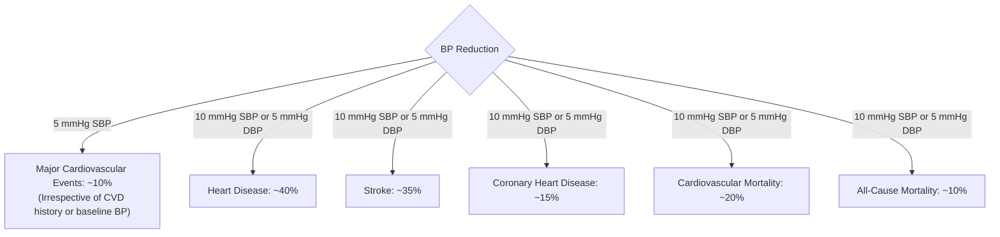
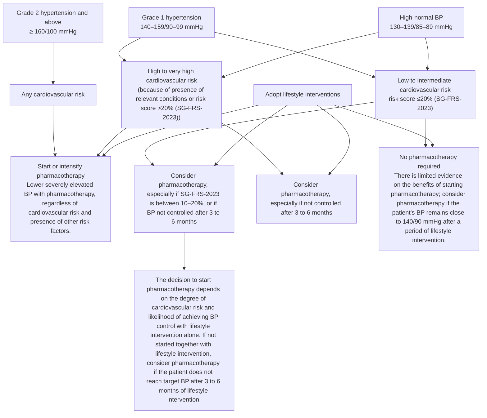

<!-- cpg_id: acg-hypertension_15dec2023 | phase4 deterministic | spine: Overview, Assessment, Management, Monitoring and follow-up, Supplementary, References -->
<!-- meta | source: ACE CLINICAL GUIDANCE | published: Published: 15 December 2023 | url: www.ace-hta.gov.sg | title: Hypertension. Tailoring the management plan to optimise blood pressure control -->


## Overview

```yaml
cpg_id: acg-hypertension_15dec2023
chunk_id: acg-hypertension_15dec2023.overview.prose.01
chunk_type: prose
section_id: overview
parent_rec: null
title: "Objective"
source_pages: [1, 2]
strength: null
tables_referenced: []
figures_referenced: []
url_links: []
cross_refs: []
review_flags:
  - contains_conditional_language
```

To optimise management of hypertension and reduce risk of cardiovascular disease

### Scope

Clinical assessment and management of hypertension, with a focus on pharmacotherapy

### Target audience

This clinical guidance is relevant to all healthcare professionals, especially those providing primary or generalist care

### Background

Hypertension is a highly prevalent risk factor for the development of cardiovascular disease (CVD), affecting an estimated 1.28 billion people worldwide.   In Singapore, the 2022 National Population Health Survey reported that over one in three residents (37%) aged 18 to 74 years had hypertension, and that more than half of this group (53%) were previously undiagnosed.   Without appropriate management, hypertension can lead to complications such as stroke, ischaemic heart disease, heart failure, and kidney damage, which are all associated with premature morbidity and mortality.

A comprehensive assessment that incorporates cardiovascular risk is essential for informing prognosis and treatment options for patients presenting with hypertension. This assessment is also a useful communication tool to help patients understand the importance of managing their elevated blood pressure (BP).

### Statement of Intent

This ACE Clinical Guidance (ACG) provides concise, evidence-based recommendations and serves as a common starting point nationally for clinical decision-making. It is underpinned by a wide array of considerations contextualised to Singapore, based on best available evidence at the time of development. The ACG is not exhaustive of the subject matter and does not replace clinical judgement. The recommendations in the ACG are not mandatory, and the responsibility for making decisions appropriate to the circumstances of the individual patient remains at all times with the healthcare professional.

### Definitions and scope of application

Accurate diagnosis of hypertension is important, as management is often lifelong and can involve multiple medications. Definitions used in this clinical guidance are based on clinic BP readings as follows:

Grade 1 hypertension and above: BP ≥140/90 mmHg

High-normal BP: BP ≥130–139/85–89 mmHg

Recommendations in this clinical guidance apply to any patient with clinic BP  >= 130/85 mmHg (elevated BP), which includes both those diagnosed with hypertension (Grade 1 and above) and those identified with high-normal BP.

### Clinic and non-clinic BP readings

Clinic BP readings may differ from those taken in non-clinic settings. This should be considered when diagnosing or managing hypertension, including when setting BP targets. For example, a clinic BP of 140/90 mmHg would correspond to a home BP of 135/85 mmHg.

For more information on these differences, see ‘A general reference for corresponding values of clinic and non-clinic BP readings’ on page 9.

---


## Assessment

```yaml
cpg_id: acg-hypertension_15dec2023
chunk_id: acg-hypertension_15dec2023.assessment.recommendation.01
chunk_type: recommendation
section_id: assessment
parent_rec: null
title: "Recommendation 1"
source_pages: [2, 3]
strength: strong
tables_referenced: []
figures_referenced: []
url_links:
  - https://go.gov.sg/acg-sgfrs-2023
cross_refs:
  - ACG-CKD-MANAGEMENT
review_flags:
  - contains_dosing_information
  - contains_conditional_language
  - cross_guideline_reference
```

**Recommendation 1:** Include cardiovascular risk assessment to inform management options for patients with elevated BP.

Assess cardiovascular risk together with clinic BP readings to inform care decisions and to engage the patient in a discussion about the importance of managing elevated BP.

For any patient with clinic BP ≥130/85 mmHg

### Identify risk factors that increase the risk of CVD. This includes:

- Conditions such as atherosclerotic CVD, diabetes mellitus (DM), or chronic kidney disease (CKD)

- Hypertension-mediated organ damage (HMOD)*, which is a cardiovascular risk factor especially relevant for patients with elevated BP, as it would warrant treatment initiation to delay or prevent further organ damage.

- HMOD refers to structural or functional changes in arteries or end organs such as heart, brain, eyes, kidneys, and blood vessels. Examples include left ventricular hypertrophy, albuminuria, or hypertensive retinopathy.

In absence of conditions known to influence cardiovascular risk

### Use calculators to estimate the patient's 10-year risk using modifiable and non-modifiable risk factors, including age, sex, and smoking status

A number of cardiovascular risk assessment calculators exist.

This clinical guidance references the Singapore-modified Framingham Risk Score (SG-FRS-2023) as it was recalibrated in 2023 with local population data.

The SG-FRS-2023 is available here:

- https://go.gov.sg/acg-sgfrs-2023

Additional factors that should be considered to further inform overall assessment and guide individualised management include:

- Other comorbidities not identified through cardiovascular assessment, such as asthma/COPD or gout

- Patient-related factors and overall health status, including pregnancy, frailty, life expectancy, socioeconomic factors, as well as individual needs, values or preferences regarding management options

The use of clinic BP and cardiovascular risk assessment to inform pharmacotherapy options is discussed further on Page 4.

### Care for patients with comorbidities

Management of hypertension is only one component of cardiovascular preventive care. Refer to the following ACGs for further details on relevant comorbidities:

- ACG on lipid management

- ACG on Type 2 DM management

- ACG on CKD diagnosis

- ACG on CKD management

### Consider secondary causes of hypertension

Secondary hypertension refers to hypertension due to an underlying, identifiable cause.   Suspicion of secondary hypertension should be higher in certain circumstances, such as early-onset, severe, or resistant hypertension. A suggestive family history or clinical clues can point to a specific secondary cause of hypertension, which includes:

- Aortic coarctation

- Certain medications (such as oral contraceptives, NSAIDs, steroids, decongestants, or diet pills)

- Cushing's syndrome

- Excessive alcohol intake

- Hyperthyroidism

- Hypothyroidism

- Obstructive sleep apnoea

- Phaeochromocytoma

- Primary aldosteronism

- Renal parenchymal disease

- Renovascular disease

- Use of illicit drugs

Management of secondary hypertension depends on the underlying cause and can require a combination of lifestyle intervention, cause-specific medications, and surgery. Referral for further investigations and shared management is often required.

Safe or moderate drinking is defined as no more than two standard drinks a day for men, and no more than one standard drink a day for women; a standard alcoholic drink contains 10 g of alcohol and roughly equates to one can (330 ml) of regular beer with 5% alcohol content, half a glass (100 ml) of wine with 15% alcohol content and one shot (30 ml) of spirits with 40% alcohol content.

Local evidence on patients with hypertension reported a prevalence of around 5%.

---


## Management

```yaml
cpg_id: acg-hypertension_15dec2023
chunk_id: acg-hypertension_15dec2023.management.prose.01
chunk_type: prose
section_id: management
parent_rec: null
title: "Management overview"
source_pages: [3]
strength: null
tables_referenced: []
figures_referenced: []
url_links: []
cross_refs: []
review_flags: []
```

The main goals of hypertension management are to achieve significant reduction in BP to attain optimal BP control, delay or prevent progression of hypertension and its associated complications, and mitigate CVD risks. BP levels can be effectively lowered through a tailored management plan, which includes personalised BP targets, sustainable lifestyle intervention, and pharmacotherapy where appropriate.

---

```yaml
cpg_id: acg-hypertension_15dec2023
chunk_id: acg-hypertension_15dec2023.management.prose.02
chunk_type: prose
section_id: management
parent_rec: null
title: "BP targets for patients with hypertension"
source_pages: [2, 3]
strength: null
tables_referenced: []
figures_referenced:
  - Figure 1. Summary of the estimated risk reductions due to BP reduction
url_links: []
cross_refs: []
review_flags:
  - contains_conditional_language
```

Any reduction in BP decreases the risk of cardiovascular morbidity and mortality.   The benefits of BP reduction are shown in Figure 1 below.

Individualise BP targets according to patient cardiovascular risk and overall health status; more stringent BP targets can be considered as tolerated by the patient. Do not lower BP below 120/70 mmHg as evidence of benefit beyond this threshold is inconsistent, and the potential for increased risk of side effects can lead to treatment discontinuation.

---

```yaml
cpg_id: acg-hypertension_15dec2023
chunk_id: acg-hypertension_15dec2023.management.figure.01
chunk_type: figure
section_id: management
parent_rec: null
title: "Figure 1. Summary of the estimated risk reductions due to BP reduction"
source_pages: [3]
strength: null
reconstructed_from: mermaid
image_dir: grouped_p3_fig_01.jpg
url_links: []
cross_refs: []
review_flags: []
```

**Figure 1. Summary of the estimated risk reductions due to BP reduction**



> *Footnote: BP, blood pressure; DBP, diastolic blood pressure; SBP, systolic blood pressure*

> *Footnote: § Major cardiovascular events are defined as a composite of fatal or non-fatal stroke, fatal or nonfatal myocardial infarction or ischemic heart disease, or heart failure causing death or hospital admission*

---

```yaml
cpg_id: acg-hypertension_15dec2023
chunk_id: acg-hypertension_15dec2023.management.table.01
chunk_type: table
section_id: management
parent_rec: null
title: "Table 1. Guide to setting BP targets"
source_pages: [3]
strength: null
image_dir: f6aba618e598f45cc59146b4a14393ba43ca6eece5507a02e4bd1358693428ba.jpg
url_links: []
cross_refs: []
review_flags:
  - contains_dosing_information
```

**Table 1. Guide to setting BP targets**

<table><tr><td>Patient stratification based on comprehensive assessment</td><td>BP targets (clinic reading)</td></tr><tr><td>High to very high cardiovascular risk• Patients with CVD, CKD, DM, or HMOD OR risk score &gt;20% (SG-FRS-2023)</td><td>&lt;130/80 mmHg</td></tr><tr><td>Low to intermediate cardiovascular risk• Patients with none of the above risk factors/comorbiditiesOR risk score ≤20% (SG-FRS-2023)</td><td>&lt;140/90 mmHgConsider going lower as tolerated (e.g., &lt;130/80 mmHg)</td></tr><tr><td>Older age (e.g., &gt;80 years old), frail, orthostatic hypotension, or limited life expectancy</td><td>Consider less stringent BP targets (e.g., &lt;150/90 mmHg)</td></tr></table>

> *Footnote: BP, blood pressure; CVD, cardiovascular disease; CKD, chronic kidney disease; DM, diabetes mellitus; HMOD, hypertension-mediated organ damage; SG-FRS-2023, Singapore-modified Framingham Risk Score 2023*

---

```yaml
cpg_id: acg-hypertension_15dec2023
chunk_id: acg-hypertension_15dec2023.management.prose.03
chunk_type: prose
section_id: management
parent_rec: null
title: "Benefits of lifestyle intervention"
source_pages: [4]
strength: null
tables_referenced: []
figures_referenced: []
url_links: []
cross_refs:
  - ACG-CKD-MANAGEMENT
review_flags:
  - contains_conditional_language
  - cross_guideline_reference
```

For patients with elevated BP, lifestyle intervention includes healthy diet (e.g., reducing sodium intake and alcohol consumption), increased physical activity, weight reduction if overweight or obese, and smoking cessation.   Benefits of lifestyle intervention extend across age groups and cardiovascular risk levels, and are therefore encouraged for all patients.

A personalised approach taking into consideration factors such as comorbidities, patient's preferences, quality of life, frailty, functionality, and cognitive status will help in setting sustainable lifestyle plans.

For examples of patient resources and programs, see High blood pressure: healthy eating guide, MOVEIT Programme. For patients with concomitant CKD, see ACG on CKD management, as advice relating to salt and protein intake can vary.

---

```yaml
cpg_id: acg-hypertension_15dec2023
chunk_id: acg-hypertension_15dec2023.management.prose.04
chunk_type: prose
section_id: management
parent_rec: null
title: "When to initiate pharmacotherapy"
source_pages: [4, 5]
strength: null
tables_referenced:
  - Table S1. Commonly used BP-lowering medication classes registered in Singapore
figures_referenced:
  - Figure 2. General guide to initiation of pharmacotherapy in patients with elevated BP (see Recommendations 2 to 5)
url_links: []
cross_refs: []
review_flags:
  - contains_dosing_information
  - contains_conditional_language
```

Pharmacotherapy complements lifestyle intervention where appropriate. The decision to initiate treatment with antihypertensive medications is guided by the patient's BP, cardiovascular risk, and presence of conditions such as CVD, CKD, DM, or HMOD. Figure 2 below provides a general guide for when pharmacotherapy should be initiated.

The choice of BB should be based on the patient's clinical profile, side effect profile, and dosing frequency (see Supplementary Table S1).

ACE inhibitor, angiotensin-converting enzyme inhibitor; ARB, angiotensin receptor blocker; BB, beta blocker; BP, blood pressure; CCB, calcium channel blocker; T2DM, type 2 diabetes mellitus

Single-pill combinations may be used due to their practical benefits such as reaching BP targets, improved treatment adherence and persistence rates, and lower pill burden.   However, single-pill combinations may not be suitable for all patients, such as those who require individualised dose adjustment, or are at risk of adverse effects from medication interactions.

---

```yaml
cpg_id: acg-hypertension_15dec2023
chunk_id: acg-hypertension_15dec2023.management.figure.02
chunk_type: figure
section_id: management
parent_rec: null
title: "Figure 2. General guide to initiation of pharmacotherapy in patients with elevated BP (see Recommendations 2 to 5)"
source_pages: [4]
strength: null
reconstructed_from: mermaid
image_dir: grouped_p4_fig_01.jpg
url_links: []
cross_refs: []
review_flags: []
```

**Figure 2. General guide to initiation of pharmacotherapy in patients with elevated BP (see Recommendations 2 to 5)**



> *Footnote: SG-FRS-2023, Singapore-modified Framingham Risk Score 2023*

---

```yaml
cpg_id: acg-hypertension_15dec2023
chunk_id: acg-hypertension_15dec2023.management.recommendation.02
chunk_type: recommendation
section_id: management
parent_rec: null
title: "Recommendation 2"
source_pages: [5]
strength: strong
tables_referenced:
  - Table 2. Considerations for choosing a first-line antihypertensive class (adapted from product information leaflets; see Supplementary Table S1 for further details on specific agents)
figures_referenced: []
url_links: []
cross_refs: []
review_flags:
  - contains_conditional_language
  - contains_dosing_information
```

**Recommendation 2:** Use an ACE inhibitor, ARB, or CCB as first-line antihypertensive medications; consider thiazide/thiazide-like diuretics as alternative first-line if indicated.

Where antihypertensive medication is warranted, most patients would benefit from starting with a low-dose, regardless of whether it is monotherapy or dual therapy.

- As monotherapy, angiotensin-converting enzyme (ACE) inhibitors, angiotensin receptor blockers (ARBs), calcium channel blockers (CCBs), and thiazide/thiazide-like diuretics have comparable BP-lowering efficacy and are equally effective in preventing risk of fatal and non-fatal cardiovascular events.

- Thiazide/thiazide-like diuretics are considered as an alternative first-line as their side-effect profile is less favourable compared to the other first-line antihypertensives. Known side-effects include increased risk of insulin resistance and potential electrolyte derangement, especially for elderly patients.

Overall, the choice of antihypertensive(s) depends on a patient's comorbidities, common side effects, monitoring parameters, and other practical considerations such as frequency of administration (see Table 2).

---

```yaml
cpg_id: acg-hypertension_15dec2023
chunk_id: acg-hypertension_15dec2023.management.table.02
chunk_type: table
section_id: management
parent_rec: acg-hypertension_15dec2023.management.recommendation.02
title: "Table 2. Considerations for choosing a first-line antihypertensive class (adapte"
source_pages: [5]
strength: null
image_dir: 89c9ce5b3755dcb204b5b31a313d0d210579e226e8a96f5062eca57ea842cce8.jpg
url_links: []
cross_refs: []
review_flags:
  - contains_dosing_information
```

**Table 2. Considerations for choosing a first-line antihypertensive class (adapted from product information leaflets; see Supplementary Table S1 for further details on specific agents)**

<table><tr><td></td><td colspan="2">ACE inhibitor or ARB</td><td>CCB</td><td>Thiazide/thiazide-like diuretic**</td></tr><tr><td>Comorbidities/ conditions</td><td colspan="2">Should be used as initial monotherapy in patients who have DM or CKD, especially when complicated by albuminuria due to their renoprotective effect.Contraindicated in pregnancy, and should be avoided in women who are planning pregnancy or breastfeeding.</td><td>Non-dihydropyridine CCB (diltiazem, verapamil) are not usually prescribed for patients with heart failure with reduced ejection fraction due to their negative inotropic effect.</td><td>Preferred for patients with osteoporosis, oedema, calcium nephrolithiasis with hypercalciuria.Use with caution in patients with increased risk for DM or gout.</td></tr><tr><td>Common side effects</td><td>Persistent dry cough, dizziness, increased potassium levels.</td><td>Similar to ACE inhibitors, but persistent dry cough less likely.</td><td>Peripheral oedema, flushing, headache, hypotension.</td><td>Hypotension and dizziness, electrolyte imbalance, increased urination, increased uric acid, impaired glucose control.</td></tr><tr><td>Monitoring parameters</td><td colspan="2">Check and monitor kidney function and serum potassium before and after starting treatment, and after dose increase (e.g., within 2–4 weeks or as required). Once stable, monitor at least once every 12 months.</td><td>Laboratory monitoring usually not needed.</td><td>Check and monitor kidney function and electrolytes before and after starting treatment, and after dose increase (e.g., within 2–4 weeks or as required). Once stable, monitor at least once every 12 months.</td></tr></table>

> *Footnote: ACE inhibitor, angiotensin-converting enzyme inhibitor; ARB, angiotensin II receptor blocker; CCB, calcium channel blocker; CKD, chronic kidney disease; DM, diabetes mellitus*

> *Footnote: **Thiazides have a photosensitising effect which may result in a slightly increased risk of skin cancer. Patients taking thiazides can be advised on preventive measures to limit their exposure to sunlight, however there is limited evidence in Asian regions, and no local cases have been reported.*

---

```yaml
cpg_id: acg-hypertension_15dec2023
chunk_id: acg-hypertension_15dec2023.management.recommendation.03
chunk_type: recommendation
section_id: management
parent_rec: null
title: "Recommendation 3"
source_pages: [5, 6]
strength: strong
tables_referenced:
  - Table 3. Prescribing considerations for cardioselective and non-selective beta blockers
figures_referenced: []
url_links: []
cross_refs: []
review_flags:
  - contains_conditional_language
```

**Recommendation 3:** Avoid initiating beta blockers (BBs) as first-line monotherapy for BP control unless BB use is expected to have favourable effect on patient comorbidities.

While antihypertensive medication classes have similar BP-lowering effects, ACE inhibitors, ARBs, CCBs, and thiazides/thiazide-like diuretics are associated with better outcomes against stroke and all-cause mortality compared to BBs, especially in patients aged 60 years or older.

Because of this less favourable benefit/risk ratio, BBs are not preferred as first-line monotherapy for BP-lowering. However, they may be beneficial for patients who also require heart rate reduction, or have cardiac comorbidities such as stable ischaemic heart disease, chronic heart failure, or atrial fibrillation.

BB subclasses differ in their pharmacodynamic and pharmacokinetic properties due to differences in bioavailability and receptor selectivity (see Table 3):

---

```yaml
cpg_id: acg-hypertension_15dec2023
chunk_id: acg-hypertension_15dec2023.management.table.03
chunk_type: table
section_id: management
parent_rec: acg-hypertension_15dec2023.management.recommendation.03
title: "Table 3. Prescribing considerations for cardioselective and non-selective beta b"
source_pages: [6]
strength: null
image_dir: e418a74c972616c54ac0d7687fcaedc03004002518cdfb3d0888432b231f595f.jpg
url_links: []
cross_refs: []
review_flags: []
```

**Table 3. Prescribing considerations for cardioselective and non-selective beta blockers**

<table><tr><td>Cardioselective(e.g., atenolol, bisoprolol, metoprolol and nebivolol)</td><td>Non-selective(e.g., propranolol and carvedilol)</td></tr><tr><td>Have a more favourable side effect profile compared to non-selective beta blockersLess likely to cause constriction of airwaysPreferred for patients with respiratory diseases, and for management of coronary heart disease, chronic heart failure (bisoprolol, metoprolol, nebivolol), acute coronary syndrome and some arrhythmias</td><td>Preferred for patients who require treatment for migraine prevention, essential tremor, or portal hypertension in cirrhosis (data supports the use of carvedilol also for heart failure)</td></tr></table>

---

```yaml
cpg_id: acg-hypertension_15dec2023
chunk_id: acg-hypertension_15dec2023.management.recommendation.04
chunk_type: recommendation
section_id: management
parent_rec: null
title: "Recommendation 4"
source_pages: [6]
strength: conditional
tables_referenced:
  - Table 2. Considerations for choosing a first-line antihypertensive class (adapted from product information leaflets; see Supplementary Table S1 for further details on specific agents)
  - Table 4. Common antihypertensive combinations to consider avoiding due to their associated risks
figures_referenced: []
url_links: []
cross_refs: []
review_flags:
  - contains_conditional_language
  - contains_dosing_information
```

**Recommendation 4:** Consider initiating low-dose  dual therapy from two different antihypertensive medication classes based on required BP reduction and cardiovascular risk.

Compared to monotherapy, dual therapy  (treatment with two medicines from different antihypertensive classes) is associated with greater magnitude of BP-lowering and better safety profile.  Therefore, starting with dual therapy may be appropriate if a greater reduction in BP is required to reach targets, such as for patients with SBP/DBP >= 20/10 mmHg above target, those with Grade 2 hypertension or higher (clinic BP >= 160/100 mmHg), or those with comorbidities such as DM or CKD who may require more intensive treatment.

For elderly or frail patients, the benefits of dual therapy should be weighed against potential harms, such as increased risk of adverse effects, the impact of impaired organ function, or limited tolerability for medications.

While the choice of medication class is largely informed by comorbidities (see Table 2) and other patient factors, evidence suggests the most effective combination for reducing cardiovascular, cerebrovascular, and adverse renal outcomes is:

- ACE inhibitor/ARB + dihydropyridine CCB (such as amlodipine), or

- ACE inhibitor/ARB + diuretic (preferably a thiazide-like diuretic)

Certain combinations may need caution or avoidance due to associated risks (see Table 4 below).

---

```yaml
cpg_id: acg-hypertension_15dec2023
chunk_id: acg-hypertension_15dec2023.management.table.04
chunk_type: table
section_id: management
parent_rec: acg-hypertension_15dec2023.management.recommendation.04
title: "Table 4. Common antihypertensive combinations to consider avoiding due to their "
source_pages: [6]
strength: null
image_dir: 6d6804d628714070da37a50968d41595a793ea8292ef00c64d413e3b7c741ffd.jpg
url_links: []
cross_refs: []
review_flags: []
```

**Table 4. Common antihypertensive combinations to consider avoiding due to their associated risks**

<table><tr><td>Combination of medication classes to consider avoiding</td><td>Risks when used in combination</td></tr><tr><td>ACE inhibitor + ARB</td><td>Increased risk of hyperkalaemia, acute kidney injury and lower BP due to similar mechanisms of action</td></tr><tr><td>BB + non-dihydropyridine CCB (e.g., verapamil)</td><td>Increased risk of bradycardia and/or atrioventricular block</td></tr><tr><td>BB + diuretic</td><td>Increased risk of developing T2DM</td></tr></table>

---

```yaml
cpg_id: acg-hypertension_15dec2023
chunk_id: acg-hypertension_15dec2023.management.recommendation.05
chunk_type: recommendation
section_id: management
parent_rec: null
title: "Recommendation 5"
source_pages: [7, 8]
strength: strong
tables_referenced: []
figures_referenced: []
url_links: []
cross_refs: []
review_flags:
  - contains_conditional_language
  - contains_dosing_information
```

**Recommendation 5:** Intensify antihypertensive medications to optimise BP control if response to initial treatment is not achieved as expected (e.g., within three months).

Patients on pharmacotherapy who do not reach their BP target may require treatment intensification. After ruling out modifiable reasons for suboptimal response (see section ‘Considerations before intensification’ below), treatment could be intensified by increasing dosage of current medication, adding a different antihypertensive class, or switching to a different medication class.

Adding a different antihypertensive medication at low-dose is encouraged where possible, as this provides additive BP-lowering effects while minimising the risk of side effects (it is possible to achieve half of the maximal BP-lowering effect within a week of intensification and full effect within four weeks).   Evidence on the optimal timeframe for intensification is limited, with one study suggesting that this could be set around three months after treatment initiation (if expected treatment response is suboptimal) to avoid increased risk of cardiovascular events or mortality.

### Considerations before intensification

Prior to advancing treatment intensity, review and discuss factors influencing medication adherence with the patient, including their ability to tolerate existing medications, side effects from increasing the dose, cost, and patient preferences. Other clinical and practical considerations include:

- Evaluating salt intake

- Investigating secondary hypertension (including medication-induced causes)

- Managing volume overload (e.g., salt and water retention due to acute kidney injury)

- Treating comorbidities

### Strategies to encourage and support adherence

Including the patient in discussions about their management options is a key part of shared decision-making, enabling open conversations about individualised treatment goals and improving adherence to the overall plan. Discuss and agree with the patient on the approach to treating their hypertension, including lifestyle interventions, benefits and risks of starting pharmacotherapy in light of their overall cardiovascular risk, and medication choices.

Encourage adherence by educating patients on how their antihypertensive medications work, and the expected time frame for improvements in BP reduction. Reinforce this information at each visit. For example, if a decision is made to initially prescribe two low-dose antihypertensives together, emphasise why it is important that both are taken consistently, i.e. to maximise BP control while reducing the risk of adverse effects (compared with high-dose monotherapy).

Other strategies to support adherence include:

- Selecting antihypertensives with once-daily dosing

- Reducing polypharmacy, e.g., using a single-pill or fixed-dose combination where available when BP is stabilised

- Using pill boxes, blister packaging, or electronic reminders (e.g., smartphone apps)

Patients can also take their antihypertensive medications at a time of day that is convenient for them, which optimises adherence and minimises undesirable effects.   Night-time dosing may limit the perception of adverse effects.

### Considerations for specialist referral

Specialists can be consulted for advice, referral or collaborative care at any point, particularly for:

- Patients with indications for emergency or urgent treatment, e.g., malignant hypertension, hypertensive cardiac failure or other impending complications

- Patients with difficult-to-manage hypertension, e.g., unusually labile BP

- Patients with hypertension with no or incomplete response to multiple medication regimes (three or more i.e. resistant hypertension)

- Patients with suspected secondary hypertension, e.g., hypertension with hypokalaemia

- Hypertension in certain patient populations, e.g., pregnant women, young children, patients aged less than 30 years

- Patients with acute or recent cardiovascular complications from hypertension

### Resistant hypertension

Resistant hypertension is defined as uncontrolled BP despite a patient taking  >= 3 optimally-tolerated antihypertensives (including a diuretic). When suspecting resistant hypertension, check if:

- The patient has been adherent to their medication (at least 80% of the time)

- BP has been measured following a standardised approach

- Appropriate combination and dosage of medications has been prescribed i.e. three medications including ACE inhibitor or ARB, CCB, and diuretic

- The patient is not taking any substances which may elevate blood pressure (e.g., NSAIDs, sympathomimetics, liquorice, oral contraceptives, or corticosteroids)

Consider referral to a specialist or seek specialist advice after ruling out adherence issues.

---


## Monitoring and follow-up

```yaml
cpg_id: acg-hypertension_15dec2023
chunk_id: acg-hypertension_15dec2023.monitoring_and_follow_up.recommendation.06
chunk_type: recommendation
section_id: monitoring_and_follow_up
parent_rec: null
title: "Recommendation 6"
source_pages: [8, 9]
strength: strong
tables_referenced:
  - Table 5. Corresponding values of clinic versus non-clinic BP readings (mmHg).
figures_referenced: []
url_links:
  - https://www.shs.org.sg/patient-resources/
cross_refs: []
review_flags:
  - contains_conditional_language
  - contains_dosing_information
```

**Recommendation 6:** Follow up all patients with hypertension at least every six months, with more frequent review as needed.

The frequency of follow-up visits should be tailored according to the patient's clinical circumstances and progress in BP reduction. More frequent review (e.g., within three months) can be considered:

- For patients at increased risk of hypertension-related complications, such as those with BP ≥160/100 mmHg, CKD, DM, HMOD, or high cardiovascular risk

- If medication was recently initiated or optimised (dose adjustment, switching or adding-on of different antihypertensive class)

- If response to treatment is not as expected

Home BP monitoring should be encouraged where possible (see ‘Clinical utility and approach to home BP monitoring’ on page 9). Monitor patients closely and adjust the management plan accordingly if complications or treatment-related adverse events arise. Continue reviewing cardiovascular risk factors and parameters where appropriate, including BP, lipids profile, weight, body mass index, cardiac and kidney assessment (such as estimated glomerular filtration rate and urinary albumin:creatinine ratio), kidney function, electrolytes (e.g., serum potassium), alcohol and smoking status.

### Clinical utility and approach to home BP monitoring

When available, home BP monitoring is useful for:

- Long-term monitoring and follow-up

- Informing management and optimising BP control

- Providing direct visual feedback on BP control to patients and caregivers

- Reducing need for frequent clinic visits, allowing for telemonitoring/telesupport where available

- Increasing patients' active participation in hypertension management and improving adherence to antihypertensive medications

- Recording patients' BP trends over time

- Ruling out white-coat hypertension  or identifying masked hypertension

- Monitoring patients with clinical features consistent with hypertension (e.g., signs of HMOD)

Scan the QR code below for resources on educating patients or caregivers on appropriate home BP monitoring techniques

- https://www.shs.org.sg/patient-resources/

### A general reference for corresponding values of clinic and non-clinic BP readings

BP readings taken in non-clinic settings tend to be lower than readings taken in clinic. The difference between clinic and non-clinic BP readings is not fixed, and decreases as clinic BP decreases.

Table 5 should be interpreted with caution as the information reflects the average clinic and non-clinic BP values across untreated and treated individuals from non-Asian and Asian ethnicities.

---

```yaml
cpg_id: acg-hypertension_15dec2023
chunk_id: acg-hypertension_15dec2023.monitoring_and_follow_up.table.01
chunk_type: table
section_id: monitoring_and_follow_up
parent_rec: acg-hypertension_15dec2023.monitoring_and_follow_up.recommendation.06
title: "Table 5. Corresponding values of clinic versus non-clinic BP readings (mmHg)."
source_pages: [9]
strength: null
image_dir: d029de439c2f4865110301652cf4b0e80f67ebc8d9d398f627420565b92640a6.jpg
url_links: []
cross_refs: []
review_flags: []
```

**Table 5. Corresponding values of clinic versus non-clinic BP readings (mmHg).**

<table><tr><td>Clinic</td><td>HBPM or Daytime ABPM</td><td>Night-time ABPM</td><td>24-hour ABPM</td></tr><tr><td>120/80</td><td>120/80</td><td>100/65</td><td>115/75</td></tr><tr><td>130/80</td><td>130/80</td><td>110/65</td><td>125/75</td></tr><tr><td>140/90</td><td>135/85</td><td>120/70</td><td>130/80</td></tr><tr><td>160/100</td><td>145/90</td><td>140/85</td><td>145/90</td></tr></table>

> *Footnote: ABPM, ambulatory blood pressure monitoring; HBPM, home blood pressure monitoring*

> *Footnote: Adapted from Whelton et al. 2017*

---


## Supplementary

```yaml
cpg_id: acg-hypertension_15dec2023
chunk_id: acg-hypertension_15dec2023.supplementary.table.01
chunk_type: table
section_id: supplementary
parent_rec: null
title: "Table S1. Commonly used BP-lowering medication classes registered in Singapore"
source_pages: [10, 11]
strength: null
image_dir: 31358e4e413c1b0eb72a409e8ba7932fd4071dac1f01e7bfc300f3dc5af6caec.jpg
url_links: []
cross_refs: []
review_flags:
  - contains_dosing_information
```

**Table S1. Commonly used BP-lowering medication classes registered in Singapore**

This table only includes medications from the major classes mentioned in the ACG and is non-exhaustive. Information from local product inserts has been referenced and supplemented with information from consolidated product monographs (e.g., Lexicomp) where local product inserts are unavailable or unclear. Refer to local product inserts for full details before prescribing. Information from other references (e.g., international guidelines) may differ. Clinical judgement should be exercised at all times when making decisions for an individual patient. For fixed-dose combination products, refer to information on individual components.

<table><tr><td>Medication class/ mechanism of action</td><td>Name#</td><td>Dosing recommendations§§</td><td>Renal dose adjustment***</td><td>Precautions and adverse reactions (common/significant)</td></tr><tr><td rowspan="7">Angiotensin-converting enzyme (ACE) inhibitor inhibits the formation of angiotensin II, leading to vasodilation</td><td>Captopril</td><td>Initial: 6.25–25 mg BD-TDSMax: 50 mg TDS</td><td>CrCl 10–50, administer 75% of normal dose every 12–18hCrCl &lt;10, 50% of normal dose every 24h</td><td rowspan="15">Precaution: women of child-bearing potentialSide effects: decline in renal function, hyperkalemia, angioedema, cough (more common in ACE inhibitor)Contraindication: pregnant women</td></tr><tr><td>Enalapril</td><td>Initial: 2.5–10 mg ODMax: 40 mg/day</td><td>CrCl 10–30, initial: 2.5 mg/day in 1–2 divided dose; max: 20 mg/dayCrCl &lt;10, initial: 1.25 mg OD or 2.5 mg EOD; max:10mg/day</td></tr><tr><td>Imidapril</td><td>Initial: 2.5–10 mg ODMax: 20 mg OD</td><td>Renal impairment, initial: 2.5 mg ODCrCl &lt;30, consider lowering to half of usual dose or prolonging time interval between doses</td></tr><tr><td>Lisinopril</td><td>Initial: 2.5–10 mg ODMax: 40 mg OD</td><td>CrCl &lt;10, initial: 2.5 mg ODCrCl 10–30, initial: 2.5–5 mg OD</td></tr><tr><td>Perindopril arginine</td><td>Initial: 2.5–5 mg OMMax: 10 mg OD</td><td>CrCl 60–89, max: 5 mg/dayCrCl 30–59, max: 2.5 mg/dayCrCl 15–29, max: 2.5 mg EOD</td></tr><tr><td>Perindopril erbumine</td><td>Initial: 4 mg ODMax: 8–16 mg OD</td><td>CrCl 30–80, initial: 2 mg OM, max: 8 mg OMCrCl &lt;30, not recommended</td></tr><tr><td>Ramipril</td><td>Initial: 2.5 mg ODMax: 10 mg/day</td><td>CrCl 20–50, initial: 1.25 mg OM, max: 5 mg/day</td></tr><tr><td rowspan="8">Angiotensin II receptor blocker blocks type 1 angiotensin II receptors, preventing vascular contraction</td><td>Candesartan</td><td>Initial: 4–8 mg ODMax: 32 mg OD</td><td>Renal impairment, initial: 4 mg OM</td></tr><tr><td>Eprosartan</td><td>Initial: 300–600 mg OMMax: 1200 mg OD (in clinical trials for 8 weeks)</td><td>CrCl &lt;60, initial: 300 mg OM</td></tr><tr><td>Fimasartan</td><td>Initial: 60 mg ODMax: 120 mg OD</td><td>CrCl &lt;30, initial: 30 mg OD, max: 60 mg OD</td></tr><tr><td>Irbesartan</td><td>Initial: 75–150 mg ODMax: 300 mg OD</td><td>No dosage adjustment needed</td></tr><tr><td>Losartan</td><td>Initial: 25–50 mg ODMax: 100 mg OD</td><td>CrCl &lt;20, initial: 25 mg OD</td></tr><tr><td>Olmesartan</td><td>Initial: 20 mg ODMax: 40 mg OD</td><td>No dose adjustment needed</td></tr><tr><td>Telmisartan</td><td>Initial: 20–40 mg ODMax: 80 mg OD</td><td>No dose adjustment needed</td></tr><tr><td>Valsartan</td><td>Initial: 80–160 mg ODMax: 320 mg OD</td><td>CrCl &lt;10, use with caution</td></tr><tr><td rowspan="10">Beta blocker blocks the neurotransmitters norepinephrine and epinephrine from binding to receptors</td><td colspan="4">Cardioselective</td></tr><tr><td>Acebutolol</td><td>Initial: 100–200 mg BD (200–400 mg/day in 1–2 divided doses)Max: 600 mg BD (1200 mg/day)</td><td>CrCl &lt;50, reduce daily dose by 50%CrCl &lt;25, reduce daily dose by 75%</td><td rowspan="5">Precaution: Avoid abrupt discontinuation, risk of bradycardiaSide effects: Masking of hypoglycemia, bronchospasm (especially non-cardioselective beta blockers)</td></tr><tr><td>Atenolol</td><td>Initial: 25 mg OD-BDMax: 100 mg/day</td><td>CrCl 15–35, max: 50 mg ODCrCl &lt;15, max: 25 mg OD or 50 mg EOD</td></tr><tr><td>Bisoprolol</td><td>Initial: 2.5–5 mg ODMax: 20 mg/day</td><td>CrCl &lt;20, initial: lower initial dose, max: 10 mg/day</td></tr><tr><td>Metoprolol tatrate</td><td>Initial: 50 mg BDMax: 400 mg/day in divided doses</td><td>No dose adjustment needed</td></tr><tr><td>Nebivolol</td><td>Initial: 2.5–5 mg ODMax: 40 mg/day<eq>^{†††}</eq></td><td>In patients with renal insufficiency, initial: 2.5 mg OD, max: 5 mg OD</td></tr><tr><td colspan="4">Non-cardioselective</td></tr><tr><td>Carvedilol</td><td>Initial: 12.5 mg OD for first 2 days, then 25 mg ODMax: 50 mg/day</td><td>No dose adjustment needed</td><td rowspan="3">Refer to precautions and side effects of cardioselective beta blockers</td></tr><tr><td>Labetalol</td><td>Initial: 100 mg BDMax: 800–2400 mg/day in divided doses</td><td>No dose adjustment needed</td></tr><tr><td>Propranolol</td><td>Initial: 40 mg BD (80 mg/day in 1 to 4 divided doses)Max: 160 mg/day (usual 80–160 mg/day, max not mentioned)</td><td>Use with caution in renal impairment</td></tr></table>

<table><tr><td>Medication class/ mechanism of action</td><td>Name<eq>^{\ddagger\ddagger}</eq></td><td>Dosing recommendations<eq>^{\S\S}</eq></td><td>Renal dose adjustment***</td><td>Precautions and adverse reactions (common/significant)</td></tr><tr><td rowspan="8">Calcium channel blocker prevents calcium from entering the cells of the heart and arteries, which reduces contraction of arteries and allows vasodilation</td><td colspan="4">Dihydropyridine</td></tr><tr><td>Amlodipine</td><td>Initial: 5 mg ODMax: 10 mg OD</td><td rowspan="4">No dose adjustment needed</td><td rowspan="4">Precaution: hepatic impairmentSide effects: oedema, dizziness, headache</td></tr><tr><td>Felodipine</td><td>Initial: 2.5–5 mg ODMax: 20 mg OD</td></tr><tr><td>Lacidipine</td><td>Initial: 2 mg OMMax: 6 mg OM</td></tr><tr><td>Nifedipine LA</td><td>Initial: 20–30 mg ODMax: 120 mg OD</td></tr><tr><td colspan="4">Non-dihydropyridine</td></tr><tr><td>Verapamil<eq>^{###}</eq></td><td>IR - Initial: 40–80 mg TDSMax: 360–480 mg in divided doses (no evidence that dosages beyond 360 mg provided added effect)SR - Initial: 120–240 mg OMMax: 480 mg OM</td><td rowspan="2">Use with caution in renal impairment</td><td rowspan="2">Precaution: avoid abrupt discontinuation, heart block, LV dysfunction, hepatic impairmentSide effects: oedema, bradycardia, constipation (verapamil), headache (verapamil), hepatotoxicity</td></tr><tr><td>Diltiazem hydrochloride</td><td>Three different formulations, select and adjust dosage according to age and symptoms.IR - Usual: 30–60 mg TDSSR (BD) - Usual: 90 mg BDSR (OD) - Usual: 100–200 mg OD</td></tr><tr><td rowspan="3">Diuretic diminishes sodium reabsorption at different sites in the nephron, thereby increasing urinary sodium and water loss</td><td colspan="4">Thiazide and thiazide-like</td></tr><tr><td>Hydrochlorothiazide</td><td>Initial: 12.5–25 mg ODMax: 50–100 mg OD</td><td>Use with caution in renal impairmentCrCl &lt;10, use not recommended due to lack of efficacy</td><td rowspan="2">Precaution: risk of squamous cell carcinomaSide effects: hyperuricemia, hypokalaemia, hyponatremia, hypercalcemia, hyperglycaemia, photosensitivity</td></tr><tr><td>Indapamide</td><td>IR - Initial &amp; Max: 2.5 mg OMSR - Initial &amp; Max: 1.5 mg OM</td><td>CrCl &lt;30, contraindicated</td></tr></table>

> *Footnote: CrCl, creatinine clearance in mL/min; BD, twice daily; EOD, every other day; OD, once daily; OM; once every morning; TDS, three times daily; IR, immediate release; LA, long acting; SR, slow release; QDS, four times daily*

> *Footnote: Underline denotes availability on government subsidy list.*

> *Footnote: # Includes medications with single active ingredient registered in Singapore. For fixed-dose combination products, refer to information on individual components.*

> *Footnote: §§ Maximum dosage may be lower for elderly*

> *Footnote: *** The phrase "use not recommended" indicates limited or no clinical data reported in the product information leaflets*

> *Footnote: Based on local product insert for nebivolol, recommended max dose for >65 years is 5mg/day*

> *Footnote: ### Verapamil immediate release is not registered in Singapore but available as exemption item.*

---

```yaml
cpg_id: acg-hypertension_15dec2023
chunk_id: acg-hypertension_15dec2023.supplementary.table.02
chunk_type: table
section_id: supplementary
parent_rec: null
title: "Table S2. List of single-pill combinations registered in Singapore"
source_pages: [11]
strength: null
image_dir: 7b2adfcd151dea59c6d3db1cae4bda96b73153f69608c6704e47e7e125f93851.jpg
url_links: []
cross_refs: []
review_flags:
  - contains_dosing_information
```

**Table S2. List of single-pill combinations registered in Singapore**

<table><tr><td>Medication classes</td><td>Agent names</td></tr><tr><td>ACE inhibitor + D (thiazide)</td><td>enalapril + HCTZ</td></tr><tr><td>ACE inhibitor + D (thiazide-like)</td><td>perindopril arginine + indapamide</td></tr><tr><td>ACE inhibitor + BB</td><td>perindopril arginine + bisoprolol</td></tr><tr><td>ACE inhibitor + CCB</td><td>perindopril arginine + amlodipine perindopril erbumine + amlodipine</td></tr><tr><td>ACE inhibitor + CCB + D (thiazide-like)</td><td>perindopril arginine + amlodipine + indapamide</td></tr><tr><td>ARB + CCB</td><td>irbesartan + amlodipine losartan + amlodipine olmesartan + amlodipine telmisartan + amlodipine valsartan + amlodipine</td></tr><tr><td>ARB + CCB + D (thiazide)</td><td>valsartan + amlodipine + HCTZ</td></tr><tr><td>ARB + diuretic (thiazide)</td><td>candesartan + HCTZ fimasartan + HCTZ irbesartan +HCTZ losartan + HCTZ telmisartan + HCTZ valsartan + HCTZ</td></tr><tr><td>CCB + BB</td><td>nifedipine + atenolol amlodipine + bisoprolol</td></tr><tr><td>D (thiazide) +D (potassium-sparing)</td><td>HCTZ + triamterene HCTZ + amiloride</td></tr><tr><td>D (thiazide-like) + CCB</td><td>indapamide + amlodipine</td></tr></table>

> *Footnote: ACE inhibitor, angiotensin-converting enzyme inhibitor; ARB, angiotensin receptor blocker; BB, beta blocker; CCB, calcium channel blocker; D, diuretic; HCTZ, hydrochlorothiazide*

> *Footnote: Underline denotes availability on government subsidy list.*

---


## References

```yaml
cpg_id: acg-hypertension_15dec2023
chunk_id: acg-hypertension_15dec2023.references.reference.01
chunk_type: reference
section_id: references
parent_rec: null
title: "References"
source_pages: [12]
strength: null
tables_referenced: []
figures_referenced: []
url_links:
  - https://go.gov.sg/acg-htn-management-references
cross_refs: []
review_flags: []
```

Click or scan the QR code for the reference list to this clinical guidance

- https://go.gov.sg/acg-htn-management-references

### Expert group

#### Chairpersons

Clin Assoc Prof Tay Jam Chin, General Medicine (TTSH)

Dr Lee Biing Ming Simon, Family Medicine (NHGP)

#### Members

Dr Moy Wai Lun, General/Internal Medicine (SKH)

Dr Mondry Adrian, General/Internal Medicine (Kaizen Medical)

Clin Assoc Prof Lim Soo Teik, Cardiology (NHCS)

Dr Chai Ping, Cardiology (NUHCS)

Dr Low Lip Ping, Cardiology (Low Cardiology Clinic)

Dr Troy Puar Hai Kiat, Endocrinology (CGH)

Assoc Prof Chua Peng Wei Melvin, Geriatric Medicine (SKH)

Adj Assoc Prof Chua Horng Ruey, Nephrology (NUH)

Dr Sankaraprasad Anand Sankar, Family Medicine (NUP)

Dr Andrew Ang Teck Wee, Family Medicine (SHP)

Dr Leong Choon Kit, Family Medicine (Mission Medical Clinic, Class PCN)

Dr Ngoh Hui Lee Sharon, Family Medicine (AMK FM Clinic, Parkway-Shenton PCN)

Dr S Suraj Kumar, Family Medicine (Drs Bain & Partners)

Ms Wong Yee May, Cardiology Pharmacy (TTSH)

Mr Marvin Sim, Pharmacy (NUHSP)

### About the Agency

The Agency for Care Effectiveness (ACE) was established by the Ministry of Health (Singapore) to drive better decision-making in healthcare by conducting health technology assessments (HTA), publishing healthcare guidance and providing education. ACE develops ACE Clinical Guidance (ACGs) to inform specific areas of clinical practice. ACGs are usually reviewed around five years after publication, or earlier, if new evidence emerges that requires substantive changes to the recommendations. To access this ACG online, along with other ACGs published to date, please visit www.ace-hta.gov.sg/acg

Find out more about ACE at www.ace-hta.gov.sg/about-us

### © Agency for Care Effectiveness, Ministry of Health, Republic of Singapore

All rights reserved. Reproduction of this publication in whole or in part in any material form is prohibited without the prior written permission of the copyright holder. Application to reproduce any part of this publication should be addressed to: ACE_HTA@moh.gov.sg

#### Suggested citation:

Agency for Care Effectiveness (ACE). Hypertension – tailoring the management plan to optimise blood pressure control. ACE Clinical Guidance (ACG), Ministry of Health, Singapore. 2023. Available from: go.gov.sg/acg-htn-management

The Ministry of Health, Singapore disclaims any and all liability to any party for any direct, indirect, implied, punitive or other consequential damages arising directly or indirectly from any use of this ACG, which is provided as is, without warranties.

---
