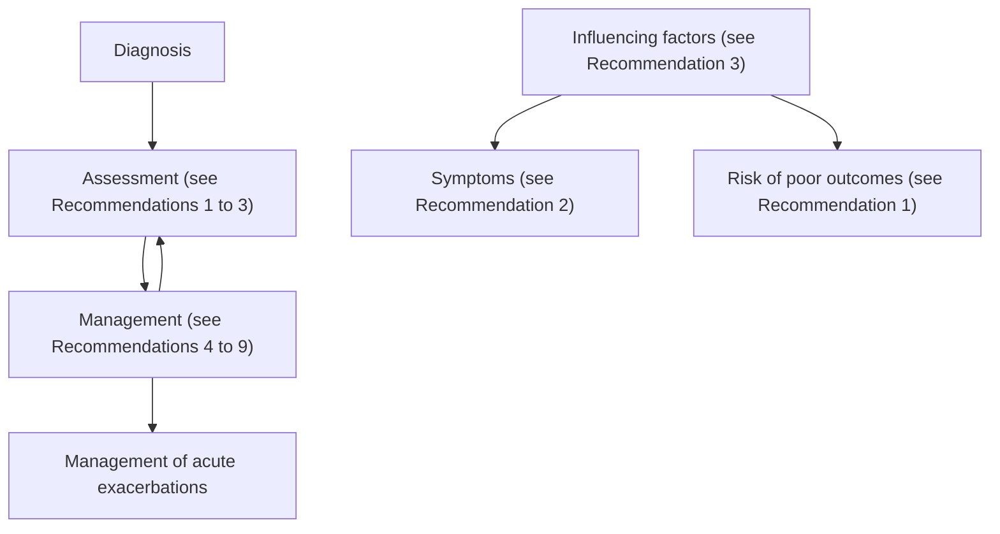

<!-- cpg_id: asthma-management-(nov-2020) | phase4 deterministic | spine: Overview, Asthma assessment, Asthma management, Patient education, References -->
<!-- meta | source: ACE CLINICAL GUIDANCE | published: Published: 15 October 2020 | url: www.ace-hta.gov.sg | title: Asthma. Optimising long-term management with inhaled corticosteroid -->


## Overview

```yaml
cpg_id: asthma-management-(nov-2020)
chunk_id: asthma-management-(nov-2020).overview.prose.01
chunk_type: prose
section_id: overview
parent_rec: null
title: "Definitions and scope of application"
source_pages: [1, 2]
strength: null
tables_referenced: []
figures_referenced: []
url_links: []
cross_refs: []
review_flags:
  - contains_conditional_language
```

Illustration of a human esophagus with visible blood vessels and a yellow internal organ (no text or labels)

X-ray illustration of human lungs showing bronchial structures and vascular patterns (no text or labels)

### Objective

To advance appropriate management of asthma

### Scope

Clinical assessment, pharmacological treatment, and non-pharmacological strategies for managing asthma over the long term

### Target audience

This clinical guidance is relevant to all healthcare professionals caring for patients with asthma, especially those in primary care

### Background

Asthma is one of the most common chronic respiratory conditions seen in primary care in Singapore. Around 5\% of residents in Singapore aged 18 to 69 years have asthma. About 1 in 3 patients with asthma aged 12 years and older in Singapore report exacerbations in the past year, and about 1 in 2 have missed work or school due to asthma in the past year. The impact of asthma locally is also reflected in hospital admissions, with Singapore's asthma hospital admission rates being higher than countries in the Organisation for Economic Co-operation and Development (OECD).

Risk of exacerbations and other poor asthma outcomes, such as hospital admissions, can be reduced with preventer (or controller) medications, particularly inhaled corticosteroid (ICS)—the mainstay of long-term asthma management.   Despite wide availability of ICS, use of preventers in Singapore is the lowest among eight countries in the Asia-Pacific region, with only 1 in 4 patients with asthma aged 12 years and older using a preventer in the past month.   Locally, one third of patients with a severe asthma exacerbation requiring mechanical ventilation or intensive care unit (ICU) admission were not on ICS prior to the exacerbation.

To reduce the impact of asthma in Singapore, more optimal ICS use as part of long-term management is needed.

### Statement of Intent

This ACE Clinical Guidance (ACG) provides concise, evidence-based recommendations and serves as a common starting point nationally for clinical decision-making. It is underpinned by a wide array of considerations contextualised to Singapore, based on best available evidence at the time of development. The ACG is not exhaustive of the subject matter and does not replace clinical judgement. The recommendations in the ACG are not mandatory, and the responsibility for making decisions appropriate to the circumstances of the individual patient remains at all times with the healthcare professional.

College of Family Physicians Singapore

### Management goal for asthma

Although asthma is a chronic condition, it typically manifests as episodic symptoms with variable expiratory airflow limitation. Asthma symptoms include shortness of breath, cough, wheeze, and chest tightness, which tend to vary over time in frequency or intensity.

The underlying pathophysiology of asthma is characterised by chronic airway inflammation, rendering the airways more susceptible to a variety of stimuli that may trigger bronchoconstriction (hyper-responsiveness), leading to asthma symptoms. However, the degree of chronic airway inflammation does not always correlate with the extent of symptoms.

Without adequate long-term management, asthma may result in poor outcomes including exacerbations,   hospital admissions, fixed airflow limitation, and in some cases, even death. The management goal for asthma is to prevent or minimise symptoms and reduce risk of poor outcomes.

To achieve the management goal, this heterogeneous condition should be addressed in totality, including comprehensive clinical assessment (see section “Asthma assessment” below) and personalised management (see section “Asthma management” starting on page 4).

---


## Asthma assessment

```yaml
cpg_id: asthma-management-(nov-2020)
chunk_id: asthma-management-(nov-2020).asthma_assessment.recommendation.01
chunk_type: recommendation
section_id: asthma_assessment
parent_rec: null
title: "Recommendation 1"
source_pages: [2]
strength: strong
tables_referenced: []
figures_referenced:
  - Figure 1. Overall approach to asthma assessment and management over the long term
url_links: []
cross_refs: []
review_flags:
  - contains_conditional_language
```

**Recommendation 1**

Regularly assess asthma symptoms and risk of poor asthma outcomes, including factors that can influence these.

Asthma assessment over the long term is to evaluate the patient in relation to the management goal, and therefore encompasses assessment of both symptoms and risk of poor outcomes (see Figure 1).

While more frequent or intense asthma symptoms are associated with higher risk of poor asthma outcomes (including exacerbations and hospital admissions), such risk may still exist even if the patient reports minimal symptoms.   Factors other than symptoms that can affect risk of poor asthma outcomes include adherence to treatment, inhaler technique, lung function, and relevant comorbidities. Some of these factors can also worsen asthma symptoms (see Figure 1).

Consequently, symptoms as well as factors known to influence symptoms or risk of poor outcomes (influencing factors) should be assessed.

---

```yaml
cpg_id: asthma-management-(nov-2020)
chunk_id: asthma-management-(nov-2020).asthma_assessment.figure.01
chunk_type: figure
section_id: asthma_assessment
parent_rec: asthma-management-(nov-2020).asthma_assessment.recommendation.01
title: "Figure 1. Overall approach to asthma assessment and management over the long term"
source_pages: [2]
strength: null
reconstructed_from: mermaid
image_dir: grouped_p2_fig_01.jpg
url_links: []
cross_refs: []
review_flags: []
```

**Figure 1. Overall approach to asthma assessment and management over the long term**



---

```yaml
cpg_id: asthma-management-(nov-2020)
chunk_id: asthma-management-(nov-2020).asthma_assessment.recommendation.02
chunk_type: recommendation
section_id: asthma_assessment
parent_rec: null
title: "Recommendation 2"
source_pages: [3]
strength: strong
tables_referenced:
  - Table 2. Risk factors for more severe asthma outcomes that can be readily assessed clinically
figures_referenced: []
url_links: []
cross_refs: []
review_flags:
  - contains_conditional_language
```

**Recommendation 2**

Consider using a validated questionnaire to assess asthma symptoms.

Aspects of asthma symptom assessment include:

- Frequency and intensity of daytime and night-time symptoms

- Frequency of reliever use for symptom relief (excluding pre-exercise use for symptom prevention)

- Ability to carry out daily activities

In addition to broad questions such as “How is your asthma?”, use specific questions like “Over the past four weeks, how many times did you have asthma symptoms at night?”. Specific questions are often used in validated questionnaires  for asthma symptom assessment.

### Peak expiratory flow (PEF)

PEF is a simple, self-administered objective measure of expiratory airflow limitation. Consider PEF for patients prone to underperceiving symptoms (such as adolescents, patients who have comorbidities with symptoms similar to asthma, elderly patients), or those likely to overperceive them (such as anxious patients).

Examples of such questionnaires   include the Asthma Control Questionnaire (ACQ),   the Asthma Control Test (ACT),   the Royal College of Physicians Three Questions,   the Pharmacy Asthma Control Screening Tool,   and the Childhood Asthma Control Test (C-ACT) for patients aged 4 to 11 years.

Consider reviewing asthma management when symptoms are frequent (for example, an average of more than twice a week), when they affect the patient's ability to carry out daily activities or rest at night, or when there is a change in usual number or intensity of symptoms.

When choosing an asthma symptom assessment questionnaire  for children aged 0 to 5 years, select one developed especially for this age group or their caregivers, such as the Test for Respiratory and Asthma Control in Kids (TRACK).

Some of the factors captured in BREATHE are associated with more severe asthma outcomes (such as severe exacerbations or mortality). Listed in Table 2 below are such factors that can be readily assessed clinically.

---

```yaml
cpg_id: asthma-management-(nov-2020)
chunk_id: asthma-management-(nov-2020).asthma_assessment.recommendation.03
chunk_type: recommendation
section_id: asthma_assessment
parent_rec: null
title: "Recommendation 3"
source_pages: [3]
strength: strong
tables_referenced: []
figures_referenced: []
url_links: []
cross_refs: []
review_flags: []
```

**Recommendation 3**

Assess factors influencing asthma symptoms or risk of poor asthma outcomes. These can be remembered with the acronym BREATHE.

Several factors are known to worsen asthma symptoms or risk of poor asthma outcomes. The BREATHE acronym below is an easy and comprehensive way to remember these influencing factors.

---

```yaml
cpg_id: asthma-management-(nov-2020)
chunk_id: asthma-management-(nov-2020).asthma_assessment.table.01
chunk_type: table
section_id: asthma_assessment
parent_rec: asthma-management-(nov-2020).asthma_assessment.recommendation.03
title: "Table 1. BREATHE factors for asthma assessment"
source_pages: [3]
strength: null
image_dir: 7b1a2aaf148b1509bc449cb2eafbca1fc1f2dac3e84f43c4eb1a681967b4c2dd.jpg
url_links: []
cross_refs: []
review_flags: []
```

**Table 1. BREATHE factors for asthma assessment**

<table><tr><td>B</td><td>eliefs, knowledge, and attitudes</td><td>Assess possible misconceptions about asthma and its management, including understanding of asthma as a chronic condition, the management goal, and role of preventers and relievers.<eq>^{26}</eq></td></tr><tr><td>R</td><td>ecent asthma treatment</td><td>Identify patients with suboptimal treatment, such as those not on ICS or those using SABA often.<eq>^{9,27}</eq></td></tr><tr><td>E</td><td>effects of asthma</td><td>Assess extent of asthma effects, including current effects such as reduced quality of life or productivity, and past effects such as an exacerbation over the past year, or history of intubation or admission to ICU for asthma.<eq>^{28}</eq></td></tr><tr><td>A</td><td>dherence</td><td>Identify patients with suboptimal adherence to asthma treatment and patients with incorrect inhaler technique.<eq>^{29}</eq></td></tr><tr><td>T</td><td>riggers</td><td>Evaluate asthma triggers (for example, dust or occupational exposures) to identify those potentially avoidable, such as cigarette smoking.<eq>^{26,30}</eq></td></tr><tr><td>H</td><td>istory of asthma</td><td>Review initial diagnosis (if needed) and the course of disease, including lung function and other relevant test findings (for example, <eq>FEV_1</eq>, <eq>FEV_1/FVC</eq>, or inflammatory biomarker levels), especially for patients in whom asthma symptoms persist or worsen despite appropriate management.</td></tr><tr><td>E</td><td>existing comorbidities or medications</td><td>Assess presence of comorbidities relevant for asthma, such as rhinitis, rhinosinusitis, obesity, obstructive sleep apnoea, GORD, asthma-COPD overlap, or mental health disorders.<eq>^{10}</eq> Also assess for medication interactions.</td></tr></table>

> *Footnote: COPD, chronic obstructive pulmonary disease; FEV  , forced expiratory volume in first second; FVC, forced vital capacity; GORD, gastro-oesophageal reflux disease; ICS, inhaled corticosteroid; ICU, intensive care unit; SABA, short-acting beta   agonist*

> *Footnote: Some of these questionnaires are protected by copyright and require a licensing fee to use.*

---

```yaml
cpg_id: asthma-management-(nov-2020)
chunk_id: asthma-management-(nov-2020).asthma_assessment.table.02
chunk_type: table
section_id: asthma_assessment
parent_rec: asthma-management-(nov-2020).asthma_assessment.recommendation.03
title: "Table 2. Risk factors for more severe asthma outcomes that can be readily assess"
source_pages: [4]
strength: null
image_dir: 2a6ed6e641875009a7ebc5a09b396ab8d7ee6d9da24ce2c17e26091b42d329be.jpg
url_links: []
cross_refs: []
review_flags: []
```

**Table 2. Risk factors for more severe asthma outcomes that can be readily assessed clinically**

<table><tr><td>Consider prioritising these when assessing factors influencing asthma symptoms or risk of poor asthma outcomes:</td></tr><tr><td>No preventer treatment, or finishing ≥1 canisters of SABA in ≤2 months</td></tr><tr><td>Suboptimal ICS use</td></tr><tr><td>History of intubation or admission to ICU because of asthma</td></tr><tr><td>One or more exacerbations over the past year</td></tr><tr><td>Cigarette smoking (current or past), or current exposure to secondhand smoke</td></tr></table>

> *Footnote: ICS, inhaled corticosteroid; ICU, intensive care unit; SABA, short-acting beta  agonist*

---


## Asthma management

```yaml
cpg_id: asthma-management-(nov-2020)
chunk_id: asthma-management-(nov-2020).asthma_management.prose.01
chunk_type: prose
section_id: asthma_management
parent_rec: null
title: "Asthma management overview"
source_pages: [4]
strength: null
tables_referenced: []
figures_referenced: []
url_links: []
cross_refs: []
review_flags: []
```

Long-term asthma management involves personalising both pharmacological treatment and non-pharmacological strategies according to the patient's needs as reflected in the assessment findings. In particular, it targets chronic airway inflammation and BREATHE factors where applicable, to achieve the management goal of preventing or minimising symptoms and reducing risk of poor outcomes.

In addition to management strategies outlined in this section, offer influenza and pneumococcal vaccination to patients with asthma, consistent with the National Adult Immunisation Schedule and the National Childhood Immunisation Schedule.

---

```yaml
cpg_id: asthma-management-(nov-2020)
chunk_id: asthma-management-(nov-2020).asthma_management.prose.02
chunk_type: prose
section_id: asthma_management
parent_rec: null
title: "Pharmacological treatment"
source_pages: [4]
strength: null
tables_referenced: []
figures_referenced: []
url_links: []
cross_refs: []
review_flags: []
```

Pharmacological treatment for asthma encompasses preventers and relievers.

---

```yaml
cpg_id: asthma-management-(nov-2020)
chunk_id: asthma-management-(nov-2020).asthma_management.recommendation.04
chunk_type: recommendation
section_id: asthma_management
parent_rec: null
title: "Recommendation 4"
source_pages: [4]
strength: strong
tables_referenced: []
figures_referenced: []
url_links: []
cross_refs: []
review_flags:
  - contains_conditional_language
  - contains_dosing_information
```

**Recommendation 4**

Use inhaled corticosteroid as the mainstay of long-term asthma management.

Inhaled corticosteroid (ICS) addresses airway inflammation and is the most effective treatment to achieve the management goal for asthma. It reduces poor asthma outcomes in the long term, including exacerbations and mortality.   Benefits of ICS have been observed at low doses even in patients with infrequent or minor asthma symptoms.

Some patients or caregivers may be reluctant to use ICS as they believe it may result in adverse effects similar to those with oral corticosteroid (OCS). Proactively address this misconception and educate them regarding risk of adverse effects with ICS, which is much lower than with OCS. Consider the following general suggestions and measures to minimise risk of adverse effects associated with ICS:

- Optimise inhaler technique to minimise systemic medication absorption

- Advise patients to rinse their mouth after ICS use and to use a spacer if appropriate, to reduce topical adverse effects

- Use the lowest effective ICS dose. If treatment needs to be increased, consider adding another agent, such as a long-acting beta agonist (LABA) or a leukotriene receptor antagonist (LTRA), rather than increasing the ICS dose. If not possible to avoid long-term daily high-dose ICS, monitor patients closely for adverse effects and consider specialist referral

---

```yaml
cpg_id: asthma-management-(nov-2020)
chunk_id: asthma-management-(nov-2020).asthma_management.recommendation.05
chunk_type: recommendation
section_id: asthma_management
parent_rec: null
title: "Recommendation 5"
source_pages: [4]
strength: strong
tables_referenced: []
figures_referenced:
  - Figure 2. Stepwise approach to asthma pharmacological treatment
url_links: []
cross_refs: []
review_flags: []
```

**Recommendation 5**

For patients aged 6 years and older, do not use short-acting beta  agonist alone (without a preventer) to treat asthma long term.

Short-acting beta  agonist (SABA) does not address airway inflammation. Compared to patients using an ICS-containing treatment as the preventer with SABA as the reliever, those relying on SABA alone (without a preventer) are more likely to experience poor asthma outcomes, such as need for OCS, emergency department visits, or hospital admissions.

### Important change in asthma management

The recommendation not to use SABA alone (without a preventer) for the long-term treatment of patients aged 6 years and older, even those with infrequent or minor symptoms, is the most significant change in asthma management recently. SABA is still recommended for short-term relief of symptoms as needed (see Figure 2 on page 6).

---

```yaml
cpg_id: asthma-management-(nov-2020)
chunk_id: asthma-management-(nov-2020).asthma_management.recommendation.06
chunk_type: recommendation
section_id: asthma_management
parent_rec: null
title: "Recommendation 6"
source_pages: [5, 6]
strength: strong
tables_referenced: []
figures_referenced:
  - Figure 2. Stepwise approach to asthma pharmacological treatment
url_links: []
cross_refs: []
review_flags:
  - contains_conditional_language
  - contains_dosing_information
```

**Recommendation 6**

Use a stepwise approach when selecting or adjusting preventer treatment for asthma (see Figure 2 on page 6).

A patient with well-managed asthma would, ideally, have no symptoms. While this may not always be feasible, long-term asthma management, including pharmacological treatment, should be aimed at preventing symptoms from occurring. Preventer treatment does so by addressing chronic airway inflammation. The decision regarding choice or adjustment of preventer treatment is mainly guided by asthma symptoms, risk of poor asthma outcomes, and presence of BREATHE factors. As part of the decision-making, practical considerations include the patient's ability to use the inhaler correctly, concerns about using ICS, and inhaler cost. Preventers registered for asthma in Singapore are listed in the Appendix.

Across the asthma treatment steps overall (see Figure 2 on page 6), daily ICS-containing treatment is the most effective preventer option at preventing or minimising asthma symptoms, and has the most evidence available—including long-term benefits on exacerbations and mortality.   Daily ICS-containing treatment is particularly important for patients at higher risk of poor asthma outcomes (for example, those with frequent or intense symptoms, or those with multiple BREATHE factors, as described in Recommendation 2 and Recommendation 3 starting on page 3).

Depending on individual patient circumstances, including treatment adherence, as-needed ICS-containing treatment could be a suitable option in Step 1–2. However, reliance on a solely symptom-driven approach may limit the achievement of the management goal for asthma, and may render adjustment to daily treatment more difficult if this is required.

### STARTING PREVENTER TREATMENT

ICS-naïve patients usually respond well to initial ICS treatment with daily low-dose ICS. A higher step could be used for initial treatment as necessary, for example for patients with frequent or intense symptoms, those who had an exacerbation over the past year, those with relevant comorbidities, or smokers.

### STEPPING UP

Consider stepping up the preventer treatment for patients who still have frequent or intense symptoms, and based on risk of poor outcomes (especially if particular BREATHE factors are present, such as an exacerbation over the past year), after assessing adherence and inhaler technique. Options for stepping up within the same step or by moving up steps include:

- Increasing the ICS frequency (for example, from once to twice daily)

- Adding another medication (for example, LABA or LTRA)

- Increasing to a higher ICS dose category (for example, from medium to high dose)

### STEPPING DOWN

Consider gradually stepping down the preventer treatment to the lowest effective dose once symptoms are well managed for at least 3 to 6 months, and based on risk of poor outcomes, including choice of a suitable time for stepping down (for example, not stepping down in times of higher exacerbation risk such as during illness, allergy season, pregnancy, period of travel or high stress). Options for stepping down include:

- Decreasing the ICS dose gradually by 25 to  every three months (for example, switching patients from twice daily low-dose ICS to once daily counts as a  reduction in dose)

- Removing a medication (for example, LABA or LTRA) from combination treatment with ICS

For patients diagnosed with asthma aged 6 years and older, stopping ICS altogether is not recommended as this is associated with increased risk of exacerbations. Discuss with the patient or caregiver potential benefits and risks of adjusting the preventer treatment. Monitor patients closely after any treatment change. If asthma worsens after stepping down, resume the previous dose. If the patient's condition is not improving after stepping up, consider other management options—including specialist referral.

Regularly assess children aged 0 to 5 years to evaluate the need for ongoing ICS. Consider discontinuing ICS when appropriate (see Figure 2 on page 6), and monitor these patients closely.

Patient education

---

```yaml
cpg_id: asthma-management-(nov-2020)
chunk_id: asthma-management-(nov-2020).asthma_management.figure.01
chunk_type: figure
section_id: asthma_management
parent_rec: asthma-management-(nov-2020).asthma_management.recommendation.06
title: "Figure 2. Stepwise approach to asthma pharmacological treatment"
source_pages: [6]
strength: null
reconstructed_from: table
image_dir: grouped_p6_fig_01.jpg
url_links: []
cross_refs: []
review_flags: []
```

**Figure 2. Stepwise approach to asthma pharmacological treatment**

| Age | Treatment Category | Step 1–2 | Step 3 | Step 4 (consider specialist referral) | Step 5 (refer to a specialist) |
| :--- | :--- | :--- | :--- | :--- | :--- |
| **≥12 years** | **Preventer options** | **Daily:**<br>• Low-dose ICS<br>• LTRA<br><br>**As needed:**<br>• Low-dose ICS-formoterol<br>• Low-dose ICS whenever SABA is used | **Daily:**<br>• Low-dose ICS-LABA<br>• Low-dose ICS + LTRA<br>• Medium-dose ICS<br><br>**MART:**<br>• Daily low-dose ICS-formoterol + as-needed low-dose ICS-formoterol | **Daily:**<br>• Medium-dose ICS-LABA<br>• Medium-dose ICS + LTRA<br>• High-dose ICS<br><br>**Possible adjustments to daily preventer options above:**<br>• Add LTRA to medium-dose ICS-LABA or high-dose ICS<br>• Increase to high-dose ICS-LABA or high-dose ICS + LTRA<br>• Add tiotropium<br><br>**MART:**<br>• Daily medium-dose ICS-formoterol + as-needed low-dose ICS-formoterol<br><br>**Possible adjustments to MART above:**<br>• Add LTRA to daily medium-dose ICS-formoterol<br>• Add tiotropium to daily medium-dose ICS-formoterol | Continue treatment as per Step 4 and consider add-on treatment with biologic agent for asthma, or low-dose OCS |
| | **Reliever** | As-needed SABA inhaler (as-needed ICS-formoterol is the reliever if this option is chosen in Step 1–2, or if MART is chosen in Step 3 or above) | | | |
| **6–11 years** | **Preventer options** | **Daily:**<br>• Low-dose ICS<br>• LTRA<br><br>**As needed:**<br>• Low-dose ICS whenever SABA is used | **Daily:**<br>• Low-dose ICS-LABA<br>• Low-dose ICS + LTRA<br>• Medium-dose ICS<br><br>**MART:**<br>• Daily low-dose ICS-formoterol + as-needed low-dose ICS-formoterol | **Daily:**<br>• Medium-dose ICS-LABA<br>• Medium-dose ICS + LTRA<br><br>**Possible adjustments to daily preventer options above:**<br>• Add LTRA to medium-dose ICS-LABA<br>• Increase to high-dose ICS-LABA or high-dose ICS + LTRA<br>• Add tiotropium | Continue treatment as per Step 4 and consider add-on treatment with biologic agent for asthma, or low-dose OCS |
| | **Reliever** | As-needed SABA inhaler (as-needed ICS-formoterol is the reliever if MART is chosen in Step 3) | | | |
| **0–5 years** | **Preventer options** | **Step 1–2:**<br>Consider specialist referral<br><br>**Daily:**<br>• Low-dose ICS<br>• LTRA | **Step 3:**<br>Consider specialist referral<br><br>**Daily:**<br>• Double low-dose ICS<br>• Low-dose ICS + LTRA<br>• If on LTRA in Step 1–2, switch to low-dose ICS | **Step 4:**<br>Refer to a specialist | **Step 5:**<br>Refer to a specialist |
| | **Reliever** | As-needed SABA inhaler | | | |
| **0–5 years** | **Long-term SABA alone** | In children aged 0 to 5 years, long-term treatment with SABA alone (without a preventer) for asthma could be used only if the child fulfills all of the following criteria:<br>• No history of ICU admission or intubation for asthma<br>• No more than 3 exacerbations over the past year<br>• Normal lung function test over the past year (if available)<br>• No night awakening due to asthma over the past 4 weeks<br>• No exercise limitations due to asthma over the past 4 weeks<br>• Asthma symptoms no more than once over the past 4 weeks<br>• SABA used no more than once over the past 4 weeks<br><br>When one or more criteria above are not met, start or continue the child on preventer treatment. | | | |

**Footnotes & Definitions:**
*   **ICS:** inhaled corticosteroid
*   **ICU:** intensive care unit
*   **LABA:** long-acting beta agonist
*   **LTRA:** leukotriene receptor antagonist
*   **MART:** maintenance and reliever therapy
*   **OCS:** oral corticosteroid
*   **SABA:** short-acting beta agonist
*   Preventer options are listed in no particular order within each treatment step. Black bolding denotes preventer options with the most evidence available. Refer to the Appendix for ICS dose categories (low, medium, high). The steps are not scaled to proportion of patients expected to be on each step.
*   **a:** Please refer to the Health Sciences Authority (HSA) Drug Safety Information No. 71 "Advisory on restriction on the use of montelukast and neuropsychiatric effects".
*   **b:** Locally registered: budesonide-formoterol.
*   **c:** Off-label; ICS and SABA are only available locally as separate inhalers.
*   **d:** Locally registered: budesonide-formoterol for patients aged 12 years and older; beclomethasone-formoterol for patients aged 18 years and older.
*   **e:** Locally registered: omalizumab (anti-immunoglobulin E) for patients aged 6 years and older with severe persistent allergic asthma; mepolizumab (anti-interleukin-5) for patients aged 12 years and older with severe eosinophilic asthma; benralizumab (anti-interleukin-5) for patients aged 18 years and older with severe eosinophilic asthma; dupilumab (anti-interleukin-4 receptor alpha) not locally registered for asthma (approved by U.S. Food and Drug Administration (FDA) and European Medicines Agency (EMA) for patients aged 12 years and older with asthma).
*   **f:** Off-label for patients aged less than 12 years; published trial on budesonide-formoterol included patients aged 6-11 years.

> *Footnote: ICS, inhaled corticosteroid; ICU, intensive care unit; LABA, long-acting beta  agonist; LTRA, leukotriene receptor antagonist; MART, maintenance and reliever therapy; OCS, oral corticosteroid; SABA, short-acting beta  agonist*

> *Footnote: Preventer options are listed in no particular order within each treatment step. Black bolding denotes preventer options with the most evidence available. Refer to the Appendix for ICS dose categories (low, medium, high). The steps are not scaled to proportion of patients expected to be on each step.*

> *Footnote: a Please refer to the Health Sciences Authority (HSA) Drug Safety Information No. 71 "Advisory on restriction on the use of montelukast and neuropsychiatric effects".*

> *Footnote: b Locally registered: budesonide-formoterol.*

> *Footnote: c Off-label; ICS and SABA are only available locally as separate inhalers.*

> *Footnote: d Locally registered: budesonide-formoterol for patients aged 12 years and older; beclomethasone-formoterol for patients aged 18 years and older.*

> *Footnote: e Locally registered: omalizumab (anti-immunoglobulin E) for patients aged 6 years and older with severe persistent allergic asthma; mepolizumab (anti-interleukin-5) for patients aged 12 years and older with severe eosinophilic asthma; benralizumab (anti-interleukin-5) for patients aged 18 years and older with severe eosinophilic asthma; dupilumab (anti-interleukin-4 receptor not locally registered for asthma (approved by U.S. Food and Drug Administration (FDA) and European Medicines Agency (EMA) for patients aged 12 years and older with asthma).*

> *Footnote: f Off-label for patients aged less than 12 years; published trial on budesonide-formoterol included patients aged 6-11 years.*

---


## Patient education

```yaml
cpg_id: asthma-management-(nov-2020)
chunk_id: asthma-management-(nov-2020).patient_education.recommendation.07
chunk_type: recommendation
section_id: patient_education
parent_rec: null
title: "Recommendation 7"
source_pages: [7]
strength: strong
tables_referenced: []
figures_referenced:
  - Figure 3. Key components of asthma patient education
url_links: []
cross_refs: []
review_flags:
  - contains_conditional_language
```

**Recommendation 7**

Educate all patients with asthma or their caregivers on how to self-manage.

Asthma patient education addresses some of the BREATHE factors, and has been shown to reduce asthma-related days off work or school, unscheduled clinic visits, emergency department visits, and hospital admissions.   It also improves quality of life in patients with asthma.   Although usually delivered at diagnosis, consider reinforcing some or all key components of asthma patient education (see Figure 3 below) as informed by findings of asthma assessment or when adjusting preventer treatment.

---

```yaml
cpg_id: asthma-management-(nov-2020)
chunk_id: asthma-management-(nov-2020).patient_education.figure.01
chunk_type: figure
section_id: patient_education
parent_rec: asthma-management-(nov-2020).patient_education.recommendation.07
title: "Figure 3. Key components of asthma patient education"
source_pages: [7]
strength: null
reconstructed_from: table
image_dir: grouped_p7_fig_01.jpg
url_links: []
cross_refs: []
review_flags: []
```

**Figure 3. Key components of asthma patient education**

**Figure 3. Key Components of Asthma Patient Education**

| Component | Details |
|---|---|
| **Share information on:** | • Asthma as a chronic condition<br>• Role of preventers and relievers |
| **Teach how to:** | • Use the inhaler correctly (with spacer if needed)<br>• Recognise worsening asthma |
| **Emphasise the importance of adherence to:** | • Asthma treatment<br>• Follow-up |
| **Provide a written asthma action plan to all patients** | • Individualised WAAP includes details of usual asthma medications<br>• Instructions on how to recognise worsening asthma<br>• Actions to take (increasing ICS dose, using OCS, getting emergency help) |

**Non-Pharmacological Aspects**
• Smoking cessation
• Trigger avoidance
• Healthy eating
• Physical activity
• Weight loss
• Breathing exercises (for patients prone to hyperventilation)

**Table 3. Frequency of Follow-up for Patients with Asthma**

| Condition | Follow-up Frequency |
|---|---|
| After an exacerbation | Within 1 to 2 weeks |
| After starting or adjusting treatment | Within 1 to 3 months |
| Patients at higher risk of poor outcomes | Every 1 to 3 months |
| All patients | At least twice a year |

**Recommendation 9. Referral to a Specialist**

| Criteria | Details |
|---|---|
| Inadequate response | Persistent or worsening symptoms despite stepped up preventer treatment and BREATHE factors addressed |
| High dose/biologic | Needing medium to high doses of ICS-containing treatment, or biologic agent |
| Age | Children with asthma aged 0 to 5 years |
| Specific groups | Occupational asthma, pregnant patients, elderly patients, athletes |
| Uncertain diagnosis | Patients in whom the asthma diagnosis is uncertain |

---


## References

```yaml
cpg_id: asthma-management-(nov-2020)
chunk_id: asthma-management-(nov-2020).references.reference.01
chunk_type: reference
section_id: references
parent_rec: null
title: "References"
source_pages: [8]
strength: null
tables_referenced: []
figures_referenced: []
url_links: []
cross_refs: []
review_flags: []
```

Scan the QR code for the reference list to this clinical guidance

### Expert group

### Co-chairpersons

Clin A/Prof Mariko Koh Siyue, Respiratory and Critical Care Medicine (SGH)

Adj Asst Prof Tan Tze Lee, Family Medicine (The Edinburgh Clinic)

#### Members

Dr Ang Joo Shiang, Emergency Medicine (TTSH)

Prof Chay Oh Moh, Respiratory Medicine (KKH)

Ms Joy Chong, Pharmacy (Watson's Personal Care Stores Pte Ltd)

Dr Choo Xue Ning, Respiratory and Critical Care Medicine (CGH)

Dr Agnes Koong Ying Leng, Family Medicine (SHP)

Mr Ong Kheng Yong, Pharmacy (SGH)

Dr Phua Huei Wen Daryl, Family Medicine (NUP)

Ms Lathy Prabhakaran, Nursing (TTSH)

Ms See Chue Win, Nursing (SHP)

Ms Chioh Mei Suang, Nursing (AIC)

Dr Tan Teck Jack, General Medicine (Northeast Medical Group)

Dr Ronnie Tan Voon Shiong, Internal Medicine (NTFGH)

Dr Jenny Tang Poh Lin, Paediatrics (SBCC Asthma Lung Sleep Allergy and Paediatric Centre)

A/Prof Tang Wern Ee, Family Medicine (NHGP)

Dr Michael Wong Wen Yao, Family Medicine (Raffles Medical Group)

### About the Agency

The Agency for Care Effectiveness (ACE) was established by the Ministry of Health (Singapore) to drive better decision-making in healthcare by conducting health technology assessments (HTA), publishing healthcare guidance and providing education. ACE develops ACE Clinical Guidances (ACGs) to inform specific areas of clinical practice. ACGs are usually reviewed around five years after publication, or earlier, if new evidence emerges that requires substantive changes to the recommendations. To access this ACG online, along with other ACGs published to date, please visit www.ace-hta.gov.sg/acg

Find out more about ACE at www.ace-hta.gov.sg/about-us

### © Agency for Care Effectiveness, Ministry of Health, Republic of Singapore

All rights reserved. Reproduction of this publication in whole or in part in any material form is prohibited without the prior written permission of the copyright holder. Application to reproduce any part of this publication should be addressed to: ACE_HTA@moh.gov.sg

#### Suggested citation:

Agency for Care Effectiveness (ACE). Asthma – optimising long-term management with inhaled corticosteroid. ACE Clinical Guidance (ACG), Ministry of Health, Singapore. 2020. Available from: go.gov.sg/acg-asthma-optimising-long-term-management-with-inhaled-corticosteroid

The Ministry of Health, Singapore disclaims any and all liability to any party for any direct, indirect, implied, punitive or other consequential damages arising directly or indirectly from any use of this ACG, which is provided as is, without warranties.

---
