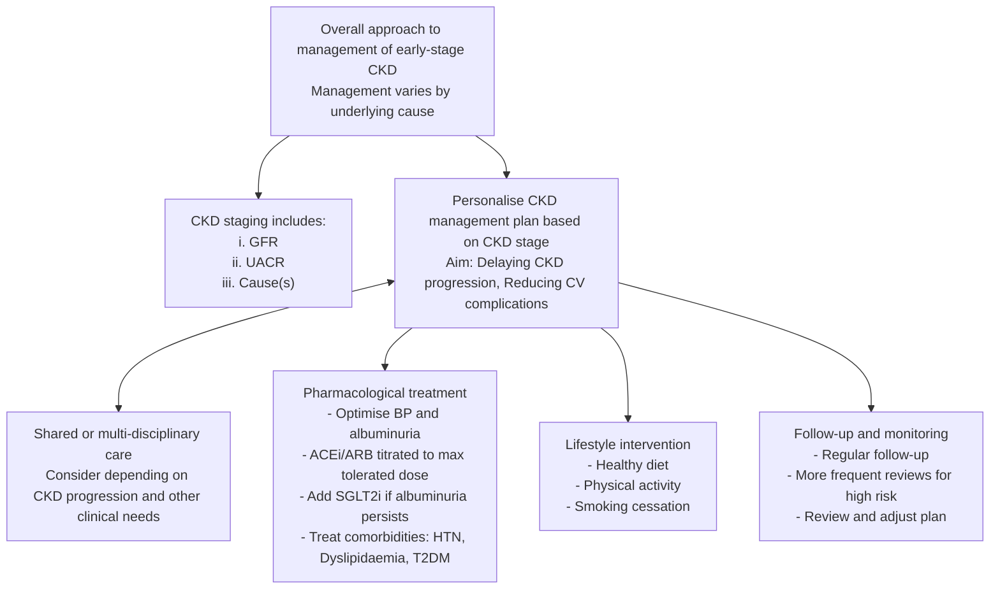

<!-- cpg_id: ckd--management-(october-2023) | phase4 deterministic | spine: Overview, Overall approach to management of CKD, Pharmacological treatment, Treatment considerations depending on comorbidities, Important considerations for medication prescribing in patients with CKD, Follow-up and monitoring, References -->
<!-- meta | source: ACE CLINICAL GUIDANCE | published: Published: 27 October 2023 | url: www.ace-hta.gov.sg | title: Chronic kidney disease. Delaying progression and reducing cardiovascular complications -->


## Overview

```yaml
cpg_id: ckd--management-(october-2023)
chunk_id: ckd--management-(october-2023).overview.prose.01
chunk_type: prose
section_id: overview
parent_rec: null
title: "Definitions and scope of application"
source_pages: [1]
tables_referenced: []
figures_referenced: []
url_links: []
cross_refs: []
review_flags:
  - contains_conditional_language
```

Chronic
kidney
disease

Illustration of the human kidneys with surrounding health icons and no textual labels

### Objective

To enhance management of chronic kidney disease (CKD)

### Scope

Management of early-stage CKD  through pharmacotherapy and lifestyle intervention

### Target audience

This clinical guidance is relevant to all healthcare professionals caring for patients with CKD, such as those in primary care

### Background

Chronic kidney disease (CKD) is a major public health problem worldwide.   Patients with CKD have increased risk of cardiovascular (CV) complications such as coronary artery disease, heart failure, arrhythmia, or sudden cardiac death.   Furthermore, patients with commonly associated comorbidities such as hypertension, dyslipidaemia, or diabetes mellitus carry an even higher CV risk – underscoring the importance of optimised management of comorbidities and overall CV risk for all patients.

In Singapore, CKD prevalence among residents aged 18–74 years was 8.8% in 2019-2020.   This is estimated to triple by 2035, with CKD stages G1-2 accounting for most cases.   Locally, the number of people detected with CKD stages G1-2 had increased significantly during the last decade and their annual rate of decline in kidney function was also found to be higher compared to those in the later stages – highlighting the need for timely and effective management early. This ACG focuses on management of early-stage CKD to slow down disease progression and to reduce risk of renal and CV complications.

For the purpose of this ACG, “early-stage” denotes patients with CKD G1-3a and A1-A3.

### Statement of Intent

This ACE Clinical Guidance (ACG) provides concise, evidence-based recommendations and serves as a common starting point nationally for clinical decision-making. It is underpinned by a wide array of considerations contextualised to Singapore, based on best available evidence at the time of development. The ACG is not exhaustive of the subject matter and does not replace clinical judgement. The recommendations in the ACG are not mandatory, and the responsibility for making decisions appropriate to the circumstances of the individual patient remains at all times with the healthcare professional.

---


## Overall approach to management of CKD

```yaml
cpg_id: ckd--management-(october-2023)
chunk_id: ckd--management-(october-2023).overall_approach_to_management_of_ckd.recommendation.01
chunk_type: recommendation
section_id: overall_approach_to_management_of_ckd
parent_rec: null
title: "Recommendation 1"
source_pages: [2]
tables_referenced: []
figures_referenced:
  - Figure 1. Overview of management of early-stage CKD
url_links: []
cross_refs: []
review_flags:
  - contains_conditional_language
```

**Recommendation 1:** Personalise the management plan based on CKD stage, including underlying cause.

CKD staging is based on three main components: GFR, UACR, and cause(s) such as other renal structural abnormalities. Collectively, these quantitative (GFR and UACR) and qualitative (cause) components of CKD staging provide essential information to determine the patient's prognosis and guide appropriate management.

For example, management of CKD may differ in patients with same GFR and albuminuria categories if the underlying cause is different. Similarly, the rate of CKD progression (i.e. the decline in GFR or worsening albuminuria),  risk of progression to end-stage renal disease (ESRD), and CV risk may differ depending on underlying causes or risk factors. Therefore, the assessment and management of underlying cause(s) and risk factor(s) is key to optimising and personalising each patient's treatment. See the ACG “Chronic kidney disease – early detection” for more details. Figure 1 provides an overview of management principles for patients with early-stage CKD, based on relevant comorbidities.

---

```yaml
cpg_id: ckd--management-(october-2023)
chunk_id: ckd--management-(october-2023).overall_approach_to_management_of_ckd.figure.01
chunk_type: figure
section_id: overall_approach_to_management_of_ckd
parent_rec: ckd--management-(october-2023).overall_approach_to_management_of_ckd.recommendation.01
title: "Figure 1. Overview of management of early-stage CKD"
source_pages: [2]
reconstructed_from: mermaid
image_dir: grouped_p2_fig_01.jpg
url_links: []
cross_refs: []
review_flags: []
```

**Figure 1. Overview of management of early-stage CKD**



---


## Pharmacological treatment

```yaml
cpg_id: ckd--management-(october-2023)
chunk_id: ckd--management-(october-2023).pharmacological_treatment.recommendation.02
chunk_type: recommendation
section_id: pharmacological_treatment
parent_rec: null
title: "Recommendation 2"
source_pages: [3]
tables_referenced:
  - Table 1. Monitoring and treatment considerations for ACE inhibitors or ARBs
figures_referenced: []
url_links: []
cross_refs: []
review_flags:
  - contains_conditional_language
  - contains_dosing_information
```

**Recommendation 2**

Optimise blood pressure control and albuminuria management with an ACE inhibitor or ARB, and titrate to maximum tolerated dose as needed.

Optimisation of blood pressure (BP) and albuminuria levels is a key management goal for patients with CKD to delay disease progression and reduce risk of CV complications.

Angiotensin-converting enzyme inhibitors (ACE inhibitors) and angiotensin II receptor blockers (ARBs) are the mainstay treatment options for patients with CKD and albuminuria, due to their beneficial effects in reducing the risk of major CV events and kidney failure.   The dose-dependent effects of these agents   mean they can be started at low doses and up-titrated according to the patients' need for BP control, and their albuminuria levels. This approach reduces the risk of possible side effects associated with high doses and improves patient compliance (See Supplementary Table 1: Dosing information of ACE inhibitors and ARBs for patients with early-stage CKD for recommended starting and maximum doses). While initiation with an ACE inhibitor or ARB may be accompanied by a decline in GFR, treatment need not be discontinued if the GFR decline is less than 25% from baseline.   However, if the eGFR decline is  >=25\% \)  from baseline, some of the follow-up actions can be found in Table 1 below.

### Combination of ACE inhibitors and ARBs

Combination of ACE inhibitors and ARBs is not recommended due to limited evidence on benefits and increased risk of adverse effects, such as hypotension and hyperkalaemia.

### Patient education

Provide patient education on home BP monitoring (if available), adequate oral hydration, low salt diet and avoidance of concurrent NSAIDs.

ACE inhibitor, angiotensin-converting enzyme inhibitor; ARB, angiotensin II receptor blocker; BP, blood pressure; NSAIDs, non-steroidal anti-inflammatory drugs; SBP, systolic blood pressure

*In this ACG, ‘GFR’ is used when referring to the overall filtration function of the kidneys, while ‘eGFR’ (estimated GFR) is used when presenting the test/test results or eGFR-based clinical indications.

Role of non-steroidal mineralocorticoid receptor antagonists (MRA) in patients with CKD and T2DM

Finerenone (a non-steroidal MRA) was found to improve composite cardiovascular and renal outcomes in patients with CKD and T2DM who have albuminuria despite maximum tolerated dose of ACE inhibitors or ARBs.

Currently, no head-to-head trials are available that compare finerenone and SGLT2 inhibitors. Indirect evidence from a network meta-analysis of trials evaluating finerenone and SGLT2 inhibitors with placebo favours SGLT2 inhibitors in reducing risk of kidney function progression  and hospitalisation for heart failure.

Limited evidence on the efficacy of finerenone compared to SGLT2 inhibitors, its relatively high cost and limited availability locally position finerenone only as a possible add-on therapy after SGLT2 inhibitor therapy in patients with CKD and T2DM who have persistent albuminuria. Monitoring of serum potassium (due to increased risk of hyperkalaemia) and renal function is recommended before and during treatment with finerenone.

---

```yaml
cpg_id: ckd--management-(october-2023)
chunk_id: ckd--management-(october-2023).pharmacological_treatment.table.01
chunk_type: table
section_id: pharmacological_treatment
parent_rec: ckd--management-(october-2023).pharmacological_treatment.recommendation.02
title: "Table 1. Monitoring and treatment considerations for ACE inhibitors or ARBs"
source_pages: [3]
url_links: []
cross_refs: []
review_flags: []
```

**Table 1. Monitoring and treatment considerations for ACE inhibitors or ARBs**

---

```yaml
cpg_id: ckd--management-(october-2023)
chunk_id: ckd--management-(october-2023).pharmacological_treatment.table.02
chunk_type: table
section_id: pharmacological_treatment
parent_rec: ckd--management-(october-2023).pharmacological_treatment.recommendation.02
title: "Monitoring of clinical features"
source_pages: [3]
image_dir: 6b60004c8f748e9dfacdd9ce81bb7110459f30e92c621bec2d97346318327ee9.jpg
url_links: []
cross_refs: []
review_flags:
  - contains_dosing_information
```

**Monitoring of clinical features**

<table><tr><td>Clinical feature to monitor</td><td>Follow-up actions</td></tr><tr><td>eGFR*, serum creatinine and potassium levels (for example within 2–4 weeks or as required).Closer monitoring may be required in patients who are at increased risk of acute kidney injury (AKI).</td><td>If eGFR decline is ≥25% from baseline upon initiation of ACE inhibitor/ARB,Cessation of ACE inhibitor/ARB therapy or shared care with a specialist may be needed (see Recommendation 7).If there is persistent hyperkalaemia despite dietary potassium restriction or &gt;30% increase in serum creatinine (at any point during therapy),Review the potential causes and treat accordingly.Dose adjustment or cessation of ACE inhibitor or ARB therapy may be required depending on the causes.</td></tr><tr><td>Side effects such as dry cough or angioedema.</td><td>If cough or angioedema develops while on ACE inhibitor therapy, Consider switching to ARB therapy.If other side effects affect adherence to treatment or other clinical concerns,Consider switching to another agent(s).</td></tr><tr><td>BP and symptoms related to hypotension.</td><td>If SBP is &lt;110 mmHg or symptomatic hypotension, Consider dose adjustment or cessation of anti-hypertensive agents (prioritise adjustment or cessation of non-ACE inhibitor/ARB therapy, if applicable).</td></tr></table>

---

```yaml
cpg_id: ckd--management-(october-2023)
chunk_id: ckd--management-(october-2023).pharmacological_treatment.recommendation.03
chunk_type: recommendation
section_id: pharmacological_treatment
parent_rec: null
title: "Recommendation 3"
source_pages: [4]
tables_referenced:
  - Table 2. eGFR levels and starting dose for SGLT2 inhibitors for patients with CKD
figures_referenced: []
url_links: []
cross_refs: []
review_flags:
  - contains_conditional_language
  - contains_dosing_information
```

**Recommendation 3**

Add an SGLT2 inhibitor to ACE inhibitor/ARB therapy for patients with CKD and persistent albuminuria, regardless of DM status.

Sodium-glucose co-transporter 2 inhibitors (SGLT2 inhibitors) have been shown to reduce risk of worsening kidney function, onset of kidney failure or death from renal causes,  with the added benefit of reducing the risk of CV events in patients with CKD.  Notably, these renal outcomes were observed in patients with or without concomitant diabetes mellitus (DM).

Important factors when considering SGLT2 inhibitors

For patients with CKD, the improvements in cardiorenal outcomes are independent of the glucose-lowering effects of an SGLT2 inhibitor. Guide the choice of medication and starting dose according to the patient's eGFR level (See Table 2 below). Reported side effects from SGLT2 inhibitors include increased risk of recurrent urinary or genitourinary tract infections, and increased risk of euglycaemic ketoacidosis. Absence of contraindications and a careful assessment of the benefit-risk balance can inform the decision to add an SGLT2 inhibitor for patients with CKD and persistent albuminuria, in light of individual patient circumstances. When adding an SGLT2 inhibitor to ACE inhibitor/ARB therapy, measure serum creatinine within 4 weeks of initiation if there are concerns of a higher risk of AKI, such as in patients on concurrent diuretic therapy, or in elderly patients.

GFR decline after initiation of SGLT2 inhibitors

An acute eGFR decline may occur at 2–4 weeks after initiation of an SGLT2 inhibitor. In the absence of haemodynamic instability or an alternate cause of AKI, the initial rise in serum creatinine of up to 30% is not associated with long-term kidney function loss, and treatment with SGLT2 inhibitors should not be discontinued.

---

```yaml
cpg_id: ckd--management-(october-2023)
chunk_id: ckd--management-(october-2023).pharmacological_treatment.table.03
chunk_type: table
section_id: pharmacological_treatment
parent_rec: ckd--management-(october-2023).pharmacological_treatment.recommendation.03
title: "Table 2. eGFR levels and starting dose for SGLT2 inhibitors for patients with CK"
source_pages: [4]
image_dir: 8ceec206676a919cd9116448e659a158b17d88ea886e824f86084f77eff8f8c3.jpg
url_links: []
cross_refs: []
review_flags:
  - contains_dosing_information
```

**Table 2. eGFR levels and starting dose for SGLT2 inhibitors for patients with CKD**

<table><tr><td></td><td>Canagliflozin</td><td>Dapagliflozin</td><td>Empagliflozin</td></tr><tr><td>eGFR level for initiation</td><td>eGFR ≥30 mL/min/1.73m2or CrCl ≥30 mL/min</td><td>eGFR ≥25 mL/min/1.73m2</td><td rowspan="3">eGFR ≥20 mL/min/1.73m2was used in the recent EMPA-KIDNEY trial with initial dose of 10 mg OD and included participants with or without T2DM.16Refer to product insert for updated information.</td></tr><tr><td>Starting dose</td><td>100 mg OD</td><td>5–10 mg OD</td></tr><tr><td>Registered indication</td><td>CKD and T2DM</td><td>CKD (+/- T2DM)</td></tr></table>

> *Footnote: CKD, chronic kidney disease; CrCl, creatinine clearance; eGFR, estimated glomerular filtration rate; EMPA-KIDNEY, The Study of Heart and Kidney Protection With Empagliflozin; OD, once daily; T2DM, type 2 diabetes mellitus*

---


## Treatment considerations depending on comorbidities

```yaml
cpg_id: ckd--management-(october-2023)
chunk_id: ckd--management-(october-2023).treatment_considerations_depending_on_comorbidities.recommendation.04
chunk_type: recommendation
section_id: treatment_considerations_depending_on_comorbidities
parent_rec: null
title: "Recommendation 4"
source_pages: [5]
tables_referenced: []
figures_referenced: []
url_links: []
cross_refs: []
review_flags:
  - contains_conditional_language
  - contains_dosing_information
```

**Recommendation 4**

Optimise management of CKD-related comorbidities.

A key management principle for early-stage CKD is to delay CKD progression and CV complications. As such, treatment plans should take into consideration the patient's CKD stage, comorbidities, and the need to meet individualised treatment targets. The sections below focus on the major comorbid conditions associated with CKD in Singapore: hypertension, dyslipidaemia, and T2DM.

### CKD and hypertension

Optimisation of BP control in patients with CKD is associated with a reduction in the risk of cardiorenal complications and CKD progression.   A BP target of <130/80 mmHg can be used for most patients with CKD (with or without DM) to guide management. Less stringent BP targets (for example <140/90 mmHg) can be considered for patients with CKD; this is particularly important in patients for whom there is limited evidence on benefits of specific BP targets and increased risk of complications, such as older patients, those with high risk of frailty or falls, and those with multi-comorbidities.

ACE inhibitors or ARBs are still the preferred treatment options due to their effectiveness in reducing both BP and albuminuria. Other BP-lowering medications such as calcium channel blockers or diuretics may be considered as additional add-on therapy to ACE inhibitors/ARBs depending on patient factors, or the need to meet therapeutic targets.

### CKD and dyslipidaemia

Management of dyslipidaemia (including hyperlipidaemia) is important to reduce overall CV risk and prevent associated complications, including for patients with early stages of CKD. Even though the association between dyslipidaemia and risk of CKD progression (i.e. risks of renal replacement therapy or death) is unclear,  the association between reduction of LDL-cholesterol (LDL-C) levels and prevention of major atherosclerotic events in patients with CKD is established.

Optimisation of lipid profile should be one of the key management goals for patients with CKD to reduce the risk of CV complications. Moderate-intensity statin therapy is the mainstay of treatment for reducing overall CV risk, with or without ezetimibe.   Setting appropriate LDL-C targets should be based on overall CV risk and other patient-related factors (such as age or frailty). An LDL-C target of <2.6 mmol/L can be used for most patients with CKD and hyperlipidaemia to guide management; more stringent LDL-C targets such as <1.8 mmol/L can be considered in patients with a history of atherosclerotic cardiovascular disease (ASCVD), comorbid DM or additional risk factors, if tolerated.

In addition to optimising medications based on eGFR, possible side effects (for example, increased risk of myopathy/myalgia with statins in patients with more advanced CKD), cost and management of potential drug-drug interactions should be taken into account when deciding on lipid-lowering therapy in patients with CKD.

### CKD and T2DM

Patients with CKD and T2DM are at increased risk of ESRD, and cardiovascular morbidity and mortality.   Generally, an HbA1c target of  <=7\% \)  is recommended for most patients with early-stage CKD to reduce the incidence of albuminuria and help to slow down the progression of CKD.   More flexible targets (e.g. <6.5% or <8.0%) can be considered depending on factors such as age, frailty, or multiple comorbidities. See the ACG “Type 2 diabetes mellitus – personalising management with non-insulin medications” for more details.

For patients with CKD and T2DM who require glycaemic control, metformin remains a good initial treatment choice for most patients with T2DM due to its long-standing effectiveness profile, coupled with generally affordable cost. This includes patients with early-stage CKD who requires glycaemic control although dose adjustments may be needed for patients with eGFR <60 mL/min/1.73m  . In addition to glucose-lowering effects, SGLT2 inhibitors have shown cardiorenal protective effects in patients with CKD with or without T2DM (See Recommendation 3) and are associated with weight reduction and low risk of hypoglycaemia, making this class of medications a preferred choice in patients with CKD (alone or as add-on to metformin).   Other diabetes medications such as glucagon-like peptide-1 receptor agonists (GLP-1 RAs) or dipeptidyl peptidase-4 inhibitors can be used in patients with CKD and T2DM depending on patient factors and clinical needs. In addition to glucose-lowering effects, GLP-1 RAs have shown cardiorenal benefits in patients with CKD and T2DM,   although there is limited evidence for primary renal endpoints in patients with CKD.

Overall, evidence for GLP-1 RA has shown a 21% reduction in composite kidney outcomes, 26% reduction in macroalbuminuria, 16% reduction in risk of nonfatal stroke, and 14% reduction in major CV events in patients with T2DM with or without CV disease.

---


## Important considerations for medication prescribing in patients with CKD

```yaml
cpg_id: ckd--management-(october-2023)
chunk_id: ckd--management-(october-2023).important_considerations_for_medication_prescribing_in_patients_with_ckd.prose.01
chunk_type: prose
section_id: important_considerations_for_medication_prescribing_in_patients_with_ckd
parent_rec: null
title: "Important considerations for medication prescribing in patients with CKD overview"
source_pages: [6]
tables_referenced:
  - Table 2. eGFR levels and starting dose for SGLT2 inhibitors for patients with CKD
figures_referenced: []
url_links: []
cross_refs: []
review_flags:
  - contains_conditional_language
  - contains_dosing_information
```

- More than two-thirds of all prescription medications are excreted by the kidneys and require dose adjustments in patients with decreased kidney function. Without appropriate dosing, patients may experience adverse effects, toxicity, or worsening of kidney function. Therefore, exercising precaution (e.g. monitoring, dose adjustment) is important to avoid the risk of side effects or complications.

- Review home medications and educate patients regarding over-the-counter medications such as NSAIDs (including combination products) or supplements (including herbal products) that might be nephrotoxic.

See Supplementary Table 2: Commonly prescribed medications that should be used with caution (e.g. dose adjustment or temporary cessation may be necessary) in patients with CKD for a non-exhaustive list of common medications that may require caution, with a focus on patients with early-stage CKD (for example, dose adjustment depending on eGFR or creatinine clearance).

---

```yaml
cpg_id: ckd--management-(october-2023)
chunk_id: ckd--management-(october-2023).important_considerations_for_medication_prescribing_in_patients_with_ckd.recommendation.05
chunk_type: recommendation
section_id: important_considerations_for_medication_prescribing_in_patients_with_ckd
parent_rec: null
title: "Recommendation 5"
source_pages: [6]
tables_referenced:
  - Table 3. Nutrient-specific intakes for patients with CKD
figures_referenced: []
url_links: []
cross_refs: []
review_flags:
  - contains_conditional_language
```

**Recommendation 5**

Encourage and provide education on lifestyle intervention through shared decision-making.

Lifestyle changes serve as an important complement to pharmacotherapy in patients with CKD, supporting prevention of disease progression and complications, as well as enhancing the quality of life among patients with CKD.   Lifestyle intervention needs to be tailored to the individual (considering factors such as comorbidities, age, and social context) and patients should be involved when setting achievable and sustainable goals. For example, in discussing physical activity, patients can select types of exercise that are most manageable and likely to be well-tolerated, with clinician guidance.

Lifestyle changes for patients with CKD include increased physical activity, healthy diet, and smoking cessation. Beyond a healthy and balanced diet, certain nutrient-specific intakes can also be considered as part of lifestyle intervention – depending on CKD stage and clinical features. See Table 3 below for information.

Not all patients with CKD will need dietitian involvement. However, depending on availability of resources, referral to a dietitian could be useful for patients who have more complex dietary requirements or need further assistance to adopt dietary changes.

### Protein intake

Protein-restricted diets may not reduce kidney failure events nor increase GFR among patients with CKD G3b and earlier (although protein restriction may improve these outcomes in later stages of CKD).

### Potassium intake

Current evidence regarding the effect of potassium restriction on CKD progression is mixed,  and hence potassium restriction is not recommended as a routine dietary intervention for all patients with CKD.

However, for patients on ACE inhibitor/ARB with hyperkalaemia, reducing potassium intake through diet may be required and it is usually preferred over stopping pharmacotherapy.

### Sodium intake

Unless contraindicated, sodium restriction can be considered in order to reduce blood pressure  , albuminuria,   and risk of CV events.

ACE inhibitor, angiotensin-converting enzyme inhibitor; ARB, angiotensin II receptor blocker; CKD, chronic kidney disease; CV, cardiovascular; DASH, dietary approaches to stop hypertension; GFR, glomerular filtration rate; HPB, Health Promotion Board

---

```yaml
cpg_id: ckd--management-(october-2023)
chunk_id: ckd--management-(october-2023).important_considerations_for_medication_prescribing_in_patients_with_ckd.table.01
chunk_type: table
section_id: important_considerations_for_medication_prescribing_in_patients_with_ckd
parent_rec: ckd--management-(october-2023).important_considerations_for_medication_prescribing_in_patients_with_ckd.recommendation.05
title: "Table 3. Nutrient-specific intakes for patients with CKD"
source_pages: [6]
url_links: []
cross_refs: []
review_flags: []
```

**Table 3. Nutrient-specific intakes for patients with CKD**

---


## Follow-up and monitoring

```yaml
cpg_id: ckd--management-(october-2023)
chunk_id: ckd--management-(october-2023).follow_up_and_monitoring.recommendation.06
chunk_type: recommendation
section_id: follow_up_and_monitoring
parent_rec: null
title: "Recommendation 6"
source_pages: [7]
tables_referenced:
  - Table 4. General guidance on frequency of follow-up and assessments by CKD stage
figures_referenced: []
url_links: []
cross_refs: []
review_flags:
  - contains_conditional_language
```

**Recommendation 6**

Regularly follow up all patients with CKD, with more frequent review for those at increased risk of disease progression.

Rate of CKD progression may vary between patients depending on underlying causes or risk factors. Regular follow-up is recommended for all patients with CKD, including for those with early stages of CKD. More frequent review may be required for individuals at increased risk of CKD progression, such as for those with DM (especially when associated with high levels of albuminuria), with high blood pressure, or with increasing albuminuria and decreasing eGFR.   Regular monitoring of eGFR and albuminuria is indicated for all patients with CKD at least annually. Table 4 below provides general guidance on frequency of review (based on expert opinion and practical considerations – no studies available) and monitoring parameters.

### Follow-up and monitoring overview

Besides monitoring of clinical parameters, follow-up visits are an opportunity to check with patients on how they are coping with treatment, including factors that may be contributing to poor adherence (such as dosing regimen complexity, safety, tolerability, or cost concerns). Regular follow up should include review of lifestyle changes, reinforcing the importance of these to complement pharmacotherapy. Vaccination status should be reviewed regularly for all patients with CKD, prioritising vaccinations as per the Handbook on Adult Vaccination in Singapore 2020.

---

```yaml
cpg_id: ckd--management-(october-2023)
chunk_id: ckd--management-(october-2023).follow_up_and_monitoring.table.01
chunk_type: table
section_id: follow_up_and_monitoring
parent_rec: ckd--management-(october-2023).follow_up_and_monitoring.recommendation.06
title: "Table 4. General guidance on frequency of follow-up and assessments by CKD stage"
source_pages: [7]
image_dir: 2118fff4370ad7d766abfa23ff701121cafefc0415033f7cefb557c0dedc3d1a.jpg
url_links: []
cross_refs: []
review_flags:
  - contains_dosing_information
```

**Table 4. General guidance on frequency of follow-up and assessments by CKD stage**

<table><tr><td></td><td>G1 or G2 with moderately increased albuminuria (A2) OR G3a with normal to mildly increased albuminuria (A1)</td><td>G3a with moderately increased albuminuria (A2) OR G1-2 with severely increased albuminuria (A3)</td><td>G3a with severely increased albuminuria (A3)</td></tr><tr><td>Frequency of review</td><td>Consider following up every 6–12 months</td><td>Consider following up every 3–6 months</td><td>Consider following up every 1–4 months</td></tr><tr><td>Clinical and laboratory assessments</td><td colspan="3">Selection of parameters for review should be tailored to the patients’ CKD stage and clinical needs, such as comorbidities management. Clinical and laboratory assessments include:Overall CV riskBlood pressureBMIOedema (for patients with A3)eGFR and UACR (if UACR is &gt;30 mg/mmol, consider UPCR especially if non-albumin proteinuria is suspected)Biochemical profile including electrolytes, creatinine, and HbA1c for patients with DMLipid profileFBC (for patients with CKD stage G3aA2 or G1-3A3)Albumin, calcium, and phosphate (for patients with CKD stage G3aA3)</td></tr></table>

> *Footnote: A, albuminuria category; BMI, body mass index, CV, cardiovascular; DM, diabetes mellitus; eGFR, estimated glomerular filtration rate; FBC, full blood count; G, GFR category; HbA1c, haemoglobin A1c; UACR, urine albumin: creatinine ratio; UPCR, urine protein: creatinine ratio*

---

```yaml
cpg_id: ckd--management-(october-2023)
chunk_id: ckd--management-(october-2023).follow_up_and_monitoring.recommendation.07
chunk_type: recommendation
section_id: follow_up_and_monitoring
parent_rec: null
title: "Recommendation 7"
source_pages: [7]
tables_referenced: []
figures_referenced: []
url_links: []
cross_refs: []
review_flags:
  - contains_conditional_language
```

**Recommendation 7**

Consider shared or multidisciplinary care depending on CKD progression and other clinical needs.

Shared-care management between primary care providers and specialists may sometimes be necessary and are especially needed for patients at later stages of renal disease. This includes patients on conservative management, including older frail patients suitable for advance care planning, and those on dialysis or planned for transplant. Shared or multidisciplinary care for patients with CKD should be decided based on individual patient needs. It is usually indicated for people:

- With later stages of CKD (e.g. CKD G3b-5)

- In whom a primary cause of CKD is suspected (e.g. glomerulonephritis or autoimmune diseases)

- With nephrotic syndrome

- Needing further diagnostic assessment (e.g. kidney biopsy)

- With rapidly progressive CKD (i.e. a ≥25% decline in eGFR from baseline or >5 mL/min/1.73m²/year decline) or high risk of kidney failure

- With AKI

- With anaemia secondary to CKD

- With resistant hypertension or refractory hypertension suspected to be secondary to CKD

- With multiple comorbidities, such as heart failure or rheumatological conditions

- With persistent hyperkalaemia

- With bone disease or abnormal calcium metabolism

---


## References

```yaml
cpg_id: ckd--management-(october-2023)
chunk_id: ckd--management-(october-2023).references.reference.01
chunk_type: reference
section_id: references
parent_rec: null
title: "References"
source_pages: [8]
tables_referenced: []
figures_referenced: []
url_links:
  - https://www.ace-hta.gov.sg/docs/default-source/acgs/ckd--management-references-(oct-2023).pdf?sfvrsn=845e8901_8
cross_refs: []
review_flags: []
```

Scan the QR code for the reference list to this clinical guidance

- https://www.ace-hta.gov.sg/docs/default-source/acgs/ckd--management-references-(oct-2023).pdf?sfvrsn=845e8901_8

### Expert group

### Chairperson

Prof Chan Choong Meng, Nephrology (SGH)

#### Members

Dr Andrew Ang Teck Wee, Family Medicine, Eunos Polyclinic (SHP)

Adj Asst Prof Manohar Giliyar Bairy, Nephrology (TTSH)

Dr Daphne Gardner Tan Su-Lyn, Endocrinology (SGH)

Adj Asst Prof Pankaj Kumar Handa, General Medicine (TTSH)

Dr S Suraj Kumar, Family Medicine (Drs Bain and Partners)

Dr Titus Lau Wai Leong, Nephrology (NUH)

Dr Edwin Lim Boon Howe, Family Medicine (Lakeside Family Medicine Clinic)

Dr Lim Chee Kong, Family Medicine (NHGP)

Asst Prof Lin Weiqin, Cardiology (NUHCS)

Dr Low Lip Ping, Cardiology (Low Cardiology Clinic)

Dr Sharon Ngoh Hui Lee, Family Medicine (Ang Mo Kio Family Medicine Clinic)

Dr Sitoh Yih Yiow, Geriatric Medicine (Age-Link Specialist Clinic for Older Persons)

Dr Abel Soh Wah Ek, Endocrinology (Abel Soh Diabetes, Thyroid and Endocrine Clinic)

Dr Tan Seng Hoe, Nephrology (SH Tan Kidney and Medical Clinic)

Dr Cynthia Wong Sze Mun, Family Medicine (National University Polyclinics)

### About the Agency

The Agency for Care Effectiveness (ACE) was established by the Ministry of Health (Singapore) to drive better decision-making in healthcare by conducting health technology assessments (HTA), publishing healthcare guidance and providing education. ACE develops ACE Clinical Guidances (ACGs) to inform specific areas of clinical practice. ACGs are usually reviewed around five years after publication, or earlier, if new evidence emerges that requires substantive changes to the recommendations. To access this ACG online, along with other ACGs published to date, please visit www.ace-hta.gov.sg/acg

Find out more about ACE at www.ace-hta.gov.sg/about-us

### © Agency for Care Effectiveness, Ministry of Health, Republic of Singapore

All rights reserved. Reproduction of this publication in whole or in part in any material form is prohibited without the prior written permission of the copyright holder. Application to reproduce any part of this publication should be addressed to: ACE_HTA@moh.gov.sg

#### Suggested citation:

Agency for Care Effectiveness (ACE). Chronic kidney disease – delaying progression and reducing cardiovascular complications. ACE Clinical Guidance (ACG), Ministry of Health, Singapore. 2023. Available from: go.gov.sg/acg-ckd-management

The Ministry of Health, Singapore disclaims any and all liability to any party for any direct, indirect, implied, punitive or other consequential damages arising directly or indirectly from any use of this ACG, which is provided as is, without warranties.

SADMANS

- Sulfonylurea, other secretagogues

- ACE inhibitors

- Diuretics, direc

- Metformin

- ARBs

- Nonsteroidal anti-inflammatory drugs (NSAIDs)
- SGLT2 inhibitors or "flozins"

---

```yaml
cpg_id: ckd--management-(october-2023)
chunk_id: ckd--management-(october-2023).references.table.01
chunk_type: table
section_id: references
parent_rec: ckd--management-(october-2023).follow_up_and_monitoring.recommendation.07
title: "Supplementary Table 2: Commonly prescribed medications that should be used with "
source_pages: [9]
url_links: []
cross_refs: []
review_flags: []
```

**Supplementary Table 2: Commonly prescribed medications that should be used with caution in patients with CKD**

---

```yaml
cpg_id: ckd--management-(october-2023)
chunk_id: ckd--management-(october-2023).references.table.02
chunk_type: table
section_id: references
parent_rec: ckd--management-(october-2023).follow_up_and_monitoring.recommendation.07
title: "This table offers a non-exhaustive list of common medications that may require c"
source_pages: [9]
image_dir: 48d9b286e657d29901d375d0344135be917fa2addbfa0fa42bdaed8ef52c0f9f.jpg
url_links: []
cross_refs: []
review_flags:
  - contains_dosing_information
```

**This table offers a non-exhaustive list of common medications that may require caution, with a focus on patients with early-stage CKD (for example, dose adjustment depending on eGFR or creatinine clearance); it also includes medications that may need to be ceased during acute illness.**

<table><tr><td>Antimicrobial</td><td>Cardiovascular</td><td>DM</td><td>Pain management</td><td>Others</td></tr><tr><td>• Ceftazidime• Ciprofloxacin• Fluconazole• Nitrofurantoin• Sulfamethoxazole/trimethoprim• Terbinafine• Valaciclovir</td><td>• Apixaban• Atenolol• Dabigatran• Digoxin• Edoxaban• Fenofibrate• Rivaroxaban• Sotalol• Warfarin</td><td>• DPP4 inhibitors except Linagliptin• Insulin• Metformin• PPARγ agonist• SGLT2 inhibitors• Sulfonylureas</td><td>• Gabapentin• NSAIDs• Opioids analgesics• Pregabalin</td><td>• Colchicine• First-generation antihistamines• Lithium</td></tr></table>

---

```yaml
cpg_id: ckd--management-(october-2023)
chunk_id: ckd--management-(october-2023).references.table.03
chunk_type: table
section_id: references
parent_rec: ckd--management-(october-2023).follow_up_and_monitoring.recommendation.07
title: "Medications that should be ceased during illness and may resume when patients ha"
source_pages: [9]
url_links: []
cross_refs: []
review_flags: []
```

**Medications that should be ceased during illness and may resume when patients have recovered from sickness**

---

```yaml
cpg_id: ckd--management-(october-2023)
chunk_id: ckd--management-(october-2023).references.table.04
chunk_type: table
section_id: references
parent_rec: ckd--management-(october-2023).follow_up_and_monitoring.recommendation.07
title: "Medication classes have been stated in italics."
source_pages: [9]
url_links: []
cross_refs: []
review_flags: []
```

**Medication classes have been stated in italics.**

---

```yaml
cpg_id: ckd--management-(october-2023)
chunk_id: ckd--management-(october-2023).references.table.05
chunk_type: table
section_id: references
parent_rec: ckd--management-(october-2023).follow_up_and_monitoring.recommendation.07
title: "ACE inhibitors, angiotensin-converting enzyme inhibitors; ARBs, angiotensin II r"
source_pages: [9]
url_links: []
cross_refs: []
review_flags: []
```

**ACE inhibitors, angiotensin-converting enzyme inhibitors; ARBs, angiotensin II receptor blockers; DM, diabetes mellitus; DPP4, dipeptidyl peptidase-4; eGFR, estimated glomerular filtration rate in mL/min/1.73m²; NSAID, nonsteroidal anti-inflammatory drug; PPARγ, peroxisome proliferator-activated receptor gamma; SGLT2 inhibitors, sodium-glucose co-transporter 2 inhibitors**

---

```yaml
cpg_id: ckd--management-(october-2023)
chunk_id: ckd--management-(october-2023).references.table.06
chunk_type: table
section_id: references
parent_rec: ckd--management-(october-2023).follow_up_and_monitoring.recommendation.07
title: "List is not exhaustive; refer to package inserts for full details of medications"
source_pages: [9]
url_links: []
cross_refs: []
review_flags: []
```

**List is not exhaustive; refer to package inserts for full details of medications.**

---

```yaml
cpg_id: ckd--management-(october-2023)
chunk_id: ckd--management-(october-2023).references.table.07
chunk_type: table
section_id: references
parent_rec: ckd--management-(october-2023).follow_up_and_monitoring.recommendation.07
title: "Avoid over-the-counter use of medications containing NSAIDs."
source_pages: [9]
url_links: []
cross_refs: []
review_flags: []
```

**Avoid over-the-counter use of medications containing NSAIDs.**

---

```yaml
cpg_id: ckd--management-(october-2023)
chunk_id: ckd--management-(october-2023).references.table.08
chunk_type: table
section_id: references
parent_rec: ckd--management-(october-2023).follow_up_and_monitoring.recommendation.07
title: "Supplementary Table 1: Dosing information of ACE-inhibitors and ARBs for patient"
source_pages: [9]
image_dir: b6cedc1e03008b357db53eef710338cc305fce033a7fd438ac52b47eade9202b.jpg
url_links: []
cross_refs: []
review_flags:
  - contains_dosing_information
```

**Supplementary Table 1: Dosing information of ACE-inhibitors and ARBs for patients with early-stage CKD**

<table><tr><td rowspan="2">Medication Class</td><td rowspan="2">Medication Name</td><td colspan="2">Dose</td></tr><tr><td>Normal Renal Function</td><td>Renal Dose Adjustment</td></tr><tr><td rowspan="3"></td><td>Captopril</td><td>Initial: 6.25-25mg BD-TDSMax: 50mg TDS</td><td>CrCl 10-50: administer75% of normal doseevery 12-18 hours</td></tr><tr><td>Enalapril</td><td>Initial: 2.5-10mg ODMax: 40mg/day</td><td>CrCl 10-30: Initial 2.5mg/day in 1-2 divided dose,Max 20mg/day</td></tr><tr><td>Imidapril</td><td>Initial: 2.5-5mg ODMax: 20mg OD</td><td>Initial 2.5mg OD (in patients with renal impairment)</td></tr><tr><td rowspan="7">ACE inhibitors</td><td>Lisinopril</td><td>Initial: 2.5-10mg ODMax: 40mg OD</td><td>CrCl 10-30: Initial 2.5-5mg OD</td></tr><tr><td>Perindopril arginine</td><td>Initial: 2.5-5mg OMMax: 10mg OD</td><td>CrCl 60-89: Max 5mg/dayCrCl 30-59: Max 2.5mg/day</td></tr><tr><td>Perindopril erbumine</td><td>Initial: 4mg ODMax: 8-16mg OD</td><td>CrCl ≥30-80: Initial 2mg OM,Max 8mg OM</td></tr><tr><td>Ramipril</td><td>Initial: 2.5mg ODMax: 10mg/day</td><td>CrCl 20-50: Initial 1.25 mg/day,Max 5 mg/day</td></tr><tr><td>Candesartan</td><td>Initial: 4-8mg ODMax: 32mg OD</td><td>Initial 4mg OM (in patients with renal impairment)</td></tr><tr><td>Eprosartan</td><td>Initial: 300-600mg OMMax: 1200mg OD (in clinical trials for 8 weeks)</td><td>CrCl &lt;60: Initial 300mg OM</td></tr><tr><td>Fimasartan</td><td>Initial: 60mg ODMax: 120mg OD</td><td>CrCl 30-80: no initial dose adjustment needed</td></tr><tr><td rowspan="5">ARBs</td><td>Irbesartan</td><td>Initial: 75-150 mg ODMax: 300 mg OD</td><td>No dose adjustment needed</td></tr><tr><td>Losartan</td><td>Initial: 25-50mg ODMax: 100mg OD</td><td>No dose adjustment needed</td></tr><tr><td>Olmesartan</td><td>Initial: 20mg ODMax: 40mg OD</td><td>No dose adjustment needed</td></tr><tr><td>Telmisartan</td><td>Initial: 20-40mg ODMax: 80mg OD</td><td>No dose adjustment needed</td></tr><tr><td>Valsartan</td><td>Initial: 80-160mg ODMax: 320mg OD</td><td>CrCl &gt;10: no dose adjustment needed</td></tr></table>

> *Footnote: Medications in bold denote availability on government subsidy list. Information from local product inserts has been referenced, and supplemented with information from consolidated product monographs (e.g. Lexicomp) where local product inserts are unavailable or unclear. Refer to product inserts for full details before prescribing. Renal dose adjustment for CrCl  are excluded from the table.*

> *Footnote: Information from other references (e.g. international guidelines) may differ. Clinical judgement should be exercised at all times when making decisions for an individual patient.*

> *Footnote: ACE inhibitor, angiotensin-converting enzyme inhibitor; ARB, angiotensin II receptor blockers; CrCl, creatinine clearance in mL/min; BD, twice daily; OD, once daily; OM; once every morning; TDS, three times daily*

---
