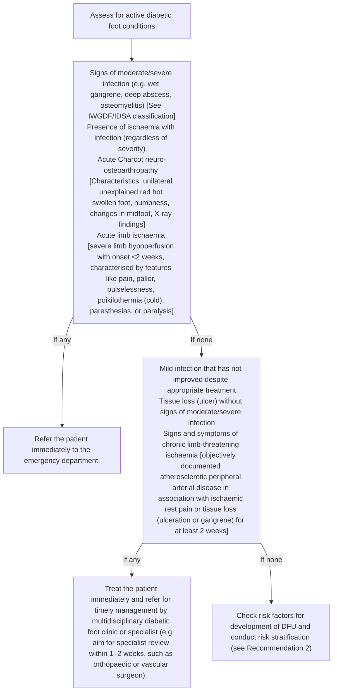
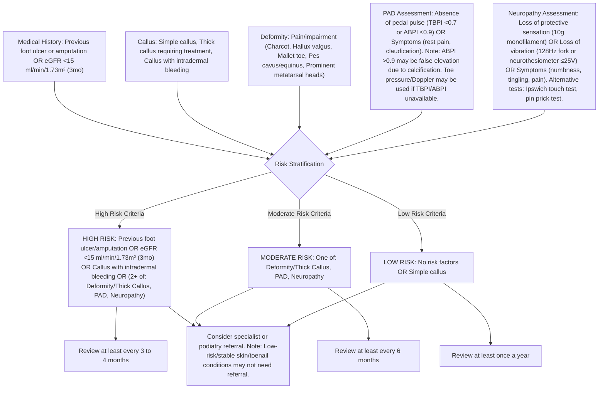
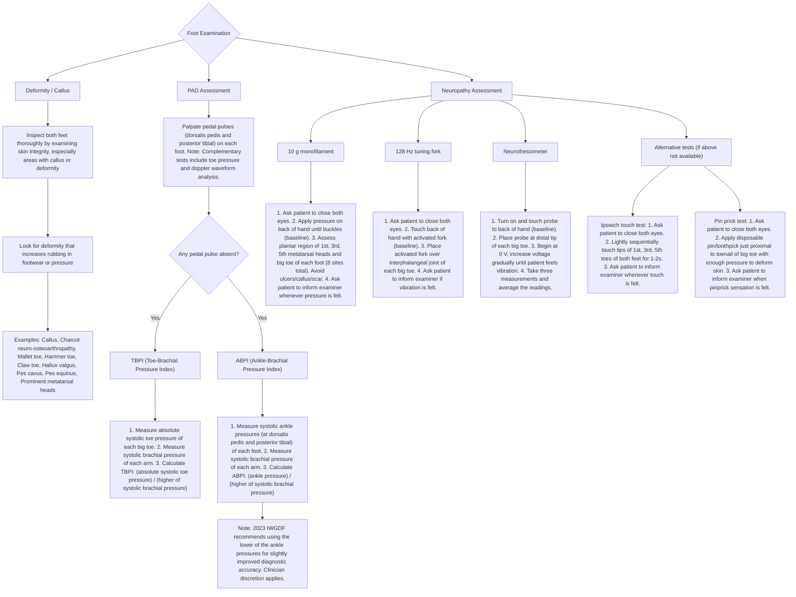

<!-- cpg_id: foot-assessment-in-patients-with-diabetes-mellitus-(aug-2024) | phase4 deterministic | spine: Overview, Foot assessment, Referral, Review, Patient education, References -->
<!-- meta | source: ACE CLINICAL GUIDANCE | published: First Published: 6 June 2019 | url: www.ace-hta.gov.sg | title: Foot assessment in patients with diabetes mellitus -->


## Overview

```yaml
cpg_id: foot-assessment-in-patients-with-diabetes-mellitus-(aug-2024)
chunk_id: foot-assessment-in-patients-with-diabetes-mellitus-(aug-2024).overview.prose.01
chunk_type: prose
section_id: overview
parent_rec: null
title: "Definitions and scope of application"
source_pages: [1]
tables_referenced: []
figures_referenced: []
url_links: []
cross_refs: []
review_flags:
  - contains_conditional_language
```

Last Updated: 8 August 2024

Foot assessment
in patients with
diabetes mellitus

### Objective

To enhance identification and management of risk for developing diabetic foot ulcers (DFU) in patients with diabetes mellitus

### Scope

Foot assessment, risk stratification, and patient education

### Target audience

This clinical guidance is relevant to all healthcare professionals caring for patients with diabetes mellitus, especially the main providers of primary or generalist diabetes care

### Background

Diabetes mellitus is a major global health concern. It is associated with macro- and microvascular complications, including DFU. DFU precede about 85% of lower extremity amputations  and are associated with mobility loss, poorer quality of life, and decreased overall productivity.  In Singapore, almost five lower extremity amputations occur every day on average in patients with diabetes mellitus.  Regular foot assessment is recommended to identify and manage the risk of developing DFU, with the frequency of assessment depending on patient's risk category.

Illustration of five different medical crutches with one highlighted (no text or symbols)

In Singapore, almost five amputations occur every day on average in patients with diabetes mellitus.

85% About of amputations could be avoided through regular foot assessment.

### Statement of Intent

This ACE Clinical Guidance (ACG) provides concise, evidence-based recommendations and serves as a common starting point nationally for clinical decision-making. It is underpinned by a wide array of considerations contextualised to Singapore, based on best available evidence at the time of development. The ACG is not exhaustive of the subject matter and does not replace clinical judgement. The recommendations in the ACG are not mandatory, and the responsibility for making decisions appropriate to the circumstances of the individual patient remains at all times with the healthcare professional.

---


## Foot assessment

```yaml
cpg_id: foot-assessment-in-patients-with-diabetes-mellitus-(aug-2024)
chunk_id: foot-assessment-in-patients-with-diabetes-mellitus-(aug-2024).foot_assessment.recommendation.01
chunk_type: recommendation
section_id: foot_assessment
parent_rec: null
title: "Recommendation 1"
source_pages: [2]
tables_referenced: []
figures_referenced:
  - Figure 1. Active diabetic foot presentation and management
url_links: []
cross_refs: []
review_flags:
  - contains_conditional_language
```

**Recommendation 1:** Check for presence of active diabetic foot conditions in all patients with diabetes mellitus.

Foot assessment for patients with diabetes mellitus begins with checking for presence of active diabetic foot conditions, such as infection, acute Charcot neuro-osteoarthropathy, or limb ischaemia. If present, immediate treatment or referral may be warranted depending on the type of condition identified (see Figure 1 below). In patients without active diabetic foot conditions, assess the patient's risk of developing DFU and stratify accordingly (see Recommendation 2).

---

```yaml
cpg_id: foot-assessment-in-patients-with-diabetes-mellitus-(aug-2024)
chunk_id: foot-assessment-in-patients-with-diabetes-mellitus-(aug-2024).foot_assessment.figure.01
chunk_type: figure
section_id: foot_assessment
parent_rec: foot-assessment-in-patients-with-diabetes-mellitus-(aug-2024).foot_assessment.recommendation.01
title: "Figure 1. Active diabetic foot presentation and management"
source_pages: [2]
reconstructed_from: mermaid
image_dir: grouped_p2_fig_01.jpg
url_links: []
cross_refs: []
review_flags: []
```

**Figure 1. Active diabetic foot presentation and management**



> *Footnote: DFU, diabetic foot ulcers*

> *Footnote: * See Supplementary table 1 on IWGDF/IDSA classification system for presence and severity of infection*

> *Footnote: Characteristics include: unilateral unexplained red hot swollen foot, numbness, changes in the midfoot (e.g. rocker-bottom deformity), X-ray findings (e.g. midfoot collapse, joint destruction, joint subluxation, or malalignment), possible history of overloading or trauma. Differential diagnoses (e.g. infection, gout, deep vein thrombosis, fractures or sprains) should also be excluded.*

> *Footnote: Acute limb ischaemia: severe limb hypoperfusion with onset <2 weeks, characterised by features like pain, pallor, pulselessness, poikilothermia (cold), paresthesias, or paralysis*

> *Footnote: Chronic limb-threatening ischaemia: objectively documented atherosclerotic peripheral arterial disease in association with ischaemic rest pain or tissue loss (ulceration or gangrene) for at least 2 weeks*

---

```yaml
cpg_id: foot-assessment-in-patients-with-diabetes-mellitus-(aug-2024)
chunk_id: foot-assessment-in-patients-with-diabetes-mellitus-(aug-2024).foot_assessment.recommendation.02
chunk_type: recommendation
section_id: foot_assessment
parent_rec: null
title: "Recommendation 2"
source_pages: [3]
tables_referenced: []
figures_referenced:
  - Figure 2. Risk stratification based on clinical findings from foot assessment in patients with diabetes mellitus (For features of active diabetic foot conditions, see Figure 1)
  - Figure 3. Foot examination and main objective tests for risk stratification
url_links: []
cross_refs: []
review_flags: []
```

**Recommendation 2:** Use foot assessment findings to determine the risk of developing a diabetic foot ulcer, corresponding review frequency, and need for referral.

A comprehensive foot assessment includes medical history, physical examination of the feet (including tests), symptoms assessment, and review of other risk factors for the development of DFU. Foot assessment findings are used to categorise a patient's risk of developing DFU and inform risk-based management decisions, such as referral and frequency of review.

### Risk stratification

Assess patients without active diabetic foot conditions for factors that increase their risk of developing DFU and manage according to their assigned risk category.

Factors used for stratifying risk of developing DFU are:

- Previous foot ulcer or amputation

- Estimated glomerular filtration rate persistently  over at least three months (including patients on dialysis)

- Clinical findings (including objective tests) of:

- Callus

- Peripheral arterial disease (PAD)

- Deformity

- Neuropathy

See Figure 2 for details of factors contributing to risk stratification, risk categories for the development of DFU, and associated actions (e.g. review frequency). Figure 3 summarises the steps involved in conducting a foot examination and performing main objective tests.

### Practice point

If any of the factors contributing to risk of developing DFU cannot be assessed reliably to inform risk stratification, assume the risk factor to be present.

Example: a patient with cognitive impairment who is unable to engage in objective tests for neuropathy can be assumed to have the neuropathy risk factor for risk stratification.

### Other factors of foot assessment

While not directly contributing to risk stratification, other factors inform overall management needs, referral requirements, and patient education. These include:

- Glycaemic control

- Skin integrity (e.g. corns, callus requiring intervention, blisters)

- Smoking

- Toenail condition (e.g. ingrown toenail, moderate fungal nail)

- Foot care and footwear

- Lacking caregiver support or inability to self-care (e.g. significant arthritis, cognitive or visual impairment, inability to maintain personal hygiene or self-check feet for problems)

### Importance of comprehensive management

Foot assessment is only one component of diabetes management and its associated conditions (refer to type 2 diabetes mellitus management ACG). For example, patients with PAD require comprehensive cardiovascular management including optimisation of glycaemic control, blood pressure (refer to hypertension ACG), and lipid profile (refer to lipid management ACG), smoking cessation (if applicable), and initiation of antiplatelet therapy, if indicated.

ACGs on other areas of diabetes management and relevant associated conditions can be found here under “Related ACGs”.

---


## Referral

```yaml
cpg_id: foot-assessment-in-patients-with-diabetes-mellitus-(aug-2024)
chunk_id: foot-assessment-in-patients-with-diabetes-mellitus-(aug-2024).referral.prose.01
chunk_type: prose
section_id: referral
parent_rec: null
title: "Referral overview"
source_pages: [4]
tables_referenced: []
figures_referenced: []
url_links:
  - https://go.gov.sg/acg-dfa-hsg-dm-cp
cross_refs: []
review_flags:
  - contains_conditional_language
```

Referral to specialists, podiatrists, or other healthcare professionals may be required based on findings from foot assessment. Patients who are stratified to be at moderate or high risk of developing a DFU could be referred if additional assessment or intervention is needed.

Patients lacking self-care ability (e.g. significant arthritis, cognitive or visual impairment, inability to maintain personal hygiene or self-check feet for problems) or have limited/absent caregiver support may require referral to relevant services (e.g. primary care nursing, podiatry or social services) where available.

Additional considerations for referral are:

Scan the QR code to the right for podiatry referral criteria in the diabetes mellitus HealthierSG care protocol

- https://go.gov.sg/acg-dfa-hsg-dm-cp

---


## Review

```yaml
cpg_id: foot-assessment-in-patients-with-diabetes-mellitus-(aug-2024)
chunk_id: foot-assessment-in-patients-with-diabetes-mellitus-(aug-2024).review.prose.01
chunk_type: prose
section_id: review
parent_rec: null
title: "Review overview"
source_pages: [4]
tables_referenced: []
figures_referenced: []
url_links: []
cross_refs: []
review_flags: []
```

Conduct comprehensive foot assessment at least once a year for all patients with diabetes mellitus. Carry out more frequent review for patients in the moderate-risk (every six months) and high-risk categories (every three to four months), focusing the assessment on factors that contributed to that risk classification. For example, for a patient with a moderate risk of developing DFU because of thick callus requiring treatment, review after six months for any change in status of callus and then again at one year for a comprehensive foot assessment.

Each review is also an opportunity for the healthcare professional providing care at that point (e.g. nurse, doctor, or podiatrist) to:

- Visually inspect the feet for any visible lesion

- Check on the patient's understanding of good practices (see Recommendation 3), and

- Reinforce the importance of foot care and appropriate footwear (see Recommendation 3)

Scan the QR code below for podiatry referral criteria in the diabetes mellitus HealthierSG care protocol

---

```yaml
cpg_id: foot-assessment-in-patients-with-diabetes-mellitus-(aug-2024)
chunk_id: foot-assessment-in-patients-with-diabetes-mellitus-(aug-2024).review.figure.01
chunk_type: figure
section_id: review
parent_rec: null
title: "Figure 2. Risk stratification based on clinical findings from foot assessment in patients with diabetes mellitus (For features of active diabetic foot conditions, see Figure 1)"
source_pages: [5]
reconstructed_from: mermaid
image_dir: grouped_p5_fig_01.jpg
url_links: []
cross_refs: []
review_flags: []
```

**Figure 2. Risk stratification based on clinical findings from foot assessment in patients with diabetes mellitus (For features of active diabetic foot conditions, see Figure 1)**



> *Footnote: ABPI, ankle-brachial pressure index; eGFR, estimated glomerular filtration rate; PAD, peripheral arterial disease; TBPI, toe-brachial pressure index*

> *Footnote: ## Medial artery calcification is likely in ABPI >1.3 and if co-existent with PAD may result in ABPI within the normal range of 0.9 to 1.3.*

> *Footnote: For example, TBPI or ABPI could be conducted for patients with a toe pressure of <100 mmHg based on a local study.   However, evidence supporting the use of toe pressure alone as PAD test is limited and accuracy of toe pressure may be affected by other factors including white coat effect or dialysis.*

> *Footnote: *** While the Ipswich touch test does not require any equipment, is simple to conduct, and has comparable agreement with standard tests in detection of neuropathy, studies that show usefulness in predicting foot ulcer or amputation are lacking.   Loss of protective sensation is likely when light touch is not sensed in 2 or more sites. Limited studies are available on the usefulness of pin prick test in diagnosis of diabetic neuropathy.*

> *Footnote: A Diabetic Foot Screening Risk Calculator is also available as part of the HealthierSG care protocol on diabetes mellitus (see Diabetic Foot Screening Risk Calculator or scan QR code on the right).*

> *Footnote: ## Can be guided by referral pathways to the relevant specialties or services as per institution protocols, where available*

> *Footnote: Low-risk or stable skin and toenail conditions of the foot may not need referral to podiatry. Please see “Podiatry referral criteria” developed as part of the HealthierSG care protocol on diabetes mellitus for more details (see Diabetes Mellitus HealthierSG care protocol or scan QR code on the far right).*

> *Footnote: Scan the QR code below for Diabetic Foot Screening Risk Calculator*

---

```yaml
cpg_id: foot-assessment-in-patients-with-diabetes-mellitus-(aug-2024)
chunk_id: foot-assessment-in-patients-with-diabetes-mellitus-(aug-2024).review.figure.02
chunk_type: figure
section_id: review
parent_rec: null
title: "Figure 3. Foot examination and main objective tests for risk stratification"
source_pages: [6]
reconstructed_from: mermaid
image_dir: grouped_p6_fig_01.jpg
url_links: []
cross_refs: []
review_flags: []
```

**Figure 3. Foot examination and main objective tests for risk stratification**



---


## Patient education

```yaml
cpg_id: foot-assessment-in-patients-with-diabetes-mellitus-(aug-2024)
chunk_id: foot-assessment-in-patients-with-diabetes-mellitus-(aug-2024).patient_education.recommendation.03
chunk_type: recommendation
section_id: patient_education
parent_rec: null
title: "Recommendation 3"
source_pages: [7]
tables_referenced: []
figures_referenced:
  - Figure 4. Patient education aid on foot care and footwear
url_links: []
cross_refs: []
review_flags:
  - contains_conditional_language
```

**Recommendation 3:** Educate all patients with diabetes mellitus regularly on lifestyle, regular foot assessment, foot care and appropriate footwear, to reduce risk of developing diabetic foot ulcers.

Advise patients on sustained lifestyle interventions to maintain optimal glycaemic control, such as eating a healthy balanced diet, maintaining a healthy weight, exercising regularly and quitting smoking (smoking increases lower extremity amputation risk by 40% in people with diabetes mellitus. For more details, please refer to the ACG “Type 2 diabetes mellitus – personalising management with non-insulin medications”. Patients who require more comprehensive support for lifestyle modifications may also be referred to other resources or healthcare professionals for multidisciplinary care, as appropriate.

Regularly educate patients on the importance of good foot care and appropriate footwear (see Figure 4), in addition to their risk stratification result and recommended follow up frequency.

---

```yaml
cpg_id: foot-assessment-in-patients-with-diabetes-mellitus-(aug-2024)
chunk_id: foot-assessment-in-patients-with-diabetes-mellitus-(aug-2024).patient_education.figure.01
chunk_type: figure
section_id: patient_education
parent_rec: foot-assessment-in-patients-with-diabetes-mellitus-(aug-2024).patient_education.recommendation.03
title: "Figure 4. Patient education aid on foot care and footwear"
source_pages: [7]
reconstructed_from: table
image_dir: grouped_p7_fig_01.jpg
url_links: []
cross_refs: []
review_flags: []
```

**Figure 4. Patient education aid on foot care and footwear**

**Table 1: Foot Care Education**

| Category | Instructions / Details |
| :--- | :--- |
| **Check feet every day** | • Use a mirror or selfie stick (or ask for help) to see the bottom of feet.<br>• Look out for: blister, wound, corn, callus, toenail abnormality.<br>• Look out for: redness, swelling, bruise, or increased warmth. |
| **Wear well-fitting and covered footwear** | • Avoid walking barefoot or in socks without shoes (even at home); wear home sandals with non-slip soles.<br>• Try on new shoes while standing and at the end of the day (when feet are largest).<br>• Wear well-fitting covered shoes with socks.<br>• Check and remove stones or sharp objects inside shoes before wearing. |
| **Maintain good foot care and hygiene** | • Clean feet daily with mild soap and water.<br>• Dry thoroughly between each toe.<br>• Avoid harsh soap, massaging with hot oil, or soaking feet for prolonged periods.<br>• Avoid cutting nails too short; cut straight across and file corners.<br>• Avoid sharp tools; use pumice stone or foot file gently to remove hard skin (check area regularly after every few strokes). |
| **Apply simple first aid to small wounds** | • Clean small wound with saline or clean water before applying antiseptic and covering with a plaster.<br>• Seek medical help if no improvement after two days or if signs of infection. |
| **Moisturise feet regularly** | • Apply moisturiser daily but not between toes.<br>• Avoid scratching skin as it may lead to wound or bleeding. |
| **Seek medical help early** | • If wound is not healing well or worsens.<br>• If signs of infection are present (redness, swelling, increased pain, pus, fever, or wound starts to smell), seek medical help as soon as possible. |

**Table 2: Footwear Education**

| Feature | Description / Purpose |
| :--- | :--- |
| **Adjustable ankle fastening** | Lace or velcro to hold feet in place and reduce rubbing within shoes. |
| **Soft cushioning inner sole** | For better comfort. |
| **Firm back (heel counter)** | (Feature listed; specific purpose not detailed in text box). |
| **Low heel** | (Feature listed; specific purpose not detailed in text box). |
| **Firm at back and middle sections of the sole** | To support middle part of the foot (arch). |
| **Flexible at front section of the sole** | To allow natural movement of toes when walking. |
| **Soft and breathable materials** | To prevent too much moisture within shoes. |
| **Appropriate sizing of footwear** | • Deep and wide toe box.<br>• Toes wiggle freely.<br>• Broad enough for widest part of feet and any deformities.<br>• Appropriate length (one-thumb width between toes and tip of shoes). |

---


## References

```yaml
cpg_id: foot-assessment-in-patients-with-diabetes-mellitus-(aug-2024)
chunk_id: foot-assessment-in-patients-with-diabetes-mellitus-(aug-2024).references.reference.01
chunk_type: reference
section_id: references
parent_rec: null
title: "References"
source_pages: [8]
tables_referenced: []
figures_referenced: []
url_links: []
cross_refs:
  - acg-dfa-ref
review_flags: []
```

Click or scan the QR code for the reference list to this clinical guidance

- http://go.gov.sg/acg-dfa-ref

### Expert group

#### Chairpersons

Dr Elaine Tan, Family Medicine (NHGP)

Dr Julian Wong, Vascular Surgery (The Vascular and Endovascular Clinic)

#### Members

Dr David Carmody, Endocrinology (SGH)

Adj A/Prof Chan Yee Cheun, Neurology (NUH)

Dr Cheah Ming Hann, Family Medicine (NUP)

Ms Marine Chioh, Nursing (AIC)

Ms Foo Mei Ching, Nursing (SHP)

Ms Chelsea Law Chiew Chie, Podiatry (KTPH)

A/Prof Inderjeet Singh Rikhraj, Orthopaedic Surgery (SKH)

Dr Donna Tan Mui Ling, Family Medicine (NHGP)

Mr Tan Liang Sheng, Podiatry (NUP)

Dr Brindha Balakrishnan, Family Medicine (SHP)

Dr Theresa Yap, Family Medicine (Yang & Yap Clinic & Surgery)

Dr Liew Huiling, Endocrinology (TTSH)

### About the Agency

The Agency for Care Effectiveness (ACE) was established by the Ministry of Health (Singapore) to drive better decision-making in healthcare by conducting health technology assessments (HTA), publishing healthcare guidance and providing education. ACE develops ACE Clinical Guidances (ACGs) to inform specific areas of clinical practice. ACGs are usually reviewed around five years after publication, or earlier, if new evidence emerges that requires substantive changes to the recommendations. To access this ACG online, along with other ACGs published to date, please visit www.ace-hta.gov.sg/acg

Find out more about ACE at www.ace-hta.gov.sg/about-us

### © Agency for Care Effectiveness, Ministry of Health, Republic of Singapore

All rights reserved. Reproduction of this publication in whole or in part in any material form is prohibited without the prior written permission of the copyright holder. Application to reproduce any part of this publication should be addressed to: ACE_HTA@moh.gov.sg

#### Suggested citation:

Agency for Care Effectiveness (ACE). Foot assessment in patients with diabetes mellitus. ACE Clinical Guidance (ACG), Ministry of Health, Singapore. 2024. Available from: go.gov.sg/acg-dfa

The Ministry of Health, Singapore disclaims any and all liability to any party for any direct, indirect, implied, punitive or other consequential damages arising directly or indirectly from any use of this ACG, which is provided as is, without warranties.

Agency for Care Effectiveness (ACE)

College of Medicine Building

16 College Road Singapore 169854

---

```yaml
cpg_id: foot-assessment-in-patients-with-diabetes-mellitus-(aug-2024)
chunk_id: foot-assessment-in-patients-with-diabetes-mellitus-(aug-2024).references.table.01
chunk_type: table
section_id: references
parent_rec: foot-assessment-in-patients-with-diabetes-mellitus-(aug-2024).patient_education.recommendation.03
title: "Supplementary Table 1. IWGDF/IDSA classification of presence and severity of inf"
source_pages: [9]
image_dir: 307109b7fb81f99adcbbb415659821522eccbd9f08138627ed3f4cc8425a4bdb.jpg
url_links: []
cross_refs: []
review_flags: []
```

**Supplementary Table 1. IWGDF/IDSA classification of presence and severity of infection of the foot in a patient with diabetes mellitus****12**

<table><tr><td>Clinical classification of infection, definitions</td><td>IWGDF/IDSA classification</td></tr><tr><td>No systemic or local symptoms or signs of infection</td><td>1 / Uninfected</td></tr><tr><td>Infected: at least two of these items are present:Local swelling or indurationErythema &gt;0.5 but &lt;2 cm<eq>^{††††}</eq> around the woundLocal tenderness or painLocal increased warmthPurulent dischargeAnd, no other cause of an inflammatory response of the skin (e.g. trauma, gout, acute Charcot neuro-arthropathy, fracture, thrombosis, or venous stasis)</td><td>2 / Mild</td></tr><tr><td>Infection with no systemic manifestations and involving:Erythema extending ≥2 cm<eq>^{††††}</eq> from the wound margin, and/orTissue deeper than skin and subcutaneous tissues (e.g. tendon, muscle, joint, and bone)</td><td>3 / Moderate</td></tr><tr><td>Infection involving bone (osteomyelitis<eq>^{††††}</eq>)</td><td>Add “(O)”</td></tr><tr><td>Any foot infection with associated systemic manifestations (of the systemic inflammatory response syndrome [SIRS]), as manifested by ≥2 of the following:Temperature, &gt;38 °C or &lt;36 °CHeart rate, &gt;90 beats/minRespiratory rate, &gt;20 breaths/min, or PaCO<eq>_{2}</eq> &lt;4.3 kPa (32 mmHg)White blood cell count &gt;12,000/mm<eq>^{3}</eq>, or &lt;4 G/L, or &gt;10% immature (band) forms</td><td>4 / Severe</td></tr><tr><td>Infection involving bone (osteomyelitis<eq>^{††††}</eq>)</td><td>Add “(O)”</td></tr></table>

> *Footnote: Note: The presence of clinically significant foot ischaemia makes both diagnosis and treatment of infection considerably more difficult.*

> *Footnote: **** Infection refers to any part of the foot, not just of a wound or an ulcer.*

> *Footnote: In any direction, from the rim of the wound.*

> *Footnote: ### If osteomyelitis is demonstrated in the absence of ≥2 signs/symptoms of local or systemic inflammation, classify the foot as either grade 3(O) if <2 SIRS criteria, or grade 4(O) if ≥2 SIRS criteria.*

---

```yaml
cpg_id: foot-assessment-in-patients-with-diabetes-mellitus-(aug-2024)
chunk_id: foot-assessment-in-patients-with-diabetes-mellitus-(aug-2024).references.additional_material.01
chunk_type: additional_material
section_id: references
parent_rec: null
title: "Foot assessment in people with diabetes mellitus references"
source_pages: [8]
url_links: []
cross_refs:
  - acg-dfa-ref
review_flags:
  - external_resource
```

**External material — Foot assessment in people with diabetes mellitus references**

*Source: http://go.gov.sg/acg-dfa-ref*

### References

This is the reference list to the ACE Clinical Guideline "Foot assessment in patients with diabetes mellitus".

1. Pecoraro RE, Reiber GE, Burgess EM. Pathways to diabetic limb amputation. Basis for prevention. Diabetes Care. 1990;13(5):513-521.  
2. Vileikyte L. Diabetic foot ulcers: a quality of life issue. Diabetes Metab Res Rev. 2001;17(4):246-249.  
3. Ministry of Health, Singapore. Lower extremity amputation, including toe amputation, in people with diabetes. 2021. Unpublished.  
4. Bus SA, Sacco ICN, Monteiro-Soares M, et al. Guidelines on the prevention of foot ulcers in persons with diabetes (IWGDF 2023 update). Diabetes Metab Res Rev. 2023:e3651.  
5. National Institute for Health and Care Excellence (NICE). Diabetic foot problems: prevention and management. 2015, updated 2019. NICE clinical guideline 19. https://www.nice.org.uk/guidance/ng19 [Accessed 15 May 2023].  
6. ElSayed NA, Aleppo G, Aroda VR, et al. 12. Retinopathy, Neuropathy, and Foot Care: Standards of Care in Diabetes-2023. Diabetes Care. 2023;46 (Suppl 1):S203-s15.  
7. Embil JM, Albalawi Z, Bowering K, et al. Diabetes Canada Clinical Practice Guidelines Expert Committee. Foot care. Can J Diabetes. 2018;42 (Suppl 1):S222-S227.  
8. Scottish Intercollegiate Guidelines Network (SIGN). Management of diabetes. 2017. SIGN publication no. 116. https://www.sign.ac.uk/assets/sign116.pdf [Accessed 15 May 2023].  
9. Hingorani A, Lamuraglia GM, Henke P, et al. The management of diabetic foot: a clinical practice guideline by the Society of Vascular Surgery in collaboration with the American Podiatric Medical Association and the Society for Vascular Medicine. J Vasc Surg. 2016;63(Suppl 2):3S-21S.  
10. Kaminski MR, Golledge J, Lasschuit JWJ, et al. Australian guideline on prevention of foot ulceration: part of the 2021 Australian evidence-based guidelines for diabetes-related foot disease. J Foot Ankle Res. 2022;15(1):53.  
11. Ministry of Health Malaysia. Clinical Practice Guidelines: Management of Diabetic Foot (2nd Edition). 2018.
https://www.moh.gov.my/moh/resources/Penerbitan/CPG/Orthopaedics/Draft%20CPG%20Diabetic%20Foot.pdf [Accessed 15 May 2023].  
12. Senneville É, Albalawi Z, van Asten SA, et al. IWGDF/IDSA guidelines on the diagnosis and treatment of diabetes-related foot infections (IWGDF/IDSA 2023). Diabetes Metab Res Rev. 2023:e3687.  
13. Gerhard-Herman MD, Gornik HL, Barrett C, et al. 2016 AHA/ACC Guideline on the Management of Patients With Lower Extremity Peripheral Artery Disease: A Report of the American College of Cardiology/American Heart Association Task Force on Clinical Practice Guidelines. Circulation. 2017;135(12):e726-e79.  
14. Conte MS, Bradbury AW, Kolh P, et al. Global vascular guidelines on the management of chronic limb-threatening ischemia. J Vasc Surg. 2019;69(6s):3S-125S.e40.  
15. Pop-Busui R, Boulton AJ, Feldman EL, et al. Diabetic neuropathy: a position statement by American Diabetes Association. Diabetes Care. 2017;40(1):136-154.  
16. Ng CG, Cheong CYW, Chan WC, et al. Diagnostic thresholds for absolute systolic toe pressure and toe-brachial index in diabetic foot screening. Ann Acad Med Sing. 2022;51(3):143-8.  
17. Carle R, Tehan P, Stewart S, et al. Variability of toe pressures during haemodialysis: comparison of people with and without diabetes; a pilot study. Journal of Foot and Ankle Research. 2023;16(1):42.  
18. Hu A, Koh B, Teo MR. A review of the current evidence on the sensitivity and specificity of the Ipswich touch test for the screening of loss of protective sensation in patients with diabetes mellitus. Diabetol Int. 2021;12(2):145-50.  
19. Abraham A, Alabdali M, Alsulaiman A, et al. The sensitivity and specificity of the neurological examination in polyneuropathy patients with clinical and electrophysiological correlations. PLoS One. 2017;12(3):e0171597.  
20. Nather A, Neo SH, Chionh SB, et al. Assessment of sensory neuropathy in diabetic patients without diabetic foot problems. J Diabetes Complications. 2008;22(2):126-31.  
21. Schaper NC, van Netten JJ, Apelqvist J, et al. Practical guidelines on the prevention and management of diabetes-related foot disease (IWGDF 2023 update). Diabetes Metab Res Rev. 2023:e3657.  
22. Aboyans V., Ricco J.B., Bartelink M.E.L., Björck M., Brodmann M., Cohnert T., et al. 2017 ESC Guidelines on the Diagnosis and Treatment of Peripheral Arterial Diseases, in collaboration with the European Society for Vascular Surgery (ESVS): Document covering atherosclerotic disease of extracranial carotid and vertebral, mesenteric, renal, upper and lower extremity arteriesEndorsed by: the European Stroke Organization (ESO)The Task Force for the Diagnosis and Treatment of Peripheral Arterial Diseases of the European Society of Cardiology (ESC) and of the European Society for Vascular Surgery (ESVS). European heart journal. 2018;39(9):763-816.  
23. Frank U., Nikol S., Belch J., Boc V., Brodmann M., Carpentier P.H., et al. ESVM Guideline on peripheral arterial disease. VASA Zeitschrift fur Gefasskrankheiten. 2019;48(Suppl 102):1-79.  
24. Abramson B.L., Al-Omran M., Anand S.S., Albalawi Z., Coutinho T., de Mestral C., et al. Canadian Cardiovascular Society 2022 Guidelines for Peripheral Arterial Disease. The Canadian journal of cardiology. 2022;38(5):560-87.  
25. Fitridge R., Chuter V., Mills J., Hinchliffe R., Azuma N., Behrendt C., et al. The Intersocietal IWGDF ESVS SVS guidelines on peripheral artery disease in patients with diabetes mellitus and a foot ulcer. 2023.  
26. Chuter V., Schaper N., Mills J., Hinchliffe R., Russell D., Azuma N., et al. Effectiveness of bedside investigations to diagnose peripheral artery disease among people with diabetes mellitus: A systematic review. Diabetes/Metabolism Research and Reviews. 2023:e3683.  
27. Boulton AJ, Armstrong DG, Albert SF, et al. Comprehensive foot examination and risk assessment: a report of the task force of the foot care interest group of the American Diabetes Association, with endorsement by the American Association of Clinical Endocrinologists. Diabetes Care. 2008;31(8):1679-85.  
28. Ying AF, Tang TY, Jin A, et al. Diabetes and other vascular risk factors in association with the risk of lower extremity amputation in chronic limb-threatening ischemia: a prospective cohort study. Cardiovasc Diabetol. 2022;21(1):7.

---
