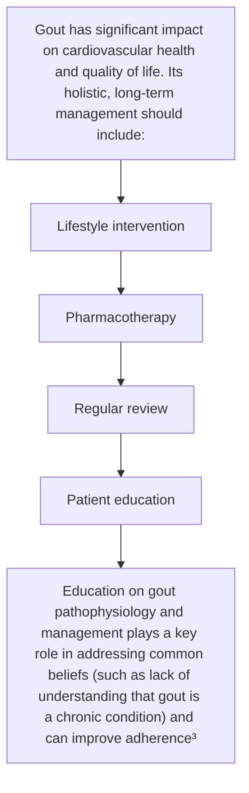

<!-- cpg_id: gout-achieving-the-management-goal-dec2023 | phase4 deterministic | spine: Overview, Ensuring long-term management, Management of acute flares, References -->
<!-- meta | source: ACE CLINICAL GUIDANCE | published: First Published: 20 December 2019. Last Updated: 14 December 2023 | url: www.ace-hta.gov.sg | title: Gout. Achieving the management goal -->


## Overview

```yaml
cpg_id: gout-achieving-the-management-goal-dec2023
chunk_id: gout-achieving-the-management-goal-dec2023.overview.prose.01
chunk_type: prose
section_id: overview
parent_rec: null
title: "Definitions and scope of application"
source_pages: [1]
tables_referenced: []
figures_referenced: []
url_links: []
cross_refs: []
review_flags:
  - contains_conditional_language
```

First Published: 20 December 2019

Last Updated: 14 December 2023

### Objective

To enhance long-term management of gout

### Scope

Pharmacological and non-pharmacological aspects of management, with a focus on urate-lowering therapy (including SCAR monitoring), prophylaxis, and treatment for acute flares

### Target audience

This clinical guidance is relevant to all healthcare professionals caring for patients with gout, especially those providing primary or generalist care

### Background

Gout, a form of inflammatory arthritis, is due to deposition of monosodium urate (MSU) crystals in one or more joints, and is a result of chronic serum urate elevation. Although gout is a chronic condition, it usually presents episodically with intense joint pain, swelling, and redness. Without appropriate long-term management, acute flares may increase in frequency or severity. Crystal build-up may form tophi that could lead to joint damage or functional impairment. In addition, renal complications, such as urate nephrolithiasis or chronic kidney disease (CKD) may develop. As CKD is also a known risk factor for gout, the relationship between the two is bidirectional. Also, patients with gout often have multiple comorbidities, including obesity, metabolic syndrome, type 2 diabetes mellitus, and cardiovascular disease.

This ACG highlights the need for improved management of gout as a chronic condition, beyond managing acute, episodic exacerbations. When lifestyle management is insufficient, urate-lowering therapy (ULT) is the mainstay of the long-term management approach to gout.

### Statement of Intent

This ACE Clinical Guidance (ACG) provides concise, evidence-based recommendations and serves as a common starting point nationally for clinical decision-making. It is underpinned by a wide array of considerations contextualised to Singapore, based on best available evidence at the time of development. The ACG is not exhaustive of the subject matter and does not replace clinical judgement. The recommendations in the ACG are not mandatory, and the responsibility for making decisions appropriate to the circumstances of the individual patient remains at all times with the healthcare professional.

---


## Ensuring long-term management

```yaml
cpg_id: gout-achieving-the-management-goal-dec2023
chunk_id: gout-achieving-the-management-goal-dec2023.ensuring_long_term_management.prose.01
chunk_type: prose
section_id: ensuring_long_term_management
parent_rec: null
title: "Ensuring long-term management overview"
source_pages: [2]
tables_referenced: []
figures_referenced:
  - Figure 1 on page 3 provides an overview of long-term management of gout.
url_links: []
cross_refs: []
review_flags: []
```

The management goal for gout is resolution of symptoms and signs, so as to reduce the risk of further complications. A long-term approach to managing gout should be in place for all patients, and this includes going beyond episodic treatment of acute flares:



Figure 1. Overview of long-term gout management

Manage gout long term as a chronic condition to resolve symptoms and signs, so as to reduce the risk of further complications

---

```yaml
cpg_id: gout-achieving-the-management-goal-dec2023
chunk_id: gout-achieving-the-management-goal-dec2023.ensuring_long_term_management.figure.01
chunk_type: figure
section_id: ensuring_long_term_management
parent_rec: null
title: "Figure 1 on page 3 provides an overview of long-term management of gout."
source_pages: [2]
reconstructed_from: table
image_dir: grouped_p2_fig_01.jpg
url_links: []
cross_refs: []
review_flags: []
```

**Figure 1 on page 3 provides an overview of long-term management of gout.**

| Concept | Definition / Key Point | Management Implication |
|---|---|---|
| **Gout** | Clinical manifestation of MSU crystal deposition from chronic serum urate elevation. | (Context implies long-term management beyond acute flares) |
| **Asymptomatic Hyperuricaemia** | Elevated serum urate without symptoms or signs. | ULT evidence not established. Lifestyle advice can be given for persistent cases. |
| **Serum Urate Levels** | Naturally fluctuates. | May not always correspond to clinical features of gout. |

---

```yaml
cpg_id: gout-achieving-the-management-goal-dec2023
chunk_id: gout-achieving-the-management-goal-dec2023.ensuring_long_term_management.prose.02
chunk_type: prose
section_id: ensuring_long_term_management
parent_rec: null
title: "Lifestyle management"
source_pages: [3]
tables_referenced: []
figures_referenced: []
url_links: []
cross_refs: []
review_flags: []
```

As part of lifestyle management, provide advice on healthy lifestyle, including diet (see Patient education aid 1)

---

```yaml
cpg_id: gout-achieving-the-management-goal-dec2023
chunk_id: gout-achieving-the-management-goal-dec2023.ensuring_long_term_management.prose.03
chunk_type: prose
section_id: ensuring_long_term_management
parent_rec: null
title: "ULT"
source_pages: [3]
tables_referenced: []
figures_referenced: []
url_links: []
cross_refs: []
review_flags:
  - contains_dosing_information
```

Initiate ULT for patients with gout who meet the ULT treatment criteria, starting at a low dose and slowly titrating upwards as needed (see Recommendation 1)

ULT treatment criteria (any of the following):

- Frequent acute gout flares (two or more per year)

- Presence of any tophus

- Radiographic damage due to gouty arthritis

- History of urolithiasis

---

```yaml
cpg_id: gout-achieving-the-management-goal-dec2023
chunk_id: gout-achieving-the-management-goal-dec2023.ensuring_long_term_management.prose.04
chunk_type: prose
section_id: ensuring_long_term_management
parent_rec: null
title: "Management of comorbidities"
source_pages: [3]
tables_referenced: []
figures_referenced: []
url_links: []
cross_refs: []
review_flags: []
```

Review and manage comorbidities and risk factors, including:

- CKD

- Obesity

- T2DM

- Hypertension

- Hyperlipidaemia

Relevant ACGs on the management of these conditions can be found here

---

```yaml
cpg_id: gout-achieving-the-management-goal-dec2023
chunk_id: gout-achieving-the-management-goal-dec2023.ensuring_long_term_management.prose.05
chunk_type: prose
section_id: ensuring_long_term_management
parent_rec: null
title: "Specialist referral"
source_pages: [3]
tables_referenced: []
figures_referenced: []
url_links: []
cross_refs: []
review_flags:
  - contains_conditional_language
```

Management of gout (including ULT initiation) can be done in primary care, with specialist referral when needed.

Main considerations for specialist referral include:

- Severe or refractory gout (e.g., recurrent flares despite reaching target serum urate levels with ULT)

- CKD with GFR

- Difficulty in achieving the management goal with ULT, particularly for patients with CKD

- Serious adverse effects from ULT

---

```yaml
cpg_id: gout-achieving-the-management-goal-dec2023
chunk_id: gout-achieving-the-management-goal-dec2023.ensuring_long_term_management.prose.06
chunk_type: prose
section_id: ensuring_long_term_management
parent_rec: null
title: "Patient education"
source_pages: [3]
tables_referenced: []
figures_referenced: []
url_links: []
cross_refs: []
review_flags: []
```

Include the following key points as part of patient education, as appropriate:

- Gout pathophysiology (see Patient education aid 1)

- Lifestyle advice (see Patient education aid 1)

- Benefits and risks of ULT, including adverse effect monitoring, particularly SCARs (see Patient education aid 2)

- Benefits and risks of medications for prophylaxis

- Acute flares should be treated as soon as possible after symptom onset

- Benefits and risks of medications for acute flare treatment

- Advice on resting affected joint(s) and applying ice packs during an acute flare

---


## Management of acute flares

```yaml
cpg_id: gout-achieving-the-management-goal-dec2023
chunk_id: gout-achieving-the-management-goal-dec2023.management_of_acute_flares.prose.01
chunk_type: prose
section_id: management_of_acute_flares
parent_rec: null
title: "Management of acute flares overview"
source_pages: [3]
tables_referenced: []
figures_referenced: []
url_links: []
cross_refs: []
review_flags:
  - contains_dosing_information
```

- Manage acute flares as soon as possible, including treatment with colchicine, NSAIDs, or corticosteroids (see Recommendation 4)

- Continue ULT during an acute flare

- Review the long-term management plan, including the ULT dose

---

```yaml
cpg_id: gout-achieving-the-management-goal-dec2023
chunk_id: gout-achieving-the-management-goal-dec2023.management_of_acute_flares.prose.02
chunk_type: prose
section_id: management_of_acute_flares
parent_rec: null
title: "Using ULT to achieve the management goal"
source_pages: [4]
tables_referenced: []
figures_referenced: []
url_links: []
cross_refs: []
review_flags: []
```

The management goal for gout focuses on resolution of symptoms and signs, to minimise risk of complications. This includes resolving tophi and reducing acute flares, which can be achieved through lowering of serum urate with ULT.

---

```yaml
cpg_id: gout-achieving-the-management-goal-dec2023
chunk_id: gout-achieving-the-management-goal-dec2023.management_of_acute_flares.recommendation.01
chunk_type: recommendation
section_id: management_of_acute_flares
parent_rec: null
title: "Recommendation 1"
source_pages: [4, 5]
tables_referenced:
  - Table 1. ULT treatment criteria
  - Table 2. Key clinical precautions with ULT*
figures_referenced:
  - Figure 1 on page 3 provides an overview of long-term management of gout.
url_links: []
cross_refs: []
review_flags:
  - contains_conditional_language
  - contains_dosing_information
```

**Recommendation 1:** Initiate urate-lowering therapy (ULT) for patients who meet the ULT treatment criteria, starting at a low dose and slowly titrating upwards as needed.

Consider starting patients on ULT, particularly when they meet ULT treatment criteria (see Table 1). Involve patients through shared decision-making when deciding on ULT.

Generally, the effects of ULT on decreasing acute flare frequency and tophi number or size are greater when serum urate is reduced and maintained    (6 mg/dL) for the long term.   Further reductions in flare frequency and tophi may be experienced with lower serum urate levels   such as below 300    (5 mg/dL), although higher ULT doses may be required.

When using ULT, consider starting with allopurinol – a xanthine oxidase inhibitor (XOI) that is effective, generally well tolerated, and commonly used. Febuxostat is a newer XOI. While allopurinol and febuxostat have similar benefits  for reducing acute flare frequency  or tophi,  research suggests a higher risk of all-cause and cardiovascular death with febuxostat compared to allopurinol for patients with gout and major cardiovascular disease (CVD).  Among patients without CVD, recent evidence indicates the cardiovascular risk of these two XOIs may not differ.

Table 1. ULT treatment criteria

Any of the following:

- Frequent acute gout flares (two or more per year)

- Presence of any tophus

- Radiographic damage due to gouty arthritis

- History of urolithiasis

ULT, urate-lowering therapy

When initiating allopurinol, start at a low dose (typically 50–100 mg/day). Slowly titrate upwards in 50–100 mg increments every four to eight weeks, informed by serum urate and clinical features (“start low, go slow”). Allopurinol doses of more than 300 mg/day may be needed to achieve the management goal. Doses could be increased up to a maximum of 900 mg/day in patients with normal renal function.

### Allopurinol in renal impairment

In patients with renal impairment,   use a lower starting dose of allopurinol.   The maximum maintenance dose of allopurinol in patients with renal impairment is not well established, although doses higher than 300 mg/day could be used safely with adequate patient education and monitoring.

Information in this notepad was sourced from package insert and supplemented with information from UpToDate (www.uptodate.com). Please refer accordingly for full details on allopurinol.

Uricosuric agents are another class of ULT, and include probenecid and benzbromarone. As they promote urate excretion through the kidneys, these agents are less effective in patients with renal impairment  (see Table 2). An uricosuric agent could be used alone or in combination with an XOI (usually allopurinol) for enhanced effectiveness, if there is inadequate response to an XOI alone. Benzbromarone is not commonly used locally.

"Start low, go slow" with ULT, informed by serum urate and clinical features.

### Addressing clinical precautions of using ULT

A summary of clinical precautions when using ULT is presented in Table 2. Main considerations for specialist referral and key points for patient education can be found in Figure 1.

---

```yaml
cpg_id: gout-achieving-the-management-goal-dec2023
chunk_id: gout-achieving-the-management-goal-dec2023.management_of_acute_flares.table.01
chunk_type: table
section_id: management_of_acute_flares
parent_rec: gout-achieving-the-management-goal-dec2023.management_of_acute_flares.recommendation.01
title: "Table 2. Key clinical precautions with ULT*"
source_pages: [5]
image_dir: 24a0b828e428c26a5f1c88465f40d871899dbba02631542b7ccf98ebb5bd75e6.jpg
url_links: []
cross_refs: []
review_flags: []
```

**Table 2. Key clinical precautions with ULT***

<table><tr><td colspan="2">Xanthine oxidase inhibitors</td><td colspan="2">Uricosuric agents</td></tr><tr><td><eq>Allopurinol^†</eq></td><td>Febuxostat</td><td><eq>Probenecid^†</eq></td><td><eq>Benzbromarone</eq></td></tr><tr><td rowspan="2">Risk of SCARs (see section “Understanding SCARs in ULT” below)Contraindicated in patients with previous hypersensitivity to allopurinol (including SCARs); consider other ULT options</td><td rowspan="2">Risk of SCARs, although the risk is lower than with allopurinol (see section “Understanding SCARs in ULT” below)Research suggests a higher risk of all-cause and cardiovascular death with febuxostat than with allopurinol among patients with gout and major cardiovascular disease</td><td colspan="2">Contraindicated in patients with a history of urolithiasisMay not be as effective when GFR &lt;30 mL/min/1.73m2</td></tr><tr><td>Risk of haemolytic anaemia in patients with G6PD deficiency</td><td>Withdrawn in some countries following reports of <eq>hepatotoxicity^{18}</eq></td></tr><tr><td colspan="4">May precipitate acute flares during initial period of ULT(see section “Prophylaxis against acute flares during initial period of ULT” below)</td></tr></table>

> *Footnote: GFR, glomerular filtration rate; G6PD, glucose-6-phosphate dehydrogenase; SCARs, severe cutaneous adverse reactions; ULT, urate-lowering therapy*

> *Footnote: * Information sourced from package inserts and UpToDate (www.uptodate.com). Please refer accordingly for full details on these medications.*

> *Footnote: Available on government subsidy list.*

---

```yaml
cpg_id: gout-achieving-the-management-goal-dec2023
chunk_id: gout-achieving-the-management-goal-dec2023.management_of_acute_flares.recommendation.02
chunk_type: recommendation
section_id: management_of_acute_flares
parent_rec: null
title: "Recommendation 2"
source_pages: [5]
tables_referenced: []
figures_referenced: []
url_links: []
cross_refs: []
review_flags:
  - contains_conditional_language
  - contains_dosing_information
```

**Recommendation 2:** Provide prophylaxis with colchicine; if colchicine is not suitable, consider a low-dose oral nonsteroidal anti-inflammatory drug (NSAID), or a low-dose oral corticosteroid if NSAIDs are not suitable.

To mitigate the risk of acute flares when initiating ULT, provide prophylaxis with colchicine, typically 0.5 mg or 0.6 mg once daily. Prophylaxis with colchicine is generally recommended for up to six months.   However, prophylaxis duration could be tailored depending on the occurrence of acute flares. Starting ULT at a low dose before slowly titrating upwards also helps to mitigate the risk of acute flares.

For patients who cannot use colchicine, consider a low-dose oral nonsteroidal anti-inflammatory drug (NSAID), including a cyclooxygenase-2 (COX-2) inhibitor. Alternatively, a low-dose oral corticosteroid could be considered for patients who cannot use colchicine, and who are unsuitable for prophylaxis with NSAIDs (such as patients with renal impairment). Optimal prophylaxis duration with these non-colchicine medications is not established.

### Colchicine adverse effects and interactions

Nausea, vomiting, and diarrhoea are the most common adverse effects of colchicine. The frequency of adverse effects increases with higher doses or longer duration of use. Colchicine has the potential for many drug-drug (such as macrolide antibiotics, azole antifungals, statins, verapamil, or diltiazem) and drug-food interactions.

Monitor for adverse effects due to drug-drug interactions and consider reducing the dose of colchicine or increasing dosing interval as required.

Clinical decisions should be individualised, taking into consideration the importance of patients' concurrent medications for their respective conditions. Patients with renal or hepatic impairment are at increased risk of toxicity, including myopathy, neuropathy, and pancytopenia.

Medications for prophylaxis are also used to treat acute flares (see section “Managing acute flares” below). If an acute flare occurs during prophylaxis and the same medication for prophylaxis is chosen to treat the acute flare, use the higher acute flare treatment dose instead of the prophylactic dose. Reinitiate the prophylactic dose after the acute flare resolves. If a different medication is chosen to treat the acute flare, exercise more caution with the combination of an oral NSAID plus an oral corticosteroid due to the increased risk of gastrointestinal ulcer or bleeding.

### Anti-inflammatory medications in renal impairment

Renal impairment affects treatment options both in prophylaxis and treatment of acute flares:

- As renal impairment increases the risk of colchicine toxicity, consider reducing colchicine dose or increasing dosing interval.

- Use of oral NSAIDs, including COX-2 inhibitors, requires more caution in patients with renal impairment, and is not suitable for patients with GFR <30 mL/min/1.73m or for prolonged duration (such as for prophylaxis).

---

```yaml
cpg_id: gout-achieving-the-management-goal-dec2023
chunk_id: gout-achieving-the-management-goal-dec2023.management_of_acute_flares.recommendation.03
chunk_type: recommendation
section_id: management_of_acute_flares
parent_rec: null
title: "Recommendation 3"
source_pages: [6]
tables_referenced: []
figures_referenced: []
url_links:
  - https://www.hsa.gov.sg/announcements/safety-alert/allopurinol-induced-severe-cutaneous-adverse-reactions-and-the-role-of-hla-b-5801-genotyping-a-reminder
cross_refs: []
review_flags:
  - contains_conditional_language
  - contains_dosing_information
```

**Recommendation 3:** Mitigate the risk of developing severe cutaneous adverse reactions (SCARs) and provide counselling on SCAR monitoring for patients on allopurinol or febuxostat.

Allopurinol/febuxostat-induced SCARs are uncommon. They include Stevens-Johnson syndrome (SJS), toxic epidermal necrolysis (TEN), and drug reaction with eosinophilia and systemic symptoms (DRESS). SCARs may result in long-term complications and even be life-threatening. Most SCARs occur within the first few weeks to months after therapy initiation. Monitoring for SCARs in patients starting on allopurinol or febuxostat is important to ensure early detection and prompt management. While a number of SCAR risk factors exist, the acronym RASHES below presents key factors to guide clinical decision-making.

Around 3 out of 1,000

patients on allopurinol may develop SCARs

(even less with febuxostat)

Key factors that increase the risk of allopurinol-induced SCARs  :

Renal impairment

Agent

concomitant use of therapeutic agents, such as diuretics

Starting dose

high allopurinol starting dose

presence of this allele

Escalation

rapid escalation of allopurinol dose

Seniority

older age

Legend: Genetic factor Non-genetic factor

Assess the RASHES factors in all patients starting on allopurinol. Mitigate the risk of developing SCARs by addressing the RASHES factors where possible, for example by starting allopurinol at a low dose and slowly titrating upwards. Patients with renal impairment or older age are inherently at increased risk of SCARs. Nonetheless, monitoring for SCARs is important in all patients starting on allopurinol. This includes educating patients on the early symptoms of SCARs and actions to take if such symptoms are experienced (see Patient education aid 2). Abnormalities in laboratory tests such as full blood count, alanine aminotransferase, and aspartate transaminase may be indicative of SCARs.

While the HLA-B*5801 allele is a known risk factor for allopurinol-induced SCARs, reactions may still develop without the allele as there are non-genetic factors that increase the risk. The positive predictive value (PPV) of HLA-B*5801 for allopurinol-induced SCARs is estimated at around 2% (around 2 out of 100 patients with the allele starting on allopurinol may develop SCARs). The low PPV limits the overall value of routine genotyping in the Singapore population before initiation of allopurinol and routine genotyping of all patients with gout is not recommended. For patients assessed to already be at higher risk of allopurinol-induced SCARs with renal impairment or older age, the option of HLA-B*5801 genotyping may be considered prior to allopurinol initiation, taking into account cost considerations. For patients who have already well tolerated long-term allopurinol treatment, genotyping is not required.

For more information on allopurinol-induced SCARs, please click or scan the QR code to access the 2021 reminder of the Ministry of Health (MOH) – Health Sciences Authority (HSA) Drug Safety Information No. 59 summary (first published on 21 September 2016):

- https://www.hsa.gov.sg/announcements/safety-alert/allopurinol-induced-severe-cutaneous-adverse-reactions-and-the-role-of-hla-b-5801-genotyping-a-reminder

SCARs have also been reported with febuxostat, although the risk is significantly lower than with allopurinol.   Post-marketing surveillance found that some of the patients who developed SCARs with febuxostat had renal impairment or a history of hypersensitivity to allopurinol.

"Start low, go slow" with ULT to minimise the risk of adverse effects.

Inform patients of SCAR risk and provide counselling on SCAR monitoring (see Patient education aid 2).

> *Footnote: Please refer to the Chronic Disease Management Programme handbook for further information on care components for patients with gout, including monitoring parameters and frequencies.*

---

```yaml
cpg_id: gout-achieving-the-management-goal-dec2023
chunk_id: gout-achieving-the-management-goal-dec2023.management_of_acute_flares.recommendation.04
chunk_type: recommendation
section_id: management_of_acute_flares
parent_rec: null
title: "Recommendation 4"
source_pages: [7, 8, 9]
tables_referenced: []
figures_referenced: []
url_links: []
cross_refs: []
review_flags:
  - contains_conditional_language
  - contains_dosing_information
```

**Recommendation 4:** Manage acute flares as soon as possible, including treatment with colchicine, NSAIDs, or corticosteroids.

Acute flares should be treated as soon as possible. Anti-inflammatory medications for treatment of acute flares include:

- Colchicine

- Oral NSAIDs, including COX-2 inhibitors

- Oral corticosteroids

- Intra-articular or intramuscular corticosteroids

Monotherapy or a combination of medications can be used. However, exercise more caution with the combination of an oral NSAID plus an oral corticosteroid. See notepads under section “Prophylaxis against acute flares during initial period of ULT” for more information on anti-inflammatory medications.

### Low-dose colchicine for acute flares

Use one of the following low-dose colchicine regimens for acute flare treatment:

One-off treatment with 1 mg or 1.2 mg loading dose, followed by one dose of 0.5 mg or 0.6 mg one hour later

OR

0.5 mg or 0.6 mg two to three times per day until the acute flare resolves

Historically, acute flares were treated with a higher dose of colchicine, starting with 1 mg loading dose, followed by 0.5 mg every four hours until acute pain improved, patient felt sick, or had diarrhoea.   However, there is a greater likelihood of gastrointestinal adverse effects with higher doses of colchicine, without added benefits.

Practice considerations when managing an acute flare:

Determine the choice of treatment by considering patient characteristics such as comorbidities (e.g., renal impairment), concomitant medications, and patient preferences.

Advise patients to rest affected joint(s) and apply ice packs.

ULT could be initiated during an acute flare provided that the acute flare is adequately treated, followed by prophylaxis. However, delaying the initiation until after the acute flare subsides is also an option.

For patients who are on ULT, continue ULT during an acute flare. Review the long-term management plan, including the ULT dose. As serum urate naturally fluctuates, serum urate levels may be normal or low during an acute flare.

### Patient education aid 1: gout and healthy lifestyle

The purpose of this aid is to assist discussions between healthcare professionals and patients on what gout is and key elements of a healthy lifestyle for gout. The information presented here is not exhaustive of the subject matter. This aid is designed to complement, but not replace, advice provided by a healthcare professional.

Gout causes pain and swelling in joints. This form of arthritis is due to high levels of uric acid, a substance in the body

Uric acid forms crystals
Uric acid crystals trigger painful gout attacks

Other problems (complications) can develop if gout is not treated:

Collection of uric acid crystals, forming lumps around joints (tophi)

Kidney or bladder stones

Joint damage

A healthy lifestyle is important:

Maintain a healthy weight (including weight loss if overweight)

Exercise regularly,
but rest affected joints
during a gout attack

Avoid smoking

Maintain a healthy diet

The following diet can help to prevent gout attacks:

Avoid

Include more of

Excessive alcohol (especially beer and spirits)

Low-fat dairy products

Sugary drinks,
such as fruit juices or
carbonated drinks

Vegetables,
such as lettuce or radish

Excessive high-purine foods, especially seafood or meat, including organ meats (the body converts purine into uric acid)

Fluids
Drink plenty of fluids (at least 2 litres a day), unless under fluid restriction

### Patient education aid 2: severe cutaneous adverse reactions (SCARs) in urate-lowering therapy (ULT)

The purpose of this aid is to assist discussions between healthcare professionals and patients on SCARs in ULT, particularly SCAR monitoring. The information presented here is not exhaustive of the subject matter. This aid is designed to complement, but not replace, advice provided by a healthcare professional.

Urate-lowering therapy (ULT) is an effective treatment for gout. However, severe cutaneous adverse reactions (SCARs) may develop with allopurinol (the most common ULT) or febuxostat (another ULT).

SCARs are serious and generally affect skin, eyes, or mouth

SCARs are uncommon

Around 3 out of 1,000 people taking allopurinol may develop SCARs (even less with febuxostat)

Some people are at higher risk of SCARs (e.g., people with renal impairment or older age)

However, it is not possible to know who will develop SCARs

People starting on allopurinol or febuxostat need to look out for early symptoms of SCARs, which include:

Flu-like symptoms (such as fever, body aches, or feeling unwell)

Mouth ulcers
or sore throat

Red or
sore eyes

Rash

These symptoms may not happen together and they are not the only ones.

Monitor for SCAR symptoms, especially in the first 3 months after starting the medication (but they can also happen after 3 months).

Seek advice from your doctor if you experience any SCAR symptoms or if you are unsure about your symptoms.

Remember to:

√ Stop the medication completely and see your doctor right away

√ Photograph the rash if possible

√ Inform the doctor that you have recently started taking a new medication for gout

For more information, please click or scan the QR code to refer to the Health Sciences Authority (HSA) consumer guide on the safe use of allopurinol.

---


## References

```yaml
cpg_id: gout-achieving-the-management-goal-dec2023
chunk_id: gout-achieving-the-management-goal-dec2023.references.reference.01
chunk_type: reference
section_id: references
parent_rec: null
title: "References"
source_pages: [10]
tables_referenced: []
figures_referenced: []
url_links:
  - https://www.ace-hta.gov.sg/docs/default-source/acgs/gout-achieving-the-management-goal-references-dec2023.pdf?sfvrsn=7c2403f4_4
cross_refs: []
review_flags: []
```

Click or scan the QR code for the reference list to this clinical guidance

- https://www.ace-hta.gov.sg/docs/default-source/acgs/gout-achieving-the-management-goal-references-dec2023.pdf?sfvrsn=7c2403f4_4

### Expert group

### Lead discussants

Dr Koh Kim Hwee, Family Medicine (SHP)

Dr Tan Teck Choon, Rheumatology (KTPH)

### Chairperson

Adj A/Prof Bernard Thong Yu Hor, Rheumatology (TTSH)

#### Members

Dr Wilson Eu Tieng Juoh, Family Medicine (Sennett Medical Clinic)

Dr Goh Su Mein, Nephrology (TTSH)

Dr Lee Haur Yueh, Dermatology (SGH)

Dr Richard Lee Meng Kam, Family Medicine (NHGP)

Ms Cheryl Lim Yu Ling, Pharmacy (SGH)

Dr Sharon Ngoh Hui Lee, Family Medicine (AMK FMC)

Dr Poh Yih Jia, Rheumatology (SGH)

Dr Adrian Poh Zhongxian, Family Medicine (OneCare Medical)

Dr Teng Gim Gee, Rheumatology (Alexandra Hospital)

Dr Cynthia Wong Sze Mun, Family Medicine (NUP)

Dr Wong Wei Mon, Family Medicine (St Luke's Hospital)

### About the Agency

The Agency for Care Effectiveness (ACE) was established by the Ministry of Health (Singapore) to drive better decision-making in healthcare by conducting health technology assessments (HTA), publishing healthcare guidance and providing education. ACE develops ACE Clinical Guidances (ACGs) to inform specific areas of clinical practice. ACGs are usually reviewed around five years after publication, or earlier, if new evidence emerges that requires substantive changes to the recommendations. To access this ACG online, along with other ACGs published to date, please visit www.ace-hta.gov.sg/acg

Find out more about ACE at www.ace-hta.gov.sg/about-us

### © Agency for Care Effectiveness, Ministry of Health, Republic of Singapore

All rights reserved. Reproduction of this publication in whole or in part in any material form is prohibited without the prior written permission of the copyright holder. Application to reproduce any part of this publication should be addressed to: ACE_HTA@moh.gov.sg

Suggested citation:

Agency for Care Effectiveness (ACE). Gout – achieving the management goal. ACE Clinical Guidance (ACG), Ministry of Health, Singapore. 2023.

Available from: go.gov.sg/acg-gout-achieving-management-goal

The Ministry of Health, Singapore disclaims any and all liability to any party for any direct, indirect, implied, punitive or other consequential damages arising directly or indirectly from any use of this ACG, which is provided as is, without warranties.

---
