<!-- cpg_id: initiating-basal-insulin-in-type-2-diabetes-mellitus-(nov-2024) | phase4 deterministic | spine: Overview, Notes on insulin prescribing, Addressing concerns about starting insulin, Preventing and managing hypoglycaemia, Insulin administration and storage, References -->
<!-- meta | source: ACE CLINICAL GUIDANCE | published: First Published: 20 November 2017. Last Updated: 29 November 2024 | url: www.ace-hta.gov.sg | title: Initiating basal insulin in type 2 diabetes mellitus -->


## Overview

```yaml
cpg_id: initiating-basal-insulin-in-type-2-diabetes-mellitus-(nov-2024)
chunk_id: initiating-basal-insulin-in-type-2-diabetes-mellitus-(nov-2024).overview.prose.01
chunk_type: prose
section_id: overview
parent_rec: null
title: "Definitions and scope of application"
source_pages: [1]
strength: null
tables_referenced: []
figures_referenced: []
url_links: []
cross_refs: []
review_flags:
  - contains_conditional_language
```

First Published: 20 November 2017

Last Updated: 29 November 2024

2
US
INSULIN

### Objective

To provide guidance on timely, safe and appropriate introduction of basal insulin in the management of type 2 diabetes

### Scope

Commencement of basal insulin for patients with type 2 diabetes mellitus who are suboptimally controlled on other non-insulin diabetes medications

### Target audience

This clinical guidance is relevant to all healthcare professionals caring for patients with type 2 diabetes mellitus, such as those in primary care

### Background

Approximately 1 in 4 Singaporeans with diabetes mellitus have poor glycaemic control, hence are at increased risk of diabetes-related complications and poor clinical outcomes.   For patients with type 2 diabetes mellitus (T2DM), non-insulin T2DM medications can help patients to achieve initial glycaemic control but may not be able to do so in the long term. Patients with T2DM who are unable to reach their glycaemic targets despite optimal treatment with non-insulin T2DM medications alone should be started on insulin therapy.

Patient education and shared decision making is integral to the successful initiation of insulin for patients with T2DM. Health care professionals play an important role in empowering patients and their caregivers by engaging them in discussions relating to insulin use, from addressing insulin-related concerns, to appropriate and safe use, and preventing and managing hypoglycaemia.

### Statement of Intent

This ACE Clinical Guidance (ACG) provides concise, evidence-based recommendations and serves as a common starting point nationally for clinical decision-making. It is underpinned by a wide array of considerations contextualised to Singapore, based on best available evidence at the time of development. The ACG is not exhaustive of the subject matter and does not replace clinical judgement. The recommendations in the ACG are not mandatory, and the responsibility for making decisions appropriate to the circumstances of the individual patient remains at all times with the healthcare professional.

---

```yaml
cpg_id: initiating-basal-insulin-in-type-2-diabetes-mellitus-(nov-2024)
chunk_id: initiating-basal-insulin-in-type-2-diabetes-mellitus-(nov-2024).overview.recommendation.01
chunk_type: recommendation
section_id: overview
parent_rec: null
title: "Recommendation 1"
source_pages: [2]
strength: strong
tables_referenced:
  - Table 1. Types and profiles of basal insulin
figures_referenced: []
url_links: []
cross_refs: []
review_flags:
  - contains_conditional_language
```

**Recommendation 1:** Start basal insulin if glycaemic targets are not met despite optimal treatment with non-insulin T2DM medications.

When progression of type 2 diabetes requires the introduction of insulin therapy, the use of basal insulin alone is one of the simplest and most convenient ways to do so. Basal insulin is used to control fasting blood glucose and can be categorised into intermediate- or long-acting insulin according to the time-action profile (see Table 1 below).

Intermediate-acting insulin isophane, or neutral protamine Hagedorn (NPH), has traditionally been used. It is usually injected once daily at bedtime. Long-acting insulin analogues (LAIAs) are as effective as NPH in lowering fasting blood glucose. LAIAs are associated with fewer hypoglycaemic events, especially nocturnal hypoglycaemia, but are more expensive than insulin NPH.

The various LAIAs registered in Singapore (insulin detemir, insulin glargine, insulin degludec) are comparable in efficacy and safety. To achieve similar glycaemic control, insulin degludec and insulin glargine are usually injected once daily, whereas insulin detemir may need to be injected twice daily.   Insulin degludec has the longest duration of action, which results in less nocturnal hypoglycaemia than insulin detemir and insulin glargine.   Include cost considerations in choosing a basal insulin.

### Other indications for insulin therapy in T2DM

This ACG focuses on the initiation of insulin therapy for patients with T2DM who are suboptimally controlled on other non-insulin diabetes medications. Insulin therapy should also be considered for patients with T2DM who are experiencing symptoms of hyperglycaemia or showing signs of ongoing catabolism (e.g. unexpected weight loss), regardless of their current non-insulin diabetes medications or stage of T2DM.   Further assessment or referral may be warranted for such patients.

---

```yaml
cpg_id: initiating-basal-insulin-in-type-2-diabetes-mellitus-(nov-2024)
chunk_id: initiating-basal-insulin-in-type-2-diabetes-mellitus-(nov-2024).overview.table.01
chunk_type: table
section_id: overview
parent_rec: initiating-basal-insulin-in-type-2-diabetes-mellitus-(nov-2024).overview.recommendation.01
title: "Table 1. Types and profiles of basal insulin"
source_pages: [2]
strength: null
image_dir: 533a713daff2255c8404e5e83948950731ae2ee185d48078c81437a14a399f3c.jpg
url_links: []
cross_refs: []
review_flags:
  - contains_dosing_information
```

**Table 1. Types and profiles of basal insulin**

<table><tr><td>Registered insulin compound (brand name)</td><td>Dosage form</td><td>Onset</td><td>Peak</td><td>Duration</td><td>Dosing</td></tr><tr><td>Intermediate-acting</td><td></td><td></td><td></td><td></td><td></td></tr><tr><td>Isophane/NPH (Insulatard)</td><td>U-100 vial(see note 1 below)</td><td>1–4 h</td><td>8–12 h</td><td>12–20 h</td><td>Once to twice daily</td></tr><tr><td colspan="6">Long-acting (analogues)</td></tr><tr><td>Detemir (Levemir)(see note 2 below)</td><td>U-100 prefilled penU-100 cartridge</td><td>1–4 h</td><td>No peak</td><td>18–24 h</td><td>Once to twice daily</td></tr><tr><td>Glargine (Lantus)</td><td>U-100 vialU-100 prefilled pen</td><td>1–4 h</td><td>No peak</td><td>24 h</td><td>Once daily*</td></tr><tr><td>Glargine biosimilar (Semglee)</td><td>U-100 prefilled pen</td><td>1–4 h</td><td>No peak</td><td>24 h</td><td>Once daily*</td></tr><tr><td><eq>Glargine (Toujeo)^†</eq></td><td>U-300 prefilled pen</td><td>6 h</td><td>No peak</td><td>24–36 h</td><td>Once daily</td></tr><tr><td>Degludec (Tresiba)</td><td>U-100 prefilled penU-200 prefilled pen</td><td>1–4 h</td><td>No peak</td><td>42 h</td><td>Once daily</td></tr></table>

> *Footnote: NPH, neutral protamine Hagedorn*

> *Footnote: Insulin listed in order of increasing duration of action. Dosage forms in bold denote availability on government subsidy list.*

> *Footnote: * Patients requiring high doses may need twice-daily dosing.*

> *Footnote: U-300 glargine has a longer duration of action than U-100 glargine due to the lower injection volume needed for the same insulin dose (as U-300 is more concentrated than U-100), and the smaller precipitate surface area leads to more sustained release.*

---


## Notes on insulin prescribing

```yaml
cpg_id: initiating-basal-insulin-in-type-2-diabetes-mellitus-(nov-2024)
chunk_id: initiating-basal-insulin-in-type-2-diabetes-mellitus-(nov-2024).notes_on_insulin_prescribing.prose.01
chunk_type: prose
section_id: notes_on_insulin_prescribing
parent_rec: null
title: "Notes on insulin prescribing overview"
source_pages: [2, 3]
strength: null
tables_referenced:
  - Table 1. Types and profiles of basal insulin
figures_referenced: []
url_links: []
cross_refs: []
review_flags:
  - contains_conditional_language
```

Note:

1. The supply of insulin isophane/NPH (Insulatard) U-100 penfill cartridges was discontinued in Singapore in August 2024, based on information from the manufacturer. Please check with your distributor or institution pharmacist for information on remaining stock availability.

2. Insulin detemir (Levemir) will be discontinued in Singapore from August 2025, based on information from the manufacturer. Please check with your distributor or institution pharmacist for information on actual stock availability and consider continuity of supply before prescribing.

Different insulin compounds (Table 1), even within the same time-action category, are not identical and the decision to switch between products should be evaluated by the clinician. Include brand names when prescribing to distinguish between products and minimise errors.

Biosimilars are biological products with physicochemical characteristics, biological activity, safety, and efficacy similar to their originator reference products  and they may offer some cost savings.

Insulin glargine biosimilars are non-inferior to reference insulin glargine in efficacy and safety.

Addressing concerns about starting insulin

Many patients have concerns about starting insulin, with reported barriers including stigma and perceived failure, fear of injection and pain, concerns about weight gain, and fear of hypoglycaemia.   These barriers contribute to a delay in the timely initiation of insulin, which is associated with suboptimal glycaemic control,   and for some patients, the development of diabetes-related complications.

Early conversations about the potential need for insulin and regular patient education can help address these barriers.

---


## Addressing concerns about starting insulin

```yaml
cpg_id: initiating-basal-insulin-in-type-2-diabetes-mellitus-(nov-2024)
chunk_id: initiating-basal-insulin-in-type-2-diabetes-mellitus-(nov-2024).addressing_concerns_about_starting_insulin.prose.01
chunk_type: prose
section_id: addressing_concerns_about_starting_insulin
parent_rec: null
title: "Explaining the need for insulin therapy"
source_pages: [3]
strength: null
tables_referenced: []
figures_referenced:
  - Figure 2. Starting and titrating basal insulin for patients with type 2 diabetes mellitus (T2DM)
url_links: []
cross_refs: []
review_flags: []
```

√ Explain to patients the progressive nature of T2DM, with the body increasingly not being able to respond to insulin properly (insulin resistance) and not making enough insulin (insulin deficiency due to loss of   -cell function).

√ Emphasise the role and benefits of insulin in maintaining glycaemic control when T2DM cannot be managed adequately with other non-insulin T2DM medications.

√ Assure patients that the need for insulin is no one’s fault and is not a punishment.

Figure 2 summarises the steps involved in commencing insulin therapy for patients with T2DM with poor glycaemic control despite optimal treatment with non-insulin medication(s).

---

```yaml
cpg_id: initiating-basal-insulin-in-type-2-diabetes-mellitus-(nov-2024)
chunk_id: initiating-basal-insulin-in-type-2-diabetes-mellitus-(nov-2024).addressing_concerns_about_starting_insulin.recommendation.02
chunk_type: recommendation
section_id: addressing_concerns_about_starting_insulin
parent_rec: null
title: "Recommendation 2"
source_pages: [3]
strength: strong
tables_referenced: []
figures_referenced: []
url_links: []
cross_refs: []
review_flags:
  - contains_conditional_language
  - contains_dosing_information
```

**Recommendation 2**

Review concomitant T2DM medications when starting basal insulin and continue them at the current or lower dose where appropriate.

When starting basal insulin for a patient with T2DM, review the use of concomitant T2DM medications regularly, taking into account their benefits and risks, and considering the patient's need for them as well as overall treatment burden.

---

```yaml
cpg_id: initiating-basal-insulin-in-type-2-diabetes-mellitus-(nov-2024)
chunk_id: initiating-basal-insulin-in-type-2-diabetes-mellitus-(nov-2024).addressing_concerns_about_starting_insulin.figure.01
chunk_type: figure
section_id: addressing_concerns_about_starting_insulin
parent_rec: initiating-basal-insulin-in-type-2-diabetes-mellitus-(nov-2024).addressing_concerns_about_starting_insulin.recommendation.02
title: "Figure 1. Considerations for concomitant T2DM medications when initiating basal insulin"
source_pages: [3]
strength: null
reconstructed_from: table
image_dir: grouped_p3_fig_01.jpg
url_links: []
cross_refs: []
review_flags: []
```

**Figure 1. Considerations for concomitant T2DM medications when initiating basal insulin**

| Category | Rationale | Specific Examples / Notes |
| :--- | :--- | :--- |
| **Continue** | Improve glycaemic control through synergistic effects | Potentially reducing insulin requirements |
| **Continue** | Retain positive effects of concomitant medication beyond glycaemic control | E.g. continuing SGLT2 inhibitor or GLP-1 RA for their cardiovascular or renal benefits, particularly for patients with relevant comorbidities |
| **Continue** | Offset potential weight gain associated with insulin therapy | E.g. continuing metformin or SGLT2 inhibitor |
| **Discontinue** | Prevent adverse effects from concomitant use | E.g. discontinuing thiazolidinediones due to increased risk of oedema and heart failure |
| **Discontinue** | Prevent adverse effects from concomitant use | E.g. discontinuing sulfonylurea or meglitinide due to increased risk of hypoglycaemia and weight gain |

**Footnotes:**
- SGLT2 inhibitor: sodium-glucose co-transporter 2
- GLP-1 RA: glucagon-like peptide-1 receptor agonist

---

```yaml
cpg_id: initiating-basal-insulin-in-type-2-diabetes-mellitus-(nov-2024)
chunk_id: initiating-basal-insulin-in-type-2-diabetes-mellitus-(nov-2024).addressing_concerns_about_starting_insulin.figure.02
chunk_type: figure
section_id: addressing_concerns_about_starting_insulin
parent_rec: initiating-basal-insulin-in-type-2-diabetes-mellitus-(nov-2024).addressing_concerns_about_starting_insulin.recommendation.02
title: "Figure 2. Starting and titrating basal insulin for patients with type 2 diabetes mellitus (T2DM)"
source_pages: [4]
strength: null
reconstructed_from: mermaid
image_dir: grouped_p4_fig_01.jpg
url_links: []
cross_refs: []
review_flags: []
```

**Figure 2. Starting and titrating basal insulin for patients with type 2 diabetes mellitus (T2DM)**

```mermaid
graph TD
    Start["HbA1c above target despite optimal treatment with non-insulin medication(s)"] --> Initiate["Initiate basal insulin to control fasting blood glucose AND Review concomitant T2DM medications and continue them at current or lower dose AND Provide tailored patient education"]
    
    Initiate --> SelectType["Select type of basal insulin taking into account insulin profile, patient needs and preferences, and cost considerations"]
    
    SelectType --> NPH["Intermediate-acting insulin Isophane/NPH Compared to LAIAs: Higher risk of hypoglycaemia, shorter duration of action, may require twice-daily injections"]
    SelectType --> LAIA["Long-acting insulin analogues LAIAs Detemir, glargine, glargine biosimilars, degludec Compared to isophane/NPH: Lower risk of hypoglycaemia especially nocturnal, longer duration of action hence once-daily injections except detemir"]
    
    NPH --> Titrate
    LAIA --> Titrate
    
    Titrate["Titrate basal insulin dose Start: 0.1–0.2 units/kg/day depending on age, comorbidities, and fasting blood glucose levels. Adjust: 2–4 units every three or four days, or as clinically indicated, until fasting blood glucose target is reached. For hypoglycaemia: Address the cause and adjust the dose as clinically indicated e.g. by reducing the dose by 10–20%."] --> Monitor["Self-monitoring of blood glucose SMBG enables better assessment of the patient's insulin needs including needs regarding control of fasting or postprandial blood glucose, and titration of insulin dose, response to therapy, and is useful to help detect hypoglycaemia. Continuous glucose monitoring devices are also available and could be considered for some patients e.g. patients who may need more frequent glucose monitoring, patients with frequent hypoglycaemia."]
    
    Titrate --> CheckEscalation{HbA1c above target AND High postprandial blood glucose OR HbA1c above target AND Basal insulin dose exceeding 0.5 units/kg/day}
    
    CheckEscalation -->|Yes| Intensify["Intensify insulin therapy A common approach is to add bolus or prandial insulin with a short or rapid onset of action before meals to control postprandial hyperglycaemia. Combination compounds such as premixed biphasic insulin or insulin/GLP-1 RAs are also available and could be considered for patients with regular eating patterns who prefer more convenient regimens over multiple daily injections. Premixed biphasic insulin incorporates a short- or rapid-acting insulin with an intermediate-acting insulin to manage both prandial and basal insulin needs. Other considerations informing the choice of intensification regimen include glycaemic control requirements, risk of hypoglycaemia, and weight management. Patient education is crucial and team-based support is needed."]
    
    CheckEscalation -->|No| Continue["Continue current regimen"]
```



---

```yaml
cpg_id: initiating-basal-insulin-in-type-2-diabetes-mellitus-(nov-2024)
chunk_id: initiating-basal-insulin-in-type-2-diabetes-mellitus-(nov-2024).addressing_concerns_about_starting_insulin.recommendation.03
chunk_type: recommendation
section_id: addressing_concerns_about_starting_insulin
parent_rec: null
title: "Recommendation 3"
source_pages: [5]
strength: strong
tables_referenced: []
figures_referenced: []
url_links: []
cross_refs: []
review_flags: []
```

**Recommendation 3:** Educate patients and their caregivers on how to use insulin safely and effectively, including how to prevent and manage hypoglycaemia.

When starting insulin therapy, it is critical to ensure that the patient and their caregiver are engaged in the process, and are equipped to manage their insulin use so that insulin therapy is not only safe, but also effective. Where feasible, enlist the support of other healthcare professionals in educating the patient and their caregiver.

Given the wide array of topics to cover, the discussion about insulin therapy needs to be tailored to each individual and the stage they are at. Some topics need to be addressed prior to starting (e.g. concerns with insulin use – see ‘Addressing concerns about starting insulin’ on page 3), others at the start of treatment (e.g. preventing and managing hypoglycaemia; insulin use and storage), and others as they become relevant across the patient’s life journey (e.g. fasting during Ramadan, or travelling while on insulin).

---


## Preventing and managing hypoglycaemia

```yaml
cpg_id: initiating-basal-insulin-in-type-2-diabetes-mellitus-(nov-2024)
chunk_id: initiating-basal-insulin-in-type-2-diabetes-mellitus-(nov-2024).preventing_and_managing_hypoglycaemia.prose.01
chunk_type: prose
section_id: preventing_and_managing_hypoglycaemia
parent_rec: null
title: "Preventing and managing hypoglycaemia overview"
source_pages: [5]
strength: null
tables_referenced:
  - Table 2. Hypoglycaemia and its management
figures_referenced: []
url_links: []
cross_refs: []
review_flags:
  - contains_dosing_information
```

Hypoglycaemia (blood glucose level below 4 mmol/L) is a potentially serious adverse effect of insulin therapy. Hypoglycaemia is, therefore, a major limiting factor in achieving good glycaemic control. Prevention and prompt management of hypoglycaemia are crucial.

Hypoglycaemia is associated with many symptoms (Table 2) but is sometimes not perceived or experienced by the patient, including lack of early warning symptoms. This is known as hypoglycaemia unawareness and can be detected through blood glucose monitoring.

Patients who are at increased risk of hypoglycaemia include those with:

- Advanced age

- Renal impairment

- Intensive or high-dose insulin regimens

- Poor oral intake or prolonged fasting with high activity levels

- Concurrent illness, such as infection or sepsis

- Cognitive dysfunction

- Polypharmacy or medication non-adherence

Individualise glycaemic targets for these patients as appropriate, and review insulin regimens (and concomitant T2DM medications) for patients with frequent hypoglycaemia or hypoglycaemia unawareness.

---

```yaml
cpg_id: initiating-basal-insulin-in-type-2-diabetes-mellitus-(nov-2024)
chunk_id: initiating-basal-insulin-in-type-2-diabetes-mellitus-(nov-2024).preventing_and_managing_hypoglycaemia.prose.02
chunk_type: prose
section_id: preventing_and_managing_hypoglycaemia
parent_rec: null
title: "Hypoglycaemia"
source_pages: [5]
strength: null
tables_referenced:
  - Table 2. Hypoglycaemia and its management
figures_referenced: []
url_links: []
cross_refs: []
review_flags: []
```

√ Educate patients and their caregivers about hypoglycaemia and its management (Table 2).

√ Advise patients who are at increased risk of hypoglycaemia to be more vigilant with their SMBG.

√ Encourage patients to keep a record of each hypoglycaemic event (including possible causes), and review this at each clinic visit.

---

```yaml
cpg_id: initiating-basal-insulin-in-type-2-diabetes-mellitus-(nov-2024)
chunk_id: initiating-basal-insulin-in-type-2-diabetes-mellitus-(nov-2024).preventing_and_managing_hypoglycaemia.prose.03
chunk_type: prose
section_id: preventing_and_managing_hypoglycaemia
parent_rec: null
title: "Hypoglycaemia unawareness (HU)"
source_pages: [5]
strength: null
tables_referenced: []
figures_referenced: []
url_links: []
cross_refs: []
review_flags:
  - contains_conditional_language
```

HU or impaired awareness of hypoglycaemia significantly increases the risk of severe hypoglycaemia, and HU has been reported in 9 to 18% of patients with insulin-treated T2DM.

Patients with HU do not experience or perceive typical early warning symptoms of hypoglycaemia (such as tremors, palpitations, sweating) when their blood glucose is low. This may occur in patients with repeated hypoglycaemic events or in those with concomitant autonomic neuropathy.

Advise patients with HU to raise their glycaemic targets for several weeks to months to avoid hypoglycaemia.   Use of continuous glucose monitoring could be helpful.

---

```yaml
cpg_id: initiating-basal-insulin-in-type-2-diabetes-mellitus-(nov-2024)
chunk_id: initiating-basal-insulin-in-type-2-diabetes-mellitus-(nov-2024).preventing_and_managing_hypoglycaemia.table.01
chunk_type: table
section_id: preventing_and_managing_hypoglycaemia
parent_rec: null
title: "Table 2. Hypoglycaemia and its management"
source_pages: [6]
strength: null
image_dir: 15aa44f508427a3dd75a96527869553ca7ccab9c4f62e727f4042e89b213b3cb.jpg
url_links: []
cross_refs: []
review_flags:
  - contains_dosing_information
```

**Table 2. Hypoglycaemia and its management**

<table><tr><td></td><td>Typical symptoms and signs</td><td>Management</td></tr><tr><td>Mild to moderate hypoglycaemia (self-management is possible)</td><td>Tremors, palpitations, sweating, excessive hunger, headaches, mood changes, confusion, irritability, decreased attentiveness, paraesthesias, visual disturbances</td><td>15-15 ruleGlucose 15 g$ is preferred (e.g. dextrose powder or 3 teaspoons of Glucolin), although any form of carbohydrate that contains glucose can be used (e.g. 1⁄2 cup juice, 1⁄2 can regular soft drink, 1 can low-sugar soft drink, 3 teaspoons sugar).Advise patients and their caregivers to re-check blood glucose levels after 15 minutes. Repeat treatment (glucose 15 g$) and seek medical advice when the patient&#x27;s symptoms or signs do not improve or when blood glucose level remains &lt;4 mmol/L.Once blood glucose level is ≥4 mmol/L, advise patients to consume a meal or snack to prevent the recurrence of hypoglycaemia.</td></tr><tr><td>Severe hypoglycaemia (requires assistance)</td><td>Unresponsiveness, unconsciousness, seizures, coma</td><td>Call 995 for an ambulance and seek urgent medical assistance.Do not administer anything orally to prevent choking.</td></tr></table>

> *Footnote: § 30 g glucose is needed if blood glucose level <2.8 mmol/L.*

---


## Insulin administration and storage

```yaml
cpg_id: initiating-basal-insulin-in-type-2-diabetes-mellitus-(nov-2024)
chunk_id: initiating-basal-insulin-in-type-2-diabetes-mellitus-(nov-2024).insulin_administration_and_storage.prose.01
chunk_type: prose
section_id: insulin_administration_and_storage
parent_rec: null
title: "Insulin administration and storage overview"
source_pages: [6]
strength: null
tables_referenced: []
figures_referenced: []
url_links: []
cross_refs: []
review_flags: []
```

√ Advise patients to inspect the insulin to ensure that it looks as it should. For example, NPH should look cloudy, while LAIAs should appear clear. Insulin should not be used if there is clumping, frosting, precipitation, change in colour, or if the patient is uncertain about the appearance.

√ Ensure patients know how to inject insulin correctly.

- If the insulin is retrieved from the fridge, inform patients to wait for a while for the insulin to be less cold as injecting cold insulin can be more painful.

- Insulin should be injected subcutaneously into the abdomen, arms, thighs, or buttocks. Note that absorption rates of insulin vary between body areas. Keep to one body area and do not massage injection sites.

- Patients should avoid areas with bruises, scar tissue, parts near joints, the groin, and the navel.

- Used syringes and needles should be discarded in a puncture-resistant container (hard plastic/metal/sharps container) with a secured lid. Do not reuse them.

- Remind patients to rotate injection sites regularly within their preferred body area to avoid the development of lipohypertrophy.

√ Discuss how to store insulin properly.

- For unopened insulin, store in the fridge between 2°C and 8°C. Do not freeze.

- Open one insulin pen, vial or cartridge at a time. Once opened, keep it in a cool area below 30°C for up to 4, 6, or 8 weeks depending on the product. Advice regarding refrigeration of opened products varies between products. Please refer to individual product information leaflets for details.

---

```yaml
cpg_id: initiating-basal-insulin-in-type-2-diabetes-mellitus-(nov-2024)
chunk_id: initiating-basal-insulin-in-type-2-diabetes-mellitus-(nov-2024).insulin_administration_and_storage.prose.02
chunk_type: prose
section_id: insulin_administration_and_storage
parent_rec: null
title: "Diet"
source_pages: [6]
strength: null
tables_referenced: []
figures_referenced: []
url_links: []
cross_refs: []
review_flags:
  - contains_dosing_information
```

√ Advise patients regarding a healthy and balanced diet. Skipping or delaying meals, or changing the amount or type of food can affect their blood glucose levels.

√ Advise patients who are on fixed insulin doses that they need consistent patterns of carbohydrate intake.

√ Refer patients to a dietitian or other suitably trained healthcare professional for dietary advice, if available.

---

```yaml
cpg_id: initiating-basal-insulin-in-type-2-diabetes-mellitus-(nov-2024)
chunk_id: initiating-basal-insulin-in-type-2-diabetes-mellitus-(nov-2024).insulin_administration_and_storage.prose.03
chunk_type: prose
section_id: insulin_administration_and_storage
parent_rec: null
title: "Fasting and physical activity"
source_pages: [7]
strength: null
tables_referenced: []
figures_referenced: []
url_links: []
cross_refs: []
review_flags:
  - contains_conditional_language
  - contains_dosing_information
```

√ Encourage patients to discuss any changes in diet (including religious fasting) and physical activities as their insulin requirements may change.

√ Before patients start fasting (e.g. during Ramadan):

- Assess their suitability to fast.

- Discuss the need to adjust medication doses if they proceed with the fast.

- Discuss risks associated with fasting and address any problems encountered during previous fasts.

- Reinforce SMBG and how to prevent and manage hypoglycaemia.

- Advise them to end their fast if hypoglycaemia or severe hyperglycaemia occurs.

- Advise them to maintain a healthy and balanced diet when they break their fast.

√ Schedule a follow-up appointment after they complete their fast.

---

```yaml
cpg_id: initiating-basal-insulin-in-type-2-diabetes-mellitus-(nov-2024)
chunk_id: initiating-basal-insulin-in-type-2-diabetes-mellitus-(nov-2024).insulin_administration_and_storage.prose.04
chunk_type: prose
section_id: insulin_administration_and_storage
parent_rec: null
title: "Sick days"
source_pages: [7]
strength: null
tables_referenced: []
figures_referenced: []
url_links: []
cross_refs: []
review_flags:
  - contains_conditional_language
```

√ Advise patients to continue their insulin and monitor their blood glucose more regularly as blood glucose levels may rise when they are ill.

√ Encourage patients not to skip meals but to consume smaller, more frequent meals or to drink liquid supplements suitable for patients with diabetes if their appetite decreases.

---

```yaml
cpg_id: initiating-basal-insulin-in-type-2-diabetes-mellitus-(nov-2024)
chunk_id: initiating-basal-insulin-in-type-2-diabetes-mellitus-(nov-2024).insulin_administration_and_storage.prose.05
chunk_type: prose
section_id: insulin_administration_and_storage
parent_rec: null
title: "Travel"
source_pages: [7]
strength: null
tables_referenced: []
figures_referenced: []
url_links: []
cross_refs: []
review_flags: []
```

√ Remind patients to:

- Bring sufficient insulin and injection/testing equipment, and to keep them in carry-on baggage.

- Store their insulin at the appropriate temperature while travelling.

- Carry glucose tablets or glucose-containing sweets in case of hypoglycaemia.

√ Ensure that patients have a doctor's letter certifying that they need their insulin and injection/testing equipment at all times.

---

```yaml
cpg_id: initiating-basal-insulin-in-type-2-diabetes-mellitus-(nov-2024)
chunk_id: initiating-basal-insulin-in-type-2-diabetes-mellitus-(nov-2024).insulin_administration_and_storage.prose.06
chunk_type: prose
section_id: insulin_administration_and_storage
parent_rec: null
title: "Patient information and resources on insulin"
source_pages: [7]
strength: null
tables_referenced: []
figures_referenced: []
url_links:
  - https://go.gov.sg/healthhub-diabetes-resources
  - https://go.gov.sg/healthhub-diabetes-insulin-treatment
  - https://go.gov.sg/healthhub-diabetes-pocketguide
cross_refs: []
review_flags: []
```

Click or scan the QR codes to access examples of patient information and resources from HealthHub which can be used to complement patient education about insulin.

- https://go.gov.sg/healthhub-diabetes-resources

The National Diabetes Reference Materials contain comprehensive information on diabetes management (available in English, Chinese, Malay and Tamil). The ‘Be Proactive’ slides contain insulin-related information, including hypoglycaemia and its management, SMBG, and insulin injections.

- https://go.gov.sg/healthhub-diabetes-insulin-treatment

This page provides an overview of insulin types and insulin administration, including videos on how to inject insulin (available in English, Chinese, Malay and Tamil).

- https://go.gov.sg/healthhub-diabetes-pocketguide

This series of visual guides cover many aspects of diabetes management, including the role of insulin ('What is type 2 diabetes?') and insulin use ('How to draw insulin from a vial', 'How to inject insulin', 'Insulin storage' and 'How to safely dispose of syringes').

---


## References

```yaml
cpg_id: initiating-basal-insulin-in-type-2-diabetes-mellitus-(nov-2024)
chunk_id: initiating-basal-insulin-in-type-2-diabetes-mellitus-(nov-2024).references.reference.01
chunk_type: reference
section_id: references
parent_rec: null
title: "References"
source_pages: [8]
strength: null
tables_referenced: []
figures_referenced: []
url_links: []
cross_refs: []
review_flags: []
```

Click or scan the QR code for the reference list to this clinical guidance

GO.gov.sg

### Expert group

### Lead Discussant

A/Prof Goh Su-Yen, Endocrinology (SGH)

### Chairperson

A/Prof Michelle Jong, Endocrinology (TTSH)

#### Members

Ms Kala Adaikan, Dietetics (SGH)

Ms Debra Chan Shu Zhen, Pharmacy (TTSH)

Dr Anthony Chao, Family Medicine (Boon Lay Clinic & Surgery Pte Ltd)

Dr Cheah Ming Hann, Family Medicine (NUP)

Dr Khoo Chin Meng, Endocrinology (NUH)

Ms Lee Hwee Khim, Nursing (SHP)

Prof Joyce Lee, Pharmacy (UC Irvine)

Dr Phua Eng Joo, Endocrinology (KTPH)

Dr Darren Seah, Family Medicine (NHGP)

Clin Asst Prof Gilbert Tan Choon Seng, Family Medicine (SHP)

A/Prof Thai Ah Chuan, Endocrinology (NUH)

### About the Agency

The Agency for Care Effectiveness (ACE) was established by the Ministry of Health (Singapore) to drive better decision-making in healthcare by conducting health technology assessments (HTA), publishing healthcare guidance and providing education. ACE develops ACE Clinical Guidances (ACGs) to inform specific areas of clinical practice. ACGs are usually reviewed around five years after publication, or earlier, if new evidence emerges that requires substantive changes to the recommendations. To access this ACG online, along with other ACGs published to date, please visit www.ace-hta.gov.sg/acg

Find out more about ACE at www.ace-hta.gov.sg/about-us

### © Agency for Care Effectiveness, Ministry of Health, Republic of Singapore

All rights reserved. Reproduction of this publication in whole or in part in any material form is prohibited without the prior written permission of the copyright holder. Application to reproduce any part of this publication should be addressed to: ACE_HTA@moh.gov.sg

Suggested citation:

Agency for Care Effectiveness (ACE). Initiating basal insulin in type 2 diabetes mellitus. ACE Clinical Guidance (ACG), Ministry of Health, Singapore. 2024. Available from: go.gov.sg/acg-initiating-basal-insulin-in-type-2-diabetes-mellitus

The Ministry of Health, Singapore disclaims any and all liability to any party for any direct, indirect, implied, punitive or other consequential damages arising directly or indirectly from any use of this ACG, which is provided as is, without warranties.

---
