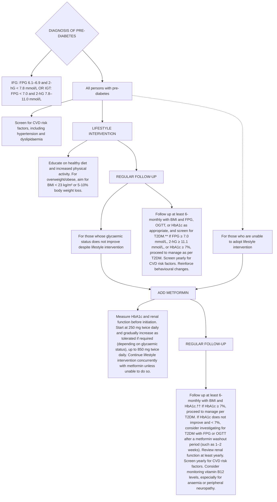

<!-- cpg_id: managing-pre-diabetes-(updated-on-27-jul-2021)c2bfc77474154c2abf623156a4b93002 | phase4 deterministic | spine: Overview, Diagnosis of pre-diabetes, Lifestyle intervention, Pharmacotherapy, References -->
<!-- meta | source: Appropriate Care Guide (ACG) | title: Managing pre-diabetes – a growing health concern -->


## Overview

```yaml
cpg_id: managing-pre-diabetes-(updated-on-27-jul-2021)c2bfc77474154c2abf623156a4b93002
chunk_id: managing-pre-diabetes-(updated-on-27-jul-2021)c2bfc77474154c2abf623156a4b93002.overview.prose.01
chunk_type: prose
section_id: overview
parent_rec: null
title: "Definitions and scope of application"
source_pages: [1]
strength: null
tables_referenced: []
figures_referenced: []
url_links: []
cross_refs: []
review_flags:
  - contains_conditional_language
```

First Published:

3 July 2017

Last updated:

27 July 2021

Diet and physical activity plan

### Key messages

1 Pre-diabetes is asymptomatic but puts a person at high risk of developing type 2 diabetes mellitus (T2DM) and cardiovascular disease (CVD).

② Early diagnosis, appropriate management and follow-up help to prevent or delay T2DM in persons with pre-diabetes.

3 Recommend lifestyle intervention to all persons with pre-diabetes.

4 Tailor lifestyle intervention to individual needs for sustained behavioural changes.

5 Consider metformin for persons with pre-diabetes when

- glycaemic status does not improve despite lifestyle intervention OR

- they are unable to adopt lifestyle intervention,

especially if persons outlined in the two points above have a body mass index (BMI) of  >= 23 \, kg/m^{2} \) , are younger than 60 years of age, or are women with a history of gestational diabetes.

### Preventing or delaying the progression to T2DM

Pre-diabetes is defined by glycaemic levels that are higher than normal, but lower than diabetes thresholds. Pre-diabetes is asymptomatic but predisposes individuals to T2DM and CVD. Around 14% of Singaporeans have impaired glucose tolerance and without lifestyle changes, at least 35% of persons with pre-diabetes in Singapore will progress to T2DM within eight years.   There is a pressing need to address pre-diabetes as part of the efforts to reduce the impact of T2DM and CVD.

Education increases awareness of pre-diabetes and enables individuals to adopt lifestyle changes.

---


## Diagnosis of pre-diabetes

```yaml
cpg_id: managing-pre-diabetes-(updated-on-27-jul-2021)c2bfc77474154c2abf623156a4b93002
chunk_id: managing-pre-diabetes-(updated-on-27-jul-2021)c2bfc77474154c2abf623156a4b93002.diagnosis_of_pre_diabetes.prose.01
chunk_type: prose
section_id: diagnosis_of_pre_diabetes
parent_rec: null
title: "Diagnosis of pre-diabetes overview"
source_pages: [1, 2]
strength: null
tables_referenced:
  - Table 1. Glucose thresholds for pre-diabetes
figures_referenced: []
url_links: []
cross_refs: []
review_flags: []
```

In Singapore, glucose thresholds in Table 1 below are used to diagnose pre-diabetes (impaired fasting glucose or impaired glucose tolerance).

In Singapore, glycated haemoglobin (HbA1c) is not currently indicated as a diagnostic test for pre-diabetes.

---

```yaml
cpg_id: managing-pre-diabetes-(updated-on-27-jul-2021)c2bfc77474154c2abf623156a4b93002
chunk_id: managing-pre-diabetes-(updated-on-27-jul-2021)c2bfc77474154c2abf623156a4b93002.diagnosis_of_pre_diabetes.table.01
chunk_type: table
section_id: diagnosis_of_pre_diabetes
parent_rec: null
title: "Table 1. Glucose thresholds for pre-diabetes"
source_pages: [2]
strength: null
image_dir: 0926c76e182d7b172c61b318f833bd15476059e4bbc9e59996281e04764494a8.jpg
url_links: []
cross_refs: []
review_flags:
  - contains_dosing_information
```

**Table 1. Glucose thresholds for pre-diabetes**

<table><tr><td>Pre-diabetes</td><td>Fasting plasma glucose (mmol/L)</td><td>2-hr post-load glucose (mmol/L)*</td></tr><tr><td>IFG</td><td>6.1–6.9</td><td>&lt;7.8</td></tr><tr><td>IGT</td><td>&lt;7.0</td><td>7.8–11.0</td></tr></table>

> *Footnote: IFG, impaired fasting glucose; IGT, impaired glucose tolerance*

---


## Lifestyle intervention

```yaml
cpg_id: managing-pre-diabetes-(updated-on-27-jul-2021)c2bfc77474154c2abf623156a4b93002
chunk_id: managing-pre-diabetes-(updated-on-27-jul-2021)c2bfc77474154c2abf623156a4b93002.lifestyle_intervention.prose.01
chunk_type: prose
section_id: lifestyle_intervention
parent_rec: null
title: "Lifestyle intervention overview"
source_pages: [2]
strength: null
tables_referenced: []
figures_referenced: []
url_links: []
cross_refs: []
review_flags: []
```

Lifestyle intervention is recommended for all persons with pre-diabetes, as adopting healthy diet and increased physical activity reduces the risk of them developing T2DM by 31 to 37% over 2 to 6 years, and is cost-effective.

For those who are overweight or obese, aim to gradually achieve and maintain a BMI of < 23 kg/m  or a 5 to 10% body weight loss.

Smokers are advised to stop smoking, as smoking impairs glucose metabolism, insulin sensitivity and secretion.

---

```yaml
cpg_id: managing-pre-diabetes-(updated-on-27-jul-2021)c2bfc77474154c2abf623156a4b93002
chunk_id: managing-pre-diabetes-(updated-on-27-jul-2021)c2bfc77474154c2abf623156a4b93002.lifestyle_intervention.prose.02
chunk_type: prose
section_id: lifestyle_intervention
parent_rec: null
title: "Healthy diet"
source_pages: [2]
strength: null
tables_referenced: []
figures_referenced: []
url_links: []
cross_refs: []
review_flags: []
```

A healthy and balanced diet plays a key role in preventing or delaying the progression to T2DM in persons with pre-diabetes.

Advise those who are overweight or obese to achieve weight loss by implementing a negative caloric balance.

---

```yaml
cpg_id: managing-pre-diabetes-(updated-on-27-jul-2021)c2bfc77474154c2abf623156a4b93002
chunk_id: managing-pre-diabetes-(updated-on-27-jul-2021)c2bfc77474154c2abf623156a4b93002.lifestyle_intervention.prose.03
chunk_type: prose
section_id: lifestyle_intervention
parent_rec: null
title: "Increased physical activity"
source_pages: [1, 2]
strength: null
tables_referenced: []
figures_referenced: []
url_links: []
cross_refs: []
review_flags:
  - contains_conditional_language
```

Obesity and a sedentary lifestyle are major risk factors for developing T2DM and can be modified by an increase in physical activity.

Pedometers or fitness trackers allow progress to be monitored over time and may provide additional motivation.

- Perform at least 150 minutes of moderate-intensity exercise (such as brisk walking, leisure cycling), or 75 minutes of vigorous-intensity exercise (such as jogging, fast-paced cycling, swimming laps) every week.

- Avoid more than two consecutive days without exercise.

- Engage in exercises that require intensity and that accelerate the heart rate.

---

```yaml
cpg_id: managing-pre-diabetes-(updated-on-27-jul-2021)c2bfc77474154c2abf623156a4b93002
chunk_id: managing-pre-diabetes-(updated-on-27-jul-2021)c2bfc77474154c2abf623156a4b93002.lifestyle_intervention.prose.04
chunk_type: prose
section_id: lifestyle_intervention
parent_rec: null
title: "Instructions on lifestyle intervention"
source_pages: [2]
strength: null
tables_referenced: []
figures_referenced: []
url_links: []
cross_refs: []
review_flags: []
```

Convey the following points to persons with pre-diabetes during consultations.

---

```yaml
cpg_id: managing-pre-diabetes-(updated-on-27-jul-2021)c2bfc77474154c2abf623156a4b93002
chunk_id: managing-pre-diabetes-(updated-on-27-jul-2021)c2bfc77474154c2abf623156a4b93002.lifestyle_intervention.prose.05
chunk_type: prose
section_id: lifestyle_intervention
parent_rec: null
title: "Portion a healthy plate"
source_pages: [2]
strength: null
tables_referenced: []
figures_referenced: []
url_links: []
cross_refs: []
review_flags: []
```

- Fill half the plate with vegetables and a small portion of fruits.

- Fill a quarter of the plate with lean meat, fish, poultry (skinless), eggs, low-fat dairy or soy products.

- Fill a quarter of the plate with whole grains, such as brown rice, rolled oats, whole grain bread or cereals.

---

```yaml
cpg_id: managing-pre-diabetes-(updated-on-27-jul-2021)c2bfc77474154c2abf623156a4b93002
chunk_id: managing-pre-diabetes-(updated-on-27-jul-2021)c2bfc77474154c2abf623156a4b93002.lifestyle_intervention.prose.06
chunk_type: prose
section_id: lifestyle_intervention
parent_rec: null
title: "Avoid sweetened beverages and foods"
source_pages: [2]
strength: null
tables_referenced: []
figures_referenced: []
url_links: []
cross_refs: []
review_flags: []
```

- Opt for water instead of sugar-sweetened beverages (such as soda, fruit juice, energy drinks).

---

```yaml
cpg_id: managing-pre-diabetes-(updated-on-27-jul-2021)c2bfc77474154c2abf623156a4b93002
chunk_id: managing-pre-diabetes-(updated-on-27-jul-2021)c2bfc77474154c2abf623156a4b93002.lifestyle_intervention.prose.07
chunk_type: prose
section_id: lifestyle_intervention
parent_rec: null
title: "Eat less fat"
source_pages: [2]
strength: null
tables_referenced: []
figures_referenced: []
url_links: []
cross_refs: []
review_flags: []
```

- Avoid pastries, fried food, and food containing coconut milk or cream.

- Use less oil when cooking and use healthier oils (such as sunflower oil, rice bran oil, olive oil) instead of butter, ghee, or palm oil.

---

```yaml
cpg_id: managing-pre-diabetes-(updated-on-27-jul-2021)c2bfc77474154c2abf623156a4b93002
chunk_id: managing-pre-diabetes-(updated-on-27-jul-2021)c2bfc77474154c2abf623156a4b93002.lifestyle_intervention.prose.08
chunk_type: prose
section_id: lifestyle_intervention
parent_rec: null
title: "Limit alcohol intake"
source_pages: [2]
strength: null
tables_referenced: []
figures_referenced: []
url_links: []
cross_refs: []
review_flags: []
```

- No more than one standard drink  per day for female.

- No more than two standard drinks  per day for male.

---

```yaml
cpg_id: managing-pre-diabetes-(updated-on-27-jul-2021)c2bfc77474154c2abf623156a4b93002
chunk_id: managing-pre-diabetes-(updated-on-27-jul-2021)c2bfc77474154c2abf623156a4b93002.lifestyle_intervention.prose.09
chunk_type: prose
section_id: lifestyle_intervention
parent_rec: null
title: "Sustained behavioural changes"
source_pages: [3]
strength: null
tables_referenced: []
figures_referenced: []
url_links: []
cross_refs: []
review_flags:
  - contains_conditional_language
```

Providing information without individualised advice may not be sufficient to bring about robust and sustained lifestyle changes. Lifestyle intervention should therefore be tailored to each person's needs and continuously encouraged.

---

```yaml
cpg_id: managing-pre-diabetes-(updated-on-27-jul-2021)c2bfc77474154c2abf623156a4b93002
chunk_id: managing-pre-diabetes-(updated-on-27-jul-2021)c2bfc77474154c2abf623156a4b93002.lifestyle_intervention.prose.10
chunk_type: prose
section_id: lifestyle_intervention
parent_rec: null
title: "Tailor lifestyle intervention to individual needs"
source_pages: [3]
strength: null
tables_referenced: []
figures_referenced: []
url_links: []
cross_refs: []
review_flags: []
```

- Assess lifestyle (such as diet and physical activity preferences, work nature, physical or budget constraints).

- Identify areas for improvement towards a healthier lifestyle.

- Provide advice on practical and sustainable lifestyle changes that fit into daily activities.

---

```yaml
cpg_id: managing-pre-diabetes-(updated-on-27-jul-2021)c2bfc77474154c2abf623156a4b93002
chunk_id: managing-pre-diabetes-(updated-on-27-jul-2021)c2bfc77474154c2abf623156a4b93002.lifestyle_intervention.prose.11
chunk_type: prose
section_id: lifestyle_intervention
parent_rec: null
title: "Reinforce behavioural changes continuously"
source_pages: [3]
strength: null
tables_referenced: []
figures_referenced: []
url_links: []
cross_refs: []
review_flags: []
```

- Encourage persons with pre-diabetes to keep a log of their diet, exercise, and weight.

- Advise them to visit the HealthHub website (by scanning the QR code below) to find out more about pre-diabetes and associated lifestyle change programmes. They can also download the HealthHub SG and HealthHub Track applications (App Store or Google Play Store).

- Supplement verbal advice with written information.

Scan the QR code to access pre-diabetes information on the HealthHub website

GO govsg

---

```yaml
cpg_id: managing-pre-diabetes-(updated-on-27-jul-2021)c2bfc77474154c2abf623156a4b93002
chunk_id: managing-pre-diabetes-(updated-on-27-jul-2021)c2bfc77474154c2abf623156a4b93002.lifestyle_intervention.prose.12
chunk_type: prose
section_id: lifestyle_intervention
parent_rec: null
title: "Role of lifestyle intervention"
source_pages: [5]
strength: null
tables_referenced: []
figures_referenced: []
url_links: []
cross_refs: []
review_flags: []
```

Lifestyle intervention reduces the risk of developing T2DM by 31 to 37% over 2 to 6 years

Illustration of a person riding a bicycle and a food delivery box with apples (no text or symbols)

For those who are overweight or obese, aim to gradually achieve and maintain a BMI of < 23 kg/m  or a 5 to 10% body weight loss

Two simple line icons: an apple with a measuring tape and a running person on a stick, both in light blue (no text or symbols)

Ways to implement lifestyle intervention

| Category | Value |
| -------- | ----- |
| Lean meat, low fat dairy or soy products | 25% |
| Whole grains, such as brown rice | 25% |
| Vegetables and a small portion of fruits | 50% |
| Eat less fat | SAY NO |
| e.g. Fruit juice | SAY NO |
| Limit alcohol intake | Female Male |
| 1 standard drink = 330 mL of beer = 100 mL of wine = 30 mL of spirits or hard liquor | 1 DAY |

---

```yaml
cpg_id: managing-pre-diabetes-(updated-on-27-jul-2021)c2bfc77474154c2abf623156a4b93002
chunk_id: managing-pre-diabetes-(updated-on-27-jul-2021)c2bfc77474154c2abf623156a4b93002.lifestyle_intervention.prose.13
chunk_type: prose
section_id: lifestyle_intervention
parent_rec: null
title: "≥ 150 minutes per week"
source_pages: [5]
strength: null
tables_referenced: []
figures_referenced: []
url_links: []
cross_refs: []
review_flags: []
```

of moderate-intensity exercise, such as brisk walking or leisure cycling

Illustration of a person riding a bicycle with a blue circular 'OR' symbol (no text or symbols on the figure itself)

leisure cycling (<16 km/hr)

---

```yaml
cpg_id: managing-pre-diabetes-(updated-on-27-jul-2021)c2bfc77474154c2abf623156a4b93002
chunk_id: managing-pre-diabetes-(updated-on-27-jul-2021)c2bfc77474154c2abf623156a4b93002.lifestyle_intervention.prose.14
chunk_type: prose
section_id: lifestyle_intervention
parent_rec: null
title: "≥ 75 minutes per week"
source_pages: [5]
strength: null
tables_referenced: []
figures_referenced: []
url_links: []
cross_refs: []
review_flags: []
```

of vigorous-intensity exercise, such as jogging or fast-paced cycling

Illustration of a person riding a bicycle with no text or symbols present

fast-paced cycling ( >= 16 km/hr)

No more than two consecutive days without exercise

Other modifications

Illustration of a person holding a no-smoking sign (no text or symbols present)

Smoking cessation

---

```yaml
cpg_id: managing-pre-diabetes-(updated-on-27-jul-2021)c2bfc77474154c2abf623156a4b93002
chunk_id: managing-pre-diabetes-(updated-on-27-jul-2021)c2bfc77474154c2abf623156a4b93002.lifestyle_intervention.prose.15
chunk_type: prose
section_id: lifestyle_intervention
parent_rec: null
title: "How to sustain lifestyle changes"
source_pages: [5]
strength: null
tables_referenced: []
figures_referenced: []
url_links: []
cross_refs: []
review_flags: []
```

Tailor lifestyle intervention to individual needs

Preference

Budget

Physical condition

Work
nature

Reinforce behavioural changes by encouraging a regular log of

Diet

Exercise

Weight

---


## Pharmacotherapy

```yaml
cpg_id: managing-pre-diabetes-(updated-on-27-jul-2021)c2bfc77474154c2abf623156a4b93002
chunk_id: managing-pre-diabetes-(updated-on-27-jul-2021)c2bfc77474154c2abf623156a4b93002.pharmacotherapy.prose.01
chunk_type: prose
section_id: pharmacotherapy
parent_rec: null
title: "Pharmacotherapy overview"
source_pages: [3]
strength: null
tables_referenced: []
figures_referenced: []
url_links: []
cross_refs: []
review_flags:
  - contains_conditional_language
```

Pharmacotherapy for pre-diabetes is less effective than lifestyle changes and may be considered after a trial of intensive lifestyle intervention.   Discuss the benefits, side effects, and cost before commencing treatment.

Metformin is the drug of choice as it has the strongest evidence and the longest safety data.   It has been shown to reduce the incidence of T2DM in persons with pre-diabetes by 26% over three years.

Acarbose  has shown a favourable trend in preventing or delaying T2DM in pre-diabetes.  However, the evidence for acarbose is not as robust or well-studied as for metformin. Consider acarbose only when metformin is not well-tolerated. Acarbose acts mainly by decreasing postprandial glucose. Hence, its glucose-lowering effect is more likely to benefit persons with IGT and not IFG alone.

---

```yaml
cpg_id: managing-pre-diabetes-(updated-on-27-jul-2021)c2bfc77474154c2abf623156a4b93002
chunk_id: managing-pre-diabetes-(updated-on-27-jul-2021)c2bfc77474154c2abf623156a4b93002.pharmacotherapy.prose.02
chunk_type: prose
section_id: pharmacotherapy
parent_rec: null
title: "Indication, dosing regimen, and side effects of metformin for pre-diabetes"
source_pages: [3]
strength: null
tables_referenced: []
figures_referenced: []
url_links: []
cross_refs: []
review_flags:
  - contains_conditional_language
  - contains_dosing_information
```

Consider metformin for persons with pre-diabetes when

- glycaemic status does not improve despite lifestyle intervention OR

- they are unable to adopt lifestyle intervention,

especially if persons outlined in the two points above have a BMI of  >=23 \)  kg/m  , are younger than 60 years of age, or are women with a history of gestational diabetes.

Start metformin at 250 mg twice daily and gradually increase as tolerated if required (depending on glycaemic status), up to 850 mg twice daily.

Take metformin with meals to reduce side effects such as nausea, vomiting, or diarrhoea.

---

```yaml
cpg_id: managing-pre-diabetes-(updated-on-27-jul-2021)c2bfc77474154c2abf623156a4b93002
chunk_id: managing-pre-diabetes-(updated-on-27-jul-2021)c2bfc77474154c2abf623156a4b93002.pharmacotherapy.figure.01
chunk_type: figure
section_id: pharmacotherapy
parent_rec: null
title: "Figure 1. Pathway for managing pre-diabetes"
source_pages: [4]
strength: null
reconstructed_from: mermaid
image_dir: grouped_p4_fig_01.jpg
url_links: []
cross_refs: []
review_flags: []
```

**Figure 1. Pathway for managing pre-diabetes**



> *Footnote: 2-hG, 2-hour post-load glucose; BMI, body mass index; CVD, cardiovascular disease; FPG, fasting plasma glucose; HbA1c, glycated haemoglobin; IFG, impaired fasting glucose; IGT, impaired glucose tolerance; OGTT, oral glucose tolerance test; T2DM, type 2 diabetes mellitus*

> *Footnote: ** If FPG ≥ 7.0 mmol/L, 2-hG ≥ 11.1 mmol/L, or HbA1c ≥ 7%, proceed to manage as per T2DM.*

> *Footnote: If HbA1c ≥ 7%, proceed to manage per T2DM. If HbA1c does not improve and < 7%, consider investigating for T2DM with FPG or OGTT after a metformin washout period (such as 1–2 weeks).*

---


## References

```yaml
cpg_id: managing-pre-diabetes-(updated-on-27-jul-2021)c2bfc77474154c2abf623156a4b93002
chunk_id: managing-pre-diabetes-(updated-on-27-jul-2021)c2bfc77474154c2abf623156a4b93002.references.reference.01
chunk_type: reference
section_id: references
parent_rec: null
title: "References"
source_pages: [6]
strength: null
tables_referenced: []
figures_referenced: []
url_links: []
cross_refs: []
review_flags: []
```

Scan the QR code for the reference list to this ACG

GO gov.sg

### EXPERT GROUP

### Lead discussant

Dr. Phua Eng Joo (KTPH)

### Chairperson

Dr. Darren Seah (NHGP)

### Group members

Ms. Debra Chan (TTSH)

A/Prof. Goh Su-Yen (SGH)

Dr. Khoo Chin Meng (NUHS)

Prof. Joyce Lee (UC Irvine)

Ms. Lee Hwee Khim (SHP)

Dr. Lim Hui Ling (International Medical Clinic)

Ms. Ng Soh Mui (NUP)

Dr. Gilbert Tan (SHP)

Dr. Tham Tat Yean (Frontier Healthcare Group)

Ms. Pauline Xie (NHGP)

### About the Agency

The Agency for Care Effectiveness (ACE) was established by the Ministry of Health (Singapore) to drive better decision-making in healthcare by conducting health technology assessments (HTA), publishing healthcare guidance and providing education. ACE develops ACGs to inform specific areas of clinical practice. ACGs are usually reviewed around five years after publication, or earlier, if new evidence emerges that requires substantive changes to the recommendations. To access this ACG online, along with other ACGs published to date, please visit www.ace-hta.gov.sg/acg

Find out more about ACE at www.ace-hta.gov.sg/about-us

© Agency for Care Effectiveness, Ministry of Health, Republic of Singapore

All rights reserved. Reproduction of this publication in whole or in part in any material form is prohibited without the prior written permission of the copyright holder. Application to reproduce any part of this publication should be addressed to: ACE_HTA@moh.gov.sg

Suggested citation:

Agency for Care Effectiveness (ACE). Managing pre-diabetes – a growing health concern. Appropriate Care Guide (ACG), Ministry of Health, Singapore. 2021. Available from: go.gov.sg/acg-managing-pre-diabetes-a-growing-health-concern

The Ministry of Health, Singapore disclaims any and all liability to any party for any direct, indirect, implied, punitive or other consequential damages arising directly or indirectly from any use of this ACG, which is provided as is, without warranties.

Agency for Care Effectiveness (ACE)

College of Medicine Building

16 College Road Singapore 169854

---
