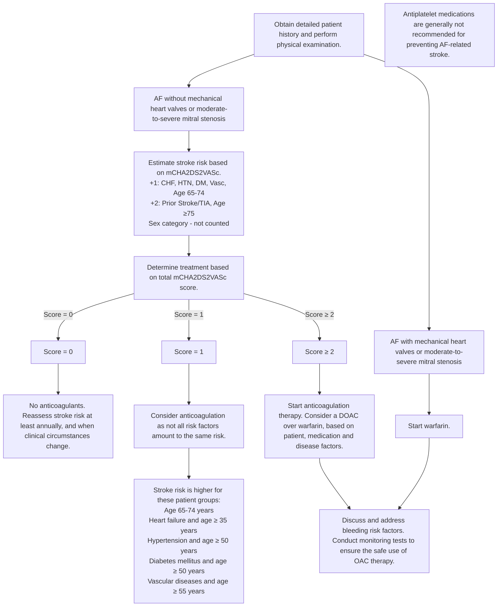
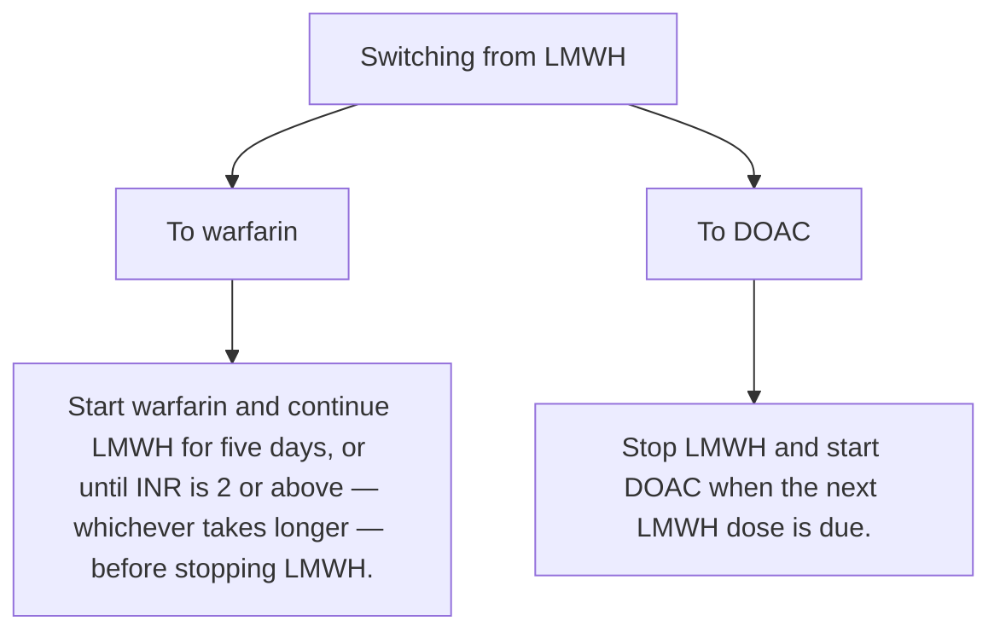
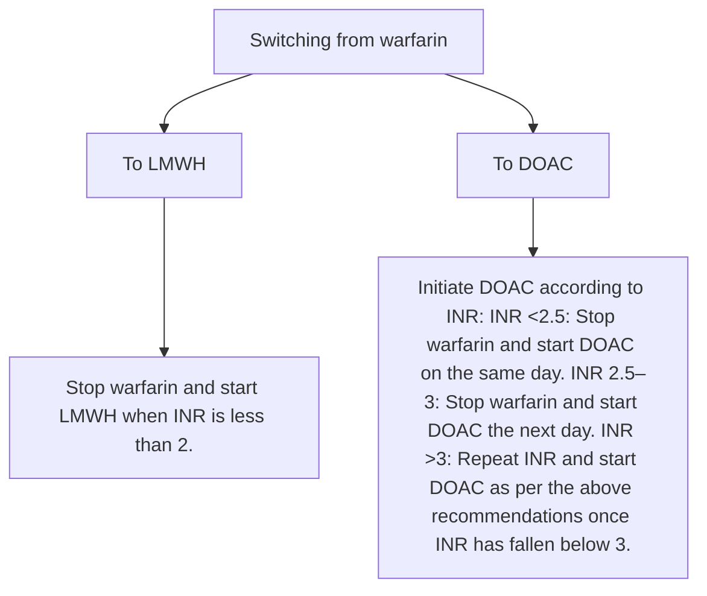
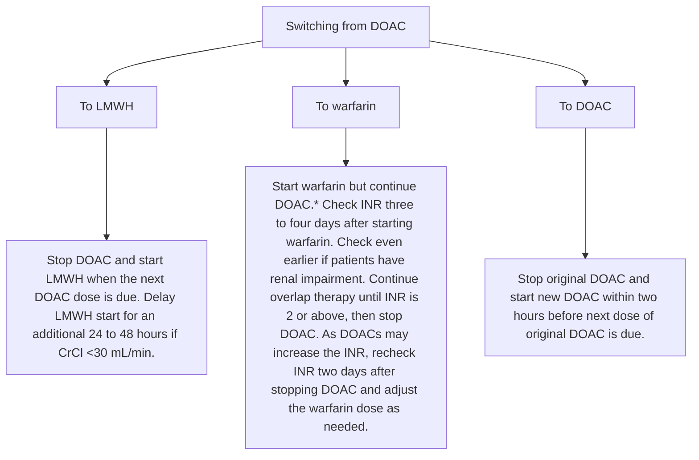

<!-- cpg_id: oral-anticoagulation-for-atrial-fibrillation | phase4 deterministic | spine: Overview, Assessment of stroke risk, Anticoagulation therapy, Monitoring and review, Assessing and addressing bleeding risk, Supplementary, References -->
<!-- meta | source: ACE CLINICAL GUIDANCE | published: First published: 20 Nov 2017 | url: www.ace-hta.gov.sg | title: Oral anticoagulation for atrial fibrillation -->


## Overview

```yaml
cpg_id: oral-anticoagulation-for-atrial-fibrillation
chunk_id: oral-anticoagulation-for-atrial-fibrillation.overview.prose.01
chunk_type: prose
section_id: overview
parent_rec: null
title: "Definitions and scope of application"
source_pages: [1]
strength: null
tables_referenced: []
figures_referenced: []
url_links: []
cross_refs: []
review_flags:
  - contains_dosing_information
  - contains_conditional_language
```

Last updated: 28 Nov 2023

[Non-Text]

Oral
anticoagulation
for atrial
fibrillation

### Objective

To optimise anticoagulation treatment for the prevention of atrial fibrillation-related stroke

### Scope

Oral anticoagulant (OAC) therapy as part of atrial fibrillation (AF) management

### Target audience

This clinical guidance is relevant to all healthcare professionals caring for patients with AF, especially those providing primary or generalist care

### Background

The prevalence of atrial fibrillation (AF) increases with advancing age. Having AF increases a person's risk of stroke by 3 to 5 times and locally, about  of strokes occurred in patients with AF in 2020.

Oral anticoagulation has been shown to be beneficial in patients with AF, with direct oral anticoagulants (DOACs) being associated with lower rates of stroke than warfarin.   Despite the established benefits of OAC therapy, many patients remain inadequately anticoagulated. In Asia, among patients with high stroke risk (CHA  DS  VASc ≥ 2) who should have been prescribed OACs, 15.7% were not prescribed any, or were only prescribed antiplatelet medications.   Even if patients were prescribed DOACs, research involving Asian populations revealed that 20-56% of patients received subtherapeutic doses, putting them at higher risk of stroke, thromboembolism, and death than those who received optimal doses.

Ensuring adequate anticoagulation is important to reduce the risk of AF-related strokes. A holistic approach should be taken to decide the appropriate OAC therapy; advanced age alone is not a contraindication to anticoagulation.

### Statement of Intent

This ACE Clinical Guidance (ACG) provides concise, evidence-based recommendations and serves as a common starting point nationally for clinical decision-making. It is underpinned by a wide array of considerations contextualised to Singapore, based on best available evidence at the time of development. The ACG is not exhaustive of the subject matter and does not replace clinical judgement. The recommendations in the ACG are not mandatory, and the responsibility for making decisions appropriate to the circumstances of the individual patient remains at all times with the healthcare professional.

---


## Assessment of stroke risk

```yaml
cpg_id: oral-anticoagulation-for-atrial-fibrillation
chunk_id: oral-anticoagulation-for-atrial-fibrillation.assessment_of_stroke_risk.recommendation.01
chunk_type: recommendation
section_id: assessment_of_stroke_risk
parent_rec: null
title: "Recommendation 1"
source_pages: [2]
strength: strong
tables_referenced: []
figures_referenced:
  - Figure 1. Overview of oral anticoagulation in AF-related stroke prevention
url_links: []
cross_refs: []
review_flags:
  - contains_conditional_language
```

**Recommendation 1:** Estimate stroke risk for patients with AF and start OAC therapy for those with a modified CHA  DS  VASc score  >=  2.

Assessment of stroke risk is required to decide if OAC therapy is clinically indicated for patients with AF. The    score was developed to estimate stroke risk in patients with AF without mechanical heart valves or moderate-to-severe mitral stenosis, with a higher score reflecting a higher stroke risk.

While gender is one of the risk factors in the    score, female gender alone may not increase stroke risk.   Furthermore, anticoagulation therapy seems to have no benefit for patients with    score = 0 for males and    score = 1 for females.   For these reasons, this ACG uses a modified    (, where gender does not contribute to the decision to initiate OAC therapy (see Figure 1).

### Stroke risks

A    score of 1 is associated with a stroke risk of 1.1 strokes per 100 patients per year, while a score of 2 is associated with a stroke risk more than twice as high.

### Considerations when

When    score = 1, the decision to start OAC should consider patient-specific factors such as age or underlying conditions. Stroke risk is higher for these patient groups:

- Age 65-74 years

- Heart failure and age ≥ 35 years

- Hypertension and age ≥ 50 years

- Diabetes mellitus and age ≥ 50 years

- Vascular diseases and age ≥ 55 years

### Patients with exceptionally high thromboembolic risk

The presence of either mechanical heart valves or moderate to severe mitral stenosis is associated with exceptionally high thromboembolic risks for patients with AF. For these patients, OAC therapy initiation is warranted, regardless of additional risk factors for stroke.

---


## Anticoagulation therapy

```yaml
cpg_id: oral-anticoagulation-for-atrial-fibrillation
chunk_id: oral-anticoagulation-for-atrial-fibrillation.anticoagulation_therapy.recommendation.02
chunk_type: recommendation
section_id: anticoagulation_therapy
parent_rec: null
title: "Recommendation 2"
source_pages: [2, 3, 4]
strength: strong
tables_referenced:
  - Table 1. Using DOACs for patients with AF and concomitant valvular heart disease (VHD)
figures_referenced: []
url_links: []
cross_refs: []
review_flags:
  - contains_conditional_language
  - contains_dosing_information
```

**Recommendation 2:** Choose a DOAC as the preferred OAC therapy for patients with AF, except for patients with mechanical heart valves or moderate-to-severe mitral stenosis for whom warfarin is the treatment of choice.

The choice of OAC is based on patient factors (including bleeding risks, age, comorbidities, renal and liver function, individual preferences), concomitant medications, tolerability, and cost considerations.

Review the indication, choice and dose of OAC at least annually and when the patient's clinical circumstances change (see Recommendations 3 and 4).

### Shared decision-making

Counsel the patient on the risks and benefits of anticoagulation. Discuss therapeutic options to help them make informed decisions about their treatment. This will facilitate management of potential complications and also encourage adherence.

### DOACs

Overall, DOACs  are recommended over warfarin for patients with AF without mechanical heart valves or moderate-to-severe mitral stenosis, due to their more favourable benefit-risk profile, fewer drug interactions, and improved convenience for patients as routine coagulation monitoring is not needed. With a lack of head-to-head trials, evidence is insufficient to recommend one DOAC over the others for safety and efficacy.

Compared to warfarin, DOACs are more effective at reducing AF-related strokes and systemic embolisms (SSE), especially for Asian patients.   They are also associated with fewer intracranial haemorrhages (ICH; about 2 to 5 ICH events avoided for every 1,000 patients treated per year) and have similar risks of gastrointestinal (GI) bleeding in Asian patients, compared to warfarin.   Another consideration for selecting a DOAC is that there is no need for international normalised ratio (INR) monitoring (e.g. in patients who find it difficult to access, or are reluctant to undergo, frequent INR monitoring). DOACs can also be used for some patients with valvular heart disease (see Table 1), but not for those with mechanical heart valves or moderate-to-severe mitral stenosis.

Routine monitoring with coagulation tests is not necessary or useful in patients on DOACs, except in cases of severe bleeding or urgent surgery. INR is not specific for DOACs and a normal prothrombin time or activated prothrombin time does not rule out the presence of residual DOACs' effects. However, a normal thrombin time can exclude the presence of clinically significant levels of dabigatran.

Switching eligible patients from warfarin to a DOAC (see Supplementary guide “Switching between anticoagulants”) could be considered, especially for those who already have a poor INR control (i.e., they are unable to maintain a therapeutic INR after multiple attempts to optimise it),  taking into account patient preferences and likely adherence to DOACs.

### Warfarin

Warfarin is the only medication with proven safety and efficacy in patients with atrial fibrillation and mechanical heart valves or moderate-to-severe mitral stenosis and it is therefore the treatment of choice for these patients.

### Is there a role for antiplatelets?

Antiplatelet medications are generally not recommended for preventing AF-related stroke.   Compared to aspirin, OACs halve the risk of SSE with no significant difference for bleeding outcomes.   A recent meta-analysis on aspirin reported a moderate reduction in the risk of all-cause stroke, but a significant increase in the risk of major bleeding and ICH compared with no treatment.   When anticoagulation therapy is contraindicated, the role of antiplatelet medications is unclear due to the lack of direct evidence for these patients with AF.   Based on local expert opinion, aspirin or clopidogrel could be considered for patients with AF in whom OAC therapy is contraindicated and who also have concomitant conditions that would benefit from antiplatelet medications, such as ischaemic heart disease, peripheral vascular disease, or a history of ischaemic stroke, transient ischaemic attack, or myocardial infarction.

---

```yaml
cpg_id: oral-anticoagulation-for-atrial-fibrillation
chunk_id: oral-anticoagulation-for-atrial-fibrillation.anticoagulation_therapy.figure.01
chunk_type: figure
section_id: anticoagulation_therapy
parent_rec: oral-anticoagulation-for-atrial-fibrillation.anticoagulation_therapy.recommendation.02
title: "Figure 1. Overview of oral anticoagulation in AF-related stroke prevention"
source_pages: [3]
strength: null
reconstructed_from: mermaid
image_dir: grouped_p3_fig_01.jpg
url_links: []
cross_refs: []
review_flags: []
```

**Figure 1. Overview of oral anticoagulation in AF-related stroke prevention**



---

```yaml
cpg_id: oral-anticoagulation-for-atrial-fibrillation
chunk_id: oral-anticoagulation-for-atrial-fibrillation.anticoagulation_therapy.table.01
chunk_type: table
section_id: anticoagulation_therapy
parent_rec: oral-anticoagulation-for-atrial-fibrillation.anticoagulation_therapy.recommendation.02
title: "Table 1. Using DOACs for patients with AF and concomitant valvular heart disease"
source_pages: [4]
strength: null
image_dir: 83e6319057baa57f02b5d8450e4e1bcde9799d7e0cb094714008e7fa7bcc5923.jpg
url_links: []
cross_refs: []
review_flags: []
```

**Table 1. Using DOACs for patients with AF and concomitant valvular heart disease (VHD)**

<table><tr><td>VHD subgroup</td><td>DOAC use</td></tr><tr><td>Mechanical heart valves or moderate-to-severe mitral stenosis</td><td>Not recommended* 25,26</td></tr><tr><td>Bioprosthetic heart valves</td><td>Recommended† 27-29</td></tr><tr><td>Aortic stenosis, mild mitral stenosis, aortic, mitral or tricuspid regurgitation</td><td>Recommended† 30-31</td></tr></table>

> *Footnote: * Harm was shown through higher rates of SSE and major bleeding.*

> *Footnote: Benefits were shown through lower risk of SSE and major bleeding.*

---

```yaml
cpg_id: oral-anticoagulation-for-atrial-fibrillation
chunk_id: oral-anticoagulation-for-atrial-fibrillation.anticoagulation_therapy.table.02
chunk_type: table
section_id: anticoagulation_therapy
parent_rec: oral-anticoagulation-for-atrial-fibrillation.anticoagulation_therapy.recommendation.02
title: "Other considerations for warfarin therapy in patients with AF"
source_pages: [4]
strength: null
image_dir: dcec98197354402498333a02865f7c89c330e7c7c58c7187fb465abafb899ae5.jpg
url_links: []
cross_refs: []
review_flags: []
```

**Other considerations for warfarin therapy in patients with AF**

<table><tr><td>Patient factors favouring warfarin</td><td>Precautions and practice considerations:</td></tr><tr><td>Severe renal or liver impairmentHigh potential for clinically significant drug-drug interactions with DOACsConcomitant antiphospholipid syndrome</td><td>Multiple drug-drug, drug-food or drug-herb interactionsA narrow therapeutic rangeRequires regular blood tests and at least 6 out of 10 INR readings to be within therapeutic rangeDelayed onset and offset of anticoagulation may necessitate bridging therapy</td></tr></table>

---

```yaml
cpg_id: oral-anticoagulation-for-atrial-fibrillation
chunk_id: oral-anticoagulation-for-atrial-fibrillation.anticoagulation_therapy.table.03
chunk_type: table
section_id: anticoagulation_therapy
parent_rec: oral-anticoagulation-for-atrial-fibrillation.anticoagulation_therapy.recommendation.02
title: "Table 2. Characteristics of oral anticoagulants registered in Singapore (extract"
source_pages: [5]
strength: null
image_dir: 2a000c9d9c5c6db68faa5611e49a6e390d5ba9977c188a991438eb136e89968d.jpg
url_links: []
cross_refs: []
review_flags: []
```

**Table 2. Characteristics of oral anticoagulants registered in Singapore (extracted from local product information leaflets)**

<table><tr><td>Medications</td><td>Warfarin‡</td><td>Apixaban‡</td><td>Rivaroxaban‡</td><td>Edoxaban</td><td>Dabigatran</td></tr><tr><td>Mechanism of action</td><td>Vitamin K antagonist</td><td>Direct factor Xa inhibitor</td><td>Direct factor Xa inhibitor</td><td>Direct factor Xa inhibitor</td><td>Direct thrombin inhibitor</td></tr><tr><td>Bioavailability</td><td>&gt;95%</td><td>~50%</td><td>80–100% when administered with food</td><td>~60%</td><td>6.5% Do not chew, break or open capsule</td></tr><tr><td>T (max)</td><td>72–96 h</td><td>3–4 h</td><td>2–4 h</td><td>1–2 h</td><td>0.5–2 h</td></tr><tr><td>Half-life</td><td>40 h</td><td>12 h</td><td>5–13 h</td><td>10–14 h</td><td>12–14 h</td></tr><tr><td>Routine coagulation monitoring</td><td>Yes</td><td>No</td><td>No</td><td>No</td><td>No</td></tr><tr><td>Reversal agent(s)</td><td>Vitamin K and/or 4F-PCC</td><td colspan="3">Andexanet alfa§ or 4F-PCC<eq>^{17,39,40}</eq></td><td>Idarucizumab or 4F-PCC<eq>^{17,39,40}</eq></td></tr><tr><td>Elimination</td><td>~100% metabolised, negligible in urine</td><td>27% renal, 73% faecal</td><td>67% renal, 33% faecal</td><td>35% renal, 65% faecal</td><td>85% renal</td></tr><tr><td>Drug interactions**</td><td>++++ Co-trimoxazole, fluconazole, metronidazole, rifampicin, carbamazepine, phenobarbitone, St John&#x27;s Wort, amiodarone</td><td colspan="2">++ Antifungals (e.g. azoles), macrolides (e.g. erythromycin), antituberculosis medications (e.g. rifampicin), phenytoin, valproate, carbamazepine, phenobarbitone, St John&#x27;s wort, antiretrovirals</td><td colspan="2">++ Antifungals (e.g. azoles), macrolides (e.g. erythromycin), antituberculosis medications (e.g. rifampicin), phenytoin, valproate, carbamazepine, phenobarbitone, St John&#x27;s wort, amiodarone, ciclosporin</td></tr></table>

---

```yaml
cpg_id: oral-anticoagulation-for-atrial-fibrillation
chunk_id: oral-anticoagulation-for-atrial-fibrillation.anticoagulation_therapy.table.04
chunk_type: table
section_id: anticoagulation_therapy
parent_rec: oral-anticoagulation-for-atrial-fibrillation.anticoagulation_therapy.recommendation.02
title: "Dosing according to renal function, CrCl (mL/min)"
source_pages: [5]
strength: null
image_dir: 4982245703446d1ed0761e55918e1edc42b5618b570bd79d281e08d90b290c7a.jpg
url_links: []
cross_refs: []
review_flags:
  - contains_dosing_information
```

**Dosing according to renal function, CrCl (mL/min)**

<table><tr><td>&gt;50</td><td rowspan="4">INR-adjusted</td><td rowspan="3">5 mg BD2.5 mg BD if patients have ≥ 2 of the following:• age ≥ 80 years• body weight ≤ 60 kg• serum creatinine ≥ 133 micromol/L</td><td>20 mg daily</td><td>60 mg daily30mg daily if patients are either:• ≤ 60kg• Taking the following P-gp inhibitors: quinidine, ciclosporin, dronedarone, erythromycin, ketoconazole</td><td rowspan="2">150 mg BD110 mg BD if patients are either:• age ≥ 80 years• taking verapamil• have high risk of bleeding</td></tr><tr><td>30 - 50</td><td rowspan="2">15 mg daily</td><td rowspan="2">30 mg daily</td></tr><tr><td>15–29<eq>^{\dagger\ddagger}</eq></td><td rowspan="2">Avoid</td></tr><tr><td>&lt; 15</td><td colspan="3">Avoid</td></tr></table>

---

```yaml
cpg_id: oral-anticoagulation-for-atrial-fibrillation
chunk_id: oral-anticoagulation-for-atrial-fibrillation.anticoagulation_therapy.table.05
chunk_type: table
section_id: anticoagulation_therapy
parent_rec: oral-anticoagulation-for-atrial-fibrillation.anticoagulation_therapy.recommendation.02
title: "Dosing in liver impairment"
source_pages: [5]
strength: null
image_dir: b710e8699eeaf0de67b89c356b305e992a31cda7e6f2f433ee64cf884553c1c2.jpg
url_links: []
cross_refs: []
review_flags:
  - contains_dosing_information
```

**Dosing in liver impairment**

<table><tr><td></td><td>INR-adjusted</td><td>Not recommended in severe liver disease</td></tr></table>

> *Footnote: 4F-PCC, four-factor prothrombin complex concentrate; BD, twice a day; CrCl, creatinine clearance; INR, international normalised ratio; P-gp, P-glycoprotein; T(max), time taken for a drug to reach maximum concentration*

> *Footnote: Available on government subsidy list.*

> *Footnote: § Andexanet alfa is not registered in Singapore at time of publication.*

> *Footnote: ** List of drug interactions is not exhaustive. Patients taking systemic strong CYP3A4 or P-gp inhibitors may be contraindicated for DOAC use. Please consult a pharmacist or appropriate online resources for information on medications with interacting metabolic pathways, especially when patients are taking new concomitant medications or supplements.*

> *Footnote: As estimated by Cockcroft-Gault formula.*

> *Footnote: Patients with CrCl < 30mL/min were excluded in pivotal trials for dabigatran, rivaroxaban and edoxaban. Patients with CrCl < 25mL/min were excluded in the pivotal trial for apixaban. However, product information leaflets state that apixaban, rivaroxaban and edoxaban can be used in patients with CrCl 15-29mL/min, based on pharmacokinetic data.*

---

```yaml
cpg_id: oral-anticoagulation-for-atrial-fibrillation
chunk_id: oral-anticoagulation-for-atrial-fibrillation.anticoagulation_therapy.table.06
chunk_type: table
section_id: anticoagulation_therapy
parent_rec: null
title: "Figure 2. Key monitoring parameters for patients with AF on DOACs"
source_pages: [6]
strength: null
image_dir: facd5dd80419d8c5f6a9a23c32e7e1fb32097538ae1810bb445d301733fac946.jpg
url_links: []
cross_refs: []
review_flags:
  - contains_dosing_information
```

**Figure 2. Key monitoring parameters for patients with AF on DOACs**

<table><tr><td></td><td>Monitoring parameters</td><td>When to check</td><td>Potential follow-up action</td></tr><tr><td>[AS8D]</td><td>Renal functionRenal impairment increases bleeding risk (see Table 4)Estimate using Cockcroft-Gault formula as this method was used in the pivotal trials<eq>^{42-45}</eq></td><td>At baselineAt least annually<eq>^{41,46}</eq> or more frequently (e.g. every <eq>\frac{CrCl}{10}</eq> months)<eq>^{§§}</eq> in patients with CrCl ≤ 60 mL/min<eq>^{41}</eq>When clinically indicated, such as the presence of concomitant factors that cause a decline in renal function (e.g. dehydration, NSAID use)<eq>^{41}</eq></td><td>-  Decrease dose. For apixaban, consider concomitant risk factors for dose reduction (see Table 2)ORIf CrCl &lt; 15 mL/min (or &lt;30mL/min for dabigatran), discuss clinical effects and choice of anticoagulant with a specialist</td></tr><tr><td>[2HKA]</td><td>Liver functionHepatic impairment increases bleeding risk (see Table 4)Note that patients with elevated liver enzymes were excluded in pivotal trialsAvoid in patients with severe hepatic impairment***</td><td>At baselineAt least annually<eq>^{41}</eq>When clinically indicated, such as the presence of hepatic conditions.<eq>^{41}</eq></td><td>MonitorOR For patients with elevated liver enzymes, discuss choice of anticoagulant with a specialist</td></tr><tr><td></td><td>Potential bleedingAssess for signs and symptoms</td><td>At baseline (including FBC)At every visitAs clinically indicated (including FBC)<eq>^{39}</eq></td><td>Monitor</td></tr><tr><td>[8KxW]</td><td>Age</td><td>At every visit</td><td>For patients aged ≥ 80 years, decrease dose of dabigatran and consider concomitant risk factors for dose reduction of apixaban (see Table 2)</td></tr><tr><td></td><td>Body weight</td><td>At every visit</td><td>For patients with body weight ≤ 60kg, decrease dose of edoxaban and consider concomitant risk factors for dose reduction of apixaban (see Table 2)</td></tr><tr><td></td><td>FrailtyAssociated with weight loss, renal impairment and fall risk, which increases bleeding risk<eq>^{41}</eq>Assess the fall risk of patients<eq>^{41}</eq></td><td>At every visit<eq>^{41}</eq></td><td>MonitorORDecrease dose (see Renal function and Body weight)</td></tr><tr><td></td><td>Changes in concomitant medicationsConsider the risk of drug interactions<eq>^{†††}</eq>Check medication history</td><td>At every visit</td><td>Monitor or switch OACORDecrease dose of edoxaban (see Table 2)</td></tr></table>

> *Footnote: CrCl, creatinine clearance; FBC, full blood count; NSAID, non-steroidal anti-inflammatory drug; OAC, oral anticoagulant*

> *Footnote: §§ For example, a patient with a CrCl 50mL/min could have his renal function reviewed every 5 months.*

> *Footnote: *** DOACs are contraindicated in patients with Child-Pugh C liver cirrhosis; rivaroxaban is also contraindicated in patients with Child-Pugh B liver cirrhosis.*

> *Footnote: See Table 2 for more details. Patients taking systemic strong CYP3A4 or P-gp inhibitors may be contraindicated for DOAC use. Please consult a pharmacist or appropriate online resources   for information on medications with interacting metabolic pathways, especially when patients are taking new concomitant medications or supplements.*

---

```yaml
cpg_id: oral-anticoagulation-for-atrial-fibrillation
chunk_id: oral-anticoagulation-for-atrial-fibrillation.anticoagulation_therapy.table.07
chunk_type: table
section_id: anticoagulation_therapy
parent_rec: null
title: "Figure 3. Key monitoring parameters for patients with AF on warfarin"
source_pages: [7]
strength: null
image_dir: 56562b8a5b7c952fde76d8e94bfd243310da2420b0d64ec75c137346fb939592.jpg
url_links: []
cross_refs: []
review_flags:
  - contains_dosing_information
```

**Figure 3. Key monitoring parameters for patients with AF on warfarin**

<table><tr><td></td><td>Monitoring parameters</td><td>When to check</td><td>Potential follow-up action</td></tr><tr><td></td><td>INR</td><td>In an outpatient setting:At baselineWhile INR is stabilising: every week (until INR is within therapeutic range)When INR is stable: every 4 to 8 weeksIf INR is very stable over an extended period: up to every 12 weeks</td><td> Establish and reinforce patient adherenceAND/OR Increase weekly doseOR Decrease weekly dose</td></tr><tr><td></td><td>Potential bleedingAssess for signs and symptoms</td><td>At baseline (including FBC)At every visitAs clinically indicated (including FBC)<eq>^{39}</eq></td><td> Monitor</td></tr><tr><td></td><td>FrailtyAssociated with weight loss, renal impairment and fall risk, which increases bleeding risk<eq>^{41}</eq>Assess the fall risk of patients<eq>^{41}</eq></td><td>At every visit<eq>^{41}</eq></td><td> MonitorOR Decrease dose (see Renal function and Body weight)</td></tr><tr><td></td><td>Changes in concomitant medicationsConsider the risk of drug interactionsCheck medication history</td><td>At every visit</td><td> Monitor or switch OACOR Decrease dose of edoxaban (see Table 2)</td></tr></table>

> *Footnote: FBC, full blood count; INR, international normalised ratio; OAC, oral anticoagulant*

---


## Monitoring and review

```yaml
cpg_id: oral-anticoagulation-for-atrial-fibrillation
chunk_id: oral-anticoagulation-for-atrial-fibrillation.monitoring_and_review.recommendation.03
chunk_type: recommendation
section_id: monitoring_and_review
parent_rec: null
title: "Recommendation 3"
source_pages: [6, 7]
strength: strong
tables_referenced:
  - Table 3. Management of high INR without significant bleeding
figures_referenced:
  - Figure 2. Key monitoring parameters for patients with AF on DOACs
  - Figure 3. Key monitoring parameters for patients with AF on warfarin
url_links: []
cross_refs: []
review_flags:
  - contains_conditional_language
  - contains_dosing_information
```

**Recommendation 3:** Conduct monitoring tests and relevant assessments to ensure the safe use of OAC therapy and to minimise bleeding risk.

Regular follow-up is recommended for all patients on OAC therapy to ensure that their treatment is optimised according to patient, drug, and disease factors (see Figure 2 below). More frequent monitoring may be required for individuals at increased risk for bleeding.

### Management of suboptimal INR levels

When a patient on warfarin has INR levels not in the therapeutic range, more frequent INR monitoring and dose adjustments are needed (see Figure 3 and Table 3).   Mild bleeding episodes   can be managed in outpatient settings while severe bleeding episodes   warrant hospitalisations. If reversal of anticoagulation is required due to severe bleeding, patients may be referred to specialists or the emergency department.

---

```yaml
cpg_id: oral-anticoagulation-for-atrial-fibrillation
chunk_id: oral-anticoagulation-for-atrial-fibrillation.monitoring_and_review.table.01
chunk_type: table
section_id: monitoring_and_review
parent_rec: oral-anticoagulation-for-atrial-fibrillation.monitoring_and_review.recommendation.03
title: "Table 3. Management of high INR without significant bleeding"
source_pages: [7]
strength: null
image_dir: 388b6116c32946fa1ac8f24295f635770083db1aba7d551776d653a77f8a2c89.jpg
url_links: []
cross_refs: []
review_flags:
  - contains_dosing_information
```

**Table 3. Management of high INR without significant bleeding**

<table><tr><td>INR</td><td>Management</td></tr><tr><td>Greater than therapeutic range but &lt; 4.5</td><td>Decrease or withhold dose.Monitor INR more frequently if clinically indicated, and restart warfarin at a lower dose when INR is within therapeutic range.</td></tr><tr><td>4.5-9.0</td><td>Withhold warfarin and consider administering oral vitamin K at 1–3 mg.Recheck INR within 24–48 h. If within range, resume warfarin at a lower dose. If INR is still high, administer a second dose of oral vitamin K at 1–3 mg.</td></tr><tr><td>&gt; 9.0</td><td>Withhold warfarin and consider administering oral vitamin K at 3–5 mg.Recheck INR within 24–48 h. If within range, resume warfarin at a lower dose. If INR is still high, administer a second dose of vitamin K at 1–3 mg.</td></tr></table>

> *Footnote: Practical notes on the use of vitamin K:*

> *Footnote: 1. Oral vitamin K is prepared from the parenteral preparation of vitamin K.*

> *Footnote: 2. The effect of oral vitamin K is usually seen after 24 h. The effects of parenteral and oral vitamin K are similar after 24 h.*

> *Footnote: 3. Excessive doses of vitamin K is associated with resistance to warfarin when restarting the medication.*

> *Footnote: Bleeding that does not require blood transfusions and does not cause haemodynamic instability. Examples include nose bleeds, small bruises and bleeding after minor trauma such as shaving.*

> *Footnote: Bleeding into critical sites (e.g. intracranial) or bleeding that causes haemodynamic instability.   Clinical judgment is required to assess the severity of bleeding, urgency of warfarin reversal and need for additional interventions.*

---


## Assessing and addressing bleeding risk

```yaml
cpg_id: oral-anticoagulation-for-atrial-fibrillation
chunk_id: oral-anticoagulation-for-atrial-fibrillation.assessing_and_addressing_bleeding_risk.prose.01
chunk_type: prose
section_id: assessing_and_addressing_bleeding_risk
parent_rec: null
title: "Assessing and addressing bleeding risk overview"
source_pages: [8]
strength: null
tables_referenced:
  - Table 4. HAS-BLED score
figures_referenced: []
url_links: []
cross_refs: []
review_flags: []
```

It is important to assess and address bleeding risk throughout the full duration of anticoagulation. Annual major bleeding risks in patients on anticoagulation range from 2.1 to 3.6% for DOACs and 3.1 to 3.4% for warfarin.   Most of these were GI bleeds and less frequently, ICH.

While bleeding risk scores such as HAS-BLED (see Table 4) only have a moderate ability for predicting major bleeding events,  they are useful to identify modifiable risk factors (see 📋 icon in Table 4).

---

```yaml
cpg_id: oral-anticoagulation-for-atrial-fibrillation
chunk_id: oral-anticoagulation-for-atrial-fibrillation.assessing_and_addressing_bleeding_risk.prose.02
chunk_type: prose
section_id: assessing_and_addressing_bleeding_risk
parent_rec: null
title: "Bleeding risk scores"
source_pages: [7, 8]
strength: null
tables_referenced: []
figures_referenced: []
url_links: []
cross_refs: []
review_flags: []
```

Bleeding risk scores should not be used to withhold anticoagulation. Instead, inform patients accordingly of their bleeding risk and make every effort to reduce bleeding risk.

denotes modifiable risk factors

ALP, alkaline phosphatase; ALT, alanine transaminase; AST, aspartate transaminase; INR, international normalised ratio; NSAIDs, non-steroidal anti-inflammatory drugs; ULN, Upper limit of normal.

### For example, as based on frailty assessment scores or tools.

---

```yaml
cpg_id: oral-anticoagulation-for-atrial-fibrillation
chunk_id: oral-anticoagulation-for-atrial-fibrillation.assessing_and_addressing_bleeding_risk.table.01
chunk_type: table
section_id: assessing_and_addressing_bleeding_risk
parent_rec: null
title: "Table 4. HAS-BLED score"
source_pages: [8]
strength: null
image_dir: 317dd4b78d60dbba42a28b60b9403bbe47b68071acb0d498cfbcecc5273325e1.jpg
url_links: []
cross_refs: []
review_flags:
  - contains_dosing_information
```

**Table 4. HAS-BLED score**

<table><tr><td colspan="3">Risk factor</td><td>Points</td></tr><tr><td>H</td><td>Uncontrolled hypertension (systolic blood pressure &gt; 160 mmHg)</td><td>[SGDZ]</td><td>1</td></tr><tr><td rowspan="2">A</td><td colspan="2">Abnormal renal function: Dialysis, renal transplant, serum creatinine &gt; 200 micromol/L</td><td>1</td></tr><tr><td colspan="2">Abnormal liver function: Cirrhosis or Bilirubin &gt; 2x ULN or AST or ALT or ALP &gt; 3x ULN</td><td>1</td></tr><tr><td>S</td><td colspan="2">Stroke (history of)</td><td>1</td></tr><tr><td>B</td><td colspan="2">Bleeding (history of or predisposition to bleeding)</td><td>1</td></tr><tr><td>L</td><td>Labile INRs (unstable or high INRs or &lt; 6 in 10 INRs were within the therapeutic range)</td><td></td><td>1</td></tr><tr><td>E</td><td colspan="2">Elderly (age &gt; 65 years) or extreme frailty§§§</td><td>1</td></tr><tr><td rowspan="2">D</td><td>Drugs (e.g. antiplatelet medications or NSAIDs)</td><td></td><td>1</td></tr><tr><td>Alcohol (&gt; 14 units [men] or &gt; 7 units [women] per week)</td><td></td><td>1</td></tr><tr><td colspan="3">Maximum score</td><td>9</td></tr></table>

---

```yaml
cpg_id: oral-anticoagulation-for-atrial-fibrillation
chunk_id: oral-anticoagulation-for-atrial-fibrillation.assessing_and_addressing_bleeding_risk.prose.03
chunk_type: prose
section_id: assessing_and_addressing_bleeding_risk
parent_rec: null
title: "High bleeding risk"
source_pages: [8]
strength: null
tables_referenced: []
figures_referenced: []
url_links: []
cross_refs: []
review_flags: []
```

A HAS-BLED score of  >=  3 indicates high bleeding risk, with  >=  4 bleeds per 100 patients per year.   Monitor these patients more frequently, and take steps to reduce their bleeding risks. Educate the patient and their carers about recognising signs and symptoms of bleeding.

---

```yaml
cpg_id: oral-anticoagulation-for-atrial-fibrillation
chunk_id: oral-anticoagulation-for-atrial-fibrillation.assessing_and_addressing_bleeding_risk.recommendation.04
chunk_type: recommendation
section_id: assessing_and_addressing_bleeding_risk
parent_rec: null
title: "Recommendation 4"
source_pages: [8, 9]
strength: strong
tables_referenced: []
figures_referenced: []
url_links: []
cross_refs: []
review_flags:
  - contains_conditional_language
  - contains_dosing_information
```

**Recommendation 4:** Reassess stroke risk and review the need for an OAC in patients who are not on OAC therapy at least annually, and when clinical circumstances change.

Stroke risk is not static, and it increases with factors such as age and incident comorbidities. For patients with AF who are not taking OACs, continue to re-assess their    score at least annually and when clinically indicated.

> *Footnote: One cohort study of 14,606 Taiwanese patients with AF not taking OAC at enrolment recommended reviewing stroke risk every 4 months; of 6,188 patients who acquired new comorbidities (heart failure, hypertension, diabetes mellitus or vascular diseases), 90% of them experienced an ischaemic stroke at least 4.4 months after acquiring the comorbidities.*

SUPPLEMENTARY GUIDE

Published: 28 May 2018

Last updated: 28 Nov 2023

www.ace-hta.gov.sg

### Switching between anticoagulants

Anticoagulants may be changed for medical reasons [such as hepatic or renal impairment, fluctuating international normalised ratio (INR) levels, or increased bleeding risk] or social reasons (such as cost issues, reluctance to do blood tests, poor adherence, and altered patient preferences). In general, switching between anticoagulants exposes patients to periods of increased thromboembolic and bleeding risks. This document gives guidance on appropriate switching strategies between low molecular weight heparin (LMWH), warfarin, and direct oral anticoagulants (DOACs).







- For patients on edoxaban 60 mg, start warfarin but decrease edoxaban dose to 30 mg once daily until INR ≥2.

---


## References

```yaml
cpg_id: oral-anticoagulation-for-atrial-fibrillation
chunk_id: oral-anticoagulation-for-atrial-fibrillation.references.reference.01
chunk_type: reference
section_id: references
parent_rec: null
title: "References"
source_pages: [10]
strength: null
tables_referenced: []
figures_referenced: []
url_links:
  - https://go.gov.sg/acg-oac-for-af-reference-list
cross_refs: []
review_flags: []
```

Click or scan the QR code for the reference list to this clinical guidance

- https://go.gov.sg/acg-oac-for-af-reference-list

### Expert group

### Lead discussant

Dr Lim Toon Wei, Cardiology (NUH)

### Chairperson

A/Prof Ching Chi Keong, Cardiology (NHCS)

#### Members

Dr Bernard Chan, Neurology (NUH)

Mr Kong Ming Chai, Pharmacy (SGH)

Clin A/Prof How Choon How, Family Medicine (CGH)

Dr Hwang Siew Wai, Family Medicine (SHP)

Clin Prof Lee Lai Heng, Haematology (SGH)

Dr Lee Sze Haur, Neurology (NNI@TTSH Campus)

A/Prof Doreen Tan, Cardiology Specialist Pharmacist (NUS/NUHCS)

### About the Agency

The Agency for Care Effectiveness (ACE) was established by the Ministry of Health (Singapore) to drive better decision-making in healthcare by conducting health technology assessments (HTA), publishing healthcare guidance and providing education. ACE develops ACE Clinical Guidances (ACGs) to inform specific areas of clinical practice. ACGs are usually reviewed around five years after publication, or earlier, if new evidence emerges that requires substantive changes to the recommendations. To access this ACG online, along with other ACGs published to date, please visit www.ace-hta.gov.sg/acg

Find out more about ACE at www.ace-hta.gov.sg/about-us

### © Agency for Care Effectiveness, Ministry of Health, Republic of Singapore

All rights reserved. Reproduction of this publication in whole or in part in any material form is prohibited without the prior written permission of the copyright holder. Application to reproduce any part of this publication should be addressed to: ACE_HTA@moh.gov.sg

Suggested citation:

Agency for Care Effectiveness (ACE). Oral anticoagulation for atrial fibrillation. ACE Clinical Guidance (ACG), Ministry of Health, Singapore. 2023.

Available from: go.gov.sg/acg-oac-for-af

The Ministry of Health, Singapore disclaims any and all liability to any party for any direct, indirect, implied, punitive or other consequential damages arising directly or indirectly from any use of this ACG, which is provided as is, without warranties.

Agency for Care Effectiveness (ACE)

College of Medicine Building

16 College Road Singapore 169854

---
