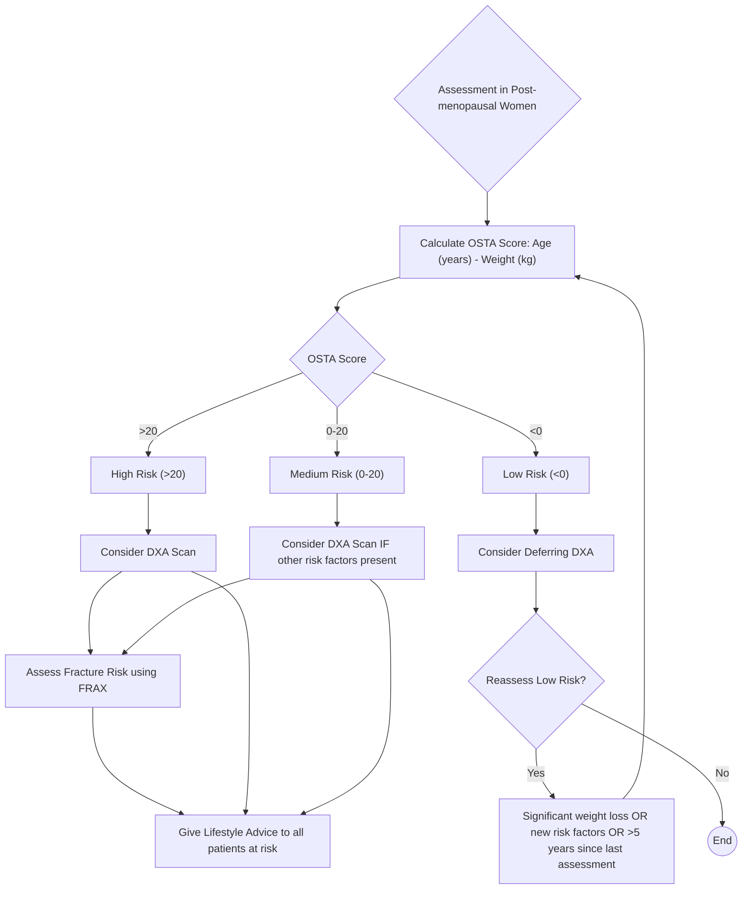
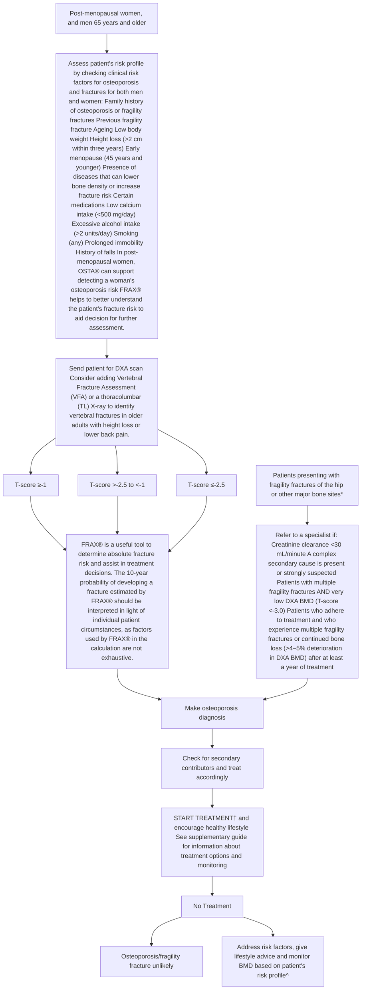

<!-- cpg_id: osteoporosis---identification-and-management-in-primary-care-(nov-2018) | phase4 deterministic | spine: Overview, Identifying patients at risk, Making a diagnosis, Referring patients, When to start treatment, Treatment monitoring, References -->
<!-- meta | source: APPROPRIATE CARE GUIDE | published: Published: 7 Nov 2018 | url: www.ace-hta.gov.sg | title: Osteoporosis. Identification and management in primary care -->


## Overview

```yaml
cpg_id: osteoporosis---identification-and-management-in-primary-care-(nov-2018)
chunk_id: osteoporosis---identification-and-management-in-primary-care-(nov-2018).overview.prose.01
chunk_type: prose
section_id: overview
parent_rec: null
title: "Key messages"
source_pages: [1]
tables_referenced: []
figures_referenced: []
url_links: []
cross_refs: []
review_flags: []
```

1 Assess osteoporosis risk in post-menopausal women, and men 65 years and older.

2 Diagnose osteoporosis in patients with a fragility fracture or DXA BMDT-score ≤-2.5.

3 Treat patients diagnosed with osteoporosis, or patients with osteopaenia and high fracture risk.

4 Refer selected patient groups to a specialist only when necessary.

### Early identification is key to reducing fragility fractures

Osteoporosis is a skeletal disease in which bone density and quality are reduced. Unrecognised or untreated osteoporosis increases fracture risk. Patients suffering hip or spine fractures need long hospitalisations and repeated rehabilitation. Also, these fractures lead to reduced ability to live actively, productively, and independently.

As osteoporosis is often asymptomatic until the patient presents with a fragility fracture (a fracture that occurs as a result of minimal trauma, or no identifiable trauma), early identification of patients at

risk is key to fracture prevention. Many factors influence an individual's likelihood to develop osteoporosis, with age and gender playing key roles. A careful assessment of the patient's risk profile is needed to identify the need for bone mineral density assessment (BMD) using dual energy X-ray absorptiometry (DXA). Low BMD defines presence of osteoporosis, but other elements also have an effect on the risk of fragility fractures. In primary care, recognising the patient's risk of osteoporosis or fragility fractures can enable appropriate diagnosis and management, keeping the patient fracture-free.

---


## Identifying patients at risk

```yaml
cpg_id: osteoporosis---identification-and-management-in-primary-care-(nov-2018)
chunk_id: osteoporosis---identification-and-management-in-primary-care-(nov-2018).identifying_patients_at_risk.prose.01
chunk_type: prose
section_id: identifying_patients_at_risk
parent_rec: null
title: "Identifying patients at risk overview"
source_pages: [1, 2]
tables_referenced:
  - Table 1. Risk factors for osteoporosis or fragility fractures
figures_referenced: []
url_links: []
cross_refs: []
review_flags:
  - contains_conditional_language
```

Recognising patients with osteoporosis risk or high fracture risk is key in identifying those who will benefit from further evaluation, counselling, and treatment. As age and gender are well-established osteoporosis risk factors, the risk profile of post-menopausal women, and men 65 years and older  should be further assessed. Several risk factors are known to be associated with osteoporosis and fragility fractures (Table 1).

When assessment is conducted in post-menopausal women, the Osteoporosis Self-Assessment Tool for Asians (OSTA) can support detecting a woman's osteoporosis risk.

Based on the woman's risk as per the coloured chart:

- High-risk (>20) → consider DXA scan as the chance of finding osteoporosis (low BMD) is high in this group

- Medium-risk (0-20) → consider DXA scan if any other risk factor(s) (Table 1) for osteoporosis is present

- Low-risk (<0) → consider deferring DXA

In patients initially deemed low risk, reassess risk if there has been significant weight loss or any clinical risk factor development since the last visit, or if last assessment was five or more years ago.

---

```yaml
cpg_id: osteoporosis---identification-and-management-in-primary-care-(nov-2018)
chunk_id: osteoporosis---identification-and-management-in-primary-care-(nov-2018).identifying_patients_at_risk.table.01
chunk_type: table
section_id: identifying_patients_at_risk
parent_rec: null
title: "Table 1. Risk factors for osteoporosis or fragility fractures"
source_pages: [2]
image_dir: 3b6db5e1b149061b2c6cb184d5c1012a8acc35a4e10ea0670380fd613cb0ddbc.jpg
url_links: []
cross_refs: []
review_flags:
  - contains_dosing_information
```

**Table 1. Risk factors for osteoporosis or fragility fractures**

<table><tr><td>Family history of osteoporosis or fragility fractures</td><td>Certain medications^</td></tr><tr><td>Previous fragility fracture</td><td>Low calcium intake (&lt;500 mg/day)*</td></tr><tr><td>Ageing</td><td>Excessive alcohol intake (&gt;2 units/day)</td></tr><tr><td>Low body weight</td><td>Smoking (any)</td></tr><tr><td>Height loss (&gt;2 cm within three years)</td><td>Prolonged immobility</td></tr><tr><td>Early menopause (45 years and younger)</td><td>History of falls</td></tr><tr><td colspan="2">Presence of diseases that can lower bone density or increase fracture risk#</td></tr></table>

---

```yaml
cpg_id: osteoporosis---identification-and-management-in-primary-care-(nov-2018)
chunk_id: osteoporosis---identification-and-management-in-primary-care-(nov-2018).identifying_patients_at_risk.figure.01
chunk_type: figure
section_id: identifying_patients_at_risk
parent_rec: null
title: "Figure 1. OSTA for risk assessment in postmenopausal women"
source_pages: [2]
reconstructed_from: mermaid
image_dir: grouped_p2_fig_01.jpg
url_links: []
cross_refs: []
review_flags: []
```

**Figure 1. OSTA for risk assessment in postmenopausal women**



---

```yaml
cpg_id: osteoporosis---identification-and-management-in-primary-care-(nov-2018)
chunk_id: osteoporosis---identification-and-management-in-primary-care-(nov-2018).identifying_patients_at_risk.prose.02
chunk_type: prose
section_id: identifying_patients_at_risk
parent_rec: null
title: "Lifestyle advice for all patients at risk"
source_pages: [3]
tables_referenced: []
figures_referenced: []
url_links: []
cross_refs: []
review_flags:
  - contains_conditional_language
  - contains_dosing_information
```

Healthy lifestyle choices can reduce osteoporosis-associated risks. However, when pharmacological treatment is indicated, lifestyle management is not considered a substitute.

- Advise on appropriate calcium intake (1,000 mg/day of elemental calcium for healthy adults 51 years and older, and 800 mg/day for adults 19 to 50 years old*)

- Optimise vitamin D intake (51 to 70 years old = 600 IU/day; >70 years old = 800 IU/day^)

- Advise on appropriate weight-bearing, muscle-strengthening, and balance exercises such as walking, elastic band exercises, and Tai Chi

- Advise on smoking cessation and appropriate alcohol intake

- Educate on fall risk, home safety, and footwear

- Educate patient about osteoporosis and fragility fractures and their implications

- Source: Singapore Health Promotion Board

^ Source: Institute Of Medicine

---


## Making a diagnosis

```yaml
cpg_id: osteoporosis---identification-and-management-in-primary-care-(nov-2018)
chunk_id: osteoporosis---identification-and-management-in-primary-care-(nov-2018).making_a_diagnosis.prose.01
chunk_type: prose
section_id: making_a_diagnosis
parent_rec: null
title: "Making a diagnosis overview"
source_pages: [3]
tables_referenced:
  - Table 2. Laboratory tests to identify secondary contributors of osteoporosis
figures_referenced: []
url_links: []
cross_refs: []
review_flags:
  - contains_conditional_language
```

The diagnosis of osteoporosis is universally defined by either the presence of a fragility fracture, or a hip and/or spine DXA BMD T-score of -2.5 or lower.   DXA is the standard technique for measuring BMD. BMD measurements of the hip and spine are widely accepted for the diagnosis. Consider adding vertebral fracture assessment (VFA) or a thoracolumbar (TL)

X-ray to identify vertebral fractures in older adults with height loss or lower back pain.

After diagnosis, a careful clinical history and physical examination is required, and the laboratory tests below should be considered to exclude secondary contributors of bone loss (Table 2).

---

```yaml
cpg_id: osteoporosis---identification-and-management-in-primary-care-(nov-2018)
chunk_id: osteoporosis---identification-and-management-in-primary-care-(nov-2018).making_a_diagnosis.table.01
chunk_type: table
section_id: making_a_diagnosis
parent_rec: null
title: "Table 2. Laboratory tests to identify secondary contributors of osteoporosis"
source_pages: [3]
image_dir: 005a5e8082fd000cd8a877f307f041e0fab376ea7731787412391226d9d04830.jpg
url_links: []
cross_refs: []
review_flags:
  - contains_dosing_information
```

**Table 2. Laboratory tests to identify secondary contributors of osteoporosis**

<table><tr><td></td><td>Test</td><td>Clinical rationale</td></tr><tr><td rowspan="4">More commonly indicated</td><td>Creatinine</td><td>Determines baseline renal function to inform treatment choice (may also indicate presence of chronic kidney disease-mineral and bone disorder [CKD-MBD])</td></tr><tr><td>Full blood count</td><td>Identifies a range of disorders, including presence of malignancies and malabsorption</td></tr><tr><td>Corrected calcium</td><td>Increased level might indicate primary hyperparathyroidism or malignancy; decreased level might indicate malabsorption or vitamin D deficiency</td></tr><tr><td>25-hydroxy vitamin D^</td><td>To test baseline level for vitamin D (aim for &gt;20 ng/mL for optimal bone and muscle strength)</td></tr><tr><td rowspan="6">Others</td><td>Thyroid-stimulating hormone</td><td>Decreased levels might indicate hyperthyroidism or over-replacement with thyroxine</td></tr><tr><td>Erythrocyte sedimentation rate (ESR)</td><td>Very high ESR might indicate rheumatological disease. A raised ESR in association with raised creatinine and anaemia might indicate haematological disease such as myeloma</td></tr><tr><td>Alkaline phosphatase</td><td>Increased levels might indicate liver disease, Paget&#x27;s disease, recent fracture, or other bone pathology</td></tr><tr><td>Serum phosphate*</td><td>Abnormal levels might indicate vitamin D deficiency or renal phosphate wasting</td></tr><tr><td>Spot urine calcium/ creatinine ratio</td><td>Elevated levels might indicate idiopathic hypercalciuria†</td></tr><tr><td>Serum total testosterone#</td><td>Decreased levels might indicate hypogonadism</td></tr></table>

> *Footnote: Other disease states that can act as secondary contributors: Cushing's syndrome, chronic obstructive pulmonary disease, organ transplantation, and anorexia nervosa*

> *Footnote: ^ Repeated tests are not needed*

> *Footnote: * Fasting needed for more accurate results*

> *Footnote: Urinary calcium/creatinine level >0.6 (urine calcium and urine creatinine in mmol/l) suggests the need to do 24-hour urine calcium test*

> *Footnote: # In men <70 years of age or in those with hypogonadal symptoms. Morning test recommended for more accurate results*

---


## Referring patients

```yaml
cpg_id: osteoporosis---identification-and-management-in-primary-care-(nov-2018)
chunk_id: osteoporosis---identification-and-management-in-primary-care-(nov-2018).referring_patients.prose.01
chunk_type: prose
section_id: referring_patients
parent_rec: null
title: "Referring patients overview"
source_pages: [4]
tables_referenced: []
figures_referenced: []
url_links: []
cross_refs: []
review_flags:
  - contains_conditional_language
```

Consider referring only selected patient groups to a specialist. These include:

- Creatinine clearance estimated by Cockcroft-Gault equation  minute

- Confirmed or strongly suspected complex secondary causes

- Patients with multiple fragility fractures AND very low DXA BMD (T-score <-3.0)

- Patients who adhere to treatment and experience fragility fractures or continued bone loss (  deterioration in DXA BMD after at least a year of treatment. Before referring these patients, consider reviewing secondary contributors of osteoporosis and/or switch to intravenous or subcutaneous therapy to negate problems of poor gut absorption or poor compliance with oral therapy

The choice of specialist depends on the reason for referral.

---


## When to start treatment

```yaml
cpg_id: osteoporosis---identification-and-management-in-primary-care-(nov-2018)
chunk_id: osteoporosis---identification-and-management-in-primary-care-(nov-2018).when_to_start_treatment.prose.01
chunk_type: prose
section_id: when_to_start_treatment
parent_rec: null
title: "When to start treatment overview"
source_pages: [4]
tables_referenced: []
figures_referenced: []
url_links: []
cross_refs: []
review_flags:
  - contains_conditional_language
```

Treatment decision-making involves exercising clinical judgement in weighing overall risks and benefits of different management options in individual patient circumstances, and discussing with the patient (including treatment duration). Consider starting anti-osteoporosis treatment in the following groups:

- Patients presenting with a fragility fracture

- Patients without a fragility fracture, but with DXA BMD T-scores of ≤-2.5

- Osteopaenic patients (DXA BMD T-scores >-2.5 but <-1) without a fragility fracture, but with high fracture risk

---

```yaml
cpg_id: osteoporosis---identification-and-management-in-primary-care-(nov-2018)
chunk_id: osteoporosis---identification-and-management-in-primary-care-(nov-2018).when_to_start_treatment.prose.02
chunk_type: prose
section_id: when_to_start_treatment
parent_rec: null
title: "Assessing fracture risk using FRAX®"
source_pages: [4]
tables_referenced: []
figures_referenced: []
url_links: []
cross_refs: []
review_flags: []
```

FRAX is a useful tool to determine absolute fracture risk and assist in treatment decisions (sheffield.ac.uk/FRAX). The 10-year probability of developing a fracture estimated by FRAX should be interpreted in light of individual patient circumstances, as the parameters used by FRAX in the calculation are not exhaustive. Although other fracture risk calculators are available (such as Garvan fracture risk calculator or QFracture), FRAX is recommended given its multi-country validation and the availability of a Singapore model. FRAX thresholds for treatment should be country-specific. Singapore-specific thresholds are under development and will be made available at ace-hta.gov.sg once validated.

Scan to go to FRAX® calculator website

---

```yaml
cpg_id: osteoporosis---identification-and-management-in-primary-care-(nov-2018)
chunk_id: osteoporosis---identification-and-management-in-primary-care-(nov-2018).when_to_start_treatment.prose.03
chunk_type: prose
section_id: when_to_start_treatment
parent_rec: null
title: "Fragility fracture"
source_pages: [4]
tables_referenced: []
figures_referenced: []
url_links: []
cross_refs: []
review_flags:
  - contains_conditional_language
```

A fracture (such as that of the vertebra, hip, femur, pelvis, humerus, or wrist) that occurs as a result of minimal trauma (such as a fall from standing height or less) or no identifiable trauma. Metatarsal, metacarpal, and phalangeal fractures are not considered osteoporotic or fragility fractures.

Asymptomatic vertebral fractures can be visually identified as  >=20\% \)  decrease in vertebral height (anterior, mid, or posterior dimensions). These are common fragility fractures and should be correctly recognised.

---


## Treatment monitoring

```yaml
cpg_id: osteoporosis---identification-and-management-in-primary-care-(nov-2018)
chunk_id: osteoporosis---identification-and-management-in-primary-care-(nov-2018).treatment_monitoring.prose.01
chunk_type: prose
section_id: treatment_monitoring
parent_rec: null
title: "Treatment monitoring overview"
source_pages: [4, 5]
tables_referenced: []
figures_referenced: []
url_links: []
cross_refs: []
review_flags:
  - contains_conditional_language
  - contains_dosing_information
```

Consider DXA BMD at baseline, after one to two years of treatment (to establish clinical effectiveness), and every two to three years thereafter. Assess for significant DXA BMD deterioration of    compared to previous measurement and for any fracture occurring while on medication (including asymptomatic vertebral fractures).

Identification and management of osteoporosis in primary care



- Although not absolutely needed for diagnosis and initiating treatment, a DXA scan assessment is useful for monitoring BMD improvement and therapy response.
# Osteoporosis Self-Assessment Tool for Asians.

^ Evidence suggests that BMD can be measured after 10 years in patients with normal DXA BMD and after two years in those with DXA BMD T-score between -2.00 to -2.49.
† Treatment decision-making involves exercising clinical judgement in weighing overall risks and benefits of different management options in individual patient circumstances,

---


## References

```yaml
cpg_id: osteoporosis---identification-and-management-in-primary-care-(nov-2018)
chunk_id: osteoporosis---identification-and-management-in-primary-care-(nov-2018).references.reference.01
chunk_type: reference
section_id: references
parent_rec: null
title: "References"
source_pages: [6]
tables_referenced: []
figures_referenced: []
url_links: []
cross_refs: []
review_flags:
  - contains_conditional_language
```

1. IOF (2013). THE ASIA-PACIFIC REGIONAL AUDIT: Epidemiology, costs & burden of osteoporosis in 2013.

2. Kanis JA, et al. (2004). A meta-analysis of previous fracture and subsequent fracture risk. Bone 35: 375–382.

3. Klotzbuecher CM, et al. (2000). Patients with prior fractures have an increased risk of future fractures: a summary of the literature and statistical synthesis. Journal of Bone and Mineral Research 15: 721–739.

4. Koh LK, et al. (2001). A simple tool to identify Asian women at increased risk of osteoporosis. Osteoporosis International 12: 699–705.

5. American Association of Clinical Endocrinologists and American College of Endocrinology Clinical Practice Guidelines for The Diagnosis and Treatment of Postmenopausal Osteoporosis, 2016 (American Association of Clinical Endocrinologists [US])

6. Management of osteoporosis and the prevention of fragility fractures, 2015 (142) (SIGN [UK]—website reference from www.sign.ac.uk)

7. Osteoporosis prevention, diagnosis and management in postmenopausal women and men over 50 years of age, 2017 (Royal Australian College of General Practitioners [RACGP] and osteoporosis Australia [OA])

8. Kanis JA, et al. (2016) A systematic review of intervention thresholds based on FRAX A report prepared for the National Osteoporosis Guideline Group and the International Osteoporosis Foundation. Archives of Osteoporosis 11: 25

### Expert Group

### Lead discussant

Dr Chionh Siok Bee (NUH)

### Chairperson

Dr Manju Chandran (SGH)

### Group members

Dr Ang Seng Bin (KKH)

Dr Lydia Au (NTFGH)

Dr Linsey Gani (CGH)

A/Prof Goh Seo Kiat (SGH)

Dr Koh Thuan Wee (Frontier Healthcare Group)

A/Prof Lau Tang Ching (NUH)

Dr Gilbert Tan (SHP)

Dr Donovan Tay (SKGH)

Dr Tng Eng Loon (NTFGH)

### About the Agency

The Agency for Care Effectiveness (ACE) is the national health technology assessment agency in Singapore residing within the Ministry of Health (MOH). ACE develops evidence-based "Appropriate Care Guides" or ACGs to guide a specific area of clinical practice. ACGs are aimed at complementing MOH Clinical Practice Guidelines when these are available, by providing additions and updates as reflected in the evidence at the time of development, and incorporating cost-effectiveness considerations where relevant. The ACGs are not exhaustive of the subject matter. When using the ACGs, the responsibility for making decisions appropriate to the circumstances of the individual patient remains with the healthcare professional. This ACG will be reviewed 3 years after publication, or earlier, if new evidence emerges that requires substantive changes to the recommendations.

Find out more about ACE at www.ace-hta.gov.sg/about

© Agency for Care Effectiveness, Ministry of Health, Republic of Singapore

All rights reserved. Reproduction of this publication in whole or in part in any material form is prohibited without the prior written permission of the copyright holder. Application to reproduce any part of this publication should be addressed to:

Agency for Care Effectiveness

Email: ACE_HTA@moh.gov.sg

In citation, please credit the "Ministry of Health, Singapore",

when you extract and use the information or data from the publication.

Driving better decision-making in healthcare

Agency for Care Effectiveness (ACE)

College of Medicine Building

16 College Road Singapore 169854

---
