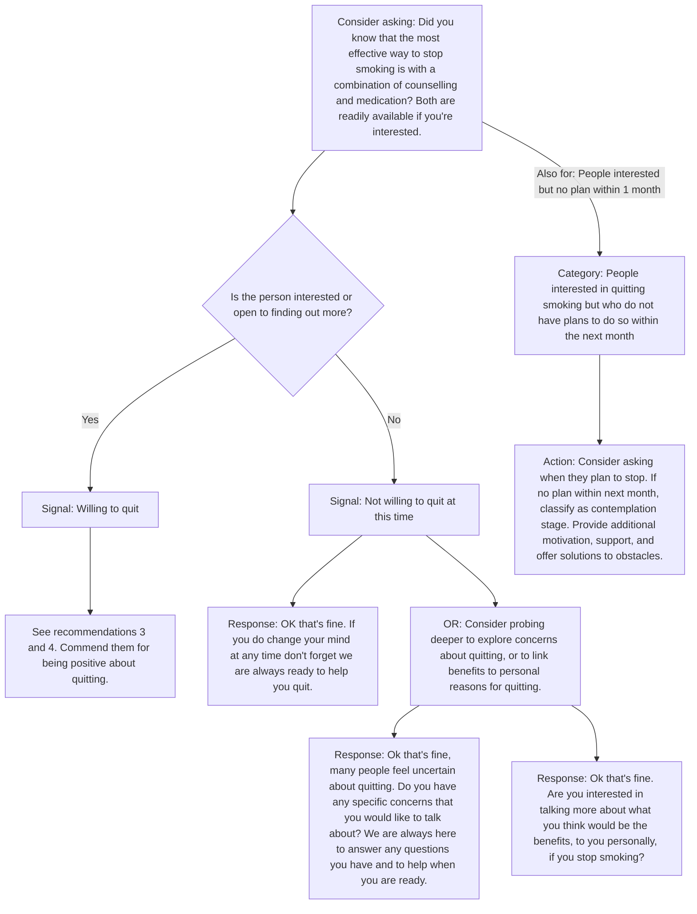
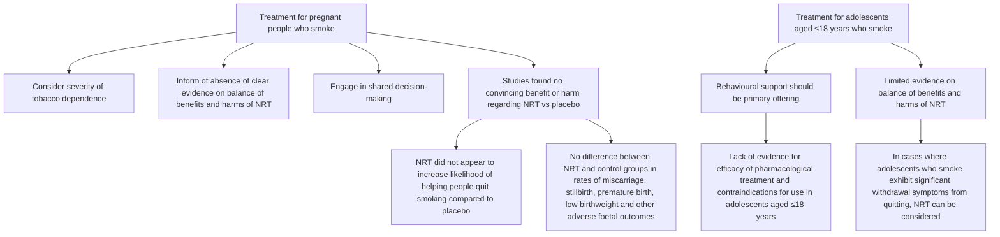
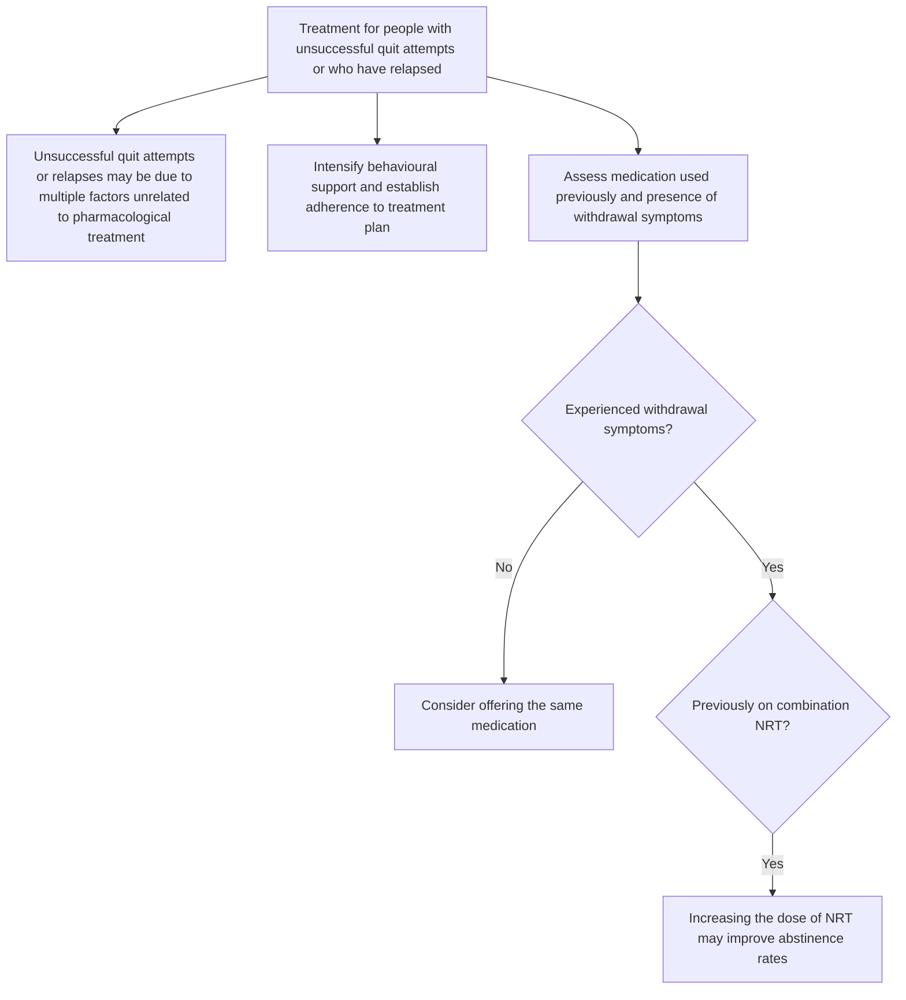

<!-- cpg_id: promoting-smoking-cessation-and-treating-tobacco-dependence-(feb-2025) | phase4 deterministic | spine: Overview, References -->
<!-- meta | source: ACE CLINICAL GUIDANCE | published: Published: 21 February 2025 | url: www.ace-hta.gov.sg | title: Promoting smoking cessation and treating tobacco dependence -->


## Overview

```yaml
cpg_id: promoting-smoking-cessation-and-treating-tobacco-dependence-(feb-2025)
chunk_id: promoting-smoking-cessation-and-treating-tobacco-dependence-(feb-2025).overview.prose.01
chunk_type: prose
section_id: overview
parent_rec: null
title: "Definitions and scope of application"
source_pages: [1]
strength: null
tables_referenced: []
figures_referenced: []
url_links: []
cross_refs: []
review_flags:
  - contains_conditional_language
```

Promoting
smoking
cessation
and treating
tobacco
dependence

### Objective

To optimise smoking cessation management

### Scope

Provision of behavioural support and pharmacological treatment to people who smoke who are motivated to quit

### Target audience

This clinical guidance is relevant to all healthcare professionals who encounter current smokers in their practice, especially those providing primary or generalist care

### Background

In Singapore, tobacco smoking is a leading cause of death and disability from lung diseases and cancer,   and imposes a significant economic burden.   Even small decreases in smoking rates can have a major impact on disease burden and societal costs, making smoking cessation the most cost-effective medical intervention among people who smoke.   Behavioural support and medications greatly increase the chances of successful quitting. Without such support, 95% of quit attempts will fail.

Most people who want to quit smoking will pass through repeated cycles of short-term abstinence and relapse before achieving long-term abstinence. This underscores the importance of providing consistent support to aid smoking cessation, even for individuals who have previously quit successfully. General practitioners, community pharmacists, and other healthcare professionals in primary care settings are well-positioned to offer this support as they have frequent and important opportunities to identify people who smoke, provide advice and help them quit.

The evidence-based recommendations in this guidance can be incorporated into, and implemented with, practical and systematic approaches like the 5As, ABC or 2As frameworks.   These frameworks have been shown to increase the promotion of smoking cessation by healthcare providers to their patients and achieve long-lasting quit rates.

### Statement of Intent

This ACE Clinical Guidance (ACG) provides concise, evidence-based recommendations and serves as a common starting point nationally for clinical decision-making. It is underpinned by a wide array of considerations contextualised to Singapore, based on best available evidence at the time of development. The ACG is not exhaustive of the subject matter and does not replace clinical judgement. The recommendations in the ACG are not mandatory, and the responsibility for making decisions appropriate to the circumstances of the individual patient remains at all times with the healthcare professional.

of Respiratory Physical College of Psychiatrists

College of Public Health and Occupational Physicians

---

```yaml
cpg_id: promoting-smoking-cessation-and-treating-tobacco-dependence-(feb-2025)
chunk_id: promoting-smoking-cessation-and-treating-tobacco-dependence-(feb-2025).overview.recommendation.01
chunk_type: recommendation
section_id: overview
parent_rec: null
title: "Recommendation 1"
source_pages: [2]
strength: strong
tables_referenced: []
figures_referenced: []
url_links:
  - https://go.gov.sg/healthhub-vaping-mistruths
cross_refs: []
review_flags:
  - contains_conditional_language
  - contains_dosing_information
```

**Recommendation 1:** Ask all patients about tobacco use and maintain an up-to-date record of their status.

Timely identification of people who smoke enables the provision of appropriate support and interventions to quit, thereby alleviating the risk, symptoms or progression of related complications. After establishing the baseline smoking status of a patient, maintaining an up-to-date record of their smoking status can alert other healthcare professionals to the patient's risk status, and prompt the delivery of smoking cessation interventions or other preventive care.

Asking all patients about tobacco use at least annually can be a good starting point for maintaining an up-to-date smoking status record (i.e. current smoker, ex-smoker or never smoker). For patients who have recently quit smoking (i.e. less than 1 year from quit date), it is important to ask more frequently about their smoking status, as their risk of relapse is high (see Recommendation 5).

Additionally, enquire about smoking status or exposure to secondhand smoke when clinically appropriate, such as when a patient presents with new symptoms associated with secondhand smoke (e.g. lower respiratory tract infections, nasal irritation, ear infections, atopic dermatitis, worsening asthma control), especially those recorded as non-smokers.

When a patient is identified to be currently smoking, review their clinical history of established comorbidities and ask them about:

- Degree of nicotine dependence (can be assessed with a scoring tool, such as the Fagerstrom scoring tool)

- Any history of quit attempts

- Any withdrawal symptoms during previous quit attempts

- Any previous treatment for smoking cessation (e.g. self-initiated nicotine replacement therapy [NRT])

### Identifying patients who vape and approaches for vaping cessation

Vaping is the act of inhaling and exhaling aerosols from a device that heats liquid chemicals. Vaping devices (including e-cigarettes) can contain nicotine and other additives known to be linked to cancer, lung disorders, and negative effects on cardiovascular health. Furthermore, many vaping devices allow users to customise the product, including increasing nicotine uptake – with levels of toxicants that can vary significantly between and across brands and sometimes reach higher levels than tobacco smoke.   Healthcare professionals are well-positioned to opportunistically ask patients whether they vape when asking them about smoking status, regardless of whether they are current smokers (i.e. dual users), ex-smokers or never smokers. Additional questions to consider asking include the type of e-cigarettes used and the frequency of vaping.

People who vape should be advised about the positive reasons to quit (e.g. health, financial, environmental impact) and informed of the risks associated with continuing to vape. While the approach to vaping cessation is similar to smoking cessation management, calculating the appropriate dose of NRT for vaping cessation can be challenging due to the unknown nicotine levels in different e-liquids. Guidelines suggest that the dosing for combination NRT in smoking cessation can be extrapolated for vaping cessation.

- https://go.gov.sg/healthhub-vaping-mistruths

People who vape can join I Quit. For patient information, including useful resources on the reasons to quit and risks of vaping, scan or click the QR code.

As vaping is illegal in Singapore, individuals may be hesitant to disclose their vaping status and patterns, potentially impeding vaping cessation efforts. However, healthcare professionals are not obligated to report cases of vaping to the authorities. Letting patients know this could provide reassurance, enhancing the likelihood of obtaining an accurate record of vaping status and maximising chances of their participation in vaping cessation.

---

```yaml
cpg_id: promoting-smoking-cessation-and-treating-tobacco-dependence-(feb-2025)
chunk_id: promoting-smoking-cessation-and-treating-tobacco-dependence-(feb-2025).overview.recommendation.02
chunk_type: recommendation
section_id: overview
parent_rec: null
title: "Recommendation 2"
source_pages: [3]
strength: strong
tables_referenced: []
figures_referenced:
  - Figure 1. Conversation starters and suggested approaches based on willingness to quit
url_links:
  - https://go.gov.sg/healthhub-help-quit-smoking
cross_refs: []
review_flags:
  - contains_conditional_language
```

**Recommendation 2:** Advise all people who smoke that effective methods to help them quit are available, and assess willingness to quit based on their response.

Studies have shown that offering assistance to people who smoke was associated with more quit attempts than directly advising them to stop smoking, soliciting intentions to quit, and reinforcing smoking harms.   This may be due to such advice generating resistance and reducing the likelihood of smokers asking for assistance.

Offering assistance in a non-confrontational way may help establish a more favourable rapport and be more effective in quitting attempts. This approach uses the person's response to the offer to implicitly assess willingness to quit and guide the next steps. By adapting the interaction based on each individual's response, healthcare professionals can more effectively engage people who smoke at different contemplation stages (see Figure 1).

For more examples of information tailored to different stages, scan or click the QR code.

- https://go.gov.sg/healthhub-help-quit-smoking

---

```yaml
cpg_id: promoting-smoking-cessation-and-treating-tobacco-dependence-(feb-2025)
chunk_id: promoting-smoking-cessation-and-treating-tobacco-dependence-(feb-2025).overview.figure.01
chunk_type: figure
section_id: overview
parent_rec: promoting-smoking-cessation-and-treating-tobacco-dependence-(feb-2025).overview.recommendation.02
title: "Figure 1. Conversation starters and suggested approaches based on willingness to quit"
source_pages: [3]
strength: null
reconstructed_from: mermaid
image_dir: grouped_p3_fig_01.jpg
url_links: []
cross_refs: []
review_flags: []
```

**Figure 1. Conversation starters and suggested approaches based on willingness to quit**



---

```yaml
cpg_id: promoting-smoking-cessation-and-treating-tobacco-dependence-(feb-2025)
chunk_id: promoting-smoking-cessation-and-treating-tobacco-dependence-(feb-2025).overview.recommendation.03
chunk_type: recommendation
section_id: overview
parent_rec: null
title: "Recommendation 3"
source_pages: [4]
strength: strong
tables_referenced: []
figures_referenced: []
url_links:
  - https://go.gov.sg/healthhub-shake-up-old-habits-to-stub-out
  - https://go.gov.sg/healthhub-quittips
  - https://go.gov.sg/healthhub-iquit-programme
cross_refs: []
review_flags:
  - contains_conditional_language
```

**Recommendation 3:** Individualise behavioural support to maximise engagement and adherence to the quit plan.

### Behavioural support strategies

Evidence indicates that providing behavioural support to people who smoke increases their chances of quitting.

Every person who smokes has unique smoking habits, triggers, and motivations. While several components and modes of delivering behavioural support are effective,  offering personalised behavioural support that addresses the specific needs and challenges of each person is more likely to resonate with them. This approach leads to greater engagement with, and adherence to, the quit plan, ultimately increasing the likelihood of successful quitting. Components of behavioural support include:

- Addressing barriers to quitting

- Informing people who smoke of the effects of nicotine withdrawal (which may still occur despite receiving pharmacological treatment)

- Identifying reasons and situations that trigger smoking

- Advising on strategies to overcome or avoid triggers

- Encouraging the support of family and friends

- Setting a quit date

### Obtaining support from external smoking cessation services

To ensure that all people who smoke are provided with adequate behavioural support that meets their needs and preferences, consider utilising external smoking cessation services (e.g. I Quit, community pharmacies etc.), especially when on-site capacity is limited. Personalised quit plans are provided for all people who smoke, with the option to receive counselling and reminders through text messages, telephone calls or face-to-face sessions.

### Setting a quit date

Although setting a quit date is effective in helping people who smoke to quit, incorporating elements of high-quality goal setting to prepare them for the quit date can increase the chances of successful quit attempts:

- Encourage all people who smoke to commit to stop smoking at one go on or before a particular date (see the box below on “Abrupt quitting”)

- Set a quit date that is most appropriate for the medication chosen (same day for NRT or one week from starting varenicline)

- Consider the person who smokes' values and preferences when agreeing on a quit date (e.g. avoiding stressful periods where they may have to cope with many things in their work or personal life)

- If possible, ensure that the person who smokes agrees on a quit date that is scheduled within 14 days of the smoking cessation counselling

### Abrupt quitting

Advising people who smoke to quit in one go increases the chances of quitting and is more effective for long-term abstinence, compared to a gradual reduction of cigarette consumption before quitting.   Here is an example of advice to quit in one go:

It is best not to cut down the number of cigarettes you smoke before your Quit Date, as each one may become more important to you. Smoking your fewer cigarettes more intensely will also not make your quitting any easier than if you were to quit all at once.

For patient resources on tips and strategies to stop smoking, scan or click the QR codes

- https://go.gov.sg/healthhub-shake-up-old-habits-to-stub-out

- https://go.gov.sg/healthhub-quittips

For more information on the I Quit programme, scan or click the QR code or call up a trained Quit Consultant

- https://go.gov.sg/healthhub-iquit-programme

QuitLine

1800 438 2000

---

```yaml
cpg_id: promoting-smoking-cessation-and-treating-tobacco-dependence-(feb-2025)
chunk_id: promoting-smoking-cessation-and-treating-tobacco-dependence-(feb-2025).overview.recommendation.04
chunk_type: recommendation
section_id: overview
parent_rec: null
title: "Recommendation 4"
source_pages: [5, 6]
strength: strong
tables_referenced:
  - Table 1. Quick guide to types of nicotine replacement therapy (NRT) registered in Singapore
figures_referenced:
  - Figure 2. Relative efficacy (percentage increase in likelihood of quitting smoking) of pharmacological treatments compared to placebo
  - Figure 3. Principles for smoking cessation strategies in specific subgroups
url_links: []
cross_refs: []
review_flags:
  - contains_conditional_language
```

**Recommendation 4:** Offer combination NRT (long-acting nicotine patch and short-acting NRT) or varenicline, alongside behavioural support.

Pharmacological treatment should be offered in conjunction with behavioural support to all non-pregnant adult smokers who are willing to quit. As noted in Recommendation 3, behavioural support plays an important role in the success of smoking cessation by addressing an individual's psychological triggers, habits and motivations. Combination NRT and varenicline are the most effective pharmacological treatments for helping people to quit smoking compared to placebo, and have similar effectiveness and safety profiles. Pharmacological treatment in specific subgroups, such as pregnant smokers, adolescents, or smokers with unsuccessful quit attempts or who have relapsed, is discussed later in this section.

### Combination NRT

NRT is recommended for all people who smoke due to its effectiveness in helping them quit regardless of nicotine dependence. Combination NRT works by using a long-acting form of NRT (e.g. patch), to help relieve baseline nicotine cravings and minimise withdrawal symptoms, with a short-acting form (e.g. lozenge, gum or mouth spray), to help with breakthrough cravings. Combination NRT is 27% more effective than any single-form NRT in helping people to quit smoking, with minimal differences in the risk of serious adverse effects – which are rarely experienced. As there does not appear to be a difference in efficacy between various types of short-acting NRT, use shared decision-making to select the type, based on the individual smoker's values and preferences (see Table 1). For example, a person who attends many work meetings may prefer using lozenges for their subtlety, while someone who wants to ease withdrawal symptoms rapidly may prefer using the mouth spray for its faster onset of action.

### Varenicline

Varenicline works by alleviating symptoms of craving and withdrawal, and by reducing the satisfaction derived from smoking. Varenicline is the most effective pharmacological monotherapy for smoking cessation, improving the likelihood of quit rates by 36% compared to bupropion and 25% for single-form NRT.   Despite initial safety concerns of higher risks for neuropsychiatric or cardiac serious adverse effects, there appears to be no significant difference between varenicline and placebo, and serious adverse effects are rare.   Mild to moderate severity nausea is the most common side effect experienced by people taking it to quit smoking.

### Bupropion

Bupropion is an alternative pharmacological treatment that is effective in helping people to quit smoking compared to placebo. However, it is 25% less likely to help smokers quit compared to either varenicline or combination NRT and is associated with higher trial dropouts due to adverse effects compared to placebo  (common adverse effects are dry mouth and gastrointestinal disturbance, including nausea and vomiting). Bupropion is currently registered in Singapore for the treatment of major depressive episodes (i.e. off-label use for smoking cessation).

### Combining different treatments

The combination of varenicline and NRT increases the likelihood of quitting smoking by 27–36% compared to using varenicline alone, and by 84% compared to NRT alone,  but concerns about cost and possible increase in non-severe side effects may limit acceptance by people who smoke. There may be no difference in quit rates between the combination of bupropion and varenicline compared to varenicline alone, and the combination of bupropion and NRT compared to NRT monotherapy.

### Shared decision-making when selecting pharmacological treatment and duration

When selecting between pharmacological treatments, it is important to provide information on the medication options, including their mechanisms of action, potential side effects (see Table 1) and success rates (see Figure 2) for smoking cessation. Additionally, it is essential to understand the preferences, values and lifestyle of the individual who smokes to tailor the decision to their specific needs and circumstances. Involving the person who smokes in the decision-making process, even if some treatments have lower efficacy, can enhance adherence and commitment to the quit plan. If they prefer to use NRT monotherapy or bupropion together with behavioural support, advise them that these options are less likely to help them quit, compared to combination NRT or varenicline.

### Evidence regarding e-cigarettes (EC) for smoking cessation

The overall evidence on the efficacy of EC as an intervention for smoking cessation remains uncertain due to mixed evidence and methodological concerns of the trials. Additionally, studies have shown that people who smoke traditional cigarettes who quit smoking with EC were eight times more likely to continue using EC after the trial compared to those who were allocated NRT, signalling continued nicotine dependence.

Use of e-cigarettes is illegal in Singapore.

### Smoking cessation for specific subgroups

Tailoring a smoking cessation strategy to the individual person's needs and circumstances is essential to maximise chances of quitting. Advising specific subgroups of smokers may require additional considerations, due to the varying evidence of pharmacological treatment efficacy (see Figure 3), and should be underpinned by a shared decision-making approach, as described on page 5.

---

```yaml
cpg_id: promoting-smoking-cessation-and-treating-tobacco-dependence-(feb-2025)
chunk_id: promoting-smoking-cessation-and-treating-tobacco-dependence-(feb-2025).overview.figure.02
chunk_type: figure
section_id: overview
parent_rec: promoting-smoking-cessation-and-treating-tobacco-dependence-(feb-2025).overview.recommendation.04
title: "Figure 2. Relative efficacy (percentage increase in likelihood of quitting smoking) of pharmacological treatments compared to placebo"
source_pages: [6]
strength: null
reconstructed_from: table
image_dir: grouped_p6_fig_01.jpg
url_links: []
cross_refs: []
review_flags: []
```

**Figure 2. Relative efficacy (percentage increase in likelihood of quitting smoking) of pharmacological treatments compared to placebo**

| Treatment | Relative Efficacy (% Increase vs Placebo) | Notes |
| :--- | :--- | :--- |
| **Varenicline** | ~130% | Highest efficacy shown |
| **Combination NRT** | ~90% | Calculated additive effect of long-acting and short-acting NRT on the log scale |
| **Bupropion** | ~40% | Off-label use (registered locally for major depressive episodes at time of publication) |
| **Short-acting NRT** | ~40% | |
| **Long-acting NRT** | ~35% | |

> *Footnote: * Calculated additive effect of long-acting NRT and short-acting NRT on the log scale*

> *Footnote: ‡ Off-label use (bupropion is only registered locally for the treatment of major depressive episodes at the time of publication)*

---

```yaml
cpg_id: promoting-smoking-cessation-and-treating-tobacco-dependence-(feb-2025)
chunk_id: promoting-smoking-cessation-and-treating-tobacco-dependence-(feb-2025).overview.figure.03
chunk_type: figure
section_id: overview
parent_rec: promoting-smoking-cessation-and-treating-tobacco-dependence-(feb-2025).overview.recommendation.04
title: "Figure 3. Principles for smoking cessation strategies in specific subgroups"
source_pages: [6]
strength: null
reconstructed_from: mermaid
image_dir: grouped_p6_fig_02.jpg
url_links: []
cross_refs: []
review_flags: []
```

**Figure 3. Principles for smoking cessation strategies in specific subgroups**

**Part 1**


**Part 2**


---

```yaml
cpg_id: promoting-smoking-cessation-and-treating-tobacco-dependence-(feb-2025)
chunk_id: promoting-smoking-cessation-and-treating-tobacco-dependence-(feb-2025).overview.table.01
chunk_type: table
section_id: overview
parent_rec: promoting-smoking-cessation-and-treating-tobacco-dependence-(feb-2025).overview.recommendation.04
title: "Table 1. Quick guide to types of nicotine replacement therapy (NRT) registered i"
source_pages: [7, 8]
strength: null
image_dir: 77f9220935929c6108063db6f59702f8521ef0a386b0a6bd0642467ce473ce9b.jpg
url_links: []
cross_refs: []
review_flags:
  - contains_dosing_information
```

**Table 1. Quick guide to types of nicotine replacement therapy (NRT) registered in Singapore**

<table><tr><td rowspan="2" colspan="2">Type</td><td>Features</td><td rowspan="2">How to use</td><td rowspan="2">Other considerations</td><td rowspan="2">Dosing recommendations</td></tr><tr><td>+Advantages -Disadvantages</td></tr><tr><td>Long-acting[Long-acting form of NRT can be used in combination with a short-acting form, i.e. combination NRT]</td><td>Patch</td><td>+Discreet and simple to use+Control of baseline cravings-Slow release of nicotine, may not curb acute cravings-Less flexible dosing-Potential for skin irritation and sleep disturbance</td><td>·Paste one patch per day (may or may not remove before sleep, depending on product and patient preference/needs e.g., sleep disturbance, morning cravings)·Reduce dose over time</td><td>·Paste patch on a clean, dry area of hairless skin·Apply to a different site each day to reduce skin irritation·Keep patch on while swimming or showering</td><td>Nicotinell (24h patch)*&gt;20cigarettesa day14 weeks21 mg4 weeks7 mg≤20cigarettesa day14 weeks8 weeks7 mgNicorette (16h patch)≥15cigarettesa day18 weeks25 mg2 weeks15 mg2 weeks10 mg&lt;15cigarettesa day18 weeks15 mg4 weeks10 mg</td></tr><tr><td>Short-acting</td><td>Gum</td><td>+Flexible as-needed dosing+Flavoured options+Less risk of sleep disturbance+Chewing motion may be useful as a substitute for habitual smokers-Smokers with dentures may experience difficulty in chewing-More conscious effort needed to correctly perform the &#x27;park and chew&#x27; technique</td><td>·Take one when urge to smoke occurs·Chew and park technique: Chew slowly until the taste becomes strong, then rest the gum between cheek and gums. Chew again when taste has faded, and repeat for about 30min·Taper usage over time as tolerated</td><td>·Do not eat or drink during use. Avoid acidic food or drinks 15 min before use·Do not use more than 1 at a time·Side effects usually occur due to intense chewing or sucking, and are dose-dependent</td><td>Chew one gum when the urge to smoke occurs.Nicotinell112 weeks1 every 1–2 hoursGradually reducetill not neededUsual dose: 8–12 gums/dayMax dose: 24 gums/day (2 mg) and 15 gums/day (4 mg)Nicorette*112 weeks8–12 gums/day2 weeks4–6 gums/day2 weeks1–3 gums/dayGradually reduce to 0 at Step 3Max dose: 30 gums/day (2 mg) and 24 gums/day (4 mg)The 4 mg gum is recommended for smokers who are highly dependent (e.g. smoking &gt;20 cigarettes per day or first smoke ≤30 minutes upon waking) or those with failed quit attempts with NRT.</td></tr></table>

> *Footnote: List of products in Table 1 is current at time of publication. Refer to the local product inserts for full information, including detailed dosing recommendations, contraindications, precautions and side effects.*

> *Footnote: *Available on government subsidy list*

<table><tr><td rowspan="2" colspan="2">Type</td><td>Features</td><td rowspan="2">How to use</td><td rowspan="2">Other considerations</td><td rowspan="2" colspan="3">Dosing recommendations</td></tr><tr><td>+Advantages -Disadvantages</td></tr><tr><td rowspan="6">Short-acting</td><td rowspan="4">Lozenge[c7YY]</td><td rowspan="4">+Flexible as-needed dosing+Flavoured options+Less risk of sleep disturbance+More discreet, provides a more consistent and steady release of nicotine-Nicotine released in milder ‘bursts’ (compared to other short-acting options), less helpful for intense cravings</td><td rowspan="4">•Take one when urge to smoke occurs•Slowly dissolve lozenge in mouth, periodically moving it from one side of the mouth to the other, until completely dissolved•Do not chew or swallow•Taper usage over time as tolerated</td><td rowspan="4">•Do not eat or drink during use. Avoid acidic food or drinks 15 min before use•Do not use more than 1 at a time•Side effects usually occur due to intense chewing or sucking, and are dose-dependent</td><td>Nicotinell*When the urge to smoke occurs</td><td colspan="2">12 weeks1 every 1–2 hours</td></tr><tr><td colspan="3">Usual dose: 8–12 lozenges/dayMax dose: 20 lozenges/day</td></tr><tr><td colspan="3">Skiip2 mg smokers withlow nicotinedependence4 mg smokers withhigh nicotinedependence16 weeks23 weeks3weeks1 every 1–2 hrs1 every 2–4 hrs1 every 4–8 hrs</td></tr><tr><td colspan="3">Max dose: 15 lozenges/day</td></tr><tr><td rowspan="2">Mouth spray</td><td rowspan="2">+Flexible as-needed dosing+Fastest onset of effect+Less risk of sleep disturbance-Potential need for more frequent use due to shorter duration of effect-May not address habitual aspects of smoking-Not as discreet in formal or public settings</td><td rowspan="2">•Spray into mouth when urge to smoke occurs. Do not inhale when spraying, and do not swallow for a few seconds after spraying•Taper usage over time as tolerated</td><td rowspan="2">•Contains alcohol (&lt;100 mg per spray)•Side effects may occur due to poor technique, and are dose-dependent</td><td>Step1 Use 1–2 sprays when the urge to smoke occurs for 6 weeks.</td><td>Step2 Reduce the average number of sprays/day to half of that in Step 1 by the end of week 9.</td><td>Step3 Continue reducing the number of sprays/day to no more than 3 during week 12, and then stop thereafter.</td></tr><tr><td colspan="3">Max dose: 2 sprays at a time3 sprays per hour48 sprays per day</td></tr></table>

> *Footnote: List of products in Table 1 is current at time of publication. Refer to the local product inserts for full information, including detailed dosing recommendations, contraindications, precautions and side effects.*

> *Footnote: *Available on government subsidy list*

---

```yaml
cpg_id: promoting-smoking-cessation-and-treating-tobacco-dependence-(feb-2025)
chunk_id: promoting-smoking-cessation-and-treating-tobacco-dependence-(feb-2025).overview.recommendation.05
chunk_type: recommendation
section_id: overview
parent_rec: null
title: "Recommendation 5"
source_pages: [9]
strength: strong
tables_referenced: []
figures_referenced: []
url_links: []
cross_refs: []
review_flags:
  - contains_conditional_language
  - contains_dosing_information
```

**Recommendation 5**

### Frequency and mode of follow-ups

The risk of relapse is highest in the first few weeks after quitting due to nicotine withdrawal symptoms, which can surface a few hours after smoking the last cigarette.   Therefore, it is important to follow up (see “Monitoring parameters during follow-up”) with the patient within 1–2 weeks of the quit date, or within 4 weeks if doing so sooner is not feasible. This can be done in-person or over the telephone, by healthcare professionals, clinic staff or I Quit counsellor.

### Monitoring parameters during follow-up

- Smoking status

- Frequency of slip-ups/lapses

- Withdrawal symptoms

- Adherence and presence of adverse effects from pharmacological treatment

- History of sick days

- Presence of smoking triggers (events that cause smokers to crave a cigarette)

- Risk of relapse (may be predicted by asking patients about the amount of time spent with urges to smoke or the strength of urges to smoke)

Patients at higher risk of relapse (e.g. multiple previous unsuccessful attempts, very high nicotine dependence, concurrent addictions, concerning social circumstances, etc.) or higher risk of complications from smoking (e.g. pregnant patients, severe cardiovascular or respiratory complications, etc.) should be prioritised for earlier follow-up if it is within the means of the healthcare professional.

Regular follow-up beyond the initial weeks should also be planned. Studies suggest that the risk of relapse may remain high throughout the first two years of quitting,   including a meta-analysis reporting that while the impact of pharmacological treatment on smoking abstinence at 12 months is beneficial, the proportion of people who benefit from medications decreases.

### Effect of smoking cessation on other medications

Smoking induces the activity of certain cytochrome P450 enzymes (e.g. CYP1A2) involved in the metabolism of some medications such as clozapine, olanzapine, warfarin or clopidogrel. After quitting smoking, decreased enzyme activity may result in slower metabolism of these medications and a consequent increase in serum concentrations. This applies also to patients who have quit smoking and are using NRT, as these drug interactions are caused by components of cigarette smoke other than nicotine.

Consider reviewing the dose or use of these medications when clinically necessary.

---

```yaml
cpg_id: promoting-smoking-cessation-and-treating-tobacco-dependence-(feb-2025)
chunk_id: promoting-smoking-cessation-and-treating-tobacco-dependence-(feb-2025).overview.recommendation.06
chunk_type: recommendation
section_id: overview
parent_rec: null
title: "Recommendation 6"
source_pages: [10, 11]
strength: conditional
tables_referenced: []
figures_referenced:
  - Figure 4. Overview of nicotine withdrawal symptoms
url_links:
  - https://go.gov.sg/healthhub-smokingtriggers
  - https://go.gov.sg/healthhub-dos-donts
cross_refs: []
review_flags:
  - contains_conditional_language
```

**Recommendation 6:** Consider interventions to prevent relapse, such as extending pharmacological treatment and advising on coping strategies.

### Extending the duration of pharmacological treatment

There is limited evidence on optimal duration of pharmacological treatment. However, if risk of relapse is a concern, extending the duration can help.   For people who smoke who are at increased risk of relapse (e.g. those who experience severe withdrawal symptoms towards the end of the medication regimen), engage in shared decision-making to understand their profile, values and preferences regarding potentially extending the duration of pharmacological treatment.

### Overcoming withdrawal symptoms

It is important to educate a person before and after their target quit date about possible physical and psychological withdrawal symptoms they may experience upon quitting and how to overcome them to prevent relapse (see Figure 4).

### Recognising and coping with smoking triggers

Other than withdrawal symptoms, triggers can be an obstacle to maintaining abstinence from smoking. Offering support to identify and manage triggers unique to each person who smokes (e.g. drinking alcohol, emotional stress, social situations with other smokers) plays a key role in preventing relapse. These triggers can be managed by avoiding them and replacing them with positive habits to break the old routines that led to smoking.

### Handling lapses and/or relapses

A “lapse” or a “slip-up” is an isolated smoking episode that occurs after at least 24 hours of abstinence and is followed by a resumption of the quit attempt. A relapse refers to the resumption of regular smoking after a period of abstinence.   Although lapses often lead to relapses, it is important for lapses to be reframed as learning opportunities rather than being considered failures, which is how patients usually see them.

After a relapse, consider the following steps: a review of factors contributing to the relapse, a reassessment of the smoking cessation plan, and the need to re-engage with support services.

For patients who have relapsed, offer encouragement, reiterate the benefits of cessation, and consider advising them to quit again immediately.

For patient information on overcoming triggers, scan or click the QR code

- https://go.gov.sg/healthhub-smokingtriggers

For patient information on handling lapses, scan or click the QR code

- https://go.gov.sg/healthhub-dos-donts

---

```yaml
cpg_id: promoting-smoking-cessation-and-treating-tobacco-dependence-(feb-2025)
chunk_id: promoting-smoking-cessation-and-treating-tobacco-dependence-(feb-2025).overview.figure.04
chunk_type: figure
section_id: overview
parent_rec: promoting-smoking-cessation-and-treating-tobacco-dependence-(feb-2025).overview.recommendation.06
title: "Figure 4. Overview of nicotine withdrawal symptoms"
source_pages: [10]
strength: null
reconstructed_from: table
image_dir: grouped_p10_fig_01.jpg
url_links: []
cross_refs: []
review_flags: []
```

**Figure 4. Overview of nicotine withdrawal symptoms**

| Symptom | Reason | Resource / Action |
| :--- | :--- | :--- |
| Fatigue and difficulty concentrating | Body takes time to adjust to the lack of stimulation from nicotine | Scan QR code for patient information and resources on coping strategies for nicotine withdrawal symptoms |
| Headaches or dizziness | Brain is getting extra oxygen | Scan QR code for patient information and resources on coping strategies for nicotine withdrawal symptoms |
| Increased appetite | Sense of taste and smell improves | Scan QR code for patient information and resources on coping strategies for nicotine withdrawal symptoms |
| Weight gain | Metabolism decreases due to lack of nicotine | Scan QR code for patient information and resources on coping strategies for nicotine withdrawal symptoms |
| Constant cravings | Addictiveness of nicotine triggers cravings to replenish it as the body starts clearing it out | Scan QR code for patient information on the 4Ds approach to help overcome craving |

---


## References

```yaml
cpg_id: promoting-smoking-cessation-and-treating-tobacco-dependence-(feb-2025)
chunk_id: promoting-smoking-cessation-and-treating-tobacco-dependence-(feb-2025).references.reference.01
chunk_type: reference
section_id: references
parent_rec: null
title: "References"
source_pages: [12]
strength: null
tables_referenced: []
figures_referenced: []
url_links: []
cross_refs: []
review_flags: []
```

Click or scan the QR code for the reference list to this clinical guidance

GO gov.sg

### Evidence-to-Recommendation Framework

Click or scan the QR code to view the Evidence-to-Recommendation Framework for the recommendations in this clinical guidance

GO.gov.sg

### Expert group

#### Chairpersons

Dr Jason Chan, Primary Care (NHGP)

Dr Camilla Wong Ming Lee, Pharmacy (MOH)

#### Members

Mr Benjamin Chee Toh Ming, Health Promotion Board (MOH)

Ms Valerie Chua, Nursing (Frontier Healthcare Group)

Dr Joanne Khor, Primary Care (NUP)

Ms Kng Kwee Keng, Pharmacy (TTSH)

Ms Grace Kng Li Lin, Pharmacy (Watsons)

Dr Rachel Lim, Primary Care (SHP)

Dr Lambert Low Tchern Kuang, Psychiatry (IMH)

Adj A/Prof Puah Ser Hon, Respiratory and Critical Care Medicine (TTSH)

Ms See Chue Win, Nursing (AIC)

Adj A/Prof See Kay Choong, Respiratory and Critical Care Medicine (NUH)

Dr Sharon Shen Fengli, Primary Care (EH Medical Family Clinic [Bukit Batok])

Ms Daphne Tan Sze Ling, Pharmacy (NUH)

Dr Nelson Wee, Primary Care (Silver Cross Medical [Holland Village])

Dr Ryan Wong Chung Kiat, Primary Care (OneDoctors Family Clinic [Holland Village])

### About the Agency

The Agency for Care Effectiveness (ACE) was established by the Ministry of Health (Singapore) to drive better decision-making in healthcare by conducting health technology assessments (HTA), publishing healthcare guidance and providing education. ACE develops ACE Clinical Guidances (ACGs) to inform specific areas of clinical practice. ACGs are usually reviewed around five years after publication, or earlier, if new evidence emerges that requires substantive changes to the recommendations. To access this ACG online, along with other ACGs published to date, please visit www.ace-hta.gov.sg/acg

Find out more about ACE at www.ace-hta.gov.sg/about-us

© Agency for Care Effectiveness, Ministry of Health, Republic of Singapore

All rights reserved. Reproduction of this publication in whole or in part in any material form is prohibited without the prior written permission of the copyright holder. Application to reproduce any part of this publication should be addressed to: ACE_HTA@moh.gov.sg

Suggested citation:

Agency for Care Effectiveness (ACE). Promoting smoking cessation and treating tobacco dependence. ACE Clinical Guidance (ACG), Ministry of Health, Singapore. 2025. Available from: go.gov.sg/acg-smoking

The Ministry of Health, Singapore disclaims any and all liability to any party for any direct, indirect, implied, punitive or other consequential damages arising directly or indirectly from any use of this ACG, which is provided as is, without warranties.

---
