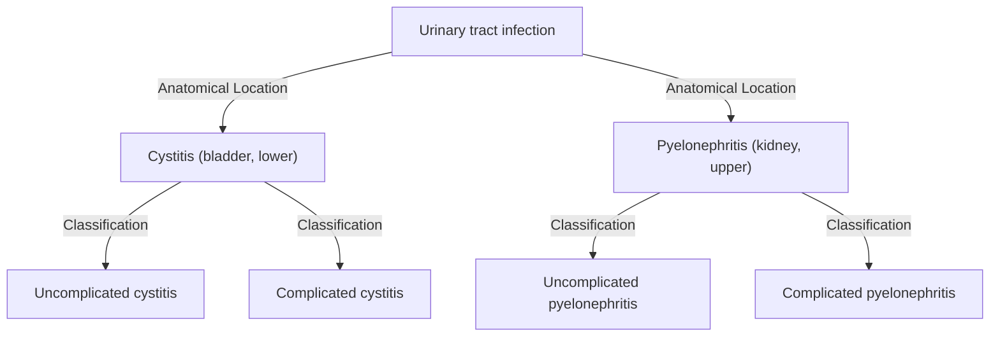
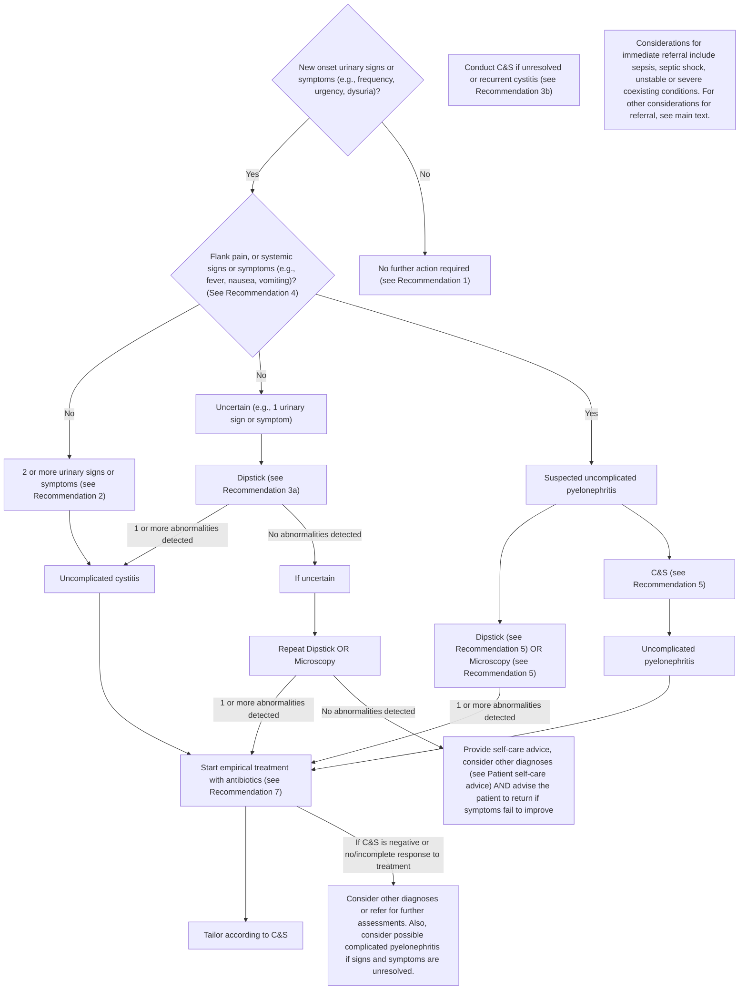

<!-- cpg_id: uti-appropriate-diagnosis-and-antibiotic-use-for-uncomplicated-cystitis-and-pyelonephritis-(dec-2023) | phase4 deterministic | spine: Overview, Assessment and diagnosis of UTI, Management of UTI, References -->
<!-- meta | source: ACE CLINICAL GUIDANCE | published: First Published: 17 November 2023 | url: www.ace-hta.gov.sg | title: Urinary tract infections -->


## Overview

```yaml
cpg_id: uti-appropriate-diagnosis-and-antibiotic-use-for-uncomplicated-cystitis-and-pyelonephritis-(dec-2023)
chunk_id: uti-appropriate-diagnosis-and-antibiotic-use-for-uncomplicated-cystitis-and-pyelonephritis-(dec-2023).overview.prose.01
chunk_type: prose
section_id: overview
parent_rec: null
title: "Definitions and scope of application"
source_pages: [1]
tables_referenced: []
figures_referenced:
  - Figure 1. Common classification of selected UTIs*
url_links: []
cross_refs: []
review_flags:
  - contains_conditional_language
```

Last Updated: 8 December 2023

Urinary tract
infections

Appropriate diagnosis and antibiotic use for uncomplicated cystitis and pyelonephritis

Urinary tract infections (UTIs) can involve different parts of the urinary tract including the bladder and the kidneys. UTIs are commonly classified into lower UTI involving the bladder (cystitis), versus upper UTI involving the kidneys (pyelonephritis). UTIs can be uncomplicated or complicated depending on the nature of the associated infection and likelihood of developing complications:

- Uncomplicated UTI: UTI limited to non-pregnant women with no known relevant anatomical and functional abnormalities of the urinary tract, or no known relevant comorbidities.

- Complicated UTI: UTI associated with an increased chance of a complicated course, which increases the risk that the infection will be more serious than expected.

Figure 1 shows a common classification of selected UTIs, with the focus of the ACG highlighted.

As UTIs more commonly occur in women than men, this ACG's main focus is on acute uncomplicated cystitis and acute uncomplicated pyelonephritis in non-pregnant pre-menopausal women. Other relevant populations (e.g., men) and situations (e.g., recurrent cystitis) will be briefly mentioned in some sections.

The following are outside the scope of the ACG: UTIs in individuals under 16 years old, and all complicated UTIs including UTIs in pregnant women, catheter-associated UTIs, and urosepsis.

### Objective

To guide appropriate diagnosis and treatment of urinary tract infections (UTIs) to reduce inappropriate antibiotic use

### Scope

Clinical assessment, diagnosis, and treatment of UTI in adults, focusing on uncomplicated acute cystitis and pyelonephritis in healthy, non-pregnant pre-menopausal women

### Target audience

This clinical guidance is relevant to all healthcare professionals caring for patients with UTIs, especially those providing primary or generalist care

### Background

Urinary tract infection (UTI) is a common bacterial infection in females, affecting about 1 in 2 women at some point in their life.   UTIs are associated with reduced quality of life   and significant clinical and economic burden.

Escherichia coli (E. coli) is the main causative bacteria for UTIs locally and internationally.   Antibiotic therapy is effective in treating UTIs, and reduces the severity of infections and duration of symptoms.   However, the susceptibility of E. coli to antibiotics is evolving over time, and high antibiotic resistance, particularly towards ciprofloxacin and cotrimoxazole, has been reported for E. coli locally.   Inappropriate use of antibiotics remains one of the main issues contributing to antimicrobial resistance (AMR) problems globally. This ACG aims to provide updated guidance on the appropriate use of antibiotics for UTIs in Singapore especially for non-pregnant pre-menopausal women.

### Statement of Intent

This ACE Clinical Guidance (ACG) provides concise, evidence-based recommendations and serves as a common starting point nationally for clinical decision-making. It is underpinned by a wide array of considerations contextualised to Singapore, based on best available evidence at the time of development. The ACG is not exhaustive of the subject matter and does not replace clinical judgement. The recommendations in the ACG are not mandatory, and the responsibility for making decisions appropriate to the circumstances of the individual patient remains at all times with the healthcare professional.

---

```yaml
cpg_id: uti-appropriate-diagnosis-and-antibiotic-use-for-uncomplicated-cystitis-and-pyelonephritis-(dec-2023)
chunk_id: uti-appropriate-diagnosis-and-antibiotic-use-for-uncomplicated-cystitis-and-pyelonephritis-(dec-2023).overview.figure.01
chunk_type: figure
section_id: overview
parent_rec: null
title: "Figure 1. Common classification of selected UTIs*"
source_pages: [2]
reconstructed_from: mermaid
image_dir: grouped_p2_fig_01.jpg
url_links: []
cross_refs: []
review_flags: []
```

**Figure 1. Common classification of selected UTIs***



> *Footnote: * This figure does not show all possible UTIs or methods or classification; ____ denotes the focus areas of the ACG*

---


## Assessment and diagnosis of UTI

```yaml
cpg_id: uti-appropriate-diagnosis-and-antibiotic-use-for-uncomplicated-cystitis-and-pyelonephritis-(dec-2023)
chunk_id: uti-appropriate-diagnosis-and-antibiotic-use-for-uncomplicated-cystitis-and-pyelonephritis-(dec-2023).assessment_and_diagnosis_of_uti.recommendation.01
chunk_type: recommendation
section_id: assessment_and_diagnosis_of_uti
parent_rec: null
title: "Recommendation 1"
source_pages: [2]
tables_referenced: []
figures_referenced: []
url_links: []
cross_refs: []
review_flags:
  - contains_conditional_language
```

**Recommendation 1**

Avoid routinely screening for and treating asymptomatic bacteriuria.

Asymptomatic bacteriuria refers to the isolation of a significant count (   bacteria/mL) of a single bacterial species from a clean catch urine specimen of an individual who has no acute signs or symptoms of a UTI.   Asymptomatic bacteriuria may be observed during routine health screening or along with other investigations in non-pregnant women who are healthy.

Screening and treatment for asymptomatic bacteriuria in healthy, non-pregnant women should not be routinely conducted. This is because the evidence suggests no differences in outcomes (development of symptomatic UTI or complications such as urosepsis or pyelonephritis) between those treated with antibiotics for asymptomatic bacteriuria compared to those not treated with antibiotics.   While antibiotic therapy is associated with eradicating more urinary pathogens, it is also associated with more adverse events, including development of antibiotic-resistant bacteria. Additionally, unnecessary screening and treatment are associated with increased cost and resource utilisation.

---

```yaml
cpg_id: uti-appropriate-diagnosis-and-antibiotic-use-for-uncomplicated-cystitis-and-pyelonephritis-(dec-2023)
chunk_id: uti-appropriate-diagnosis-and-antibiotic-use-for-uncomplicated-cystitis-and-pyelonephritis-(dec-2023).assessment_and_diagnosis_of_uti.recommendation.02
chunk_type: recommendation
section_id: assessment_and_diagnosis_of_uti
parent_rec: null
title: "Recommendation 2"
source_pages: [3, 4, 9, 10]
tables_referenced:
  - Table 1. Examples of risk factors for cystitis
figures_referenced:
  - Figure 2. Flowchart for assessing, diagnosing and treating acute uncomplicated cystitis and pyelonephritis
url_links: []
cross_refs: []
review_flags:
  - contains_conditional_language
```

**Recommendation 2:** Diagnose uncomplicated cystitis based on history and presentation in patients with two or more typical signs or symptoms such as dysuria, frequency, urgency, or absence of vaginal discharge.

Uncomplicated cystitis occurs in non-pregnant women with no known relevant urological abnormalities or comorbidities. In most cases, uncomplicated cystitis can be diagnosed based on presenting history, and signs and symptoms. Figure 2 summarises the typical course of action for managing patients with suspected UTI based on the patient's initial signs and symptoms.

The presenting signs and symptoms may vary among patients, but the most common classic symptoms include:

- Frequency

- Urgency

- Dysuria

Other signs and symptoms may include incomplete emptying, nocturia, abdominal pain, chills, foul-smelling urine, and haematuria.   The presence of vaginal discharge or irritation reduces the probability that the signs and symptoms are due to cystitis (see Examples of differential diagnoses for cystitis for other conditions which may present with similar signs and symptoms).

Diagnose uncomplicated cystitis if there are  >= 2 typical signs or symptoms, such as dysuria, frequency, urgency, or absence of vaginal discharge.

In addition, the patient's history would usually include risk factors which are associated with cystitis (see examples in Table 1).

### Examples of differential diagnoses for cystitis

- Atrophic vaginitis

- Interstitial cystitis

- Urethritis

- Vulvovaginitis

- Cervicitis

- Radiation cystitis

- Painful bladder syndrome

- Sexually transmitted disease

- Urinary stones

- Bladder cancer

### Risk factors associated with healthy pre-menopausal women

- Frequent sexual intercourse

- Use of spermicides or contraceptive diaphragms

- Women with anatomical or functional abnormalities within the urinary tract

- Women with history of UTI

### Other risk factors

- Menopausal women

- Vaginal atrophy

- Older age

- Spinal cord injuries

- Urinary catheter

- Pregnancy

- Comorbidities (e.g., diabetes, immunosuppression)

- Urological diseases

### Other populations

The presenting signs and symptoms of acute cystitis in men are similar to those in women. However, the diagnosis of UTI in men cannot be made based on signs and symptoms alone and needs further assessments (see Other populations under Recommendation 3).

For non-pregnant women with recurrent cystitis (i.e. 2 episodes within 6 months, or 3 episodes within 12 months),  the presenting signs and symptoms of acute cystitis are similar to those in women without recurrent cystitis. However, in women with recurrent cystitis, consider reviewing possible causes of recurrent cystitis, and conducting further assessments to inform management (see Other populations under Recommendation 3).

Cystitis is much less common in men than in women.   All occurrences of cystitis in men are considered to be ‘complicated’ and need further assessments. Therefore, a urine C&S test is recommended for all men presenting with signs and symptoms of cystitis, and antibiotic therapy should be tailored based on urine C&S results.

In women with history of recurrent cystitis, where available, review previous urine C&S results and history of antibiotics used. Conduct urine C&S to guide management plan.

Consider a much longer duration of antibiotic therapy (e.g., a 14-day course) when treating lower UTI in men.   UTIs in men are less common than women because in men, there is a longer distance from the urethra and anus to the kidney, hence a lower likelihood of ascending infections. Men are also less subjected to hormonal changes. However, once affected, it is considered to be complicated and requires a longer course of antibiotic therapy due to higher risk of treatment failure.

Nitrofurantoin may not be a suitable treatment option for men with suspected prostate involvement (i.e. prostatitis) as this medication is unlikely to reach therapeutic levels in the prostate. Further assessments or referral to a specialist may be needed in such patients (see Considerations for referral under Recommendation 7).

Patient self-care and education on antibiotic use complement antibiotic treatment of uncomplicated pyelonephritis. See Patient self-care advice and Patient education on antibiotic use and antimicrobial resistance awareness in Recommendation 6.

Patients with complicated pyelonephritis with associated risks factors or underlying comorbid conditions may require hospital admission or further investigations. See Figure 2 for conditions that need immediate referral and below for other considerations for referral.

---

```yaml
cpg_id: uti-appropriate-diagnosis-and-antibiotic-use-for-uncomplicated-cystitis-and-pyelonephritis-(dec-2023)
chunk_id: uti-appropriate-diagnosis-and-antibiotic-use-for-uncomplicated-cystitis-and-pyelonephritis-(dec-2023).assessment_and_diagnosis_of_uti.table.01
chunk_type: table
section_id: assessment_and_diagnosis_of_uti
parent_rec: uti-appropriate-diagnosis-and-antibiotic-use-for-uncomplicated-cystitis-and-pyelonephritis-(dec-2023).assessment_and_diagnosis_of_uti.recommendation.02
title: "Table 1. Examples of risk factors for cystitis"
source_pages: [3]
url_links: []
cross_refs: []
review_flags: []
```

**Table 1. Examples of risk factors for cystitis**

---

```yaml
cpg_id: uti-appropriate-diagnosis-and-antibiotic-use-for-uncomplicated-cystitis-and-pyelonephritis-(dec-2023)
chunk_id: uti-appropriate-diagnosis-and-antibiotic-use-for-uncomplicated-cystitis-and-pyelonephritis-(dec-2023).assessment_and_diagnosis_of_uti.figure.01
chunk_type: figure
section_id: assessment_and_diagnosis_of_uti
parent_rec: null
title: "Figure 2. Flowchart for assessing, diagnosing and treating acute uncomplicated cystitis and pyelonephritis"
source_pages: [4]
reconstructed_from: mermaid
image_dir: grouped_p4_fig_01.jpg
url_links: []
cross_refs: []
review_flags: []
```

**Figure 2. Flowchart for assessing, diagnosing and treating acute uncomplicated cystitis and pyelonephritis**



---

```yaml
cpg_id: uti-appropriate-diagnosis-and-antibiotic-use-for-uncomplicated-cystitis-and-pyelonephritis-(dec-2023)
chunk_id: uti-appropriate-diagnosis-and-antibiotic-use-for-uncomplicated-cystitis-and-pyelonephritis-(dec-2023).assessment_and_diagnosis_of_uti.recommendation.03
chunk_type: recommendation
section_id: assessment_and_diagnosis_of_uti
parent_rec: null
title: "Recommendation 3"
source_pages: [5]
tables_referenced:
  - Table 2. Acute cystitis – role and indication for urine tests
figures_referenced:
  - Figure 2. Flowchart for assessing, diagnosing and treating acute uncomplicated cystitis and pyelonephritis
url_links: []
cross_refs: []
review_flags:
  - contains_conditional_language
```

**Recommendation 3:** a. Conduct a urine dipstick test to confirm diagnosis of uncomplicated cystitis where there is uncertainty; and

b. Conduct a urine culture and sensitivity test for unresolved or recurrent cystitis.

The diagnosis of acute uncomplicated cystitis can be made solely on presenting signs and symptoms and history in most cases, and urine tests are generally not required unless there is uncertainty about the diagnosis. Table 2 summarises these urine tests, including information on when to test, findings that support the diagnosis, and other considerations. Figure 2 indicates when these tests should be considered, and the typical course of action based on the test results.

### Urine dipstick

In patients with typical signs and symptoms of cystitis, urine dipstick tests are not necessary as they lead to minimal increase in diagnostic accuracy   and are unlikely to alter management.

However, if the diagnosis is unclear (e.g., patient only has one symptom), conducting a urine dipstick test can increase the likelihood of a cystitis diagnosis.   In this instance, dipstick tests can help confirm the diagnosis of cystitis (in the context of urinary signs and symptoms)   through the presence of one or more of the following:

- Nitrite – detects presence of nitrate-reducing bacteria (including Enterobacterales which is the group of bacteria responsible for most UTIs). It is considered to be most predictive of bacteriuria, assuming infection is caused by a nitrate-reducing bacteria and has been retained in the bladder for more than four hours

- Leukocyte esterase (LE) – detects pyuria; produced by leukocytes, with levels increasing in response to infections

### Urine culture and sensitivity

Urine culture and sensitivity (C&S) is considered the gold standard test for patients presenting with signs and symptoms suggestive of UTI and helps to tailor antibiotic management based on the C&S results. However, in the context of diagnosing cystitis, urine C&S is normally not necessary except in cases of unresolved or recurrent cystitis. See Table 2 for further information.

---

```yaml
cpg_id: uti-appropriate-diagnosis-and-antibiotic-use-for-uncomplicated-cystitis-and-pyelonephritis-(dec-2023)
chunk_id: uti-appropriate-diagnosis-and-antibiotic-use-for-uncomplicated-cystitis-and-pyelonephritis-(dec-2023).assessment_and_diagnosis_of_uti.table.02
chunk_type: table
section_id: assessment_and_diagnosis_of_uti
parent_rec: uti-appropriate-diagnosis-and-antibiotic-use-for-uncomplicated-cystitis-and-pyelonephritis-(dec-2023).assessment_and_diagnosis_of_uti.recommendation.03
title: "Table 2. Acute cystitis – role and indication for urine tests"
source_pages: [5]
image_dir: da2b4c0301ad1764874fcf3b073c48fe9dce1bd737bd193c7e9c4a88537c1193.jpg
url_links: []
cross_refs: []
review_flags:
  - contains_dosing_information
```

**Table 2. Acute cystitis – role and indication for urine tests**

<table><tr><td>Urine test</td><td>When the test is required</td><td>Findings that support the diagnosis</td><td>Other considerations</td></tr><tr><td>Dipstick – nitrite and leukocyte esterase (LE)</td><td>When the diagnosis of cystitis is unclear (e.g., patient only has one symptom)</td><td>Positive findings for nitrite, LE or both, in addition to symptoms, confirm the diagnosis of acute cystitis</td><td>The detection of haematuria by a haemoglobin dipstick test is not specific to cystitis; to diagnose UTI, a positive haemoglobin test and a positive nitrite or LE test are required.A false negative finding for nitrites may occur if there is delay between collection and testing of specimen, or there is insufficient time since the last voiding for nitrites to be produced at detectable levels. Conversely, a false positive finding for nitrites may occur if the dipstick is exposed to air for too long, or if the sample is contaminated.<eq>^{19}</eq></td></tr><tr><td><img src="data:image/jpeg;base64,/9j/4AAQSkZJRgABAQAAAQABAAD/2wBDAAgGBgcGBQgHBwcJCQgKDBQNDAsLDBkSEw8UHRofHh0aHBwgJC4nICIsIxwcKDcpLDAxNDQ0Hyc5PTgyPC4zNDL/2wBDAQkJCQwLDBgNDRgyIRwhMjIyMjIyMjIyMjIyMjIyMjIyMjIyMjIyMjIyMjIyMjIyMjIyMjIyMjIyMjIyMjIyMjL/wAARCABqAGMDASIAAhEBAxEB/8QAHwAAAQUBAQEBAQEAAAAAAAAAAAECAwQFBgcICQoL/8QAtRAAAgEDAwIEAwUFBAQAAAF9AQIDAAQRBRIhMUEGE1FhByJxFDKBkaEII0KxwRVS0fAkM2JyggkKFhcYGRolJicoKSo0NTY3ODk6Q0RFRkdISUpTVFVWV1hZWmNkZWZnaGlqc3R1dnd4eXqDhIWGh4iJipKTlJWWl5iZmqKjpKWmp6ipqrKztLW2t7i5usLDxMXGx8jJytLT1NXW19jZ2uHi4+Tl5ufo6erx8vP09fb3+Pn6/8QAHwEAAwEBAQEBAQEBAQAAAAAAAAECAwQFBgcICQoL/8QAtREAAgECBAQDBAcFBAQAAQJ3AAECAxEEBSExBhJBUQdhcRMiMoEIFEKRobHBCSMzUvAVYnLRChYkNOEl8RcYGRomJygpKjU2Nzg5OkNERUZHSElKU1RVVldYWVpjZGVmZ2hpanN0dXZ3eHl6goOEhYaHiImKkpOUlZaXmJmaoqOkpaanqKmqsrO0tba3uLm6wsPExcbHyMnK0tPU1dbX2Nna4uPk5ebn6Onq8vP09fb3+Pn6/9oADAMBAAIRAxEAPwD2umSSpEMu2KZcTiCPPVj0FZbu0jFmOSa7YQ5tWefUq8mi3LragP4Iyfqab/aDf88x+dUqK19nE5nWn3Lv9oN/zzH50f2g3/PMfnVKoprmC3GZ5o4ge7uF/nT9nHsHtZ9zS/tBv+eY/Oj+0G/55j86x11TT2OFv7Un0Ey/41aBDAEEEHuKPZx7B7afcvf2g3/PMfnR/aDf88x+dUqKPZx7B7Wfc0Uv0Y4dSvv1q0rK6hlIIPcViVLDO0L5Xp3HrUSpLoaQrv7Rr0U1JFkQMp4NFYHVczLuTzLhvReBUFKxyxPvTSQoJJAA5JNdaVlY86Tu7gSACSQAOpNclqHjdZLo2Hh+0fUrzpuUfu19ye4/Ie9Ubu7vPHGpy6dp07QaJAcXFwo5mPoPb/8AWewrsNM0qy0ezW1soFijHUjqx9Se5rSyjuZ3b2OWHh3xPrHzaxrZtYj/AMu9mMfgSMf1qeH4caEh3T/arlj1Ms3X/vkCuqmnit4zJPKkSDqzsFA/E1k3Hi/w/bHEmq25/wCuZL/+g5o5pPYLRW5Sb4feG2XAsnU+onf/ABqm3w8t7fL6Vq1/ZS9QQ+VH4DB/WtFfHXhpjgamv4xOP/Za0rXXdJviFttRtZWPRVlG78utO80Fos5hr3xf4c+e9ii1eyX7zwjEij14H9D9a6HRPEem6/CXspv3ijLwuMOv1H9RWtXLeIPCYup/7U0eT7HqsfzBk4WU+h9/f86V09ws1sdTRXP+FvEY1u2eC6TydStjtuISMHI43Aen8j+FdBUtWdmUncXJ9TRSUUhinqa5TxzqM8OmwaVZ/wDH3qcnkLz0XgN/MD8TXVnqa4fVpom+JlibmRVgs7NpjuPAOGJP5YP4VUNyZbHSWFpZeGtCjhaRIoLdMyStxk92PuTXNyeJda8Rytb+GrMxW4O1r+4GB+A//WfYVBb28/j7U2u7rzYtBt2xDDnBnYdz/njoO5rrb+8s/DuiyXDRiO2t1AWOMAewAH1NVs+7Fv6HPweAIbiUT65qV3qU3ozlUHt1z+RFbEHhXQLRcppVrgDrIm/H4tmsPw/8QodY1VLCeyNs0pIicSbgT6HgYrsLmBLq3eFyQrdxj+vFKTknZhHleqKZ0LRpE/5BVgykf8+6f4VmXfgTw9dqf9B8lj/HC5Uj8On6Vv21ulrAsKEkAk5OOSTk9OOpqWlzNbMqyZxDaB4k8P8A73RNUa+gX/lzuuePQHOPy21qaF4uttVuDY3cL2OpJw1vNxuP+yT/AC/nXR1h+IvDNpr8G5v3N7GP3NwnDKe2fUZ/+tT5k9ybNbGL4ugfQ9YsvFFon3GEV2i/xqeM/lx/3zXaRyLLGsiHKOAykdwa8/OrT3/hrWNA1pdup2duz5b/AJaqnzBs9zwPr19a6fwhcG58JabIxyRCEz/ukr/SnJaahF6m3RRRWZYp6mvKPHNu9148t7SKTy2uo4oS3puYivVz1NeXeMNNudW8dG2tsiZbMSRY6kqCf1PFaUtyKmx6TZWcOn2UNpbrtihQIo9hVbW9Ji1vSJ9PlYoJQMOBkqwOQfzFUvCuvprulKXO29gAS5jIwQ3rj0P+IrdqXdMrRo4Hw58PJNK1iO+vbuOVYDuiSIHk9ic9Meld9UJu4Vultix81ug2nHQnr0zgHj2rH8T+Kbbw1bxNJE088xPlxK23IHUk9hyKbbkxJKKNO2a9N1OLhQIcnYePU4xg56YznHNcr8QPEd9osFpb2DeU9xuLTYBIAxwM/WtXwv4rt/EsMuyFoLiHG+Itu4PQg8ZrQ1fRLDXLUW9/D5iqcqwOGU+xoXuy95A9Voct8PvEuoawbq0v3MzQqHSUgA4Jxg46/wD6664XwOpG08s5A+9nnpnOPTtn14qDRtC0/QbdobCHYHOXdjlmPbJrSpSab0CKaWpwfxK04Cxh1eF/LnjzbuR/GjgjH6n8Ca2/Ay7fBmnD/Zc/+PtXLeK7t/FN7dWtk5OnaVBJPNKv3WkCnAHr0x/31XUeBc/8IZp2Rg4f/wBDarl8CuSviOiooorI0FPU1xXiVhpfjjQtWY4hlBtZCeg64J/77z+FdqeprJ8R6Mmu6JPZNgSEbomP8Ljp/h9DVRdnqKSujG17w7ewakde8POsd8B++gP3Zx3/AB/n14NW9C8Y2GrEW1wfseoA7Xt5uPm/2Sev061H4Q15723bStQDRapZDZIj9XA43e/v+fetDWvDOl66n+mW4E2MLPH8rj8e/wBDmqfaRK7o0jbQNcLcGJTMowHxyOv+J/M1zvjHwm3iWCB4JkiuoMhS+drA9jjp0qiNA8VaN/yCdZW8gHSC8HIHoCc/zFO/t/xfacXnhpJ/e2k6/kWoSad0wbT0aLPg7wi3htJ5bidJbqYBT5edqqOwz1rqq43/AIS3xA/CeELoN6tIcf8AoApDdeO9QG2OxsdORukjsGYfqf5UNNu7BNJWR1t1d29lbtPdTRwxL1d2wK4u813UPFs76Z4dDRWX3bi/cEcei/5yfarNv4F+1Tpc6/qdxqUi8iIkrGP64+mK6uOK2sLXZGkVvbxLnCgKqgfypaLbUNWch4gtbPwp4CnsbX78+Itx+9IzfeJ/AH9K6XQrI6doVjaNw8UKhv8Aexz+ua5S1ZvGviuO9CN/Y2mk+UWHEsnrj8j9APWu7oltZhHe4UUUVBY6RdsjL6Eim1cvoSr+aBwev1qnSi7q5U48smjnPEfhcarKmoWE5tNVhH7uZTgNjs3+P86oad40a0mXT/Ets9jeDjziv7uT346fUcfSuyqtfafaalbm3vbeOeI/wuM49x6H6VopdGZtdUTRTRTxLLDIkkbdGRgQfxFPrjZfAS2kpm0LVbvTpDyUDFkP6g/nmk+xeO7PiPUrC8TsJEwf/QR/OjlXRhd9UdnRXG7vH7/Ls0xP9r0/nSHw74svxt1DxIsMZ+8tqmOPTIC0cvmHN5HQat4g0zRIi97dIrdol5dvoP8AIrlWGseOpQrJLpuhDk54kn/z+X1ra0vwPoumSicwtdXAOfNuW3c+uOn6V0dF0tgs3uV7Gxt9NsorS1jEcMQwqj/PWrFFFSUFFWUspHQNkDPY0VHPHuX7OfY0mUOpVhkHtWdPZvGSUBZf1FaVFc8ZOOx2Tpqe5h0VsSRoyksik+4qv5af3F/Kt1O6OSVOztcz6K0PLT+4v5UeWn9xfyp8wuQz6K0PLT+4v5UeWn9xfyo5g5DPorQ8tP7i/lSrHHn7i/lRzByGeFLHCgk+gq7b2RBDyj6L/jV1VVR8qgfQUtZSqPZHRTopasKKKKyNz//Z"/>Culture and sensitivity (C&amp;S)</td><td>Normally not required except in cases of unresolved or recurrent cystitis.</td><td>Detection of causative bacteria</td><td>Urine C&amp;S test may be used earlier if available and appropriate, to guide antibiotic selection, especially if there is concern about resistant bacteria.In most situations, empirical antibiotic treatment may need to be started while awaiting C&amp;S results.</td></tr><tr><td colspan="4">A note about urine microscopy</td></tr><tr><td>Microscopy</td><td>May be used as an alternative to dipstick test, but it does not provide advantage over urine dipstick test in general.</td><td>Detection of bacteria (via direct microscopy or gram staining)<eq>^{20}</eq> and neutrophils</td><td></td></tr></table>

---

```yaml
cpg_id: uti-appropriate-diagnosis-and-antibiotic-use-for-uncomplicated-cystitis-and-pyelonephritis-(dec-2023)
chunk_id: uti-appropriate-diagnosis-and-antibiotic-use-for-uncomplicated-cystitis-and-pyelonephritis-(dec-2023).assessment_and_diagnosis_of_uti.recommendation.04
chunk_type: recommendation
section_id: assessment_and_diagnosis_of_uti
parent_rec: null
title: "Recommendation 4"
source_pages: [6]
tables_referenced: []
figures_referenced:
  - Figure 2. Flowchart for assessing, diagnosing and treating acute uncomplicated cystitis and pyelonephritis
url_links: []
cross_refs: []
review_flags:
  - contains_conditional_language
```

**Recommendation 4:** Suspect uncomplicated pyelonephritis in patients presenting with sudden-onset flank pain or tenderness, particularly when accompanied by other systemic symptoms such as fever, nausea or vomiting.

Uncomplicated pyelonephritis is defined as a kidney infection in non-pregnant pre-menopausal women with no known relevant urological abnormalities or comorbidities.   Unlike cystitis, the diagnosis of pyelonephritis cannot be made solely on presenting signs and symptoms, but these signs and symptoms may help to differentiate pyelonephritis from other clinical conditions (see Examples of differential diagnoses for patients presenting with sudden-onset flank pain or costovertebral tenderness).

The clinical presentation and severity of pyelonephritis can vary widely, and patients may present with different signs and symptoms,   including the following (see Figure 2):

- Systemic signs and symptoms (e.g., fever, chills, nausea, vomiting)

- Bladder symptoms (e.g., dysuria, frequency, urgency)

- Kidney signs and symptoms (e.g., acute-onset flank pain or costovertebral tenderness on palpation)

While many of the listed signs and symptoms may not always be present, acute-onset flank pain or tenderness is found to be the most common symptom in patients with acute pyelonephritis,   and the presence of this symptom (with accompanying pyuria or bacteriuria) is considered highly suggestive of pyelonephritis.

Examples of differential diagnoses for patients presenting with sudden-onset flank pain or costovertebral tenderness

- Appendicitis

- Abdominal abscess

- Urolithiasis

- Cholecystitis

- Urinary tract obstruction

- Pelvic inflammatory disease

- Pancreatitis

- Ectopic pregnancy

- Musculoskeletal pain

Acute pyelonephritis cases may be associated with moderate or severe complications such as sepsis or bacteraemia. Therefore, any suspicion of pyelonephritis needs to be confirmed quickly with further diagnostic tests (see Recommendation 5).

---

```yaml
cpg_id: uti-appropriate-diagnosis-and-antibiotic-use-for-uncomplicated-cystitis-and-pyelonephritis-(dec-2023)
chunk_id: uti-appropriate-diagnosis-and-antibiotic-use-for-uncomplicated-cystitis-and-pyelonephritis-(dec-2023).assessment_and_diagnosis_of_uti.recommendation.05
chunk_type: recommendation
section_id: assessment_and_diagnosis_of_uti
parent_rec: null
title: "Recommendation 5"
source_pages: [6, 7]
tables_referenced:
  - Table 3. Acute pyelonephritis – role and indication for urine tests
figures_referenced:
  - Figure 2. Flowchart for assessing, diagnosing and treating acute uncomplicated cystitis and pyelonephritis
url_links: []
cross_refs: []
review_flags:
  - contains_conditional_language
```

**Recommendation 5:** Conduct urine tests (dipstick or microscopy, plus culture and sensitivity) for all patients with suspected uncomplicated pyelonephritis to confirm diagnosis and guide management.

In patients with suspected uncomplicated pyelonephritis, urine tests are necessary to confirm the diagnosis, as well as to guide management. If urine dipstick or microscopy does not show any abnormalities, management should be guided by clinical judgement while awaiting the results from C&S. Table 3 summarises the role of urine tests and considerations to support the diagnosis. Figure 2 indicates when these tests should be conducted, and the typical course of action based on the test results.

### Role of imaging in uncomplicated pyelonephritis

Imaging (e.g., abdominal and pelvic CT with IV contrast) is not routinely indicated for the diagnosis of uncomplicated pyelonephritis.

Examples of situations where imaging may be considered:

- The patient remains febrile or symptoms persist after 72 hours of treatment,  or if there is a deterioration in clinical status.

- The patient is suspected to have anatomical or functional abnormalities within the urinary tract, or is at risk of complications.

In some situations, where available and feasible, bedside abdominal ultrasound may be a useful adjunct in the evaluation of pyelonephritis (e.g., to detect ipsilateral hydronephrosis).

---

```yaml
cpg_id: uti-appropriate-diagnosis-and-antibiotic-use-for-uncomplicated-cystitis-and-pyelonephritis-(dec-2023)
chunk_id: uti-appropriate-diagnosis-and-antibiotic-use-for-uncomplicated-cystitis-and-pyelonephritis-(dec-2023).assessment_and_diagnosis_of_uti.table.03
chunk_type: table
section_id: assessment_and_diagnosis_of_uti
parent_rec: uti-appropriate-diagnosis-and-antibiotic-use-for-uncomplicated-cystitis-and-pyelonephritis-(dec-2023).assessment_and_diagnosis_of_uti.recommendation.05
title: "Table 3. Acute pyelonephritis – role and indication for urine tests"
source_pages: [6]
image_dir: ffec97a39b947ca0dd38fe48bf0766e07e699d115a223c89b44546e142258489.jpg
url_links: []
cross_refs: []
review_flags:
  - contains_dosing_information
```

**Table 3. Acute pyelonephritis – role and indication for urine tests**

<table><tr><td>Urine test</td><td>When the test is required</td><td>Findings that support the diagnosis</td><td>Other considerations</td></tr><tr><td>Dipstick – nitrite and leukocyte esterase (LE)</td><td rowspan="2">For all cases of suspected pyelonephritis – dipstick, microscopy or both tests may be used depending on practicalities and logistical feasibility</td><td>Positive findings for nitrite, LE or both, in addition to symptoms, support the diagnosis of acute pyelonephritis</td><td>A false negative finding for nitrites may occur if there is delay between collection and testing of specimen, or there is insufficient time since the last voiding for nitrites to be produced at detectable levels. Conversely, a false positive finding for nitrites may occur if the dipstick is exposed to air for too long, or if the sample is contaminated.<eq>^{19}</eq>Results from C&amp;S is needed to confirm the diagnosis.</td></tr><tr><td>Microscopy</td><td>Detection of bacteria (via direct microscopy or gram staining),<eq>^{20}</eq> neutrophils and red blood cells</td><td>Results from C&amp;S is needed to confirm the diagnosis.</td></tr><tr><td>Culture and sensitivity (C&amp;S)</td><td>For all cases of suspected pyelonephritis</td><td>Detection of causative bacteria in the presence of suggestive signs and symptoms provides a definitive diagnosis</td><td>The test should be conducted prior to commencing treatment, but empirical antibiotic treatment should be started as soon as possible without waiting for C&amp;S results.</td></tr></table>

---


## Management of UTI

```yaml
cpg_id: uti-appropriate-diagnosis-and-antibiotic-use-for-uncomplicated-cystitis-and-pyelonephritis-(dec-2023)
chunk_id: uti-appropriate-diagnosis-and-antibiotic-use-for-uncomplicated-cystitis-and-pyelonephritis-(dec-2023).management_of_uti.prose.02
chunk_type: prose
section_id: management_of_uti
parent_rec: null
title: "Treatment decision and selection of antibiotics"
source_pages: [7]
tables_referenced: []
figures_referenced: []
url_links: []
cross_refs: []
review_flags:
  - contains_conditional_language
```

Antibiotics remain the mainstay of treatment for UTI. Treatment decision should include consideration of:

- Expected benefits of antibiotic treatment in reducing disease severity and duration, and reducing risk of developing complications due to non-treatment

- Risks of antibiotic treatment (e.g., contributing to AMR problem; antibiotic-associated side effects, including diarrhoea)

- The severity of the symptoms

- Patient factors (e.g., allergy or intolerance to antibiotics, patient's preference, and renal function)

When deciding on the most appropriate antibiotic, consider:

- Local antimicrobial susceptibility or resistance data where available; the antibiotic recommendations in this ACG are mostly based on the susceptibility and resistance data for E. coli, the most common pathogen for UTI

- Antibiotic spectrum of activity (with narrow-spectrum antibiotics generally preferred where possible to minimise the risk of antibiotic resistance)

- Features of the antibiotics (e.g., efficacy at the site of infection, required dosing frequency, available dosage forms)

- Availability and other factors which may affect patient adherence (e.g., potential side effects, cost)

In this ACG, most of the suggested antibiotics are oral antibiotics as they are commonly used and usually available in the primary care setting.

---

```yaml
cpg_id: uti-appropriate-diagnosis-and-antibiotic-use-for-uncomplicated-cystitis-and-pyelonephritis-(dec-2023)
chunk_id: uti-appropriate-diagnosis-and-antibiotic-use-for-uncomplicated-cystitis-and-pyelonephritis-(dec-2023).management_of_uti.recommendation.06
chunk_type: recommendation
section_id: management_of_uti
parent_rec: null
title: "Recommendation 6"
source_pages: [8, 9, 10]
tables_referenced:
  - Table 4. Suggested antibiotics for empirical treatment of acute uncomplicated cystitis
figures_referenced: []
url_links: []
cross_refs: []
review_flags:
  - contains_conditional_language
  - contains_dosing_information
```

**Recommendation 6**

Prescribe nitrofurantoin empirically for uncomplicated cystitis; if nitrofurantoin is not suitable, prescribe amoxicillin-clavulanate or fosfomycin.

Compared to placebo, non-pregnant women with microbiologically confirmed acute uncomplicated cystitis who received antibiotics were more likely to have complete symptom resolution and microbiological success (defined as negative urine culture), and less likely to experience relapse after the end of treatment.   Recommended empirical antibiotics for patients with acute uncomplicated cystitis include nitrofurantoin, or if not suitable, amoxicillin-clavulanate or fosfomycin.

- Nitrofurantoin is preferred because it is effective against both gram-positive and gram-negative bacterial strains and it is indicated for treatment of lower UTI including uncomplicated cystitis. Resistance to nitrofurantoin remains relatively rare despite several decades of widespread use.   Importantly, the local strain of E. coli remains highly susceptible to nitrofurantoin.

- Amoxicillin-clavulanate is an option for patients for whom nitrofurantoin is unsuitable or contraindicated. Amoxicillin-clavulanate is effective against most gram-positive and gram-negative bacterial strains causing community-acquired UTIs. It has a broader spectrum of activity and a higher incidence of gastrointestinal side effects than nitrofurantoin, hence the preference for nitrofurantoin.

- Fosfomycin is another option for treatment of uncomplicated cystitis if nitrofurantoin is unsuitable. It is effective against E. coli.   As a complete course only requires the administration of a single dose of medication, it may be a good option for patients who may have difficulty with medication adherence.

Information on suggested dosing and duration, common side effects and practice points are listed in Table 4.

Due to high levels of local resistance exhibited by E. coli to ciprofloxacin and co-trimoxazole, only use these medications for acute uncomplicated cystitis if supported by C&S results.

### Do NSAIDs play a role in acute uncomplicated cystitis?

Nonsteroidal anti-inflammatory drugs (NSAIDs) may play a role in two different ways:

1) Addition to antibiotic therapy – NSAIDs may be considered as an add-on therapy to antibiotic (for symptomatic management of dysuria).

2) Alternative to antibiotic therapy – this may be an option for patients with well-tolerated mild to moderate symptoms who would like to avoid antibiotic use. Evidence suggests that those treated with NSAIDs were reported to have similar outcomes to those on antibiotic therapy in symptom resolution at Day 7 and secondary antibiotic treatment rate at Day 28-30; adverse event rate were also similar.

However, antibiotics provide better symptoms resolutions at Day 3-4 compared to NSAIDs. Therefore, the NSAID-only option may be considered only if the symptoms during the first 3-4 days are mild to moderate or well tolerated by the patient (e.g., no disturbance to daily activities). As the intensity of symptoms or discomfort is subjective and variable among patients (e.g., from mild discomfort when passing urine, to moderate constant pain affecting daily activities), the severity of symptoms should be assessed before considering alternative therapy with NSAIDs.

In both circumstances, consideration of NSAID use will also depend on the patient's underlying comorbidities (e.g., may not be a suitable option for patients with renal impairment or gastrointestinal ulcers).

### Patient self-care

All patients with UTI should be encouraged to practise self-care and be informed of the appropriate and responsible use of antibiotics. See Patient self-care advice and Patient education on antibiotic use and antimicrobial resistance awareness for information and resources.

### Patient self-care advice

Encourage patients with UTIs to practise self-care.

Specific advice to support treatment plan:

- Maintain adequate hydration

- Use analgesics if required and helpful (see Do NSAIDs play a role in acute uncomplicated cystitis?)

- Be aware that there is inadequate evidence for the effectiveness of cranberry products and urinary alkalinising agents, hence they may not be helpful in treating lower UTI

General advice to minimise recurrence:

- Discuss alternative contraception methods to diaphragms and spermicides which may increase UTI risk

- Encourage post-coital urination

- Use proper sanitation techniques (i.e. wiping from front to back to avoid faecal contamination of the urinary tract)

### Patient education on antibiotic use and antimicrobial resistance awareness

Good antimicrobial stewardship includes using antibiotics responsibly and appropriately.

Remind patients prescribed antibiotics to:

- Take the antibiotics as directed

- Complete the full prescribed course and not to stop taking their antibiotics even if symptoms are improving – particularly for pyelonephritis

- Consult with their doctor if they experience any antibiotic-related side effects

- Be aware of the importance of appropriate antibiotic use to preserve its effectiveness and minimise the emergence of bacteria resistant to antibiotics

Examples of useful patient resources on antimicrobial stewardship:

- Misuse of antibiotics puts you at risk – HealthHub

- Antimicrobial resistance – National Centre for Infectious Diseases

- Use antimicrobials correctly to preserve effectiveness – SingHealth Academy

While most cases of uncomplicated cystitis are self-limiting and will resolve with appropriate pharmacological and non-pharmacological treatment, there may be instances when a referral to a specialist may be needed (see Considerations for referral under Recommendation 7).

---

```yaml
cpg_id: uti-appropriate-diagnosis-and-antibiotic-use-for-uncomplicated-cystitis-and-pyelonephritis-(dec-2023)
chunk_id: uti-appropriate-diagnosis-and-antibiotic-use-for-uncomplicated-cystitis-and-pyelonephritis-(dec-2023).management_of_uti.table.01
chunk_type: table
section_id: management_of_uti
parent_rec: uti-appropriate-diagnosis-and-antibiotic-use-for-uncomplicated-cystitis-and-pyelonephritis-(dec-2023).management_of_uti.recommendation.06
title: "Table 4. Suggested antibiotics for empirical treatment of acute uncomplicated cy"
source_pages: [8]
image_dir: e01503de0ba01c5e33394e2fd2c47553aec0dc9131eb576568125a8efb5ca327.jpg
url_links: []
cross_refs: []
review_flags:
  - contains_dosing_information
```

**Table 4. Suggested antibiotics for empirical treatment of acute uncomplicated cystitis**

<table><tr><td>Antibiotic</td><td>Suggested dose and duration</td><td>Common side effects</td><td>Practice tips</td></tr><tr><td>Nitrofurantoin</td><td>50-100 mg QID<eq>^{\dagger}</eq> x 3-5 days</td><td>Nausea, vomiting, diarrhoea, loss of appetite, headache, dizziness</td><td>Not advisable to use if eGFR is &lt;45 mL/min/1.73m<eq>^{2}</eq>, but may be used with caution in patients with eGFR 30 to 44 mL/min/1.73m<eq>^{2}</eq> if potential benefit outweighs risk.Efficacy reduced when taken concurrently with over-the-counter urinary alkalinising remedies.The decision between a longer (5-day) or shorter (3-day) course should be made based on considerations such as the expected efficacy (some evidence suggests greater clinical or microbiological cure with a 5-day course)<eq>^{34}</eq> and patient factors (e.g., likelihood of adhering to QID dosing).</td></tr><tr><td colspan="4">If nitrofurantoin is not suitable</td></tr><tr><td>Amoxicillin-clavulanate</td><td>875/125 mg BD x 5-7 days (for severe cases)500/125 mg BD x 5-7 days (for mild to moderate cases)</td><td>Diarrhoea, nausea, vomiting, mucocutaneous candidiasis (including vulvovaginal candidiasis)</td><td>Contraindicated in patients with history of amoxicillin-clavulanate-associated jaundice/hepatic dysfunction or history of hypersensitivity to beta lactams.No renal dose adjustment required in patients with CrCl &gt;30 mL/min. Refer to product insert for more information.</td></tr><tr><td>Fosfomycin</td><td>3 g single dose</td><td>GI disturbances (nausea, diarrhoea, pyrosis)</td><td>Contraindicated in patients with hypersensitivity to the medication, patients with severe renal insufficiency (CrCl &lt;10 mL/min), and patients undergoing haemodialysis.Fosfomycin may not be available on some formularies. Please check local formulary before considering.</td></tr></table>

> *Footnote: Dosing information, common side effects and practice points are based on information from local product information leaflet/product insert, reference guidelines and expert opinion.*

> *Footnote: BD, two times a day; CrCl, creatinine clearance; eGFR, estimated glomerular filtration rate; GI, gastrointestinal; QID, four times a day*

> *Footnote: At the time of publication, nitrofurantoin 100 mg (modified-release formulation with twice daily dosing) is not registered with the Health Sciences Authority.*

> *Footnote: Consider alternative treatment if adherence to QID dosing may be an issue.*

---

```yaml
cpg_id: uti-appropriate-diagnosis-and-antibiotic-use-for-uncomplicated-cystitis-and-pyelonephritis-(dec-2023)
chunk_id: uti-appropriate-diagnosis-and-antibiotic-use-for-uncomplicated-cystitis-and-pyelonephritis-(dec-2023).management_of_uti.recommendation.07
chunk_type: recommendation
section_id: management_of_uti
parent_rec: null
title: "Recommendation 7"
source_pages: [10, 11]
tables_referenced:
  - Table 5. Suggested antibiotics for empirical treatment of acute uncomplicated pyelonephritis
figures_referenced: []
url_links: []
cross_refs: []
review_flags:
  - contains_conditional_language
```

**Recommendation 7:** Prescribe amoxicillin-clavulanate empirically for patients with uncomplicated pyelonephritis and tailor antibiotic choice accordingly when urine culture and sensitivity results are available; if amoxicillin-clavulanate is not suitable, consider cefuroxime as an alternative.

In patients with acute uncomplicated pyelonephritis, start empirical treatment with oral antibiotics as soon as possible after conducting a urine C&S (see Recommendation 5), and tailor treatment based on C&S results.   Antibiotics that do not reach therapeutic concentrations in renal tissue (such as nitrofurantoin and fosfomycin) play a limited role in the management of acute uncomplicated pyelonephritis and should not be used.

For patients with acute uncomplicated pyelonephritis, the following antibiotics are recommended mainly based on local E. coli susceptibility and resistance data,  as well as the efficacy of the medication at the target tissue:

- Oral amoxicillin-clavulanate is recommended as initial empirical treatment in patients with acute uncomplicated pyelonephritis, with therapy tailored accordingly based on C&S results.

- Cefuroxime may be considered as an alternative if amoxicillin-clavulanate is not a suitable option (e.g., issues with tolerability or side effects). In the primary care setting, it is expected that oral cefuroxime (cefuroxime axetil) will be more readily available (see note about parenteral antibiotics in Table 5).

The general guidance on the recommended empirical antibiotics for patients with acute uncomplicated pyelonephritis are provided in Table 5.

Ciprofloxacin and co-trimoxazole can be effective medications for the treatment of pyelonephritis. However, due to high levels of local resistance exhibited by E. coli to ciprofloxacin and co-trimoxazole, only use these medications for acute uncomplicated pyelonephritis if supported by C&S results.

### Considerations for referral

Examples of patient factors which may prompt referral:

- Worsening symptoms

- Lack of response to treatment

- Need for parenteral intravenous antibiotics and close monitoring

- Abnormal urinary tract anatomy or function (i.e. obstruction, chronic catheterisation, recent urinary tract instrumentation or immunosuppression)

- Male sex (due to likelihood of prostatic involvement and need for longer duration of antibiotic therapy)

- Older age, frailty

- Pregnancy

- Presence of significant comorbidities (e.g., uncontrolled diabetes, organ transplant, sickle cell disease)

---

```yaml
cpg_id: uti-appropriate-diagnosis-and-antibiotic-use-for-uncomplicated-cystitis-and-pyelonephritis-(dec-2023)
chunk_id: uti-appropriate-diagnosis-and-antibiotic-use-for-uncomplicated-cystitis-and-pyelonephritis-(dec-2023).management_of_uti.table.02
chunk_type: table
section_id: management_of_uti
parent_rec: uti-appropriate-diagnosis-and-antibiotic-use-for-uncomplicated-cystitis-and-pyelonephritis-(dec-2023).management_of_uti.recommendation.07
title: "Table 5. Suggested antibiotics for empirical treatment of acute uncomplicated py"
source_pages: [11]
image_dir: f085aefa65aae737bb528615e796a0288afcfd48ee3e17c887256f0825c1183a.jpg
url_links: []
cross_refs: []
review_flags:
  - contains_dosing_information
```

**Table 5. Suggested antibiotics for empirical treatment of acute uncomplicated pyelonephritis**

<table><tr><td>Antibiotic</td><td>Suggested dose and duration</td><td>Common side effects</td><td>Practice tips</td></tr><tr><td>Amoxicillin-clavulanate</td><td>875/125 mg BD x 10-14 days‡</td><td>Diarrhoea, nausea, vomiting, mucocutaneous candidiasis (including vulvovaginal candidiasis)</td><td>Contraindicated in patients with history of amoxicillin-clavulanate-associated jaundice/hepatic dysfunction or history of hypersensitivity to beta lactams.No renal dose adjustment required in patients with CrCl &gt;30 mL/min. Refer to product insert for more information.</td></tr><tr><td colspan="4">If amoxicillin-clavulanate is not suitable</td></tr><tr><td>Cefuroxime axetil</td><td>250-500 mg BD x 7-10 days</td><td>Headache, dizziness, GI disturbances including diarrhoea, nausea, abdominal pain</td><td>No renal dose adjustment is required in patients with CrCl &gt;30 mL/min.Contraindicated in patients with known hypersensitivity to cephalosporin antibiotics.A higher dose of oral cefuroxime axetil (500 mg BD) may be required to effectively treat acute uncomplicated pyelonephritis.For patients with type 1 penicillin allergy, cross-reactivity to cefuroxime is unlikely due to structural differences in their side chains.37 However, caution is still advised.Medications that reduce gastric acidity (e.g., antacids, H2 antagonists, or proton pump inhibitors) may reduce the effectiveness of oral cefuroxime.</td></tr><tr><td colspan="4">A note about parenteral antibiotics: while the focus of this ACG is on oral antibiotics, in certain situations, parenteral antibiotics, or mixed parenteral followed by oral antibiotics, are effective and may be required to treat acute pyelonephritis. Examples of parenteral antibiotics may include ceftriaxone, cefuroxime sodium, or gentamicin. The availability of these antibiotics may vary depending on setting, hence referral may be required to access the appropriate treatment.</td></tr></table>

> *Footnote: Dosing information, common side effects and practice points are based on information from local product information leaflet/product insert, reference guidelines and expert opinion.*

> *Footnote: BD, two times a day; CrCl, creatinine clearance; GI, gastrointestinal*

> *Footnote: * Treatment should not be extended beyond 14 days without review*

---


## References

```yaml
cpg_id: uti-appropriate-diagnosis-and-antibiotic-use-for-uncomplicated-cystitis-and-pyelonephritis-(dec-2023)
chunk_id: uti-appropriate-diagnosis-and-antibiotic-use-for-uncomplicated-cystitis-and-pyelonephritis-(dec-2023).references.reference.01
chunk_type: reference
section_id: references
parent_rec: null
title: "References"
source_pages: [12]
tables_referenced: []
figures_referenced: []
url_links: []
cross_refs: []
review_flags: []
```

Scan or click the QR code for the reference list to this clinical guidance

GO gov.sg

### Expert group

### Chairperson

A/Prof David Michael Allen, Infectious Disease Medicine, NUH

#### Members

Dr Sky Koh Wei Chee, Family Medicine, NUP

A/Prof Piotr Chlebicki, Infectious Disease Medicine, SGH

Asst Prof David Terrence Consigliere, Urology, NUH

Dr Khong Haojun, Family Medicine, NHGP

Dr Asok Kurup, Infectious Disease Medicine, Infectious Diseases Care Pte Ltd

Dr Kwek Thiam Soo, Family Medicine, Bukit Batok Medical Clinic (NUHS PCN)

Ms Lee Yu Jie, Pharmacy, SHP

Dr Moey Kirm Seng Peter, Family Medicine, SHP

Dr Ng Juak Cher, Family Medicine, Raffles Medical Group Tampines (Raffles Medical PCN)

Dr Ng Tat Ming, Pharmacy, TTSH

Dr Wong Wei Chin, Geriatric Medicine, TTSH

Dr Jonathan Yeo Cheng Hsun, Family Medicine, FMC Chinatown (I-Care PCN)

### Collaborating organisation

ACE would like to acknowledge the support and assistance from the Antimicrobial Resistance Coordinating Office, National Centre for Infectious Diseases (AMRCO, NCID) in the development of this ACE Clinical Guidance.

### About the Agency

The Agency for Care Effectiveness (ACE) was established by the Ministry of Health (Singapore) to drive better decision-making in healthcare by conducting health technology assessments (HTA), publishing healthcare guidance and providing education. ACE develops ACE Clinical Guidances (ACGs) to inform specific areas of clinical practice. ACGs are usually reviewed around five years after publication, or earlier, if new evidence emerges that requires substantive changes to the recommendations. To access this ACG online, along with other ACGs published to date, please visit www.ace-hta.gov.sg/acg

Find out more about ACE at www.ace-hta.gov.sg/about-us

### © Agency for Care Effectiveness, Ministry of Health, Republic of Singapore

All rights reserved. Reproduction of this publication in whole or in part in any material form is prohibited without the prior written permission of the copyright holder. Application to reproduce any part of this publication should be addressed to: ACE_HTA@moh.gov.sg

#### Suggested citation:

Agency for Care Effectiveness (ACE). Urinary tract infections – appropriate diagnosis and antibiotic use for uncomplicated cystitis and pyelonephritis. ACE Clinical Guidance (ACG), Ministry of Health, Singapore. 2023. Available from: go.gov.sg/acg-uti-appropriate-diagnosis-and-antibiotic-use

The Ministry of Health, Singapore disclaims any and all liability to any party for any direct, indirect, implied, punitive or other consequential damages arising directly or indirectly from any use of this ACG, which is provided as is, without warranties.

---
