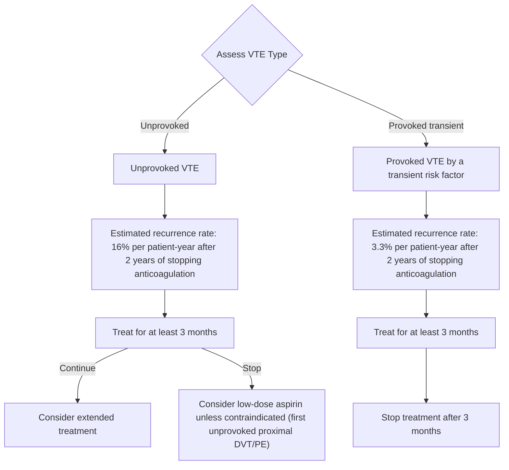
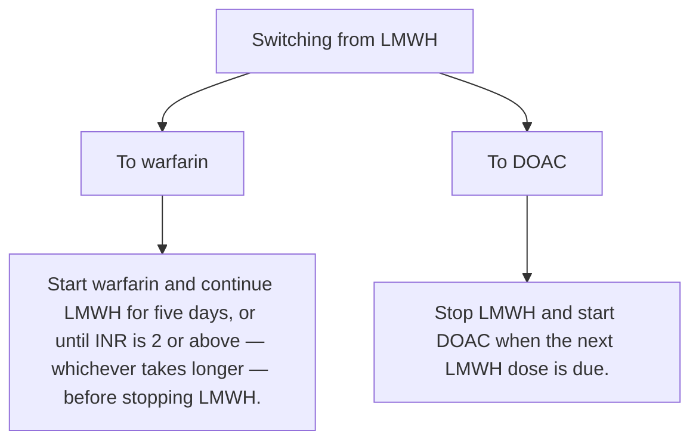
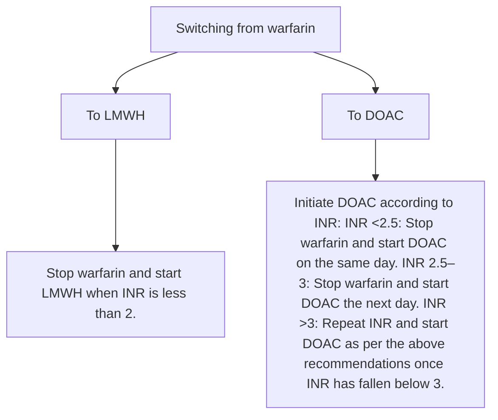
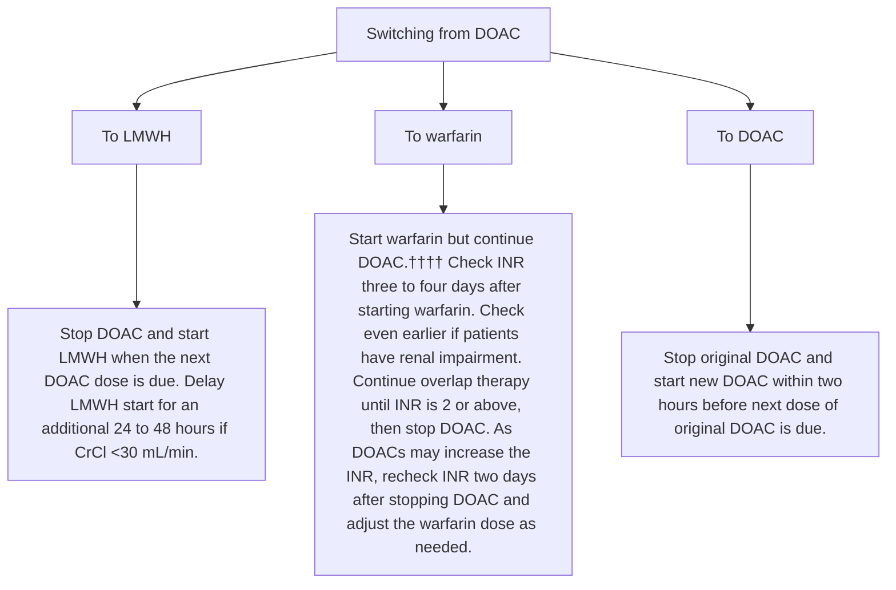

<!-- cpg_id: vte---treating-with-the-appropriate-anticoagulant-and-duration-(may-2024) | phase4 deterministic | spine: Overview, Treatment initiation, Duration of treatment, References -->
<!-- meta | source: ACE CLINICAL GUIDANCE | published: First Published: 28 May 2018 | url: www.ace-hta.gov.sg | title: Venous thromboembolism. Treating with the appropriate anticoagulant and duration -->


## Overview

```yaml
cpg_id: vte---treating-with-the-appropriate-anticoagulant-and-duration-(may-2024)
chunk_id: vte---treating-with-the-appropriate-anticoagulant-and-duration-(may-2024).overview.prose.01
chunk_type: prose
section_id: overview
parent_rec: null
title: "Definitions and scope of application"
source_pages: [1]
tables_referenced: []
figures_referenced: []
url_links: []
cross_refs: []
review_flags:
  - contains_conditional_language
```

Last Updated: 16 May 2024

Venous
thromboembolism

Treating with the
appropriate anticoagulant
and duration

### Objective

To optimise anticoagulation treatment for venous thromboembolism (VTE)

### Scope

Treatment of VTE with anticoagulants in adult patients

### Target audience

This clinical guidance is relevant to all healthcare professionals caring for patients with VTE, especially those providing primary or generalist care

### Background

Venous thromboembolism (VTE) is a serious medical condition that covers deep vein thrombosis (DVT) and pulmonary embolism (PE). Globally, patients face a 30-day mortality risk of 5% for PE and 3% for DVT following diagnosis.   Although the annual incidence of VTE in Asia (ranging from 13.8 to 19.9 per 100,000 people) is lower than the rest of the world, VTE prevalence is increasing over time likely due to population ageing, higher number of surgeries, and higher cancer rates.   As VTE has long-term complications that adversely affect quality of life and often leads to substantial healthcare utilisation, this ACG aims to guide healthcare professionals to optimise the treatment of VTE with an appropriate anticoagulant and treatment duration.

### Statement of Intent

This ACE Clinical Guidance (ACG) provides concise, evidence-based recommendations and serves as a common starting point nationally for clinical decision-making. It is underpinned by a wide array of considerations contextualised to Singapore, based on best available evidence at the time of development. The ACG is not exhaustive of the subject matter and does not replace clinical judgement. The recommendations in the ACG are not mandatory, and the responsibility for making decisions appropriate to the circumstances of the individual patient remains at all times with the healthcare professional.

---


## Treatment initiation

```yaml
cpg_id: vte---treating-with-the-appropriate-anticoagulant-and-duration-(may-2024)
chunk_id: vte---treating-with-the-appropriate-anticoagulant-and-duration-(may-2024).treatment_initiation.recommendation.01
chunk_type: recommendation
section_id: treatment_initiation
parent_rec: null
title: "Recommendation 1"
source_pages: [2]
tables_referenced:
  - Table 1. Characteristics of anticoagulants registered in Singapore (adapted from local product information leaflets)
figures_referenced:
  - Figure 1. Selecting an appropriate anticoagulant and duration for VTE treatment
url_links: []
cross_refs: []
review_flags:
  - contains_conditional_language
```

**Recommendation 1:** Start anticoagulation as soon as possible for patients with confirmed proximal DVT or PE, unless contraindicated.

The risk of thrombus extension is highest in the first few days after VTE is diagnosed.   Therefore, starting anticoagulation as soon as possible is crucial to prevent extension, VTE recurrence, morbidity, and death. Absolute contraindications for anticoagulation include severe coagulation defects, severe thrombocytopaenia, uncontrollable active bleeding, and acute haemorrhagic stroke. For these patients, temporary insertion of an inferior vena cava filter is usually considered.

### Isolated distal DVT

Following distal DVT diagnosis, the decision to initiate anticoagulation therapy depends on considerations such as:

- Persistent risk factors (e.g., active cancer or inflammatory bowel disease)

- Severe symptoms

- Risk factors for extension (e.g., positive D-dimer, multiple vein involvement, thrombosis close to proximal veins, history of VTE, absence of reversible provoking factors)

- Evidence of thrombus extension

- Unprovoked distal DVT, i.e., VTE that is not associated with a provoking risk factor (transient or persistent)

A short course of anticoagulation may be preferred for patients with any of the above.

However, monitoring with serial imaging may be sufficient or preferred for those with transient/reversible provoking risk factors (e.g., surgery, trauma, immobilisation, bed confinement, long-haul flight, pregnancy, or oestrogen therapy).

### Choice of anticoagulation therapy

Anticoagulants for VTE treatment include direct oral anticoagulants (DOACs), warfarin, low molecular weight heparin (LMWH), and unfractionated heparin (UFH). When selecting an appropriate anticoagulant, consider patient factors, medication properties, patient preferences, and cost. Figure 1 on page 3 summarises selection criteria and treatment duration, and Table 1 on page 6 summarises key medication characteristics.

---

```yaml
cpg_id: vte---treating-with-the-appropriate-anticoagulant-and-duration-(may-2024)
chunk_id: vte---treating-with-the-appropriate-anticoagulant-and-duration-(may-2024).treatment_initiation.recommendation.02
chunk_type: recommendation
section_id: treatment_initiation
parent_rec: null
title: "Recommendation 2"
source_pages: [2, 4]
tables_referenced:
  - Table 1. Characteristics of anticoagulants registered in Singapore (adapted from local product information leaflets)
figures_referenced:
  - Figure 1. Selecting an appropriate anticoagulant and duration for VTE treatment
url_links: []
cross_refs: []
review_flags:
  - contains_conditional_language
  - contains_dosing_information
```

**Recommendation 2:** For patients from the general population, use a DOAC for at least 3 months as the preferred anticoagulant for VTE treatment; consider warfarin as an alternative if DOACs are not suitable.

DOACs are the oral anticoagulant of choice for most patients with VTE in the general population. DOACs (apixaban, dabigatran, edoxaban, and rivaroxaban) are as effective as warfarin in preventing VTE recurrence, with the added benefit of reducing the likelihood of bleeding outcomes.   Other advantages of DOACs over warfarin include fewer drug and dietary interactions, and fixed dosing. Warfarin should be considered when DOACs are not suitable (see Figure 1 for examples of when DOACs are not suitable and for warfarin prescribing considerations).

There is insufficient evidence to recommend one DOAC over another as there are no head-to-head trials comparing DOACs. Practical considerations, such as the need for initial parenteral anticoagulation, would inform the choice of DOAC (see Table 1). While not commonly used locally, edoxaban is registered in Singapore for VTE treatment and listed in this ACG where appropriate, for completeness.

### Patients at the extremes of body weight

The pharmacological effects of anticoagulants may be altered by body weight, as this affects medication absorption, distribution, and elimination. Evidence for patients who are underweight is limited  and closer monitoring for signs and symptoms of bleeding is recommended, especially while on DOACs (warfarin and LMWH can also be considered, as their anticoagulation effects can be feasibly monitored). Consider specialist referral for patients who are underweight (e.g., those <40 kg). For patients who meet the definition for obesity,  evidence suggests that treatment considerations can be similar to those of the general population.  Consider specialist referral for patients who have undergone bariatric surgery.

### Patients with severe renal impairment

Evidence from observational studies indicates that apixaban is associated with fewer rates of VTE recurrence and fewer bleeding events compared to warfarin for patients with CrCl 15–29 mL/min.   Limited evidence on rivaroxaban in patients with CrCl 15–29 mL/min suggests similar rates of VTE recurrence compared with warfarin and no increase in major bleeding with decreasing renal function.   There are no clinical studies for edoxaban in patients with CrCl 15–29 mL/min at the time of ACG publication. Product information leaflets state that apixaban and rivaroxaban may be used with caution in patients with CrCl 15–29 mL/min, based on pharmacokinetic data. On balance, apixaban can be considered as the preferred option when treating VTE for patients with CrCl 15–29 mL/min.

LMWH monotherapy is not recommended as LMWH is renally excreted and accumulates in renal failure.   Patients with CrCl <30 mL/min treated with therapeutic enoxaparin have elevated levels of anti-Xa and an increased risk of a major bleeding.   Therefore, consider anti-Xa monitoring if dose-reduced enoxaparin is used for more than five days as an initial overlap with warfarin.

UFH monotherapy is also not recommended. Despite its minimal renal excretion and short half-life, UFH is impractical for prolonged use. UFH is usually reserved for patients undergoing invasive procedures, thrombolysis, or those with high bleeding risks as it requires close laboratory monitoring to achieve therapeutic anticoagulation.

As renal impairment increases the risk of VTE and bleeding events,  patients with reduced renal function may require dose adjustments (see Table 1) or more frequent monitoring. When considering switching from a DOAC to warfarin in patients with renal impairment, INR should be checked early (see Supplementary guide “Switching between anticoagulants”), especially for patients on dabigatran, which is primarily cleared renally.

### Patients with liver disease and coagulopathy

Patients with chronic liver diseases have a delicate balance between procoagulant, anticoagulant, and fibrinolytic systems; loss of this balance may result in haemorrhage or thrombosis depending on their concomitant risk factors.   The fragility of this balance and limitations of coagulation tests to accurately reflect bleeding risk increase the complexity of treating VTE in these patients.

LMWH monotherapy can be considered for these patients.   Although DOACs such as apixaban, edoxaban, and rivaroxaban can be used for patients with Child Pugh-A cirrhosis, they are contraindicated for patients with liver disease and coagulopathy. While warfarin is not contraindicated in patients with liver disease and coagulopathy, it is less suitable as the INR may not accurately reflect antithrombotic effect.

---

```yaml
cpg_id: vte---treating-with-the-appropriate-anticoagulant-and-duration-(may-2024)
chunk_id: vte---treating-with-the-appropriate-anticoagulant-and-duration-(may-2024).treatment_initiation.figure.01
chunk_type: figure
section_id: treatment_initiation
parent_rec: vte---treating-with-the-appropriate-anticoagulant-and-duration-(may-2024).treatment_initiation.recommendation.02
title: "Figure 1. Selecting an appropriate anticoagulant and duration for VTE treatment"
source_pages: [3]
reconstructed_from: summary
image_dir: grouped_p3_fig_01.jpg
url_links: []
cross_refs: []
review_flags:
  - no_structured_extract
```

**Figure 1. Selecting an appropriate anticoagulant and duration for VTE treatment**

---


## Duration of treatment

```yaml
cpg_id: vte---treating-with-the-appropriate-anticoagulant-and-duration-(may-2024)
chunk_id: vte---treating-with-the-appropriate-anticoagulant-and-duration-(may-2024).duration_of_treatment.prose.01
chunk_type: prose
section_id: duration_of_treatment
parent_rec: null
title: "Duration of treatment overview"
source_pages: [4]
tables_referenced: []
figures_referenced:
  - Figure 2. Risk of VTE recurrence
url_links: []
cross_refs: []
review_flags:
  - contains_conditional_language
  - contains_dosing_information
```

Continue anticoagulation for at least three months to prevent thrombus extension and VTE recurrence for the general population (including patients with renal impairment, or liver disease and coagulopathy). A shorter duration of four to six weeks has been shown to double the risk of recurrent VTE compared to a treatment duration of at least three months, and may be insufficient for active treatment aimed at suppressing the acute episode of VTE.   Treatment beyond three months may be needed for some patients, especially those at increased risk of VTE recurrence. The risk of VTE recurrence depends on the presence and nature of provoking factors (see Figure 2).   Unprovoked VTE has a higher risk of recurrence than provoked VTE (see Figure 2) and may require extended treatment if bleeding risks are low or moderate.

As extended treatment usually implies that anticoagulation will continue indefinitely, assess and discuss the risks and benefits of extended treatment with the patient. For patients with first unprovoked proximal DVT or PE wishing to stop anticoagulation after three months, consider low-dose aspirin unless contraindicated.   Aspirin is less effective than anticoagulants, but more effective than no treatment, in preventing VTE recurrence.   Discuss the benefits and risks of stopping anticoagulation and initiating aspirin with these patients.

---

```yaml
cpg_id: vte---treating-with-the-appropriate-anticoagulant-and-duration-(may-2024)
chunk_id: vte---treating-with-the-appropriate-anticoagulant-and-duration-(may-2024).duration_of_treatment.figure.01
chunk_type: figure
section_id: duration_of_treatment
parent_rec: null
title: "Figure 2. Risk of VTE recurrence"
source_pages: [4]
reconstructed_from: mermaid
image_dir: grouped_p4_fig_01.jpg
url_links: []
cross_refs: []
review_flags: []
```

**Figure 2. Risk of VTE recurrence**



---

```yaml
cpg_id: vte---treating-with-the-appropriate-anticoagulant-and-duration-(may-2024)
chunk_id: vte---treating-with-the-appropriate-anticoagulant-and-duration-(may-2024).duration_of_treatment.prose.02
chunk_type: prose
section_id: duration_of_treatment
parent_rec: null
title: "Frequency of review for patients on extended treatment"
source_pages: [5]
tables_referenced: []
figures_referenced: []
url_links: []
cross_refs: []
review_flags:
  - contains_conditional_language
  - contains_dosing_information
```

All patients on extended treatment, including those with cancer, should be reviewed at least once a year and when clinically indicated to assess for any change that may necessitate adjustments in the management (such as the choice or dose of the medication).

---

```yaml
cpg_id: vte---treating-with-the-appropriate-anticoagulant-and-duration-(may-2024)
chunk_id: vte---treating-with-the-appropriate-anticoagulant-and-duration-(may-2024).duration_of_treatment.prose.03
chunk_type: prose
section_id: duration_of_treatment
parent_rec: null
title: "Check for:"
source_pages: [5]
tables_referenced: []
figures_referenced: []
url_links: []
cross_refs: []
review_flags: []
```

- Signs and symptoms of bleeding (see “Oral anticoagulation for atrial fibrillation” ACG for brief information on assessing bleeding risk, bleeding management, and reversal agents) and recurrent VTE

- Treatment adherence

- Changes in renal or hepatic function

- New drug interactions

- Degree of frailty and fall risk

---

```yaml
cpg_id: vte---treating-with-the-appropriate-anticoagulant-and-duration-(may-2024)
chunk_id: vte---treating-with-the-appropriate-anticoagulant-and-duration-(may-2024).duration_of_treatment.recommendation.03
chunk_type: recommendation
section_id: duration_of_treatment
parent_rec: null
title: "Recommendation 3"
source_pages: [5, 6, 7]
tables_referenced: []
figures_referenced: []
url_links: []
cross_refs: []
review_flags:
  - contains_conditional_language
  - contains_dosing_information
```

**Recommendation 3:** For patients with cancer needing VTE treatment, use apixaban, edoxaban, rivaroxaban, or LMWH for the initial and treatment phases for at least 6 months; LMWH is preferred if the patient has gastrointestinal cancer.

In Asia, the incidence of VTE is substantially higher in patients with cancer than in the general population, with cancer being a major risk factor.   Without appropriate anticoagulation, about 3 in 10 patients with active cancer will experience recurrence within a year.

Apixaban, edoxaban, rivaroxaban, and LMWH are more effective than warfarin for preventing recurrent VTE in patients with cancer.   Apixaban, edoxaban, and rivaroxaban are also more effective than LMWH in preventing recurrent VTE,   but may have a higher risk of clinically relevant non-major bleeding (CRNMB).   The increase in bleeding risk is seen especially in patients with gastrointestinal cancer using edoxaban or rivaroxaban.   Based on local expert opinion, apixaban, edoxaban, and rivaroxaban may also have higher bleeding risks in patients with genitourinary cancer.

Consider potential drug interactions with anti-cancer therapies – LMWH is preferred for patients using concurrent anti-cancer medications which have significant drug interactions with apixaban, edoxaban, or rivaroxaban.

For patients in whom cancer has progressed, consider their wishes and quality of life before extending treatment. If a LMWH was chosen initially, offer apixaban, edoxaban or rivaroxaban as an acceptable alternative if a patient requires anticoagulation but wishes to stop daily injections after six months.

### Patients who are in cancer remission

VTE treatment for patients who are in remission is similar to that for the general population (see Recommendation 2), with the risk of VTE becoming comparable to that of patients without cancer after two years of remission. While evidence on treatment duration for these patients is lacking, three to six months is an appropriate starting point for decision-making, to be tailored to the patient's individual circumstances.

Initial parenteral anticoagulation

# Available on government subsidy list.

§§ Edoxaban is registered in Singapore for the treatment of VTE but is not commonly used at the time of ACG publication.

*** Andexanet alfa is not registered in Singapore at time of ACG publication.

Apixaban and rivaroxaban have different doses and durations for the acute treatment phase.

## For patients of age ≥80, use the reduced dose of 110 mg BD.

§§§ For patients who weigh ≤60 kg, use the reduced dose of 30 mg OD.

**** The recommended dosing for patients with CrCl 15–29 mL/min is based on pharmacokinetic data and has not been studied in this clinical setting. Apixaban is the most suitable DOAC for patients with CrCl 15–29 mL/min, as it is least affected by renal elimination compared to other DOACs.

SUPPLEMENTARY GUIDE

Published: 28 May 2018

Last updated: 16 May 2024

### Switching between anticoagulants

Anticoagulants may be changed for medical reasons [such as hepatic or renal impairment, fluctuating international normalised ratio (INR) levels, or increased bleeding risk] or social reasons (such as cost issues, reluctance to do blood tests, poor adherence, and altered patient preferences). In general, switching between anticoagulants exposes patients to periods of increased thromboembolic and bleeding risks. This document gives guidance on appropriate switching strategies between low molecular weight heparin (LMWH), warfarin, and direct oral anticoagulants (DOACs).







---

```yaml
cpg_id: vte---treating-with-the-appropriate-anticoagulant-and-duration-(may-2024)
chunk_id: vte---treating-with-the-appropriate-anticoagulant-and-duration-(may-2024).duration_of_treatment.table.01
chunk_type: table
section_id: duration_of_treatment
parent_rec: vte---treating-with-the-appropriate-anticoagulant-and-duration-(may-2024).duration_of_treatment.recommendation.03
title: "Table 1. Characteristics of anticoagulants registered in Singapore (adapted from"
source_pages: [6]
image_dir: 3cf9c170cfae11a0f130ba03225274f9ada99ac1913266e4e751fc9fbeaf24c4.jpg
url_links: []
cross_refs: []
review_flags:
  - contains_dosing_information
```

**Table 1. Characteristics of anticoagulants registered in Singapore (adapted from local product information leaflets)**

<table><tr><td rowspan="2"></td><td rowspan="2">Mechanism of action</td><td rowspan="2">Pharmacokinetics</td><td rowspan="2">Reversal agent(s)</td><td rowspan="2">Routine coagulation monitoring</td><td colspan="2">Dosing</td><td colspan="4">Dosing according to renal function, CrCl (mL/min)</td></tr><tr><td>Active treatment phase (3 months)</td><td>Extended treatment phase (&gt;3 months)</td><td>&gt;50</td><td>30-50</td><td>15-29</td><td>&lt;15</td></tr><tr><td>Apixaban‡</td><td>Direct factor Xa inhibitor</td><td>Bioavailability: ~50% Tmax: 3-4 hoursHalf-life: 12 hoursElimination: 27% renal</td><td>Andexanet alfa*** or 4F-PCC</td><td>Not required</td><td>Day 1-7: PO 10 mg BD<eq>^{+}</eq><eq>^{+}</eq>Day 8 onwards: PO 5 mg BD</td><td>Month 3-6: PO 5 mg BDMonth 7 onwards: PO 2.5 mg BD</td><td colspan="2">Dose adjustment is not necessary</td><td>Use with caution.</td><td>Not recommended</td></tr><tr><td>Dabigatran</td><td>Direct thrombin inhibitor</td><td>Bioavailability: 6.5% Tmax: 0.5-2 hoursHalf-life: 12-14 hoursElimination: 85% renal</td><td>Idarucizumab or 4F-PCC</td><td>Not required</td><td>Day 1-5: Use LMWH, no dabigatranDay 6 onwards: PO 150 mg BD<eq>^{+}</eq><eq>^{+}</eq></td><td>Use maintenance dose.</td><td>Dose adjustment is not necessary.</td><td>Day 6 onwards: Consider dose reduction to PO 110 mg BD for patients with high bleeding risks</td><td colspan="2">Not recommended</td></tr><tr><td>Edoxaban§§</td><td>Direct factor Xa inhibitor</td><td>Bioavailability: ~60% Tmax: 1-2 hoursHalf-life: 10-14 hoursElimination: 35% renal</td><td>Andexanet alfa*** or 4F-PCC</td><td>Not required</td><td>Day 1-5: Use LMWH, no edoxabanDay 6 onwards: PO 60 mg OD<eq>^{§§§}</eq></td><td>Use maintenance dose.</td><td>Dose adjustment is not necessary.</td><td colspan="2">Day 6 onwards: PO 30 mg OD****</td><td>Not recommended</td></tr><tr><td>Rivaroxaban‡</td><td>Direct factor Xa inhibitor</td><td>Bioavailability: 80-100% Tmax: 2-4 hoursHalf-life: 5-13 hoursElimination: 67% renal (36% as active compound)</td><td>Andexanet alfa*** or 4F-PCC</td><td>Not required</td><td>Day 1-21: PO 15 mg BD<eq>^{+}</eq><eq>^{+}</eq>Day 22 onwards: PO 20 mg OD</td><td>Month 3-6: Use maintenance dose.Month 7 onwards: PO 10 mg OD. Consider continuing with the maintenance dose of 20 mg OD in patients with high risk of recurrent VTE.</td><td>Dose adjustment is not necessary.</td><td colspan="2">Day 22 onwards: Consider dose reduction to PO 15 mg OD**** for patients whose bleeding risks outweigh the risks of VTE recurrence. Use with caution in patients with CrCl 15-29 mL/min.If the recommended dose is PO 10 mg OD, dose adjustment is not necessary.</td><td>Not recommended</td></tr><tr><td>Warfarin‡</td><td>Vitamin K antagonist</td><td>Bioavailability: &gt;95% Tmax: 72-96 hoursHalf-life: 40 hoursElimination: ~100% metabolised, negligible in urine</td><td>Vitamin K, fresh frozen plasma and prothrombin complex concentrates</td><td>Required</td><td>Day 1-2: PO 5 mg OD. Give with LMWH for five days, or until INR ≥2 -whichever takes longerDay 3 onwards: Titrate according to INR</td><td>Use maintenance dose.</td><td colspan="4">INR-adjusted</td></tr><tr><td>Dalteparin</td><td>Accelerates antithrombin action</td><td>Bioavailability: 87% Tmax: 3-4 hoursHalf-life: 3-5 hoursElimination: Primarily renal (&lt;5% as active compound)</td><td>Protamine</td><td>Not required</td><td>SC 200 IU/kg OD, up to a maximum of 18,000 IU, ORSC 100 IU/kg BD</td><td>Can be used as monotherapy in patients with cancer or in pregnant patients.</td><td colspan="2">Dose adjustment is not necessary.</td><td colspan="2">Not recommended</td></tr><tr><td>Enoxaparin‡</td><td>Accelerates antithrombin action</td><td>Bioavailability: ~100% Tmax: 3-5 hoursHalf-life: 4-7 hoursElimination: 40% renal (10% as active compound)</td><td>Protamine</td><td>Not required</td><td>SC 1 mg/kg BD. Can be used as monotherapy in patients with cancer.</td><td>Can be used as monotherapy in patients with cancer or in pregnant patients.</td><td colspan="2">Dose adjustment is not necessary.</td><td colspan="2">SC 1 mg/kg OD.Consider monitoring of anti-factor Xa activity.</td></tr></table>

> *Footnote: 4F-PCC, four-factor prothrombin complex concentrate; BD, twice a day; CrCl, creatinine clearance; INR, international normalised ratio; IU, international units; OD, once daily; PO, oral; SC, subcutaneous; Tmax, time taken for a drug to reach the maximum concentration*

---


## References

```yaml
cpg_id: vte---treating-with-the-appropriate-anticoagulant-and-duration-(may-2024)
chunk_id: vte---treating-with-the-appropriate-anticoagulant-and-duration-(may-2024).references.reference.01
chunk_type: reference
section_id: references
parent_rec: null
title: "References"
source_pages: [8]
tables_referenced: []
figures_referenced: []
url_links:
  - https://go.gov.sg/acg-venous-thromboembolism-reference-list
cross_refs: []
review_flags: []
```

Click or scan the QR code for the reference list to this clinical guidance

- https://go.gov.sg/acg-venous-thromboembolism-reference-list

### Expert group

### Lead discussant

Dr Chee Yen Lin, Haematology (NUHS-NCIS)

### Chairperson

Clin Prof Ng Heng Joo, Haematology (SGH)

#### Members

Clin Prof Lee Lai Heng, Haematology (SGH)

Clin A/Prof Tay Jam Chin, Internal Medicine (TTSH)

A/Prof Doreen Tan, Cardiology Specialist Pharmacist (NUS/NUHCS)

Dr Lim Ziliang, Family Medicine (NHGP)

Dr Sim Kok Ping, Family Medicine (Frontier Healthcare)

### About the Agency

The Agency for Care Effectiveness (ACE) was established by the Ministry of Health (Singapore) to drive better decision-making in healthcare by conducting health technology assessments (HTA), publishing healthcare guidance and providing education. ACE develops ACE Clinical Guidances (ACGs) to inform specific areas of clinical practice. ACGs are usually reviewed around five years after publication, or earlier, if new evidence emerges that requires substantive changes to the recommendations. To access this ACG online, along with other ACGs published to date, please visit www.ace-hta.gov.sg/acg

Find out more about ACE at www.ace-hta.gov.sg/about-us

### © Agency for Care Effectiveness, Ministry of Health, Republic of Singapore

All rights reserved. Reproduction of this publication in whole or in part in any material form is prohibited without the prior written permission of the copyright holder. Application to reproduce any part of this publication should be addressed to: ACE_HTA@moh.gov.sg

#### Suggested citation:

Agency for Care Effectiveness (ACE). Venous thromboembolism — treating with the appropriate anticoagulant and duration. ACE Clinical Guidance (ACG), Ministry of Health, Singapore. 2024. Available from: go.gov.sg/acg-venous-thromboembolism-treatment

The Ministry of Health, Singapore disclaims any and all liability to any party for any direct, indirect, implied, punitive or other consequential damages arising directly or indirectly from any use of this ACG, which is provided as is, without warranties.

Agency for Care Effectiveness (ACE)

College of Medicine Building

16 College Road Singapore 169854

---
